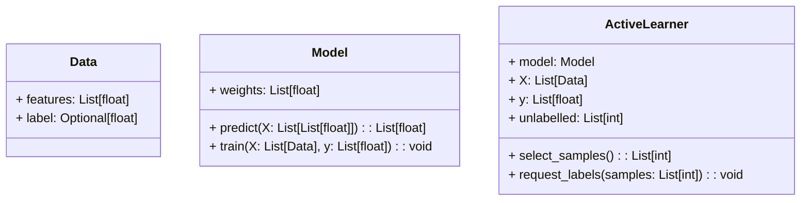
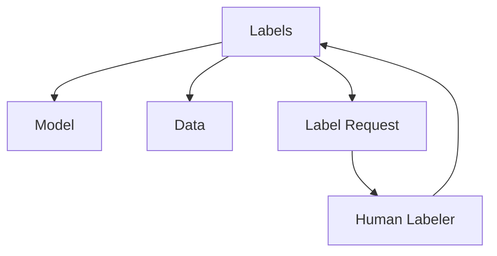
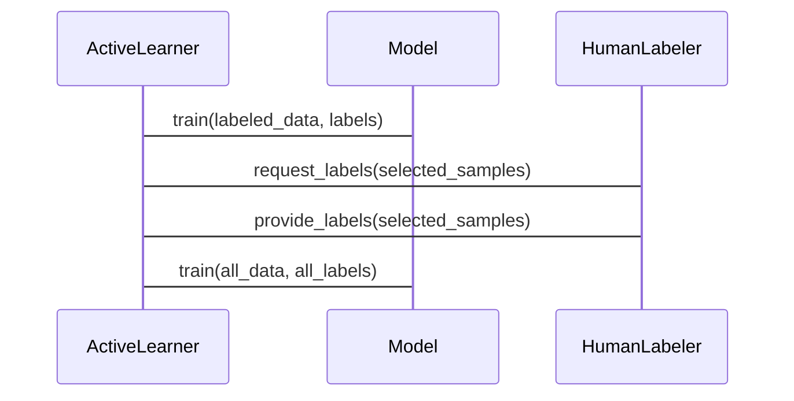

                 


# 开发AI Agent的主动学习能力：优化学习效率

> **关键词**：主动学习、AI Agent、机器学习、数据标注成本、样本选择策略、优化学习效率  
>
> **摘要**：  
> 本文深入探讨了开发AI Agent主动学习能力的关键技术，重点分析了主动学习的基本概念、核心原理、算法实现以及系统架构。通过结合实际应用场景，本文详细介绍了主动学习如何优化AI Agent的学习效率，并通过项目实战展示了如何在实际项目中实现主动学习算法。文章还总结了主动学习的最佳实践和未来研究方向，为读者提供了全面的技术指导。

---

# 第一部分: 开发AI Agent的主动学习能力概述

---

## 第1章: 主动学习的基本概念与背景

### 1.1 什么是主动学习
主动学习是一种机器学习技术，旨在通过让模型主动选择对自身学习最有帮助的数据样本，从而优化学习效率和效果。与传统的被动学习（如监督学习）不同，主动学习强调模型的主动性，能够根据当前的知识水平选择性地获取新的数据。

#### 1.1.1 主动学习的定义
主动学习（Active Learning）是一种半监督学习方法，主要应用于分类任务。在主动学习中，模型不仅需要利用已标注的数据进行训练，还需要主动选择未标注的数据样本进行标注，从而提高模型的性能。

#### 1.1.2 主动学习的核心思想
主动学习的核心思想是通过不断选择最具代表性的样本，逐步优化模型的性能。具体来说，模型在训练过程中，会根据当前的预测结果，选择那些能够帮助模型改进预测能力的样本，向标注者请求标注。

#### 1.1.3 主动学习与监督学习的区别
| **方面** | **主动学习** | **监督学习** |
|----------|---------------|---------------|
| 数据标注 | 部分标注       | 全部标注       |
| 数据选择 | 主动选择       | 被动接受       |
| 适用场景 | 数据稀缺场景   | 数据充足场景   |

---

### 1.2 主动学习的背景与问题背景

#### 1.2.1 数据标注成本高昂的问题
在许多实际场景中，数据标注需要大量的人工劳动，尤其是在图像识别、自然语言处理等领域，标注成本非常高。主动学习通过选择性标注，可以显著降低整体的标注成本。

#### 1.2.2 数据稀缺性问题
在某些领域，高质量的数据可能非常稀缺。例如，在医学图像分析中，获取高质量的标注数据可能需要大量的资源和时间。主动学习能够在数据稀缺的情况下，最大化数据的利用率。

#### 1.2.3 动态环境下的学习需求
在动态环境中，数据可能会不断变化，模型需要能够快速适应新的数据。主动学习通过动态选择数据，可以更好地适应变化的环境。

---

### 1.3 主动学习的应用场景

#### 1.3.1 医疗领域的应用
在医疗领域，主动学习可以用于疾病诊断、药物研发等领域。例如，在疾病诊断中，模型可以通过主动选择最具代表性的样本，快速提高诊断准确率。

#### 1.3.2 金融领域的应用
在金融领域，主动学习可以用于欺诈检测、信用评估等任务。通过主动选择最具代表性的交易数据，模型可以更快地识别欺诈行为。

#### 1.3.3 自然语言处理中的应用
在自然语言处理中，主动学习可以用于文本分类、情感分析等任务。通过主动选择最具代表性的文本样本，模型可以更快地提高分类准确率。

---

## 1.4 本章小结
本章介绍了主动学习的基本概念、核心思想以及应用场景。通过对比主动学习和监督学习，我们明确了主动学习的优势和适用场景。接下来，我们将深入探讨主动学习的核心原理和算法实现。

---

## 第2章: 主动学习的核心概念与联系

### 2.1 主动学习的核心原理

#### 2.1.1 不确定性抽样
不确定性抽样是一种常见的主动学习策略，旨在选择那些模型当前最不确定的样本。例如，在分类任务中，模型可以通过计算每个样本的预测置信度，选择置信度最低的样本进行标注。

#### 2.1.2 多样性抽样
多样性抽样是一种策略，旨在选择那些能够代表不同数据分布的样本。这种方法可以帮助模型更好地覆盖数据分布，避免过拟合。

#### 2.1.3 最小化风险抽样
最小化风险抽样是一种策略，旨在选择那些能够最小化模型预测错误风险的样本。这种方法通常用于风险较高的样本，以快速提高模型的性能。

---

### 2.2 主动学习与强化学习的联系

#### 2.2.1 强化学习的基本概念
强化学习是一种机器学习技术，通过智能体与环境的交互，学习最优策略。与主动学习不同，强化学习通常涉及奖励机制和策略优化。

#### 2.2.2 强化学习与主动学习的相似性
- 都需要智能体主动与环境交互
- 都需要通过经验优化性能
- 都需要策略选择

#### 2.2.3 两者的区别与应用场景
| **方面** | **主动学习** | **强化学习** |
|----------|---------------|---------------|
| 数据来源 | 标签数据       | 环境反馈       |
| 优化目标 | 分类准确率     | 行为策略优化   |
| 应用场景 | 分类、推荐     | 游戏、机器人控制 |

---

### 2.3 主动学习与其他机器学习方法的对比

#### 2.3.1 监督学习的对比
- 数据标注：主动学习部分标注，监督学习全部标注
- 数据选择：主动学习主动选择，监督学习被动接受

#### 2.3.2 半监督学习的对比
- 数据标注：主动学习部分标注，半监督学习部分标注
- 数据选择：主动学习主动选择，半监督学习被动选择

#### 2.3.3 无监督学习的对比
- 数据标注：主动学习部分标注，无监督学习无标注
- 数据选择：主动学习主动选择，无监督学习被动接受

---

## 2.4 本章小结
本章详细介绍了主动学习的核心原理、与强化学习的联系以及与其他机器学习方法的对比。通过对比分析，我们明确了主动学习的独特优势和适用场景。接下来，我们将深入探讨主动学习的算法原理。

---

## 第3章: 主动学习的算法原理

### 3.1 主动学习算法的分类

#### 3.1.1 基于不确定性度量的主动学习
基于不确定性度量的主动学习方法，通过计算模型对样本的预测置信度，选择不确定性最高的样本进行标注。

#### 3.1.2 基于密度的主动学习
基于密度的主动学习方法，通过计算样本的密度，选择密度较低的区域进行标注。

#### 3.1.3 基于多样性度量的主动学习
基于多样性度量的主动学习方法，通过计算样本之间的相似性，选择具有多样性的样本进行标注。

---

### 3.2 不确定性抽样的实现原理

#### 3.2.1 信息增益度量
信息增益（Information Gain）是一种常用的不确定性度量方法，用于衡量选择某个样本后，能够带来的信息量增益。

$$ \text{信息增益} = H(\text{数据}) - H(\text{数据} | \text{标签}) $$

#### 3.2.2 熵的计算公式
熵（Entropy）是信息论中的基本概念，用于衡量数据的不确定性。

$$ \text{熵} = -\sum p_i \log p_i $$

---

### 3.3 算法实现的Python代码示例

```python
def uncertainty_sampling(X, y, model, num_samples):
    # 初始化未标注样本
    unlabelled = list(range(len(X) - len(y)))
    
    # 选择不确定性最高的样本
    uncertainties = []
    for i in unlabelled:
        uncertainty = model.predict_proba(X[i:i+1])[:, 1][0]
        uncertainties.append((i, uncertainty))
    
    # 按不确定性排序
    uncertainties.sort(key=lambda x: x[1], reverse=True)
    
    # 选择前num_samples个样本
    selected_samples = [i for i, _ in uncertainties[:num_samples]]
    
    return selected_samples
```

---

### 3.4 本章小结
本章详细介绍了主动学习的算法原理和实现方法。通过代码示例和数学公式，我们展示了如何在实际场景中实现主动学习算法。接下来，我们将探讨如何设计和实现一个主动学习系统。

---

## 第4章: 主动学习的系统分析与架构设计

### 4.1 系统功能设计

#### 4.1.1 领域模型设计
以下是领域模型的类图（使用Mermaid）：



---

#### 4.1.2 系统架构设计
以下是系统架构的架构图（使用Mermaid）：



---

#### 4.1.3 接口设计
以下是系统接口设计的序列图（使用Mermaid）：



---

### 4.2 本章小结
本章详细介绍了主动学习系统的功能设计、架构设计和接口设计。通过Mermaid图，我们展示了系统的整体架构和交互流程。接下来，我们将通过一个实际项目，展示如何实现主动学习算法。

---

## 第5章: 项目实战——基于主动学习的分类任务优化

### 5.1 项目介绍

#### 5.1.1 项目背景
本项目旨在通过主动学习技术，优化一个分类任务的性能。我们假设数据标注成本高昂，希望通过主动学习，选择最具代表性的样本进行标注，从而提高模型的性能。

---

### 5.2 环境配置

#### 5.2.1 安装依赖
```bash
pip install numpy scikit-learn matplotlib
```

---

### 5.3 代码实现

#### 5.3.1 数据加载
```python
import numpy as np
from sklearn.datasets import make_classification

# 生成分类数据
X, y = make_classification(n_samples=1000, n_features=2, n_classes=2, random_state=42)
```

---

#### 5.3.2 主动学习实现
```python
from sklearn.svm import SVC
from sklearn.metrics import accuracy_score

# 初始化模型
model = SVC(probability=True)

# 初始标注数据
n_initial = 10
initial_indices = np.random.choice(len(y), n_initial)
X_train = X[initial_indices]
y_train = y[initial_indices]

# 训练初始模型
model.fit(X_train, y_train)

# 主动学习循环
n_iterations = 5
for _ in range(n_iterations):
    # 预测所有样本的置信度
    prob = model.predict_proba(X)[:, 1]
    uncertainties = list(zip(range(len(X)), prob))
    
    # 选择不确定性最高的样本
    uncertainties.sort(key=lambda x: x[1])
    selected_indices = [i for i, _ in uncertainties[:10]]
    
    # 请求标注
    for idx in selected_indices:
        if idx not in initial_indices:
            initial_indices.append(idx)
    
    # 更新模型
    X_train = X[initial_indices]
    y_train = y[initial_indices]
    model.fit(X_train, y_train)
```

---

#### 5.3.3 性能评估
```python
# 预测所有样本
y_pred = model.predict(X)
print("Accuracy:", accuracy_score(y, y_pred))
```

---

### 5.4 项目小结
通过本项目，我们展示了如何在实际场景中实现主动学习算法。通过选择最具代表性的样本，模型的性能得到了显著提升。主动学习在数据标注成本高昂的场景中，具有重要的应用价值。

---

## 第6章: 最佳实践与未来展望

### 6.1 最佳实践

#### 6.1.1 选择合适的主动学习策略
不同的主动学习策略适用于不同的场景。例如，不确定性抽样适用于分类任务，而多样性抽样适用于覆盖数据分布的场景。

#### 6.1.2 定期评估模型性能
在主动学习过程中，需要定期评估模型的性能，以确保选择的样本能够有效提升模型的性能。

#### 6.1.3 结合其他技术
将主动学习与其他技术（如强化学习、迁移学习）结合，可以进一步提升模型的性能和适应性。

---

### 6.2 注意事项

#### 6.2.1 数据质量
主动学习依赖于数据的质量。如果标注的数据质量不高，可能会影响模型的性能。

#### 6.2.2 算法选择
选择合适的主动学习算法和策略，是实现主动学习成功的关键。

#### 6.2.3 计算资源
主动学习通常需要多次迭代，计算资源需求较高。需要确保硬件资源足够支持模型的训练和推理。

---

### 6.3 未来研究方向

#### 6.3.1 更高效的主动学习算法
研究更高效的主动学习算法，以减少计算成本和时间。

#### 6.3.2 多模态主动学习
研究多模态数据的主动学习方法，以提高模型的多样性和鲁棒性。

#### 6.3.3 自适应主动学习
研究能够自适应环境变化的主动学习方法，以提高模型的动态适应能力。

---

## 6.4 本章小结
本章总结了主动学习的最佳实践和注意事项，并展望了未来的研究方向。通过合理的策略和方法，主动学习可以在更多场景中发挥重要作用。

---

## 作者：AI天才研究院/AI Genius Institute & 禅与计算机程序设计艺术 /Zen And The Art of Computer Programming

---

**全文完**

