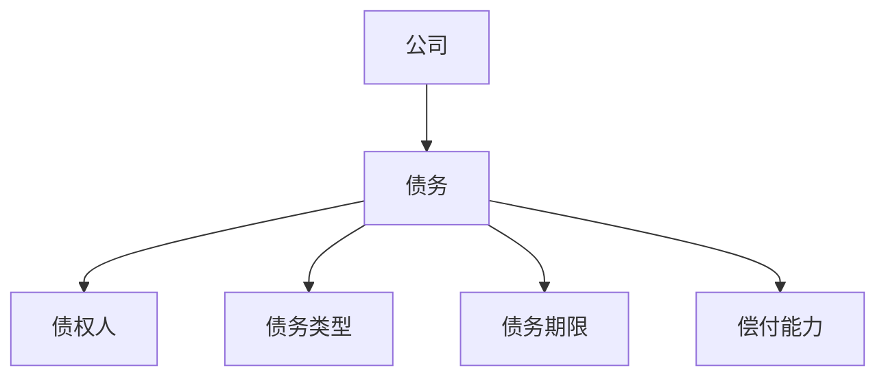
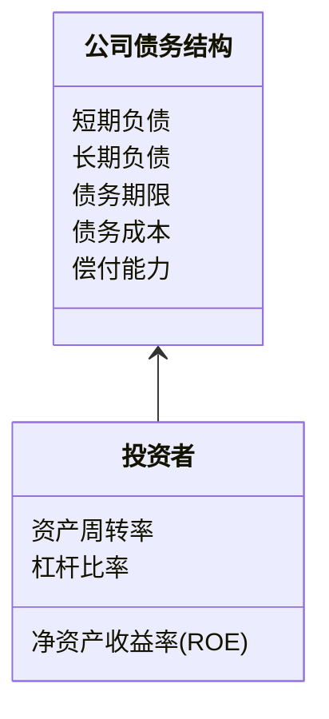
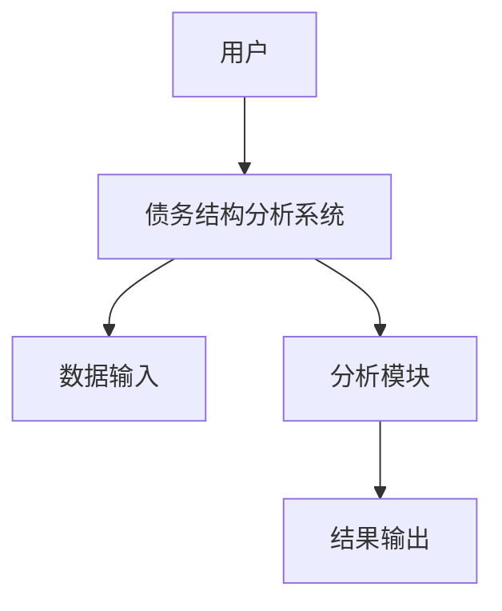
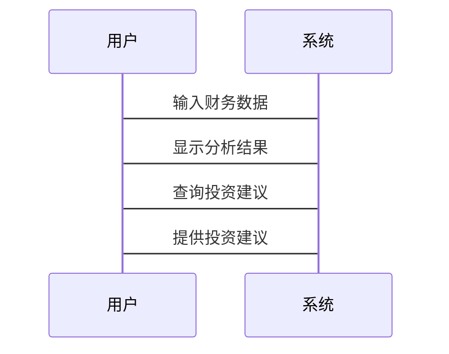

                 


# 彼得林奇对公司债务结构的分析

## 关键词：彼得·林奇，公司债务结构，财务分析，投资策略，杜邦分析法

## 摘要：本文深入分析了彼得·林奇对公司债务结构的分析方法，从背景、核心概念、数学模型到系统架构和实战案例，全面揭示了债务结构对公司价值和投资决策的影响。通过杜邦分析法和系统架构设计，本文为投资者提供了实用的债务结构评估工具和方法。

---

# 第一部分: 公司债务结构的背景与重要性

## 第1章: 公司债务结构概述

### 1.1 公司债务结构的定义与背景

#### 1.1.1 公司债务的定义

公司债务是指公司通过借款或其他方式形成的负债，通常包括短期负债和长期负债。短期负债如应付账款、短期贷款，长期负债如长期债券、银行长期贷款。

#### 1.1.2 债务结构在公司财务中的重要性

债务结构是公司资本结构的重要组成部分，影响公司的财务健康、资本成本和偿债能力。合理的债务结构可以降低资本成本，提高公司价值。

#### 1.1.3 彼得·林奇对债务结构的关注

彼得·林奇认为，债务结构是评估公司财务健康的重要指标，特别是在经济衰退或市场波动时，债务结构的风险暴露更为明显。

### 1.2 公司债务结构的核心要素

#### 1.2.1 短期负债与长期负债的区分

短期负债通常在一年内偿还，长期负债则在一年以上偿还。短期负债风险较低，但成本较高；长期负债风险较高，但成本较低。

#### 1.2.2 负债的偿付能力与风险

偿付能力包括流动比率、速动比率等指标，衡量公司偿还短期债务的能力。风险主要体现在债务期限、利率和市场环境的变化。

#### 1.2.3 债务结构对公司资本成本的影响

合理的债务结构可以降低资本成本，但过高或过低的债务比例会影响公司的信用评级和融资成本。

### 1.3 债务结构分析的边界与外延

#### 1.3.1 分析的范围与限制

债务结构分析需要考虑公司的财务报表、行业特点和市场环境，同时受数据质量和信息获取的限制。

#### 1.3.2 债务结构与公司战略的关系

公司战略影响债务结构的选择，例如扩张型战略可能需要更多的长期负债，而防御型战略则可能更注重短期负债。

#### 1.3.3 债务结构与市场环境的互动

市场环境如利率变化、经济周期会影响债务结构的优化和调整。

### 1.4 债务结构的核心概念结构

#### 1.4.1 债务结构的组成要素

包括短期负债、长期负债、债务期限、债务成本、偿付能力等。

#### 1.4.2 要素之间的关系

短期负债与长期负债的比例影响公司的流动性风险，债务期限与市场利率变化相关，偿付能力影响公司的信用评级。

#### 1.4.3 债务结构的动态变化

公司应根据市场环境和自身经营状况调整债务结构，以优化资本成本和降低风险。

## 1.5 本章小结

本章介绍了公司债务结构的定义、核心要素和分析的边界，强调了债务结构在公司财务中的重要性，为后续分析奠定了基础。

---

# 第二部分: 彼得·林奇的债务结构分析方法

## 第2章: 彼得·林奇的债务结构分析框架

### 2.1 彼得·林奇的分析理念

#### 2.1.1 投资者的视角

彼得·林奇从投资者的角度分析债务结构，关注债务对公司价值和投资风险的影响。

#### 2.1.2 债务结构对公司价值的影响

合理的债务结构可以提高公司价值，但过高的债务可能导致财务危机。

#### 2.1.3 林奇的"安全边际"概念

林奇强调安全边际，即债务结构的安全性应留有余地，避免过度杠杆。

### 2.2 林奇债务结构分析的核心步骤

#### 2.2.1 确定债务规模

分析公司债务规模是否合理，是否与公司资产规模和盈利能力匹配。

#### 2.2.2 分析债务期限

短期债务和长期债务的比例是否合理，是否匹配公司现金流的周期。

#### 2.2.3 评估债务成本

比较不同债务工具的成本，选择成本最低的债务结构。

#### 2.2.4 考察偿付能力

通过流动比率、速动比率等指标评估公司偿还债务的能力。

### 2.3 林奇分析框架的表格对比

#### 2.3.1 不同债务类型对比表

| 债务类型 | 短期负债 | 长期负债 |
|----------|----------|----------|
| 期限     | 一年以内 | 一年以上 |
| 风险     | 较低     | 较高     |
| 成本     | 较高     | 较低     |

#### 2.3.2 偿付能力指标对比表

| 指标名称   | 计算公式                   | 指标意义                   |
|------------|----------------------------|----------------------------|
| 流动比率   | 流动资产 / 流动负债         | 衡量公司偿还短期债务的能力 |
| 速动比率   | (流动资产 - 存货) / 流动负债 | 更为严格的流动性指标         |

#### 2.3.3 成本与风险对比表

| 成本与风险 | 短期负债 | 长期负债 |
|------------|----------|----------|
| 成本        | 较高     | 较低     |
| 风险        | 较低     | 较高     |

### 2.4 债务结构的ER实体关系图



### 2.5 本章小结

本章详细介绍了彼得·林奇的债务结构分析框架，包括核心步骤和对比分析，帮助投资者从多个角度评估债务结构的风险和价值。

---

# 第三部分: 债务结构分析的数学模型与算法

## 第3章: 债务结构分析的数学模型

### 3.1 杜邦分析法在债务结构中的应用

#### 3.1.1 杜邦分析法的定义

杜邦分析法是一种用于评估公司财务状况的工具，通过分解净资产收益率（ROE）来分析公司的盈利能力、资产使用效率和财务杠杆。

#### 3.1.2 杜邦分析法的公式

$$ \text{净资产收益率} = \frac{\text{净利润}}{\text{股东权益}} $$

杜邦分析法将ROE分解为三个部分：

$$ \text{ROE} = \text{净利率} \times \text{资产周转率} \times \text{杠杆比率} $$

#### 3.1.3 杜邦分析法的步骤

1. 计算净利率：净利润 / 营业收入
2. 计算资产周转率：营业收入 / 平均总资产
3. 计算杠杆比率：平均总资产 / 平均股东权益
4. 将三个指标相乘，得到ROE。

#### 3.1.4 实际案例分析

假设某公司净利润为100万元，营业收入为500万元，平均总资产为2000万元，平均股东权益为500万元。

- 净利率：100 / 500 = 20%
- 资产周转率：500 / 2000 = 25%
- 杠杆比率：2000 / 500 = 4
- ROE：20% × 25% × 4 = 20%

### 3.2 债务结构分析的数学模型

#### 3.2.1 短期债务与长期债务的比例

$$ \text{短期债务比例} = \frac{\text{短期负债}}{\text{短期负债} + \text{长期负债}} $$

#### 3.2.2 偿付能力指标

$$ \text{流动比率} = \frac{\text{流动资产}}{\text{流动负债}} $$

### 3.3 算法原理与代码实现

#### 3.3.1 算法原理

通过杜邦分析法和偿付能力指标，评估公司的债务结构和财务健康状况。

#### 3.3.2 Python代码实现

```python
def dupont_analysis(net_income, revenue, total_assets, equity):
    net_margin = net_income / revenue
    asset_turnover = revenue / (total_assets / 2)
    leverage = total_assets / equity
    roe = net_margin * asset_turnover * leverage
    return roe

net_income = 1000000
revenue = 5000000
total_assets = 20000000
equity = 5000000

roe = dupont_analysis(net_income, revenue, total_assets, equity)
print(f"ROE: {roe}%")
```

#### 3.3.3 代码解读

1. `dupont_analysis`函数计算ROE，分解为净利率、资产周转率和杠杆比率。
2. 输入参数包括净利润、营业收入、总资产和股东权益。
3. 函数返回ROE值，输出结果显示ROE为20%。

### 3.4 本章小结

本章通过杜邦分析法和偿付能力指标，展示了如何用数学模型评估债务结构，帮助投资者量化分析公司的财务健康状况。

---

# 第四部分: 系统分析与架构设计方案

## 第4章: 系统分析与架构设计方案

### 4.1 问题场景介绍

公司债务结构分析需要考虑多个因素，包括财务数据、市场环境和公司战略。通过系统化的方法，可以提高分析的效率和准确性。

### 4.2 系统功能设计

#### 4.2.1 领域模型设计



#### 4.2.2 系统架构设计



#### 4.2.3 接口设计

- 数据输入接口：接收公司财务数据和市场数据。
- 分析模块接口：执行杜邦分析和偿付能力评估。
- 结果输出接口：展示分析结果和投资建议。

#### 4.2.4 交互设计



### 4.3 系统实现与优化

#### 4.3.1 环境安装

安装Python和相关库（如pandas、numpy）。

#### 4.3.2 核心实现

编写代码实现杜邦分析和偿付能力评估。

#### 4.3.3 应用解读

通过实际案例分析，展示系统如何帮助投资者评估债务结构。

### 4.4 本章小结

本章通过系统设计和架构优化，展示了如何将债务结构分析工具化，提高分析效率和准确性。

---

# 第五部分: 项目实战

## 第5章: 项目实战

### 5.1 环境安装

安装Python、Jupyter Notebook和相关库（pandas、numpy）。

### 5.2 核心实现

编写代码实现杜邦分析和偿付能力评估。

### 5.3 代码实现与解读

#### 5.3.1 Python代码实现

```python
import pandas as pd
import numpy as np

def calculate_liquidity_ratio(current_assets, current_liabilities):
    return current_assets / current_liabilities

def calculate_solvency_ratio(total_assets, total_liabilities):
    return total_assets / total_liabilities

# 示例数据
data = {
    '公司': ['A', 'B', 'C'],
    '流动资产': [1000000, 1500000, 2000000],
    '流动负债': [500000, 750000, 1000000],
    '总资产': [5000000, 6000000, 7000000],
    '总负债': [2500000, 3000000, 3500000]
}

df = pd.DataFrame(data)

# 计算流动性比率
df['流动比率'] = df.apply(lambda x: calculate_liquidity_ratio(x['流动资产'], x['流动负债']), axis=1)

# 计算偿债比率
df['资产负债率'] = df.apply(lambda x: calculate_solvency_ratio(x['总资产'], x['总负债']), axis=1)

print(df)
```

#### 5.3.2 代码解读

1. `calculate_liquidity_ratio`函数计算流动比率。
2. `calculate_solvency_ratio`函数计算资产负债率。
3. 数据框`df`存储公司数据，包括流动资产、流动负债、总资产和总负债。
4. 应用函数计算流动性比率和资产负债率，输出结果。

### 5.4 实际案例分析

分析三家公司（A、B、C）的流动比率和资产负债率，评估其债务结构的健康状况。

### 5.5 本章小结

本章通过实际案例分析，展示了如何使用代码实现债务结构分析，帮助投资者做出更明智的投资决策。

---

# 第六部分: 总结与展望

## 第6章: 总结与展望

### 6.1 总结

彼得·林奇的债务结构分析方法为我们提供了实用的工具，结合杜邦分析法和偿付能力指标，可以全面评估公司的债务结构和财务健康状况。

### 6.2 展望

未来，随着人工智能和大数据技术的发展，债务结构分析将更加智能化和自动化，帮助投资者更快、更准确地做出决策。

---

# 作者：AI天才研究院/AI Genius Institute & 禅与计算机程序设计艺术 /Zen And The Art of Computer Programming

