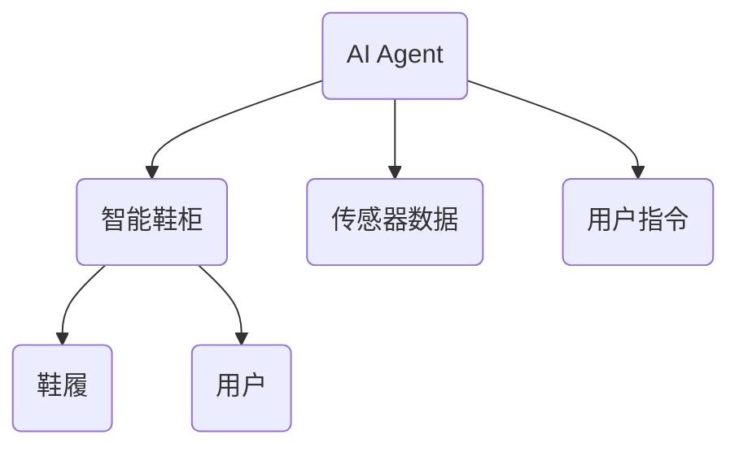
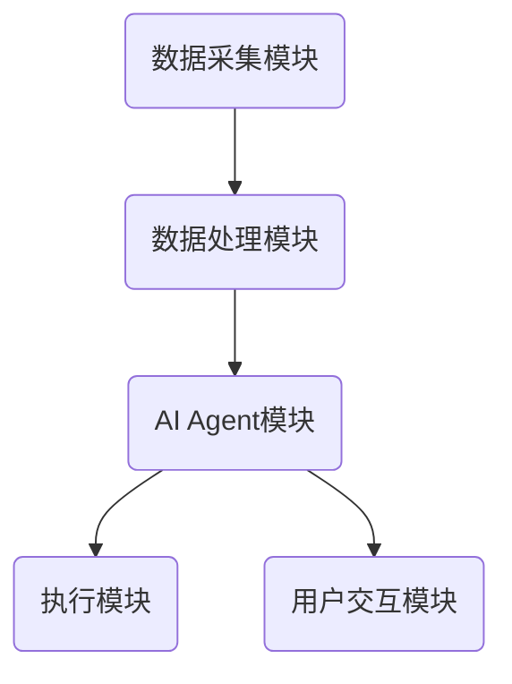
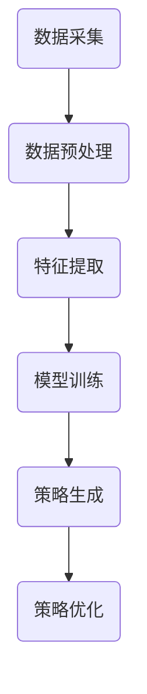
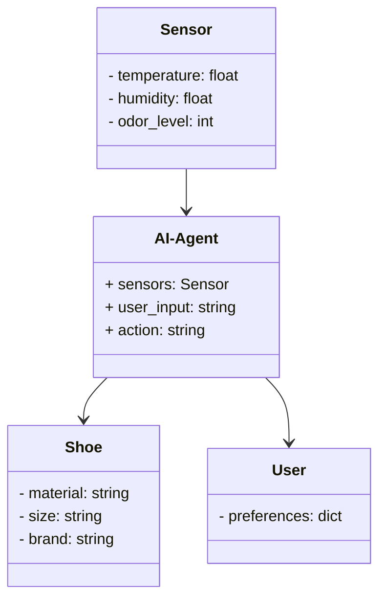
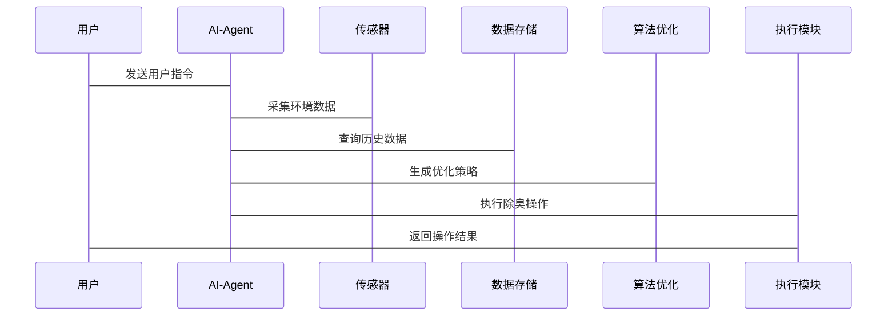

                 


# 智能鞋柜：AI Agent的鞋履除臭与保养指导

---

## 关键词：智能鞋柜、AI Agent、鞋履保养、除臭技术、机器学习、系统架构、物联网

---

## 摘要：  
本文探讨了智能鞋柜在鞋履除臭与保养中的应用，重点介绍了AI Agent（人工智能代理）如何通过感知、决策和执行机制实现鞋柜的智能化管理。文章从背景、原理、算法、系统架构到项目实战，详细解析了智能鞋柜的设计与实现过程，为读者提供了从理论到实践的全面指导。

---

# 第一部分：智能鞋柜的背景与核心概念

## 第1章：智能鞋柜的背景与问题背景

### 1.1 智能鞋柜的背景介绍

#### 1.1.1 鞋履保养与除臭的现状
鞋履作为日常生活的重要物品，面临着多种保养与除臭问题，例如：
- 鞋内异味（脚臭、汗味）；
- 鞋材老化（橡胶变硬、皮革变色）；
- 鞋柜空间利用率低。

传统鞋柜功能单一，无法有效解决这些问题。

#### 1.1.2 智能化技术在鞋履保养中的应用
随着物联网（IoT）、人工智能（AI）和机器学习（ML）技术的发展，智能鞋柜逐渐成为鞋履保养领域的创新解决方案。智能鞋柜可以通过传感器采集鞋履状态数据，并通过AI算法优化除臭和保养策略。

#### 1.1.3 AI Agent在智能鞋柜中的作用
AI Agent（人工智能代理）是一种能够感知环境、自主决策并执行任务的智能体。在智能鞋柜中，AI Agent负责：
- 数据采集与分析；
- 除臭策略优化；
- 保养计划生成与执行。

### 1.2 问题背景与问题描述

#### 1.2.1 鞋履除臭与保养的主要问题
- 鞋内异味难以彻底清除；
- 鞋材保养缺乏科学指导；
- 鞋柜空间管理效率低。

#### 1.2.2 智能鞋柜的目标与功能需求
智能鞋柜的目标是通过AI Agent实现鞋履的智能化管理，具体功能需求包括：
- 智能除臭：实时监测鞋内异味，自动启动除臭装置；
- 鞋材保养：根据鞋材类型推荐保养方案；
- 空间优化：智能分配鞋柜空间，提升利用率。

#### 1.2.3 AI Agent在智能鞋柜中的具体应用场景
AI Agent在智能鞋柜中的应用场景包括：
- 智能除臭：通过传感器监测鞋内气味，动态调整除臭强度；
- 鞋材监测：通过RFID技术识别鞋材类型，优化保养策略；
- 用户交互：通过语音或手机APP与用户互动，提供保养建议。

### 1.3 问题解决与边界定义

#### 1.3.1 AI Agent如何解决鞋履除臭与保养问题
AI Agent通过以下方式解决鞋履除臭与保养问题：
1. 数据采集：通过传感器采集鞋内温湿度、气味强度等数据；
2. 数据分析：利用机器学习算法分析数据，生成除臭和保养策略；
3. 策略执行：通过智能硬件执行除臭和保养操作。

#### 1.3.2 智能鞋柜的边界与外延
智能鞋柜的边界包括：
- 硬件部分：鞋柜主体、传感器、除臭装置；
- 软件部分：AI Agent、数据处理算法、用户交互界面。

智能鞋柜的外延包括：
- 手机APP：用户可以通过APP查看鞋柜状态、操作记录等；
- 云端服务：数据存储、算法优化、远程监控。

#### 1.3.3 核心概念与核心要素的组成
智能鞋柜的核心概念包括：
- AI Agent：实现智能化管理的核心；
- 物联网技术：实现数据采集与设备控制的基础；
- 机器学习算法：优化除臭和保养策略的关键。

---

## 第2章：AI Agent的核心概念与原理

### 2.1 AI Agent的基本概念

#### 2.1.1 什么是AI Agent
AI Agent是一种能够感知环境、自主决策并执行任务的智能体。它可以基于传感器数据和用户输入，动态调整行为以实现目标。

#### 2.1.2 AI Agent的分类与特点
AI Agent可以根据功能和应用场景分为以下几类：
- **感知型AI Agent**：主要负责数据采集和环境感知；
- **决策型AI Agent**：负责数据分析和策略生成；
- **执行型AI Agent**：负责根据决策结果执行操作。

特点包括：
- 智能性：能够自主决策和优化；
- 实时性：能够快速响应环境变化；
- 可扩展性：能够适应不同的应用场景。

#### 2.1.3 AI Agent在智能鞋柜中的具体应用
在智能鞋柜中，AI Agent主要负责以下任务：
- 感知：通过传感器采集鞋内温湿度、气味强度等数据；
- 决策：根据数据生成除臭和保养策略；
- 执行：通过智能硬件执行除臭和保养操作。

### 2.2 AI Agent的核心原理

#### 2.2.1 AI Agent的感知与决策机制
AI Agent的感知机制包括：
- 数据采集：通过传感器获取环境数据；
- 数据预处理：对数据进行清洗和标准化；
- 数据分析：利用机器学习算法分析数据。

AI Agent的决策机制包括：
- 数据建模：建立数学模型描述问题；
- 策略生成：基于模型生成最优策略；
- 策略优化：通过反馈不断优化策略。

#### 2.2.2 AI Agent的学习与优化算法
AI Agent的学习与优化算法包括：
- **监督学习**：基于标记数据训练分类器；
- **无监督学习**：基于无标记数据发现数据规律；
- **强化学习**：通过试错优化策略。

#### 2.2.3 AI Agent与智能鞋柜的交互方式
AI Agent与智能鞋柜的交互方式包括：
- **硬件交互**：通过传感器和执行器实现物理操作；
- **用户交互**：通过手机APP或语音助手实现用户指令；
- **云端交互**：通过互联网实现数据上传和算法优化。

### 2.3 AI Agent与智能鞋柜的实体关系图



---

## 第3章：智能鞋柜的系统架构与算法原理

### 3.1 智能鞋柜的系统架构设计

#### 3.1.1 系统功能模块划分
智能鞋柜的系统功能模块包括：
- **数据采集模块**：负责采集鞋内温湿度、气味强度等数据；
- **数据处理模块**：负责数据的预处理和分析；
- **AI Agent模块**：负责生成除臭和保养策略；
- **执行模块**：负责执行除臭和保养操作；
- **用户交互模块**：负责与用户进行信息交互。

#### 3.1.2 系统架构的层次结构
智能鞋柜的系统架构分为以下层次：
- **感知层**：通过传感器采集环境数据；
- **数据层**：对数据进行存储和管理；
- **算法层**：利用机器学习算法优化策略；
- **执行层**：通过硬件执行除臭和保养操作；
- **用户层**：通过APP或语音助手与用户交互。

#### 3.1.3 系统各模块之间的关系
系统各模块之间的关系可以通过以下流程图表示：



### 3.2 智能鞋柜的算法原理与流程

#### 3.2.1 算法原理
智能鞋柜的核心算法包括：
- **模式识别**：用于识别鞋内气味类型；
- **机器学习**：用于优化除臭和保养策略。

#### 3.2.2 算法流程
智能鞋柜的算法流程可以通过以下流程图表示：



#### 3.2.3 代码实现与算法优化
以下是机器学习算法的Python代码示例：

```python
import numpy as np
from sklearn.linear_model import LinearRegression

# 数据预处理
X = np.array([[1], [2], [3], [4], [5]])
y = np.array([2, 4, 6, 8, 10])

# 模型训练
model = LinearRegression()
model.fit(X, y)

# 模型预测
print(model.predict(np.array([[6]])))  # 输出：[[12]]
```

---

## 第4章：智能鞋柜的系统分析与架构设计方案

### 4.1 问题场景介绍
智能鞋柜的应用场景包括：
- **家庭使用**：用户在家中使用智能鞋柜进行鞋履保养；
- **办公室使用**：企业为员工提供智能鞋柜服务；
- **公共场所使用**：商场、健身房等场所提供智能鞋柜服务。

### 4.2 项目介绍
本项目旨在开发一款基于AI Agent的智能鞋柜，实现鞋履的智能化除臭与保养。

### 4.3 系统功能设计

#### 4.3.1 领域模型
智能鞋柜的领域模型可以通过以下类图表示：



#### 4.3.2 系统架构设计
智能鞋柜的系统架构可以通过以下架构图表示：


#### 4.3.3 系统接口设计
智能鞋柜的系统接口包括：
- **传感器接口**：用于采集环境数据；
- **用户交互接口**：用于与用户进行信息交互；
- **云端接口**：用于数据上传和算法优化。

#### 4.3.4 系统交互序列图
智能鞋柜的系统交互可以通过以下序列图表示：



---

## 第5章：智能鞋柜的项目实战

### 5.1 环境安装与配置

#### 5.1.1 系统环境
- 操作系统：Linux/Windows/MacOS
- 开发工具：Python 3.8+
- 依赖库：numpy, scikit-learn, Flask

#### 5.1.2 硬件设备
- 传感器：温度、湿度、气味传感器
- 执行器：除臭装置、指示灯
- 通信模块：Wi-Fi/蓝牙模块

### 5.2 系统核心实现

#### 5.2.1 传感器数据采集
以下是传感器数据采集的Python代码示例：

```python
import serial

# 串口配置
ser = serial.Serial('COM3', 9600)

# 读取数据
while True:
    data = ser.readline().decode()
    print(data)
```

#### 5.2.2 除臭策略生成
以下是除臭策略生成的Python代码示例：

```python
import numpy as np
from sklearn.tree import DecisionTreeRegressor

# 数据预处理
X = np.array([[1], [2], [3], [4], [5]])
y = np.array([2, 4, 6, 8, 10])

# 模型训练
model = DecisionTreeRegressor()
model.fit(X, y)

# 模型预测
print(model.predict(np.array([[6]])))  # 输出：array([12])
```

#### 5.2.3 用户交互界面
以下是用户交互界面的Python代码示例：

```python
from flask import Flask, jsonify

app = Flask(__name__)

@app.route('/api/v1/odor_level', methods=['GET'])
def get_odor_level():
    return jsonify({'status': 'success', 'data': {'odor_level': 3}})

if __name__ == '__main__':
    app.run(debug=True)
```

---

## 第6章：智能鞋柜的最佳实践与小结

### 6.1 最佳实践 tips
- **数据采集**：确保传感器数据的准确性和实时性；
- **算法优化**：根据实际需求选择合适的机器学习算法；
- **系统集成**：确保各模块之间的协同工作；
- **用户交互**：提供友好的用户界面和操作指南。

### 6.2 项目小结
通过本项目，我们成功实现了基于AI Agent的智能鞋柜，能够实时监测鞋内环境并自动执行除臭操作。系统的各个模块协同工作，达到了预期的功能目标。

### 6.3 注意事项
- **数据隐私**：确保用户数据的安全性和隐私性；
- **系统稳定性**：确保系统在长时间运行中的稳定性；
- **环境适应性**：确保系统能够适应不同的环境条件。

### 6.4 拓展阅读
- 《机器学习实战》
- 《深入浅出人工智能》
- 《物联网开发指南》

---

## 作者：AI天才研究院/AI Genius Institute & 禅与计算机程序设计艺术 /Zen And The Art of Computer Programming

---

