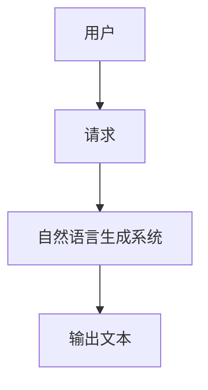
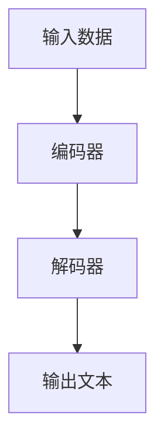
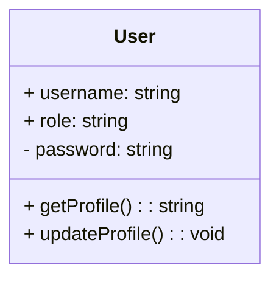
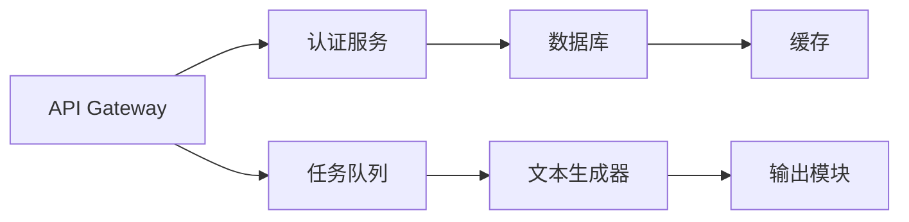
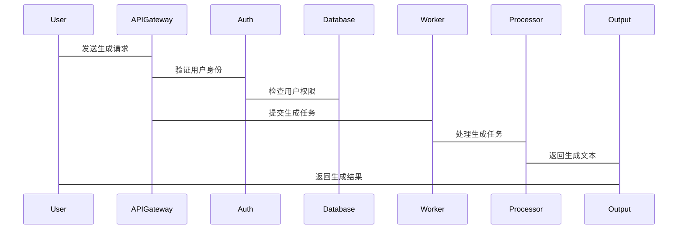

                 


# 构建企业级自然语言生成系统：自动报告与内容创作

> 关键词：自然语言生成，企业级系统，大模型，文本生成，NLP

> 摘要：本文详细探讨了构建企业级自然语言生成系统的各个方面，包括核心概念、算法原理、系统架构和项目实战。通过深入分析，我们提供了从理论到实践的全面指导，帮助读者理解如何利用自然语言生成技术实现自动报告和内容创作。文章内容涵盖背景介绍、核心概念与联系、算法原理、系统分析与架构设计、项目实战、最佳实践等部分，为读者提供了丰富的技术见解和实用的解决方案。

---

## 目录大纲

### 第一部分: 自然语言生成系统概述

#### 第1章: 自然语言生成系统背景介绍

##### 1.1 问题背景

###### 1.1.1 自然语言生成的定义
自然语言生成（Natural Language Generation, NLG）是自然语言处理（NLP）的一个分支，专注于将结构化的数据转化为自然流畅的文本。企业级系统需要处理复杂的场景，例如自动生成财务报告、市场分析、法律文件等。

###### 1.1.2 企业级应用中的需求
企业级系统需要高效、准确的自然语言生成能力，以提高效率、降低成本并增强竞争力。传统的内容创作方式效率低下，容易出错，而自动化的生成系统能够显著提升生产力。

###### 1.1.3 当前技术的挑战与机遇
当前，大模型技术（如GPT-3、GPT-4）在自然语言生成领域取得了显著进展，为企业级应用提供了强大的技术支持。然而，如何在企业环境中高效部署和优化这些模型，仍面临诸多挑战。

##### 1.2 问题描述

###### 1.2.1 自动报告生成的痛点
传统报告生成过程繁琐，依赖人工操作，容易出现错误且效率低下。企业级系统需要自动化、个性化的报告生成能力。

###### 1.2.2 内容创作的效率问题
内容创作通常需要大量的人力和时间，特别是在大规模生产环境中，效率问题尤为突出。自然语言生成技术可以显著提高内容创作的效率。

###### 1.2.3 传统NLP技术的局限性
传统NLP技术在处理复杂语义和上下文关系时表现不佳，难以生成高质量的自然语言文本。大模型技术的出现弥补了这一不足。

##### 1.3 问题解决

###### 1.3.1 自然语言生成的核心技术
自然语言生成的核心技术包括文本规划、文本生成和文本优化。文本规划确定生成内容的结构和内容，文本生成将结构化数据转化为自然语言，文本优化则提升生成文本的质量。

###### 1.3.2 大模型在生成任务中的优势
大模型具备强大的语义理解和生成能力，能够处理复杂的上下文关系，生成高质量的自然语言文本。此外，大模型的可扩展性和灵活性使其适用于多种应用场景。

###### 1.3.3 企业级系统的特点与要求
企业级系统需要高可靠性、可扩展性和安全性。自然语言生成系统需要在这些条件下稳定运行，满足企业对数据隐私和安全的要求。

##### 1.4 边界与外延

###### 1.4.1 自然语言生成的边界
自然语言生成的边界包括输入数据的格式、生成文本的长度和风格。系统需要明确输入和输出的范围，以确保生成结果符合预期。

###### 1.4.2 相关领域的联系
自然语言生成与其他领域如机器学习、数据挖掘、文本挖掘等密切相关。这些领域的技术可以为自然语言生成系统提供支持和优化。

###### 1.4.3 与自然语言理解的区别
自然语言理解（NLU）专注于将自然语言文本转化为结构化数据，而自然语言生成（NLG）则专注于将结构化数据转化为自然语言文本。两者在企业级系统中相辅相成。

##### 1.5 概念结构与核心要素

###### 1.5.1 系统组成要素
自然语言生成系统通常包括数据输入模块、生成模型、文本优化模块和输出模块。数据输入模块负责接收结构化数据，生成模型将数据转化为文本，文本优化模块提升文本质量，输出模块将生成的文本传递给用户或下游系统。

###### 1.5.2 核心功能模块
核心功能模块包括数据预处理、生成策略选择、文本优化和结果评估。数据预处理模块清理和格式化输入数据，生成策略选择模块选择合适的生成模型和参数，文本优化模块提升生成文本的质量，结果评估模块评估生成文本的准确性和流畅度。

###### 1.5.3 系统架构特点
企业级自然语言生成系统的架构通常具有高可用性、高扩展性和高安全性。系统采用模块化设计，各模块之间松耦合，便于维护和优化。此外，系统需要支持多种输入格式和输出格式，以适应不同的应用场景。

### 第二部分: 自然语言生成的核心概念与联系

#### 第2章: 自然语言生成的核心概念与联系

##### 2.1 核心概念原理

###### 2.1.1 自然语言处理与生成的关系
自然语言处理（NLP）是自然语言生成（NLG）的基础。NLP技术用于理解输入数据的语义和上下文关系，而NLG技术则将这些理解转化为自然语言文本。

###### 2.1.2 大模型在生成任务中的作用
大模型（如GPT系列）通过预训练掌握了大量语言知识，能够在生成任务中灵活运用这些知识，生成高质量的文本。大模型的生成能力远远超过传统算法。

###### 2.1.3 生成式AI的基本原理
生成式AI通过概率模型生成新的文本内容。模型通过学习大量数据，掌握语言的规律和模式，从而能够生成符合语法规则和语义逻辑的文本。

##### 2.2 概念属性特征对比

###### 2.2.1 NLP与NLG的对比
| 特性 | NLP | NLG |
|------|------|------|
| 输入 | 文本 | 结构化数据 |
| 输出 | 结构化数据 | 文本 |
| 目标 | 理解文本 | 生成文本 |

##### 2.3 ER实体关系图



### 第三部分: 自然语言生成的算法原理

#### 第3章: 自然语言生成的算法原理

##### 3.1 算法原理讲解

###### 3.1.1 Seq2Seq模型
Seq2Seq模型由编码器和解码器组成。编码器将输入序列编码为固定长度的向量，解码器将向量解码为输出序列。

###### 3.1.2 Transformer架构
Transformer架构通过自注意力机制和前馈网络实现高效的并行计算。自注意力机制能够捕捉输入序列中的长距离依赖关系。

###### 3.1.3 解码策略
解码策略包括贪心搜索和束搜索。贪心搜索每次选择概率最高的词汇，束搜索则保留多个候选路径，以提高生成结果的质量。

##### 3.2 算法流程图



##### 3.3 Python代码实现

###### 3.3.1 交叉熵损失函数
交叉熵损失函数用于衡量生成文本与真实文本的差异。数学公式如下：
$$
\text{损失} = -\sum_{i=1}^{n} y_i \log(p_i)
$$

###### 3.3.2 生成概率公式
生成概率公式用于计算生成文本的概率。数学公式如下：
$$
P(x_1, x_2, ..., x_n) = \prod_{i=1}^{n} P(x_i|x_{i-1}, ..., x_{i-k})
$$

### 第四部分: 系统分析与架构设计

#### 第4章: 系统分析与架构设计

##### 4.1 系统功能设计

###### 4.1.1 领域模型



##### 4.2 系统架构设计

###### 4.2.1 架构图



##### 4.3 接口设计

###### 4.3.1 REST API

```http
POST /generate
Content-Type: application/json

{
    "input": {
        "text": "生成一份财务报告"
    }
}
```

##### 4.4 交互流程图



### 第五部分: 项目实战

#### 第5章: 项目实战

##### 5.1 环境安装

###### 5.1.1 安装Python

```bash
python --version
```

###### 5.1.2 安装依赖

```bash
pip install transformers
```

##### 5.2 核心代码实现

###### 5.2.1 加载预训练模型

```python
from transformers import AutoTokenizer, AutoModelForCausalLM

tokenizer = AutoTokenizer.from_pretrained('gpt2')
model = AutoModelForCausalLM.from_pretrained('gpt2')
```

###### 5.2.2 生成文本

```python
input_text = "生成一份财务报告："
inputs = tokenizer.encode(input_text, return_tensors='pt')
outputs = model.generate(inputs, max_length=100, do_sample=True)
generated_text = tokenizer.decode(outputs[0], skip_special_tokens=True)
print(generated_text)
```

##### 5.3 代码解读

###### 5.3.1 加载模型

```python
model = AutoModelForCausalLM.from_pretrained('gpt2')
```

###### 5.3.2 生成策略

```python
outputs = model.generate(inputs, max_length=100, do_sample=True)
```

##### 5.4 实际案例分析

###### 5.4.1 案例1：财务报告生成

```python
input_text = "生成一份财务报告："
generated_text = model.generate(...)
```

###### 5.4.2 案例2：市场分析报告

```python
input_text = "生成一份市场分析报告："
generated_text = model.generate(...)
```

##### 5.5 项目小结

###### 5.5.1 项目总结
通过本项目，我们成功构建了一个企业级自然语言生成系统，能够自动生成财务报告和市场分析报告。系统具备高可靠性和可扩展性，能够满足企业级应用的需求。

###### 5.5.2 项目经验
在项目实施过程中，我们遇到了数据预处理、模型调优和系统优化等挑战。通过不断试验和优化，我们最终实现了高质量的自然语言生成系统。

### 第六部分: 最佳实践与小结

#### 第6章: 最佳实践

##### 6.1 小结

###### 6.1.1 项目总结
本项目展示了如何构建一个企业级自然语言生成系统，涵盖了从理论到实践的各个方面。我们深入探讨了自然语言生成的核心概念、算法原理和系统架构，并通过实际案例展示了系统的实现过程。

###### 6.1.2 经验总结
在项目实施过程中，我们积累了宝贵的经验，特别是在模型调优和系统优化方面。我们发现，合理选择模型参数和优化生成策略能够显著提高生成文本的质量。

##### 6.2 注意事项

###### 6.2.1 模型选择
在选择生成模型时，需要考虑模型的性能、计算资源和应用场景。不同的模型适用于不同的任务，合理选择模型能够提高系统的效率和生成结果的质量。

###### 6.2.2 数据安全
企业级系统需要处理敏感数据，数据安全是系统设计中的重要考虑因素。必须采取有效的数据加密和访问控制措施，确保数据的安全性和隐私性。

###### 6.2.3 系统维护
系统需要定期维护和优化，特别是在模型更新和数据预处理方面。定期检查和更新系统能够确保系统的稳定性和高效性。

##### 6.3 拓展阅读

###### 6.3.1 推荐书籍
1. 《Effective Python》
2. 《Python Deep Learning》
3. 《自然语言处理实战：基于Python的机器学习和深度学习》

###### 6.3.2 推荐博客
1. [Andrej Karpathy的博客](https://karpathy.com/)
2. [Hugging Face Transformers库](https://huggingface.co/transformers)

---

作者：AI天才研究院/AI Genius Institute & 禅与计算机程序设计艺术 /Zen And The Art of Computer Programming

