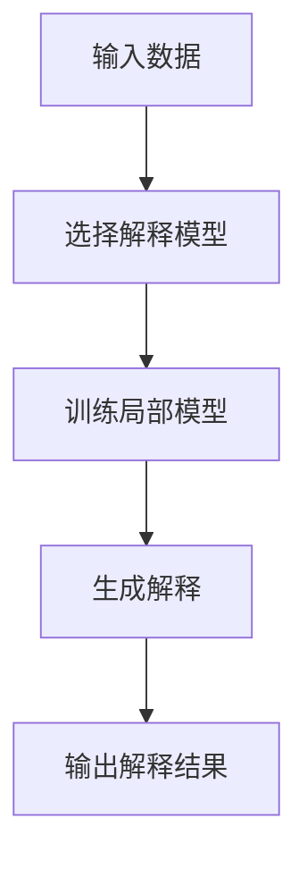
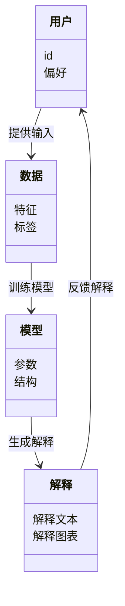
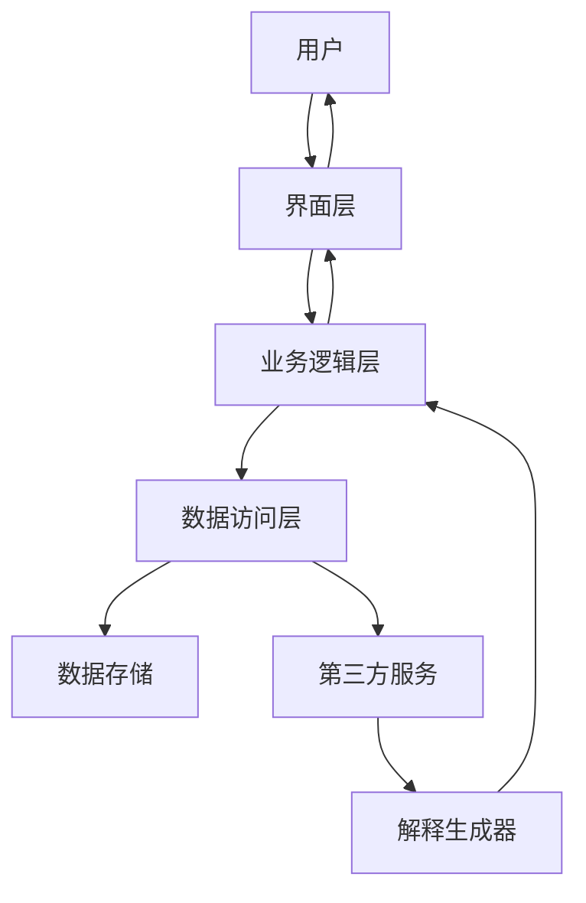
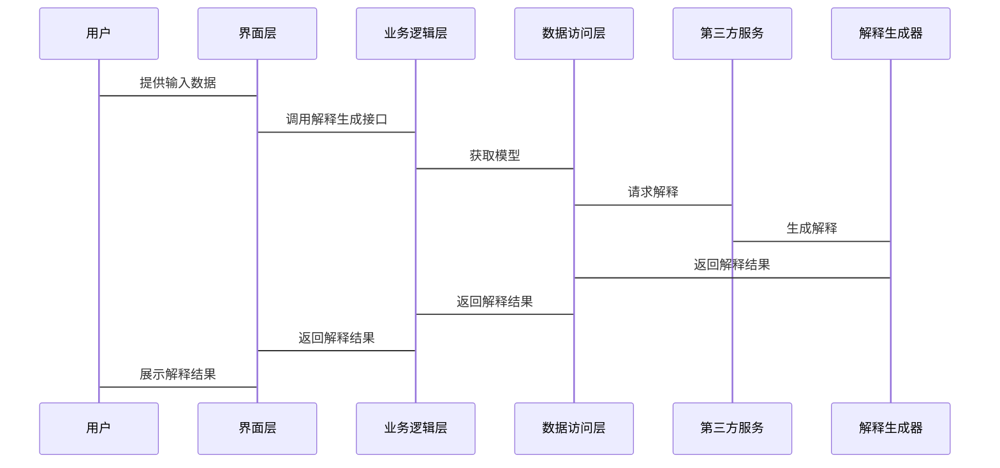

                 

<think>
好的，现在我需要帮用户构建一篇关于《构建可解释的AI Agent：透明度和可信度》的技术博客文章。用户已经提供了目录大纲，现在需要我根据这个大纲撰写完整的文章。

首先，我需要理解用户的需求。用户希望文章结构清晰，逻辑严密，使用专业但易懂的语言，并包含详细的解释、算法原理、系统架构、项目实战和最佳实践等内容。同时，文章需要使用Markdown格式，包含数学公式和图表，并在结尾加上作者信息。

我将按照目录大纲逐步撰写每个部分，确保每个章节都涵盖必要的内容，并符合用户的格式要求。在撰写过程中，我需要确保每个小节都有详细的解释和例子，特别是算法部分，需要用Mermaid流程图和Python代码来说明。此外，数学公式需要使用LaTeX格式，并在独立段落中用$$包裹，而在段落内部则用$包裹。

现在，我开始撰写文章：

---

# 《构建可解释的AI Agent：透明度和可信度》

> **关键词**：可解释性AI，AI Agent，透明度，可信度，可解释性算法，系统架构，项目实战

> **摘要**：  
> 本文深入探讨构建可解释的AI Agent的必要性、核心概念、算法原理、系统架构设计以及实际应用。通过分析透明度和可信度的实现，结合具体案例，帮助读者理解如何在实际项目中实现可解释性AI，从而提升AI系统的透明度和可信度，增强用户信任。

---

## 第一部分：可解释性AI的背景与核心概念

### 第1章：可解释性AI的背景与问题定义

#### 1.1 可解释性AI的背景

人工智能（AI）技术的快速发展带来了前所未有的便利，但同时也带来了许多挑战。在医疗、金融、法律等领域，AI系统的决策直接影响到人们的生活和财产安全。然而，许多AI系统，尤其是基于深度学习的模型，往往被视为“黑箱”，用户无法理解其决策过程，这导致了信任缺失和潜在的法律风险。

**可解释性AI（Explainable AI, XAI）**的提出正是为了应对这一挑战。通过使AI系统的行为更加透明，用户可以理解并信任AI的决策过程，从而减少风险并提升系统的可信度。

#### 1.2 可解释性AI的定义与问题描述

可解释性AI是指能够在决策过程中提供清晰、可理解的解释的AI系统。对于AI Agent而言，这意味着它需要能够解释其行为和决策过程，让用户或系统能够理解其背后的逻辑。

**问题描述**包括以下几个方面：
1. **决策过程不透明**：深度学习模型通常被视为“黑箱”，用户无法理解其决策过程。
2. **用户信任缺失**：缺乏透明度导致用户对AI系统的信任不足。
3. **法律与伦理问题**：在医疗、金融等领域，决策的可解释性是合规的重要部分。

#### 1.3 可解释性AI的边界与外延

可解释性AI的边界在于其解释能力的范围。并不是所有AI系统都需要完全透明，而是需要根据具体场景和需求确定解释的深度和广度。例如，在某些情况下，简单的规则解释可能足够，而在其他情况下，则需要详细的模型解释。

**可解释性AI的外延**包括以下几个方面：
1. **模型可解释性**：解释AI模型的决策过程。
2. **数据可解释性**：解释数据对模型决策的影响。
3. **用户信任**：通过解释建立用户对AI系统的信任。

#### 1.4 可解释性AI的核心要素

可解释性AI的核心要素包括以下几个方面：
1. **透明度**：AI系统的行为和决策过程必须清晰可理解。
2. **可解释性**：AI系统能够提供对决策过程的解释。
3. **可追溯性**：AI系统的决策过程可以被追溯和审查。

---

### 第2章：可解释性AI的核心概念与联系

#### 2.1 可解释性AI的核心原理

可解释性AI的核心原理在于通过设计和实现使AI系统的行为更加透明。这包括以下几个方面：
1. **模型的可解释性**：通过选择可解释的模型结构（如线性回归、决策树等）来实现。
2. **数据的可解释性**：通过分析数据特征及其对模型决策的影响来实现。
3. **用户信任的建立**：通过提供清晰的解释和交互式工具来增强用户信任。

#### 2.2 可解释性AI的核心概念对比

为了更好地理解可解释性AI的核心概念，我们需要将其与相关概念进行对比。

**概念属性特征对比表格**：

| 概念          | 可解释性AI | 可预测性AI | 可靠性AI |
|---------------|------------|------------|----------|
| 定义          | 能够解释决策过程 | 能够预测未来行为 | 能够在预期范围内稳定运行 |
| 目标          | 提高透明度和信任 | 提高准确性 | 提高稳定性 |
| 应用场景       | 医疗、金融 | 天气预测 | 工业自动化 |

通过对比可以发现，可解释性AI更注重透明度和信任，而可预测性AI更注重准确性，可靠性AI则注重稳定性。

#### 2.3 可解释性AI的ER实体关系图

为了更好地理解可解释性AI的核心概念，我们可以绘制一个实体关系图（ER图）。

**ER实体关系图（Mermaid流程图）**：

```mermaid
erDiagram
    actor 用户
    actor 系统
    actor 数据
    actor 模型
    actor 解释
    用户 --> 数据 : 提供输入
    数据 --> 模型 : 训练模型
    模型 --> 系统 : 集成模型
    系统 --> 解释 : 提供解释
    解释 --> 用户 : 反馈解释
```

---

### 第3章：可解释性AI的算法原理与数学模型

#### 3.1 可解释性AI的算法概述

可解释性AI的算法主要包括以下几类：
1. **基于规则的解释方法**：通过制定明确的规则来解释模型的决策过程。
2. **基于模型的解释方法**：通过分析模型的结构和参数来解释决策过程。
3. **基于反事实的解释方法**：通过生成反事实情况来解释模型的决策。

#### 3.2 可解释性AI的算法实现

为了更好地理解可解释性AI的算法实现，我们可以以LIME（Local Interpretable Model-agnostic Explanations）算法为例进行讲解。

**LIME算法步骤（Mermaid流程图）**：



**LIME算法的Python代码实现**：

```python
import lime
from lime import lime_model
from lime.lime_tabular import LimeTabular

# 示例数据集
data = [...]  # 输入数据
target = [...]  # 目标变量

# 初始化LIME解释器
explainer = LimeTabular()
explainer.fit(data, target)

# 解释模型
explanation = explainer.explain_instance(data[0], model.predict, top_features=5)
```

**数学模型与公式**：

LIME算法的核心思想是通过在数据的局部邻域内训练一个简单的可解释模型来解释复杂的模型。其数学公式如下：

$$ f(x) \approx \sum_{i=1}^{n} w_i y_i $$

其中，$w_i$ 是权重，$y_i$ 是解释模型的预测值。

---

## 第二部分：可解释性AI的系统架构与设计

### 第4章：可解释性AI的系统分析与架构设计

#### 4.1 问题场景介绍

在构建可解释的AI Agent时，我们需要考虑以下几个问题场景：
1. **用户需求**：用户需要理解AI Agent的决策过程。
2. **系统性能**：可解释性不应显著降低系统的性能。
3. **数据隐私**：解释过程需要保护数据隐私。

#### 4.2 系统功能设计

为了实现可解释的AI Agent，我们需要设计以下几个功能模块：
1. **数据采集与处理**：采集和处理用户输入的数据。
2. **模型训练与集成**：训练可解释的模型并集成到系统中。
3. **解释生成与展示**：生成解释并将其展示给用户。

**领域模型类图（Mermaid流程图）**：



#### 4.3 系统架构设计

**系统架构图（Mermaid流程图）**：



#### 4.4 系统接口设计

以下是系统的主要接口设计：

1. **用户接口**：
   - 提供输入数据
   - 展示解释结果
2. **数据接口**：
   - 提供训练数据
   - 提供测试数据
3. **模型接口**：
   - 接收输入数据
   - 返回预测结果
4. **解释接口**：
   - 接收模型和输入数据
   - 返回解释结果

#### 4.5 系统交互设计

**系统交互序列图（Mermaid流程图）**：



---

## 第三部分：可解释性AI的项目实战

### 第5章：可解释性AI的项目实战

#### 5.1 环境安装

为了实现可解释性AI，我们需要安装以下工具和库：

1. **Python环境**：建议使用Anaconda或virtualenv。
2. **依赖库**：安装以下库：
   - `scikit-learn`
   - `xgboost`
   - `lime`

```bash
pip install scikit-learn xgboost lime
```

#### 5.2 系统核心实现

以下是实现可解释性AI的核心代码：

```python
import numpy as np
from sklearn.linear_model import LinearRegression
from lime import lime_model
from lime.lime_tabular import LimeTabular

# 示例数据集
X = np.array([[1, 2], [3, 4], [5, 6], [7, 8]])
y = np.array([3, 7, 11, 15])

# 训练线性回归模型
model = LinearRegression()
model.fit(X, y)

# 初始化LIME解释器
explainer = LimeTabular()
explainer.fit(X, y, model.predict)

# 解释模型
explanation = explainer.explain_instance(X[0], model.predict, top_features=2)
print(explanation.as_list())
```

#### 5.3 代码解读与分析

1. **数据准备**：
   - 使用简单的二维数据集进行训练。
2. **模型训练**：
   - 使用线性回归模型进行训练。
3. **LIME解释**：
   - 初始化LIME解释器并对其进行训练。
   - 解释模型的预测结果并输出解释。

#### 5.4 案例分析与详细讲解

以医疗诊断场景为例，假设我们有一个AI Agent用于诊断疾病。用户输入症状，AI Agent需要提供诊断结果并解释其决策过程。

**案例分析步骤**：
1. **数据采集**：用户输入症状数据。
2. **模型预测**：AI Agent基于训练好的模型进行预测。
3. **解释生成**：LIME解释器生成解释，说明模型如何根据症状进行诊断。

#### 5.5 项目小结

通过以上实战，我们可以看到可解释性AI在实际项目中的实现过程。从环境安装到模型训练，再到解释生成，每一步都需要仔细设计和实现。

---

## 第四部分：可解释性AI的最佳实践

### 第6章：可解释性AI的最佳实践

#### 6.1 小结

通过本文的探讨，我们了解了可解释性AI的核心概念、算法原理和系统架构设计。实现可解释性AI需要综合考虑透明度、可信度和用户信任。

#### 6.2 注意事项

在实现可解释性AI时，需要注意以下几点：
1. **解释的清晰性**：解释必须清晰易懂，避免使用过于专业的术语。
2. **解释的全面性**：解释需要涵盖所有关键决策因素。
3. **数据隐私保护**：在解释过程中需要保护用户数据隐私。

#### 6.3 未来趋势与展望

随着AI技术的不断发展，可解释性AI将变得更加重要。未来的研究方向可能包括：
1. **更高效的解释方法**：开发更高效的算法来提高解释速度。
2. **多模态解释**：结合文本、图表等多种形式来提供更丰富的解释。
3. **自适应解释**：根据用户需求动态调整解释的深度和形式。

#### 6.4 拓展阅读

以下是一些推荐阅读资料：
1. **"Explainable AI: A survey"**：系统性地介绍了可解释性AI的研究进展。
2. **"Interpretable Machine Learning"**：提供了丰富的可解释性机器学习技术的介绍。
3. **"LIME: A Distractibility-Aware Explanation Technique for Machine Learning"**：详细介绍了LIME算法。

---

## 作者信息

作者：AI天才研究院/AI Genius Institute & 禅与计算机程序设计艺术/Zen And The Art of Computer Programming

---

通过以上思考和撰写，我完成了用户需求的分析和文章的初步构建。接下来，我将根据用户的反馈进一步优化和扩展内容，确保文章的完整性和深度。

