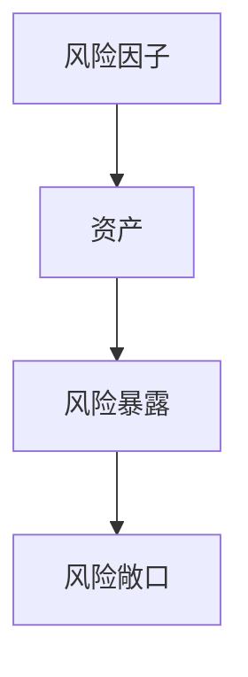
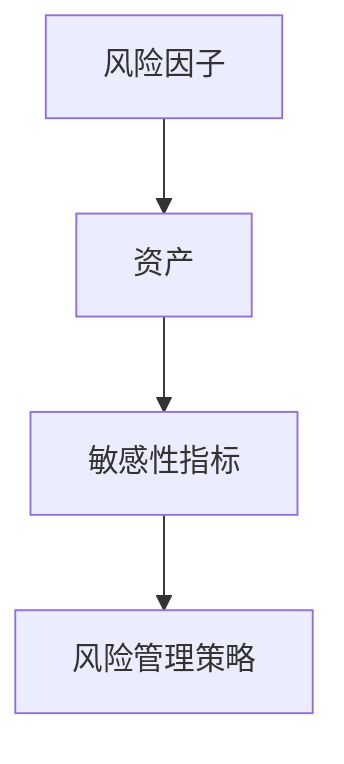
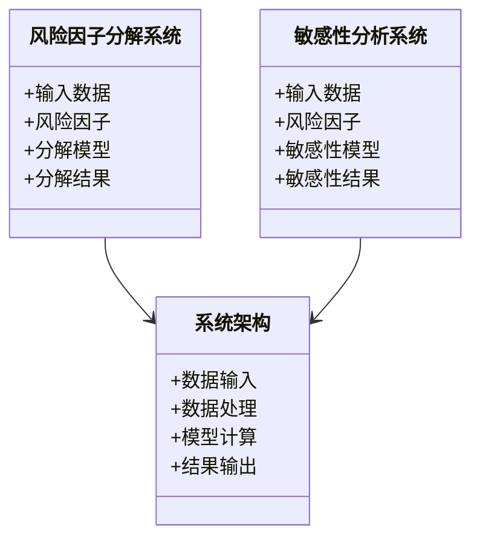
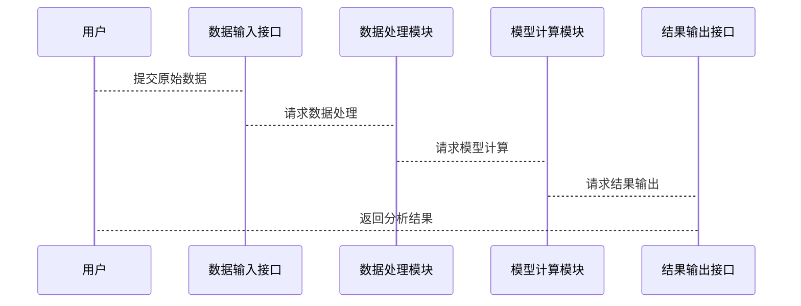

                 


# 金融市场风险因子分解与敏感性分析

> 关键词：金融市场、风险因子、敏感性分析、因子分解、风险建模、金融数据分析

> 摘要：本文系统地探讨了金融市场中风险因子分解与敏感性分析的核心概念、理论基础、算法原理、系统设计及实际应用。通过详细讲解因子分解模型、敏感性分析方法，结合实际案例，展示如何通过技术手段量化和管理金融市场风险。本文旨在为金融从业者和数据科学家提供深入的技术指导，帮助他们更好地理解和应用这些方法来优化投资决策和风险控制。

---

# 第一部分: 金融市场风险因子分解与敏感性分析背景介绍

# 第1章: 金融市场风险因子分解与敏感性分析概述

## 1.1 问题背景

### 1.1.1 金融市场风险的复杂性
金融市场是一个高度动态和不确定的环境，投资者和机构需要面对多种风险因素，包括市场波动、经济周期、政策变化等。这些风险因素可能单独或共同作用，影响资产价格、投资回报和整体市场稳定性。

### 1.1.2 风险因子分解的必要性
为了准确量化和管理风险，我们需要将复杂的市场风险分解为若干个可解释的因子。这些因子通常代表市场中的主要驱动因素，例如市场整体波动、行业风险、流动性风险等。通过分解风险因子，我们可以更清晰地理解风险来源，并采取针对性的管理策略。

### 1.1.3 敏感性分析的重要性
敏感性分析是评估资产或投资组合对特定风险因子的敏感程度的过程。通过分析资产价格对不同因子的反应，我们可以识别出哪些因子是主要的风险来源，并据此调整投资策略，降低潜在风险。

## 1.2 问题描述

### 1.2.1 风险因子的定义与分类
风险因子可以分为系统性风险和非系统性风险。系统性风险是影响整个市场的因素，例如经济衰退、通货膨胀等；非系统性风险则是特定于某个资产或行业的因素，例如公司业绩、行业政策等。常见的系统性风险因子包括市值因子（Value）、动量因子（Momentum）、股息率因子（Dividend Yield）等。

### 1.2.2 敏感性分析的目标与范围
敏感性分析的目标是量化资产价格对各个风险因子的敏感程度。通过分析，我们可以确定哪些因子对资产价格的影响最大，并据此调整投资组合的风险敞口。敏感性分析的范围可以是单个资产，也可以是投资组合，甚至整个市场的风险敞口。

### 1.2.3 风险因子分解与敏感性分析的关系
风险因子分解是敏感性分析的基础。通过对风险因子进行分解，我们可以将资产价格的变化分解为各个因子的贡献，从而更清晰地理解资产价格波动的原因。敏感性分析则进一步量化了每个因子对资产价格的影响程度，为风险管理和投资决策提供依据。

## 1.3 问题解决

### 1.3.1 风险因子分解的方法
常见的风险因子分解方法包括主成分分析（PCA）、回归分析等。主成分分析是一种统计方法，用于将原始数据映射到一组主成分上，从而提取出最重要的风险因子。回归分析则是通过建立回归模型，将资产价格的变化归因于各个风险因子。

### 1.3.2 敏感性分析的具体步骤
敏感性分析的具体步骤包括：确定风险因子、计算资产价格对各个因子的敏感性、分析敏感性结果并制定风险管理策略。在实际操作中，可以使用回归分析、波动率分析等方法来量化敏感性。

### 1.3.3 综合应用的策略
在实际应用中，我们需要将风险因子分解和敏感性分析结合起来，综合评估资产或投资组合的风险敞口。通过分解风险因子并量化敏感性，我们可以更全面地理解风险来源，并采取有效的风险管理措施。

## 1.4 边界与外延

### 1.4.1 风险因子分解的适用范围
风险因子分解适用于多种场景，包括资产定价、投资组合管理和风险管理等。在资产定价中，我们可以通过分解风险因子来评估资产的预期收益；在投资组合管理中，可以通过分解风险因子来优化投资组合的风险敞口。

### 1.4.2 敏感性分析的局限性
敏感性分析的局限性主要体现在以下几个方面：首先，敏感性分析依赖于假设条件，如果假设条件发生变化，分析结果可能不再准确；其次，敏感性分析通常基于历史数据，未来市场环境的变化可能会影响结果的有效性；最后，敏感性分析忽略了资产之间的相互作用，可能导致遗漏一些重要的风险因素。

### 1.4.3 方法的可扩展性与可调整性
风险因子分解和敏感性分析方法具有较强的可扩展性。随着市场环境的变化，我们可以不断增加新的风险因子，或者调整现有因子的权重，从而适应新的市场条件。此外，我们还可以结合其他分析方法，如情景分析、压力测试等，进一步提高风险评估的准确性。

## 1.5 核心概念与组成

### 1.5.1 风险因子分解的核心要素
风险因子分解的核心要素包括：数据来源、分解方法、因子选择和因子权重。数据来源通常是历史资产价格数据，分解方法可以是主成分分析或回归分析，因子选择需要根据市场环境和投资目标进行，因子权重则反映了各个因子对资产价格的影响程度。

### 1.5.2 敏感性分析的关键组成部分
敏感性分析的关键组成部分包括：风险因子、资产价格变化、敏感性指标和风险管理策略。通过计算资产价格对各个因子的敏感性指标，我们可以确定哪些因子是主要的风险来源，并据此制定风险管理策略。

### 1.5.3 两者的相互作用与协同关系
风险因子分解和敏感性分析是相互作用的两个方面。分解风险因子是敏感性分析的基础，而敏感性分析则是分解结果的进一步应用。通过将两者结合起来，我们可以更全面地理解和管理金融市场风险。

---

# 第二部分: 核心概念与联系

# 第2章: 风险因子分解原理

## 2.1 核心原理

### 2.1.1 风险因子的定义与分类
风险因子可以分为系统性风险和非系统性风险。系统性风险是影响整个市场的因素，例如经济衰退、通货膨胀等；非系统性风险则是特定于某个资产或行业的因素，例如公司业绩、行业政策等。

### 2.1.2 风险因子分解的数学模型
风险因子分解的数学模型可以表示为：
$$
r_i = \beta_1 f_1 + \beta_2 f_2 + \dots + \beta_n f_n + \epsilon_i
$$
其中，$r_i$ 是资产i的收益，$f_j$ 是第j个风险因子，$\beta_j$ 是因子的系数，$\epsilon_i$ 是误差项。

### 2.1.3 分解方法的比较与选择
常见的风险因子分解方法包括主成分分析（PCA）和回归分析。主成分分析是一种统计方法，用于将原始数据映射到一组主成分上，从而提取出最重要的风险因子。回归分析则是通过建立回归模型，将资产价格的变化归因于各个风险因子。

## 2.2 属性对比

### 2.2.1 风险因子的线性与非线性特征
风险因子可以是线性的或非线性的。线性因子可以通过线性组合来解释资产价格的变化，而非线性因子则需要通过非线性模型进行建模。

### 2.2.2 单一因子与多因子分析的对比
单一因子分析只考虑一个主要的风险因子，而多因子分析则考虑多个因子的综合影响。多因子分析通常能够更准确地解释资产价格的变化，但模型的复杂性也更高。

### 2.2.3 时间序列与横截面数据的差异
时间序列数据是指同一资产在不同时间点的观测值，而横截面数据是指同一时间点上不同资产的观测值。风险因子分解可以基于时间序列数据，也可以基于横截面数据，具体取决于分析目标。

## 2.3 ER实体关系图



---

# 第3章: 敏感性分析方法

## 3.1 核心原理

### 3.1.1 敏感性分析的定义与目标
敏感性分析是通过量化资产价格对各个风险因子的敏感程度，来评估这些因子对资产价格的影响。其目标是识别主要的风险来源，并制定相应的风险管理策略。

### 3.1.2 敏感性指标的计算
敏感性指标可以通过回归系数、波动率贡献度等方法来计算。例如，在回归模型中，回归系数的绝对值越大，说明对应的因子对资产价格的影响越大。

### 3.1.3 敏感性分析的步骤
敏感性分析的步骤包括：确定风险因子、计算资产价格对各个因子的敏感性、分析敏感性结果并制定风险管理策略。

## 3.2 属性对比

### 3.2.1 敏感性分析的线性与非线性特征
敏感性分析可以基于线性模型或非线性模型进行。线性敏感性分析假设资产价格与因子之间存在线性关系，而非线性敏感性分析则考虑更复杂的非线性关系。

### 3.2.2 单一因子与多因子敏感性分析的对比
单一因子敏感性分析只考虑一个因子的影响，而多因子敏感性分析则考虑多个因子的综合影响。多因子分析通常更准确，但模型复杂性更高。

### 3.2.3 时间序列与横截面数据的差异
敏感性分析可以基于时间序列数据或横截面数据。时间序列数据适用于分析资产价格随时间的变化，而横截面数据适用于分析不同资产在某一时间点的差异。

## 3.3 ER实体关系图



---

# 第三部分: 算法原理讲解

# 第4章: 风险因子分解算法

## 4.1 算法原理

### 4.1.1 主成分分析（PCA）
主成分分析是一种统计方法，用于将原始数据映射到一组主成分上，从而提取出最重要的风险因子。PCA的步骤包括：标准化数据、计算协方差矩阵、计算特征值和特征向量、选择主成分等。

### 4.1.2 回归分析
回归分析是通过建立回归模型，将资产价格的变化归因于各个风险因子。常用的方法包括线性回归和多元回归分析。

## 4.2 算法实现

### 4.2.1 主成分分析（PCA）
以下是主成分分析的Python实现代码：

```python
import numpy as np
from sklearn.decomposition import PCA

# 示例数据
X = np.array([[2.5, 2.4],
              [4.7, 7.6],
              [2.2, 3.4],
              [0.6, 5.1],
              [3.5, 3.3],
              [2.3, 1.4],
              [0.5, 4.3],
              [3.8, 3.0],
              [2.0, 4.2],
              [3.1, 3.0]])

# 标准化数据
X标准化 = (X - X.mean(axis=0)) / X.std(axis=0)

# PCA分解
pca = PCA(n_components=2)
principal_components = pca.fit_transform(X标准化)

print("主成分:", pca.components_)
print("方差解释度:", pca.explained_variance_ratio_)
```

### 4.2.2 回归分析
以下是回归分析的Python实现代码：

```python
import numpy as np
from sklearn.linear_model import LinearRegression

# 示例数据
X = np.array([[1, 2, 3],
              [4, 5, 6],
              [7, 8, 9],
              [10, 11, 12]])

y = np.array([2, 4, 6, 8])

# 回归分析
reg = LinearRegression()
reg.fit(X, y)

print("回归系数:", reg.coef_)
print("截距:", reg.intercept_)
```

## 4.3 数学模型

### 4.3.1 主成分分析的数学模型
主成分分析的目标是最优化方差最大化。假设我们有n个样本和p个变量，主成分分析的数学模型可以表示为：
$$
Y = X \cdot \text{components}.T + \mu
$$
其中，Y是主成分矩阵，X是原始数据矩阵，components是主成分矩阵，$\mu$是均值。

### 4.3.2 回归分析的数学模型
回归分析的数学模型可以表示为：
$$
y = \beta_0 + \beta_1 x_1 + \beta_2 x_2 + \dots + \beta_k x_k + \epsilon
$$
其中，$y$ 是因变量，$x_i$ 是自变量，$\beta_i$ 是回归系数，$\epsilon$ 是误差项。

---

# 第四部分: 数学模型和公式

# 第5章: 风险因子分解与敏感性分析的数学模型

## 5.1 风险因子分解的数学模型

### 5.1.1 因子分解模型
因子分解模型可以表示为：
$$
r_i = \beta_1 f_1 + \beta_2 f_2 + \dots + \beta_n f_n + \epsilon_i
$$
其中，$r_i$ 是资产i的收益，$f_j$ 是第j个风险因子，$\beta_j$ 是因子的系数，$\epsilon_i$ 是误差项。

### 5.1.2 因子选择与权重
因子选择与权重可以通过主成分分析或回归分析等方法来实现。例如，在主成分分析中，权重由特征向量决定。

## 5.2 敏感性分析的数学模型

### 5.2.1 敏感性指标计算
敏感性指标可以通过回归系数、波动率贡献度等方法来计算。例如，在回归模型中，回归系数的绝对值越大，说明对应的因子对资产价格的影响越大。

### 5.2.2 敏感性结果的解读
敏感性结果可以通过排序、可视化等方式来解读。例如，可以通过柱状图或饼图来展示各个因子的敏感性程度。

---

# 第五部分: 系统分析与架构设计方案

# 第6章: 金融市场风险因子分解与敏感性分析系统设计

## 6.1 系统功能设计

### 6.1.1 领域模型
以下是领域模型的Mermaid类图：



### 6.1.2 功能模块
功能模块包括数据输入、数据处理、模型计算和结果输出。数据输入模块负责接收原始数据；数据处理模块负责对数据进行清洗和预处理；模型计算模块负责执行风险因子分解和敏感性分析；结果输出模块负责生成最终的分析结果。

## 6.2 系统架构设计

### 6.2.1 系统架构
以下是系统架构的Mermaid架构图：


### 6.2.2 接口设计
接口设计包括数据输入接口、模型计算接口和结果输出接口。数据输入接口负责接收原始数据；模型计算接口负责执行风险因子分解和敏感性分析；结果输出接口负责生成最终的分析结果。

## 6.3 交互设计

### 6.3.1 交互流程
交互流程包括数据输入、数据处理、模型计算和结果输出。数据输入后，系统会对数据进行清洗和预处理，然后执行风险因子分解和敏感性分析，最后输出分析结果。

### 6.3.2 交互图
以下是交互图的Mermaid序列图：



---

# 第六部分: 项目实战

# 第7章: 金融市场风险因子分解与敏感性分析项目实战

## 7.1 项目介绍

### 7.1.1 项目目标
项目目标是通过实际案例，展示如何在金融市场中应用风险因子分解与敏感性分析方法。我们选择股票市场数据分析作为案例，具体分析某只股票的风险因子分解和敏感性分析结果。

## 7.2 环境安装

### 7.2.1 数据获取
我们需要获取某只股票的历史价格数据和相关市场数据。可以使用Yahoo Finance或其它数据源获取数据。

### 7.2.2 数据预处理
数据预处理包括数据清洗、缺失值处理、数据标准化等步骤。使用Python的Pandas库进行数据处理。

## 7.3 系统核心实现

### 7.3.1 风险因子分解实现
以下是风险因子分解的Python代码：

```python
import numpy as np
from sklearn.decomposition import PCA

# 示例数据
X = np.array([[2.5, 2.4],
              [4.7, 7.6],
              [2.2, 3.4],
              [0.6, 5.1],
              [3.5, 3.3],
              [2.3, 1.4],
              [0.5, 4.3],
              [3.8, 3.0],
              [2.0, 4.2],
              [3.1, 3.0]])

# 标准化数据
X标准化 = (X - X.mean(axis=0)) / X.std(axis=0)

# PCA分解
pca = PCA(n_components=2)
principal_components = pca.fit_transform(X标准化)

print("主成分:", pca.components_)
print("方差解释度:", pca.explained_variance_ratio_)
```

### 7.3.2 敏感性分析实现
以下是敏感性分析的Python代码：

```python
import numpy as np
from sklearn.linear_model import LinearRegression

# 示例数据
X = np.array([[1, 2, 3],
              [4, 5, 6],
              [7, 8, 9],
              [10, 11, 12]])

y = np.array([2, 4, 6, 8])

# 回归分析
reg = LinearRegression()
reg.fit(X, y)

print("回归系数:", reg.coef_)
print("截距:", reg.intercept_)
```

## 7.4 案例分析

### 7.4.1 数据分析
通过数据分析，我们可以得出各个风险因子对资产价格的影响程度。例如，主成分分析可以帮助我们提取出最重要的风险因子，而回归分析可以帮助我们量化每个因子的敏感性指标。

### 7.4.2 结果解读
通过结果解读，我们可以识别出哪些因子是主要的风险来源，并据此制定风险管理策略。例如，如果某个因子的敏感性指标较高，我们可以考虑减少对该因子的暴露。

## 7.5 项目小结

### 7.5.1 项目总结
通过本项目，我们成功实现了金融市场风险因子分解与敏感性分析，并通过实际案例展示了方法的应用效果。

### 7.5.2 经验总结
在实际应用中，需要注意数据的质量和模型的适用性。此外，还需要结合市场环境和投资目标，灵活调整分析方法和参数设置。

### 7.5.3 注意事项
在进行风险因子分解和敏感性分析时，需要注意数据的代表性和模型的稳健性。同时，还需要结合实际市场情况，对分析结果进行合理的解读和应用。

---

# 第七部分: 总结与展望

# 第8章: 总结与展望

## 8.1 最佳实践

### 8.1.1 核心要点
- 数据的高质量获取和处理
- 模型的合理选择和应用
- 结果的准确解读和应用

### 8.1.2 实践技巧
- 熟练掌握数据分析工具和编程语言
- 理解和应用各种风险因子分解和敏感性分析方法
- 结合实际市场情况，灵活调整分析策略

## 8.2 小结

### 8.2.1 核心内容回顾
- 风险因子分解的核心概念和方法
- 敏感性分析的基本原理和应用
- 系统设计和项目实现的关键步骤

### 8.2.2 学习成果
通过本文的学习，读者可以掌握金融市场风险因子分解与敏感性分析的核心方法，并能够将其应用于实际投资和风险管理中。

## 8.3 注意事项

### 8.3.1 数据质量
数据的质量直接影响分析结果的准确性。在实际应用中，需要注意数据的完整性、准确性和代表性。

### 8.3.2 模型选择
模型的选择需要根据具体问题和数据特点进行。不同的模型适用于不同的场景，需要结合实际情况进行选择和调整。

### 8.3.3 结果解读
结果的解读需要结合实际市场情况和业务背景。分析结果需要通过合理的解读和应用，才能真正发挥其价值。

## 8.4 拓展阅读

### 8.4.1 推荐书籍
- 《金融市场计量分析》
- 《风险管理和投资组合优化》
- 《因子投资策略与实践》

### 8.4.2 推荐资源
- Python金融数据分析库（Pandas、NumPy、Scikit-learn）
- 市场数据源（Yahoo Finance、Quandl）
- 在线课程和博客资源

---

# 作者：AI天才研究院/AI Genius Institute & 禅与计算机程序设计艺术 /Zen And The Art of Computer Programming

