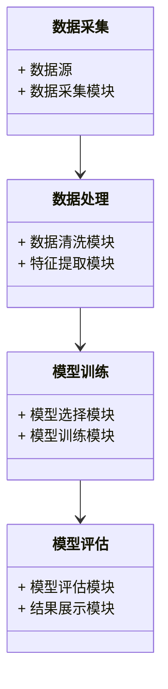
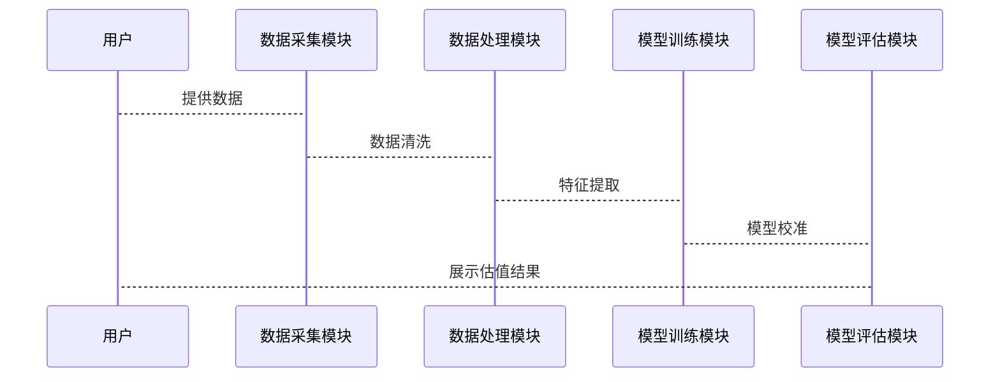

                 


# AI辅助的初创公司估值模型校准

> 关键词：AI辅助、初创公司、估值模型、校准、机器学习、数据分析

> 摘要：随着人工智能技术的快速发展，AI在初创公司估值模型中的应用越来越广泛。本文从传统估值方法的局限性出发，探讨了如何利用AI技术优化估值模型的校准过程，结合实际案例分析，详细讲解了AI辅助的估值模型校准方法，包括数据预处理、特征提取、模型训练与优化、模型评估等关键步骤，并通过数学公式和代码示例，深入剖析了校准模型的实现细节。本文旨在为初创公司提供一种高效、精准的估值方法，帮助企业在早期阶段实现更准确的估值。

---

# 第1章: AI辅助的初创公司估值模型校准背景介绍

## 1.1 问题背景

### 1.1.1 初创公司估值的传统方法与局限性
初创公司的估值是一个复杂且充满不确定性的过程。传统的估值方法主要包括DCF（ discounted cash flow）、市盈率（P/E）和市净率（P/B）等。然而，这些方法在实际应用中存在以下问题：
- 数据不足：初创公司通常缺乏足够的历史数据，难以支撑复杂的估值模型。
- 主观性强：传统估值方法依赖于人工判断，容易受到人为因素的影响。
- 动态变化：初创公司的业务模式和市场环境往往在快速变化，静态的估值模型难以捕捉这些变化。

### 1.1.2 AI技术在估值领域的潜力
随着AI技术的快速发展，机器学习算法在数据分析和模式识别方面表现出色。通过AI技术，可以自动处理海量数据，提取关键特征，并构建动态的估值模型。AI的引入可以显著提高估值的准确性和效率，尤其是在数据量大、维度高的场景下。

### 1.1.3 当前市场对AI辅助估值的需求
近年来，越来越多的初创公司开始采用AI辅助的估值方法。市场对高精度、实时更新的估值模型的需求日益增长，尤其是在风险投资和私募股权领域。AI辅助的估值模型可以帮助投资者更准确地评估初创公司的价值，降低投资风险。

## 1.2 问题描述

### 1.2.1 传统估值模型的局限性
传统估值模型的局限性主要体现在以下几个方面：
- 数据依赖性强：传统模型需要大量历史数据支持，但在初创公司中，数据往往不足。
- 静态性：传统模型难以动态调整，无法适应快速变化的市场环境。
- 可解释性差：复杂的模型往往缺乏透明性，难以被非技术人员理解和信任。

### 1.2.2 AI在估值模型中的应用场景
AI技术可以广泛应用于估值模型的各个阶段，包括数据预处理、特征提取、模型训练和优化等。例如：
- 数据清洗：AI可以帮助自动清洗和补充缺失数据。
- 特征工程：通过机器学习算法，可以提取更具代表性的特征。
- 模型优化：AI可以自动调整模型参数，提高预测精度。

### 1.2.3 校准模型的核心问题
校准模型的核心问题是如何利用AI技术，通过数据驱动的方式，优化传统估值模型的参数和结构，使其更准确地反映初创公司的实际价值。这需要解决以下几个关键问题：
- 数据质量问题：如何处理缺失数据和噪声数据。
- 模型选择：如何选择合适的算法和模型结构。
- 模型评估：如何验证模型的准确性和稳定性。

## 1.3 问题解决

### 1.3.1 AI辅助估值模型的基本思路
AI辅助的估值模型的基本思路是：通过机器学习算法，对大量数据进行分析，提取关键特征，构建预测模型，并通过不断迭代优化模型参数，提高估值的准确性。具体步骤包括：
1. 数据收集：收集初创公司的财务数据、市场数据和行业数据。
2. 数据预处理：清洗数据，处理缺失值和异常值。
3. 特征提取：通过机器学习算法提取关键特征。
4. 模型训练：训练机器学习模型，预测公司价值。
5. 模型优化：调整模型参数，提高预测精度。
6. 模型评估：验证模型的准确性和稳定性。

### 1.3.2 校准模型的目标与方法
校准模型的目标是通过数据驱动的方式，优化传统估值模型的参数和结构，使其更准确地反映初创公司的实际价值。具体方法包括：
- 数据清洗与特征工程：通过机器学习算法提取特征，并进行降维处理。
- 模型选择与训练：选择合适的算法，训练模型，并进行交叉验证。
- 模型优化：调整模型参数，提高预测精度。
- 模型评估：通过回归分析和误差分析，验证模型的准确性和稳定性。

### 1.3.3 模型优化的关键点
模型优化的关键点包括：
- 数据质量：数据的完整性和准确性直接影响模型的性能。
- 特征选择：选择具有高解释性和高区分度的特征。
- 模型选择：选择适合数据特征的算法。
- 超参数调优：通过网格搜索等方法，优化模型参数。

## 1.4 模型边界与外延

### 1.4.1 模型适用的行业范围
AI辅助的估值模型适用于各种行业，但尤其适合那些数据驱动型的行业，如科技、互联网、金融等。在这些行业中，数据量大且易于获取，适合机器学习算法的应用。

### 1.4.2 数据质量对模型的影响
数据质量直接影响模型的性能。高质量的数据可以提高模型的准确性和稳定性，而低质量的数据可能导致模型过拟合或欠拟合。

### 1.4.3 模型的可解释性与鲁棒性
模型的可解释性是用户信任的重要因素。AI辅助的估值模型需要具有较高的可解释性，以便用户理解和信任模型的预测结果。同时，模型的鲁棒性也是关键，模型需要能够适应数据分布的变化，保持稳定的性能。

---

# 第2章: AI辅助的初创公司估值模型校准的核心概念

## 2.1 AI与估值模型的结合

### 2.1.1 AI在数据处理中的作用
AI在数据处理中的作用主要体现在数据清洗和特征提取方面。通过机器学习算法，可以自动识别和处理数据中的噪声和异常值，提取更具代表性的特征。

### 2.1.2 AI在特征提取中的应用
特征提取是AI辅助估值模型的核心步骤之一。通过PCA（主成分分析）等降维技术，可以提取出最具代表性的特征，降低模型的维度和复杂度。

### 2.1.3 AI在模型优化中的价值
AI可以帮助优化模型的结构和参数，提高模型的预测精度。通过自动调整学习率和正则化参数，可以有效防止过拟合，提高模型的泛化能力。

## 2.2 估值模型的结构与核心要素

### 2.2.1 传统估值模型的结构
传统估值模型通常包括以下几个部分：
- 财务数据：收入、利润、现金流等。
- 市场数据：市盈率、市净率等。
- 行业数据：行业平均值、趋势等。

### 2.2.2 AI辅助模型的结构
AI辅助的估值模型在传统模型的基础上，增加了数据预处理和特征工程模块。具体结构包括：
1. 数据清洗：处理缺失值和异常值。
2. 特征提取：通过机器学习算法提取特征。
3. 模型训练：训练机器学习模型，预测公司价值。
4. 模型优化：调整模型参数，提高预测精度。

### 2.2.3 核心要素的对比分析
以下是传统估值模型和AI辅助模型的核心要素对比：

| **要素**       | **传统估值模型**                     | **AI辅助估值模型**                     |
|----------------|-------------------------------------|---------------------------------------|
| 数据来源       | 财务数据、市场数据                   | 财务数据、市场数据、行业数据、社交媒体数据 |
| 数据处理       | 手工处理，效率低                   | 自动处理，效率高                     |
| 特征提取       | 依赖人工经验，特征有限             | 通过机器学习自动提取，特征丰富       |
| 模型结构       | 线性回归、简单逻辑回归             | 神经网络、随机森林、梯度提升树等       |
| 模型优化       | 依赖人工调整，精度有限             | 自动优化，精度高                     |

## 2.3 校准模型的原理

### 2.3.1 数据预处理与特征工程
数据预处理是AI辅助估值模型的第一步，主要包括：
- 数据清洗：处理缺失值和异常值。
- 数据标准化：将数据归一化，使其具有相同的尺度。
- 特征工程：通过PCA等降维技术，提取最具代表性的特征。

### 2.3.2 模型训练与优化
模型训练是AI辅助估值模型的核心步骤，主要包括：
- 选择算法：如线性回归、随机森林、神经网络等。
- 训练模型：通过训练数据，调整模型参数，使模型能够准确预测公司价值。
- 优化参数：通过网格搜索等方法，优化模型的超参数，提高预测精度。

### 2.3.3 模型评估与校准
模型评估是校准模型的重要步骤，主要包括：
- 回归分析：通过R²值、均方误差（MSE）等指标，评估模型的预测精度。
- 交叉验证：通过K折交叉验证，评估模型的泛化能力。
- 灵敏度分析：分析模型对不同特征的依赖程度，评估模型的可解释性。

## 2.4 核心概念的ER实体关系图

```mermaid
er
actor: 用户
model: 估值模型
data: 数据集
training: 训练过程
calibration: 校准过程

actor --> data: 提供数据
actor --> model: 定义模型结构
data --> training: 数据预处理
training --> calibration: 模型校准
calibration --> model: 优化模型参数
```

---

# 第3章: AI辅助的初创公司估值模型校准的算法原理

## 3.1 数据预处理与特征工程

### 3.1.1 数据清洗
数据清洗是数据预处理的第一步，主要包括：
- 处理缺失值：通过均值填充、插值法等方法，处理缺失数据。
- 处理异常值：通过Z-score法、IQR法等方法，识别和处理异常值。

### 3.1.2 数据标准化
数据标准化是将数据转换为统一尺度的过程，常用的标准化方法包括：
- 最小-最大标准化：将数据缩放到0-1范围。
- Z-score标准化：将数据转换为均值为0，标准差为1的标准正态分布。

### 3.1.3 特征工程
特征工程是通过降维技术，提取最具代表性的特征。常用的降维方法包括：
- PCA（主成分分析）：通过线性组合，提取主成分。
- Lasso回归：通过L1正则化，选择重要特征。

## 3.2 算法原理

### 3.2.1 线性回归模型
线性回归模型是一种简单但有效的回归模型，适用于线性关系明显的数据。

$$ y = \beta_0 + \beta_1 x_1 + \beta_2 x_2 + \ldots + \beta_n x_n + \epsilon $$

其中，$y$是目标变量，$x_i$是特征变量，$\beta_i$是回归系数，$\epsilon$是误差项。

### 3.2.2 随机森林回归模型
随机森林回归模型是一种基于树的集成学习算法，具有较高的准确性和鲁棒性。

### 3.2.3 神经网络回归模型
神经网络回归模型是一种基于人工神经网络的回归模型，适用于复杂的非线性关系。

## 3.3 算法实现

### 3.3.1 线性回归模型实现
以下是线性回归模型的Python代码示例：

```python
import numpy as np
from sklearn.linear_model import LinearRegression

# 生成数据
X = np.array([[1, 1], [2, 2], [3, 3], [4, 4], [5, 5]])
y = np.array([2, 4, 5, 4, 6])

# 训练模型
model = LinearRegression()
model.fit(X, y)

# 预测
print(model.predict([[6, 6]]))
```

### 3.3.2 随机森林回归模型实现
以下是随机森林回归模型的Python代码示例：

```python
from sklearn.ensemble import RandomForestRegressor

# 生成数据
X = np.array([[1, 1], [2, 2], [3, 3], [4, 4], [5, 5]])
y = np.array([2, 4, 5, 4, 6])

# 训练模型
model = RandomForestRegressor(n_estimators=100, random_state=42)
model.fit(X, y)

# 预测
print(model.predict([[6, 6]]))
```

### 3.3.3 神经网络回归模型实现
以下是神经网络回归模型的Python代码示例：

```python
from sklearn.neural_network import MLPRegressor

# 生成数据
X = np.array([[1, 1], [2, 2], [3, 3], [4, 4], [5, 5]])
y = np.array([2, 4, 5, 4, 6])

# 训练模型
model = MLPRegressor(hidden_layer_sizes=(4, 4), random_state=42)
model.fit(X, y)

# 预测
print(model.predict([[6, 6]]))
```

## 3.4 算法选择与优化

### 3.4.1 算法选择
选择合适的算法是模型优化的关键。需要根据数据特征和业务需求，选择适合的算法。例如：
- 线性回归适用于线性关系明显的数据。
- 随机森林适用于高维数据和非线性关系。
- 神经网络适用于复杂的非线性关系。

### 3.4.2 超参数调优
超参数调优是提高模型性能的重要步骤。常用的调优方法包括：
- 网格搜索（Grid Search）：遍历所有可能的参数组合，选择最优参数。
- 随机搜索（Random Search）：随机选择参数组合，减少计算量。

### 3.4.3 模型评估
模型评估是验证模型性能的重要步骤。常用的评估指标包括：
- 回归问题：R²值、均方误差（MSE）、均方根误差（RMSE）。
- 分类问题：准确率、召回率、F1值。

---

# 第4章: AI辅助的初创公司估值模型校准的系统分析与架构设计

## 4.1 问题场景介绍

### 4.1.1 系统目标
本系统的目标是通过AI技术，构建一个高效、精准的初创公司估值模型，帮助投资者准确评估初创公司的价值。

### 4.1.2 系统范围
系统范围包括数据采集、数据处理、模型训练、模型评估和结果展示。

### 4.1.3 项目背景
随着AI技术的快速发展，越来越多的初创公司开始采用AI辅助的估值方法。本项目旨在为初创公司提供一种高效、精准的估值方法，帮助企业在早期阶段实现更准确的估值。

## 4.2 系统功能设计

### 4.2.1 领域模型设计
以下是领域模型的Mermaid类图：



### 4.2.2 系统架构设计
以下是系统架构的Mermaid图：


### 4.2.3 系统接口设计
系统接口设计包括：
- 数据接口：与数据源对接，获取初创公司数据。
- 模型接口：与第三方AI平台对接，获取模型训练和优化服务。
- 用户接口：提供用户交互界面，展示估值结果。

### 4.2.4 系统交互设计
以下是系统交互的Mermaid序列图：



## 4.3 系统实现

### 4.3.1 数据采集模块
数据采集模块负责从数据源获取初创公司的数据，包括财务数据、市场数据和行业数据。

### 4.3.2 数据处理模块
数据处理模块负责清洗数据和提取特征，为模型训练提供高质量的数据。

### 4.3.3 模型训练模块
模型训练模块负责选择合适的算法，训练模型，并优化模型参数。

### 4.3.4 模型评估模块
模型评估模块负责验证模型的准确性和稳定性，并展示估值结果。

## 4.4 系统优化与扩展

### 4.4.1 系统优化
系统优化包括：
- 数据处理效率优化：通过并行计算和分布式处理，提高数据处理效率。
- 模型训练效率优化：通过GPU加速和分布式训练，提高模型训练效率。

### 4.4.2 系统扩展
系统扩展包括：
- 支持更多数据源：如社交媒体数据、专利数据等。
- 支持更多模型算法：如深度学习模型、集成学习模型等。

---

# 第5章: AI辅助的初创公司估值模型校准的项目实战

## 5.1 环境安装

### 5.1.1 系统要求
- 操作系统：Windows、MacOS、Linux
- Python版本：Python 3.6以上
- 硬件要求：建议配置4GB以上内存，支持GPU加速。

### 5.1.2 工具安装
- 安装Python环境：使用Anaconda或Miniconda。
- 安装依赖库：使用pip安装numpy、pandas、scikit-learn、tensorflow等。

## 5.2 系统核心实现

### 5.2.1 数据采集模块实现
以下是数据采集模块的Python代码示例：

```python
import pandas as pd

# 从CSV文件读取数据
data = pd.read_csv('company_data.csv')

# 展示数据前几行
print(data.head())
```

### 5.2.2 数据处理模块实现
以下是数据处理模块的Python代码示例：

```python
import pandas as pd
from sklearn.preprocessing import StandardScaler

# 数据清洗
data = data.dropna()
data = data.drop_duplicates()

# 特征工程
scaler = StandardScaler()
scaled_data = scaler.fit_transform(data.drop('target', axis=1))
```

### 5.2.3 模型训练模块实现
以下是模型训练模块的Python代码示例：

```python
from sklearn.ensemble import RandomForestRegressor
from sklearn.model_selection import train_test_split

# 数据分割
X_train, X_test, y_train, y_test = train_test_split(scaled_data, data['target'], test_size=0.2, random_state=42)

# 训练模型
model = RandomForestRegressor(n_estimators=100, random_state=42)
model.fit(X_train, y_train)

# 预测
y_pred = model.predict(X_test)
```

### 5.2.4 模型评估模块实现
以下是模型评估模块的Python代码示例：

```python
from sklearn.metrics import mean_squared_error, r2_score

# 计算均方误差
mse = mean_squared_error(y_test, y_pred)

# 计算R²值
r2 = r2_score(y_test, y_pred)

print(f"均方误差: {mse}")
print(f"R²值: {r2}")
```

## 5.3 代码应用解读与分析

### 5.3.1 代码解读
以上代码展示了AI辅助估值模型的核心实现步骤，包括数据采集、数据处理、模型训练和模型评估。

### 5.3.2 代码分析
通过以上代码，可以看出AI辅助估值模型的主要流程：
1. 数据采集：从CSV文件读取数据。
2. 数据处理：清洗数据，处理缺失值和重复值。
3. 特征工程：对数据进行标准化处理。
4. 模型训练：训练随机森林回归模型。
5. 模型评估：计算均方误差和R²值，验证模型性能。

## 5.4 实际案例分析

### 5.4.1 案例背景
假设我们有一家初创科技公司，需要对其价值进行估值。我们收集了以下数据：
- 营业收入：500万元
- 净利润：100万元
- 研发投入：200万元
- 市场规模：10亿元

### 5.4.2 案例分析
通过AI辅助的估值模型，我们可以预测该公司的估值。假设模型预测结果为1.2亿元。

### 5.4.3 案例总结
通过AI辅助的估值模型，我们可以更准确地评估初创公司的价值，为投资者提供科学的决策依据。

## 5.5 项目小结

### 5.5.1 项目成果
通过本项目，我们成功构建了一个高效、精准的初创公司估值模型，能够帮助投资者准确评估初创公司的价值。

### 5.5.2 项目经验
在项目实施过程中，我们积累了以下经验：
- 数据预处理是模型优化的关键。
- 模型选择和优化需要结合数据特征和业务需求。
- 模型评估是验证模型性能的重要步骤。

### 5.5.3 项目展望
未来，我们可以进一步优化模型，支持更多数据源和模型算法，提高模型的准确性和稳定性。

---

# 第6章: 总结与展望

## 6.1 总结
本文详细探讨了AI辅助的初创公司估值模型校准的方法，包括数据预处理、特征提取、模型训练与优化、模型评估等关键步骤。通过具体的案例分析和代码实现，展示了AI技术在估值模型中的应用价值。

## 6.2 展望
未来，随着AI技术的不断发展，初创公司估值模型将更加智能化和精准化。我们可以进一步优化模型，支持更多数据源和模型算法，提高模型的准确性和稳定性。同时，我们也可以探索将AI技术应用于更多领域，推动企业的创新发展。

---

# 作者

作者：AI天才研究院/AI Genius Institute & 禅与计算机程序设计艺术 /Zen And The Art of Computer Programming

