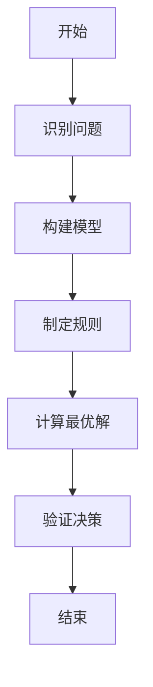
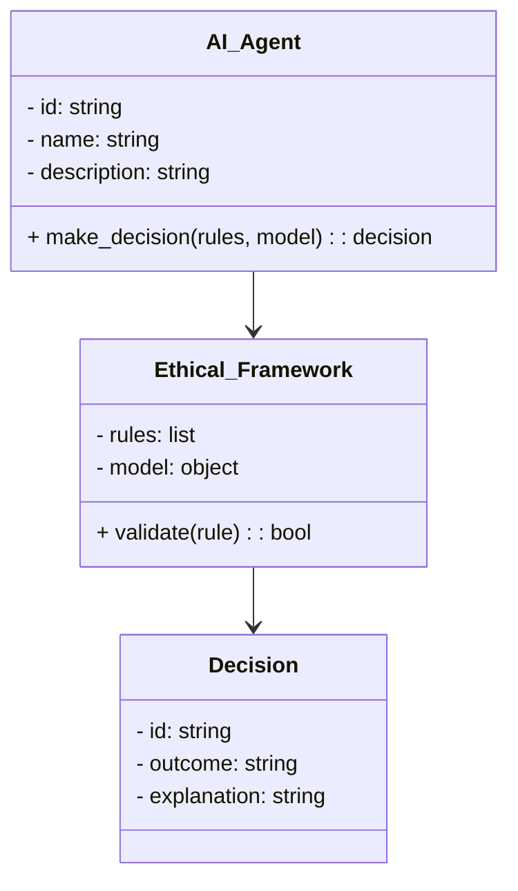
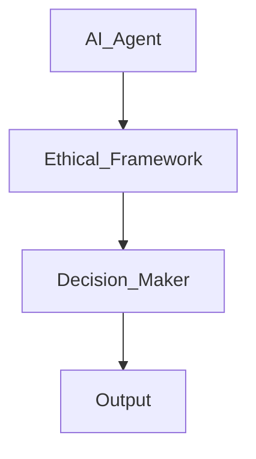
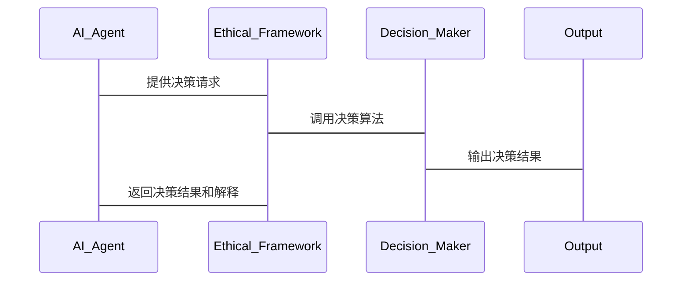

                 


# 企业AI Agent的伦理设计与道德决策框架

---

## 关键词

- 企业AI Agent
- 伦理设计
- 道德决策框架
- 人工智能伦理
- 基于规则的伦理决策
- 企业AI系统

---

## 摘要

随着人工智能技术的快速发展，企业AI Agent在各种应用场景中扮演着越来越重要的角色。然而，AI Agent的决策过程涉及复杂的伦理和道德问题，如何设计一个能够遵守伦理规范、具备道德决策能力的AI Agent，成为当前技术与学术界的热点问题。本文从企业AI Agent的基本概念出发，详细探讨伦理设计的核心概念、算法原理、系统架构以及实际应用案例。通过分析不同的伦理决策框架，结合具体的算法实现和系统设计，本文为读者提供一个全面的企业AI Agent伦理设计与道德决策框架。

---

## 正文

### # 第1章: 企业AI Agent的背景与概念

#### ## 1.1 AI Agent的基本概念

##### ### 1.1.1 AI Agent的定义与类型

AI Agent（人工智能代理）是一种能够感知环境、自主决策并执行任务的智能系统。根据功能和应用场景的不同，AI Agent可以分为以下几种类型：

- **简单反射型AI Agent**：基于预定义的规则进行简单决策，适用于环境简单、任务明确的场景。
- **基于模型的AI Agent**：通过构建环境模型进行决策，适用于复杂环境和动态变化的场景。
- **目标驱动型AI Agent**：以明确的目标为导向，优化决策以实现目标。
- **效用驱动型AI Agent**：基于效用函数进行决策，最大化整体效用。

##### ### 1.1.2 企业AI Agent的特征与属性

企业AI Agent通常具备以下特征：

1. **自主性**：能够在没有人工干预的情况下自主运行。
2. **反应性**：能够实时感知环境变化并做出反应。
3. **目标导向**：以企业目标为导向，优化决策以实现目标。
4. **学习能力**：能够通过数据和经验不断优化自身的决策能力。

##### ### 1.1.3 企业AI Agent的应用场景与价值

企业AI Agent的应用场景广泛，主要包括：

- **智能客服**：通过自然语言处理技术为用户提供高效的服务。
- **智能风控**：在金融领域，AI Agent可以用于风险评估和欺诈检测。
- **智能供应链**：优化供应链管理，提升效率和降低成本。
- **智能决策支持**：为企业提供数据驱动的决策支持。

---

#### ## 1.2 伦理设计的背景与重要性

##### ### 1.2.1 企业AI Agent的伦理问题背景

随着AI Agent在企业中的广泛应用，伦理问题也随之浮现。例如：

- **数据隐私**：AI Agent在处理数据时可能涉及用户的隐私问题。
- **决策透明性**：AI Agent的决策过程需要透明，否则可能导致信任缺失。
- **责任归属**：当AI Agent的决策导致问题时，责任归属如何确定？

##### ### 1.2.2 伦理设计的核心目标与原则

伦理设计的核心目标是确保AI Agent的决策符合伦理规范，其原则包括：

1. **透明性**：决策过程必须可解释，确保用户和相关方能够理解。
2. **公平性**：避免偏见，确保决策对所有相关方公平。
3. **隐私保护**：严格遵守数据隐私保护原则。
4. **责任归属**：明确AI Agent及其开发者的责任。

##### ### 1.2.3 企业AI Agent的伦理挑战与机遇

企业AI Agent的伦理挑战主要在于如何在复杂的商业环境中平衡效率与道德。然而，这也为企业带来了机遇，通过伦理设计提升用户体验和企业形象。

---

#### ## 1.3 伦理决策框架的现状与趋势

##### ### 1.3.1 当前主流的伦理决策框架

当前主流的伦理决策框架包括：

1. **基于规则的伦理决策框架**：通过预定义的规则进行决策。
2. **基于效用的伦理决策框架**：基于效用函数进行决策。
3. **基于学习的伦理决策框架**：通过机器学习模型进行决策。

##### ### 1.3.2 企业AI Agent伦理决策的现状分析

目前，企业AI Agent的伦理决策主要集中在以下几个方面：

- **数据隐私保护**：通过技术手段确保数据的安全性和隐私性。
- **决策透明性**：通过可视化工具展示决策过程。
- **公平性优化**：通过算法优化消除偏见。

##### ### 1.3.3 未来伦理决策框架的发展趋势

未来，伦理决策框架将更加注重以下几点：

1. **动态适应性**：能够根据环境变化动态调整决策策略。
2. **多目标优化**：在多个目标之间进行权衡，确保决策的最优性。
3. **人机协作**：结合人类的伦理判断能力，提升决策的合理性。

---

### # 第2章: 伦理设计的核心概念与联系

#### ## 2.1 伦理设计的基本原理

##### ### 2.1.1 伦理决策的基本原理

伦理决策的基本原理包括：

1. **问题建模**：将实际问题转化为数学模型，以便计算机处理。
2. **规则制定**：制定明确的伦理规则，指导决策过程。
3. **决策优化**：通过优化算法找到最优的决策方案。

##### ### 2.1.2 伦理框架的构建原则

伦理框架的构建原则包括：

1. **明确性**：伦理规则必须清晰明确，避免歧义。
2. **可扩展性**：框架能够适应不同场景和需求的变化。
3. **可解释性**：决策过程必须可解释，便于人类理解和信任。

##### ### 2.1.3 伦理设计的核心要素

伦理设计的核心要素包括：

1. **伦理规则**：用于指导决策的规则集。
2. **决策模型**：将问题转化为数学模型，用于计算最优解。
3. **优化算法**：用于在规则约束下找到最优决策。

#### ## 2.2 伦理框架的对比分析

##### ### 2.2.1 不同伦理框架的对比表格

| 框架类型         | 基于规则的伦理决策框架 | 基于效用的伦理决策框架 | 基于学习的伦理决策框架 |
|------------------|--------------------------|--------------------------|--------------------------|
| 决策依据         | 预定义规则              | 效用函数                | 历史数据与模型          |
| 适用场景         | 简单、规则明确的场景      | 复杂、需要权衡的场景      | 数据驱动的场景          |
| 优势             | 易实现，透明性高          | 能够处理复杂问题        | 学习能力强              |
| 劣势             | 难以应对动态变化          | 需要复杂的建模           | 需要大量数据，可能缺乏透明性 |

##### ### 2.2.2 伦理框架的ER实体关系图

```mermaid
er
actor(AI Agent) {
  id: string
  name: string
  description: string
}

ethic_rule {
  rule_id: string
  rule_name: string
  rule_description: string
}

decision {
  decision_id: string
  decision_type: string
  rule_used: string
  outcome: string
}

actor --> decision
ethic_rule --> decision
```

#### ## 2.3 伦理决策的流程与机制

##### ### 2.3.1 伦理决策的流程图



##### ### 2.3.2 伦理决策机制的详细说明

伦理决策机制的核心是通过规则和模型对决策过程进行约束和优化。例如，在基于规则的伦理决策框架中，AI Agent会根据预定义的规则对决策进行筛选和优化，确保决策符合伦理规范。

---

### # 第3章: 伦理决策算法的原理与实现

#### ## 3.1 伦理决策算法的基本原理

##### ### 3.1.1 基于规则的伦理决策算法

基于规则的伦理决策算法是一种简单且易于实现的算法，适用于规则明确的场景。其核心是通过预定义的规则对决策进行约束和优化。

##### ### 3.1.2 基于效用的伦理决策算法

基于效用的伦理决策算法是一种更为复杂的算法，适用于需要在多个目标之间进行权衡的场景。其核心是通过效用函数对决策进行评估和优化。

##### ### 3.1.3 基于学习的伦理决策算法

基于学习的伦理决策算法是一种新兴的算法，适用于数据驱动的场景。其核心是通过机器学习模型对历史数据进行学习，生成符合伦理规范的决策。

#### ## 3.2 伦理决策算法的实现流程

##### ### 3.2.1 算法实现的步骤分解

1. **问题建模**：将实际问题转化为数学模型。
2. **规则制定**：制定明确的伦理规则。
3. **算法选择**：选择合适的伦理决策算法。
4. **算法实现**：根据选择的算法编写代码。
5. **算法优化**：通过优化算法提升决策效率和质量。

##### ### 3.2.2 算法实现的数学模型与公式

基于规则的伦理决策算法的数学模型可以表示为：

$$
\text{决策} = \{x | x \in X, f(x) \geq t\}
$$

其中，\(X\) 是决策空间，\(f(x)\) 是决策函数，\(t\) 是阈值。

##### ### 3.2.3 算法实现的Python代码

以下是一个基于规则的伦理决策算法的Python实现示例：

```python
def ethical_decision(X, rules):
    valid_decisions = []
    for x in X:
        valid = True
        for rule in rules:
            if not rule(x):
                valid = False
                break
        if valid:
            valid_decisions.append(x)
    return valid_decisions

# 示例规则
rules = [
    lambda x: x['age'] >= 18,
    lambda x: x['score'] >= 60
]

# 示例决策空间
X = [
    {'age': 20, 'score': 70},
    {'age': 17, 'score': 85},
    {'age': 22, 'score': 55}
]

# 调用函数
result = ethical_decision(X, rules)
print(result)
```

---

### # 第4章: 系统分析与架构设计

#### ## 4.1 问题场景介绍

在企业AI Agent的实际应用中，伦理设计是确保系统合规性和用户信任的关键。例如，在智能客服系统中，AI Agent需要在提供高效服务的同时，保护用户的隐私。

#### ## 4.2 系统功能设计

##### ### 4.2.1 领域模型mermaid类图



##### ### 4.2.2 系统架构设计mermaid架构图



##### ### 4.2.3 系统接口设计

系统接口设计需要考虑以下几个方面：

1. **输入接口**：接收用户请求和环境数据。
2. **输出接口**：输出决策结果和解释。
3. **规则接口**：管理伦理规则的加载和更新。

##### ### 4.2.4 系统交互mermaid序列图



---

### # 第5章: 项目实战

#### ## 5.1 环境安装

为了实现企业AI Agent的伦理设计与道德决策框架，需要安装以下环境：

1. **Python**：用于代码实现。
2. **Mermaid**：用于绘制图表。
3. **Jupyter Notebook**：用于算法实现和测试。

#### ## 5.2 系统核心实现源代码

以下是一个基于规则的伦理决策框架的Python实现代码：

```python
class Ethical_Framework:
    def __init__(self, rules):
        self.rules = rules
    
    def validate(self, decision):
        for rule in self.rules:
            if not rule(decision):
                return False
        return True

class AI_Agent:
    def __init__(self, framework):
        self.framework = framework
    
    def make_decision(self, options):
        valid_options = []
        for option in options:
            if self.framework.validate(option):
                valid_options.append(option)
        return valid_options

# 示例规则
rules = [
    lambda x: x['age'] >= 18,
    lambda x: x['score'] >= 60
]

# 示例选项
options = [
    {'age': 20, 'score': 70},
    {'age': 17, 'score': 85},
    {'age': 22, 'score': 55}
]

# 实例化框架和AI Agent
framework = Ethical_Framework(rules)
agent = AI_Agent(framework)

# 调用决策函数
result = agent.make_decision(options)
print(result)
```

#### ## 5.3 代码的功能与分析

上述代码实现了一个基于规则的伦理决策框架，AI Agent通过调用框架的validate方法对决策进行验证，确保决策符合伦理规范。代码的功能包括：

1. **规则定义**：通过lambda函数定义伦理规则。
2. **框架实现**：通过Ethical_Framework类实现框架功能。
3. **AI Agent实现**：通过AI_Agent类实现决策功能。

#### ## 5.4 案例分析与详细讲解

以智能客服系统为例，AI Agent需要在提供服务时保护用户的隐私。通过伦理框架的规则定义，AI Agent可以确保在处理用户数据时遵守隐私保护原则。

#### ## 5.5 项目总结

通过上述代码实现，我们可以看到伦理设计在企业AI Agent中的重要性。通过合理的规则定义和算法实现，可以确保AI Agent的决策符合伦理规范，从而提升系统的可信度和用户体验。

---

### # 第6章: 最佳实践与小结

#### ## 6.1 小结

企业AI Agent的伦理设计与道德决策框架是确保AI系统合规性和用户信任的关键。通过合理的规则定义和算法实现，可以确保AI Agent的决策符合伦理规范。

#### ## 6.2 注意事项

在实际应用中，需要注意以下几点：

1. **规则的动态调整**：根据实际情况动态调整伦理规则。
2. **算法的可解释性**：确保决策过程可解释，便于人类理解和信任。
3. **数据的隐私保护**：严格遵守数据隐私保护原则。

#### ## 6.3 拓展阅读

1. **《AI Ethics: A Guide to the Future》**：介绍AI伦理的各个方面。
2. **《Machine Learning: The Algorithmic Perspective》**：深入探讨机器学习算法的实现与优化。

---

## 作者信息

作者：AI天才研究院/AI Genius Institute & 禅与计算机程序设计艺术 /Zen And The Art of Computer Programming

---

感谢您的耐心阅读，希望本文能够为您提供有价值的信息和启发！

