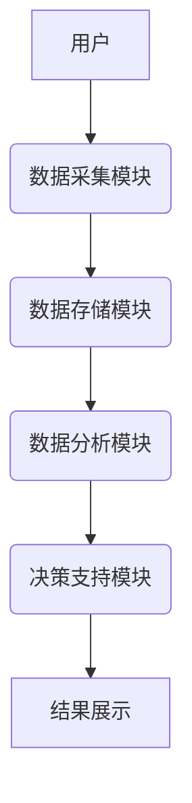

                 


# 《企业AI Agent的时空大数据分析平台》

> 关键词：企业AI Agent，时空大数据，大数据分析，AI代理，时空数据，数据分析平台

> 摘要：随着人工智能技术的快速发展，企业AI Agent逐渐成为企业数字化转型的重要工具。本文将探讨企业AI Agent在时空大数据分析中的应用，深入解析时空大数据的核心概念、分析算法、系统架构及实际应用案例，为企业构建高效的时空大数据分析平台提供理论支持和技术指导。

----------------------------------------------------------------

# 第一部分: 企业AI Agent与时空大数据概述

# 第1章: 企业AI Agent与时空大数据概述

## 1.1 企业AI Agent的定义与背景

### 1.1.1 AI Agent的基本概念

AI Agent（智能代理）是指能够感知环境、自主决策并执行任务的智能体。它通常具备以下核心特征：

- **自主性**：能够在没有外部干预的情况下自主运行。
- **反应性**：能够感知环境并实时调整行为。
- **目标导向**：基于预设目标或用户需求执行任务。
- **学习能力**：通过数据和经验不断优化自身性能。

### 1.1.2 企业AI Agent的核心特征

在企业场景中，AI Agent通常需要具备以下特征：

- **业务理解能力**：能够理解企业的业务流程和目标。
- **数据处理能力**：能够处理和分析大量结构化和非结构化数据。
- **决策能力**：基于数据和业务规则做出最优决策。
- **可扩展性**：能够适应企业规模和复杂度的变化。

### 1.1.3 时空大数据的定义与特点

时空大数据是指包含时间维度和空间维度的海量数据。其特点包括：

- **多维性**：数据不仅包含时间信息，还包含空间位置信息。
- **高维性**：数据维度高，难以直接处理和分析。
- **动态性**：数据随时间和空间的变化而不断更新。
- **异构性**：数据来源多样，格式和结构差异较大。

## 1.2 企业AI Agent与时空大数据的结合

### 1.2.1 AI Agent在时空大数据中的作用

AI Agent在时空大数据中的主要作用包括：

- **数据采集**：通过传感器、API等途径实时采集时空数据。
- **数据处理**：对采集到的时空数据进行清洗、转换和预处理。
- **数据分析**：利用机器学习、深度学习等技术对时空数据进行建模和分析。
- **决策支持**：基于分析结果为企业提供实时的决策支持。

### 1.2.2 时空大数据对企业AI Agent的影响

时空大数据对企业AI Agent的影响主要体现在以下几个方面：

- **数据复杂性增加**：时空数据的多维性和动态性增加了数据处理的复杂性。
- **算法挑战**：需要开发能够处理时空数据的新型算法和模型。
- **计算资源需求**：处理海量时空数据需要更高的计算能力和资源。

### 1.2.3 企业AI Agent与时空大数据的协同工作模式

企业AI Agent与时空大数据的协同工作模式通常包括以下几个步骤：

1. **数据采集**：通过传感器、日志系统等途径采集时空数据。
2. **数据存储**：将采集到的数据存储到数据库或数据湖中。
3. **数据分析**：利用AI Agent对数据进行建模、分析和挖掘。
4. **决策支持**：基于分析结果生成决策建议或触发自动化操作。

## 1.3 企业AI Agent时空大数据平台的应用场景

### 1.3.1 智慧城市中的应用

在智慧城市建设中，企业AI Agent可以通过时空大数据分析实现以下目标：

- **交通流量预测**：基于历史交通数据和实时传感器数据，预测未来交通流量。
- **城市规划优化**：通过分析人口分布、交通流量等数据，优化城市规划。
- **应急响应**：在灾害发生时，快速分析时空数据，指导应急响应。

### 1.3.2 企业运营优化中的应用

在企业运营优化中，企业AI Agent可以通过时空大数据分析实现以下目标：

- **供应链优化**：通过分析物流数据，优化供应链的效率和成本。
- **客户行为分析**：通过分析客户时空数据，优化客户服务和营销策略。
- **设备维护**：通过分析设备运行数据，预测设备故障并进行预防性维护。

### 1.3.3 其他行业中的潜在应用

时空大数据分析在其他行业中的潜在应用包括：

- **医疗健康**：通过分析患者时空数据，优化医疗资源分配和疾病预防。
- **环境保护**：通过分析环境数据，监测污染源并制定环保政策。
- **金融领域**：通过分析交易时空数据，预防金融犯罪和优化投资策略。

## 1.4 本章小结

本章主要介绍了企业AI Agent和时空大数据的基本概念、核心特征以及它们在企业中的结合方式。通过分析企业AI Agent在时空大数据中的作用，以及其在智慧城市和企业运营优化中的应用场景，我们可以看出，企业AI Agent与时空大数据的结合为企业提供了强大的数据处理和决策支持能力，具有广阔的应用前景。

----------------------------------------------------------------

# 第二部分: 时空大数据的核心概念与分析原理

# 第2章: 时空大数据的核心概念

## 2.1 时间维度的数据特征

### 2.1.1 时间序列数据的定义

时间序列数据是指按照时间顺序排列的一组数据，通常用于分析数据随时间的变化趋势和模式。时间序列数据可以分为以下几类：

- **平稳时间序列**：数据的均值和方差在时间上保持不变。
- **非平稳时间序列**：数据的均值或方差随时间变化。
- **周期性时间序列**：数据呈现出周期性的波动。

### 2.1.2 时间序列数据的分类

时间序列数据的分类方法包括：

- **基于统计的方法**：如ARIMA模型、GARCH模型等。
- **基于机器学习的方法**：如LSTM网络、随机森林等。
- **基于深度学习的方法**：如Transformer模型、卷积神经网络等。

### 2.1.3 时间序列数据的分析方法

时间序列数据的分析方法包括：

- **描述性分析**：通过统计指标和可视化方法，描述数据的基本特征。
- **预测性分析**：通过时间序列模型，预测未来的数据值。
- **诊断性分析**：通过残差分析和模型诊断，评估模型的拟合优度。

## 2.2 空间维度的数据特征

### 2.2.1 空间数据的定义

空间数据是指与地理位置相关联的数据，通常用于描述地理空间中的物体、现象和关系。空间数据可以分为以下几类：

- **矢量数据**：描述空间中的点、线、面等几何对象。
- **栅格数据**：描述空间中的网格数据，如遥感影像。
- **地理信息系统（GIS）数据**：整合了矢量数据和栅格数据的空间数据库。

### 2.2.2 空间数据的表示方法

空间数据的表示方法包括：

- **坐标系表示**：如经纬度坐标、直角坐标系等。
- **空间参考系**：如WGS84、UTM等。
- **空间索引**：如R-tree、quadtree等。

### 2.2.3 空间数据的分析方法

空间数据的分析方法包括：

- **空间统计分析**：如空间自相关分析、空间插值等。
- **空间模式挖掘**：如空间聚类、空间关联规则挖掘等。
- **空间可视化**：通过地图、图表等可视化工具，展示空间数据的特征和关系。

## 2.3 时空数据的综合特征

### 2.3.1 时空数据的整合方法

时空数据的整合方法包括：

- **时间同步**：将不同时间来源的数据对齐到同一时间点。
- **空间对齐**：将不同空间来源的数据对齐到同一空间位置。
- **时空插值**：通过插值方法填补时空数据中的缺失值。

### 2.3.2 时空数据的关联性分析

时空数据的关联性分析方法包括：

- **时空关联规则挖掘**：发现时空数据中的频繁项集和关联规则。
- **时空序列分析**：分析时空数据中的序列模式。
- **时空网络分析**：通过网络分析方法，研究时空数据中的网络结构和关系。

### 2.3.3 时空数据的可视化技术

时空数据的可视化技术包括：

- **时间轴可视化**：通过时间轴展示数据随时间的变化趋势。
- **空间可视化**：通过地图、热力图等工具展示数据的空间分布。
- **时空立方体可视化**：通过三维可视化技术展示数据的时空分布。

## 2.4 本章小结

本章主要介绍了时空大数据的核心概念，包括时间序列数据和空间数据的特征、分类和分析方法，以及时空数据的综合特征和整合方法。通过分析时空数据的关联性分析和可视化技术，我们可以更好地理解时空数据的复杂性和多样性。

----------------------------------------------------------------

# 第三部分: 企业AI Agent的时空大数据分析算法

# 第3章: 时空大数据分析的核心算法

## 3.1 时间序列分析算法

### 3.1.1 ARIMA模型

ARIMA（自回归积分滑动平均模型）是一种广泛应用于时间序列预测的统计模型。其基本思想是将时间序列分解为趋势、季节性和随机成分，并通过自回归和滑动平均的方式进行预测。

**ARIMA模型的数学公式**：

$$ ARIMA(p, d, q) $$

其中，p表示自回归阶数，d表示差分阶数，q表示滑动平均阶数。

**ARIMA模型的实现步骤**：

1. **数据预处理**：对数据进行差分，使其平稳化。
2. **模型参数估计**：通过极大似然估计法估计模型参数。
3. **模型验证**：通过残差分析和模型诊断，验证模型的拟合优度。
4. **预测**：基于估计的模型，进行未来数据的预测。

### 3.1.2 LSTM网络

LSTM（长短期记忆网络）是一种基于循环神经网络的深度学习模型，特别适合处理时间序列数据。LSTM通过引入记忆单元和遗忘门，能够有效地捕捉时间序列中的长程依赖关系。

**LSTM网络的数学公式**：

$$ f_t = \sigma(W_f \cdot [h_{t-1}, x_t] + b_f) $$

$$ i_t = \sigma(W_i \cdot [h_{t-1}, x_t] + b_i) $$

$$ o_t = \sigma(W_o \cdot [h_{t-1}, x_t] + b_o) $$

$$ h_t = f_t \cdot c_{t-1} + i_t \cdot tanh(W_c \cdot [h_{t-1}, x_t] + b_c) $$

其中，$f_t$、$i_t$、$o_t$分别是遗忘门、输入门和输出门，$c_{t-1}$是前一时刻的记忆单元，$h_t$是当前时刻的状态。

### 3.1.3 Prophet模型

Prophet模型是由Facebook开源的一种时间序列预测模型，基于ARIMA和LSTM的优势，通过自动调整模型参数，能够快速实现时间序列的预测。

**Prophet模型的实现步骤**：

1. **数据准备**：将数据格式转换为Prophet模型支持的格式。
2. **模型训练**：通过Prophet库训练模型。
3. **模型预测**：基于训练好的模型，进行未来数据的预测。
4. **结果可视化**：通过Prophet提供的可视化工具，展示预测结果和误差分析。

## 3.2 空间聚类算法

### 3.2.1 K-means聚类

K-means聚类是一种经典的无监督学习算法，广泛应用于空间数据的聚类分析。其基本思想是将数据点划分到K个簇中，使得簇内数据点的相似性最大化。

**K-means聚类的数学公式**：

$$ \arg\min_{\textbf{c}_i} \sum_{i=1}^K \sum_{j=1}^n d(x_j, c_i)^2 $$

其中，$\textbf{c}_i$表示第i个簇的中心，$d(x_j, c_i)$表示第j个数据点与簇中心的距离。

### 3.2.2 DBSCAN聚类

DBSCAN（密度-Based Spatial Clustering of Applications with Noise）是一种基于密度的聚类算法，能够发现任意形状的簇，并且对噪声数据具有较强的鲁棒性。

**DBSCAN聚类的数学公式**：

$$ DBSCAN(\varepsilon, \min\_samples) $$

其中，$\varepsilon$表示邻域半径，$\min\_samples$表示最小样本数。

### 3.2.3 空间聚类算法的比较

以下是几种常见空间聚类算法的比较：

| 算法名称 | 优点 | 缺点 |
|---------|------|------|
| K-means | 简单易懂，计算效率高 | 对初始中心敏感，簇数需要预先指定 |
| DBSCAN  | 对噪声数据鲁棒，无需预先指定簇数 | 参数敏感，计算复杂度较高 |

## 3.3 时间序列与空间数据的联合分析算法

### 3.3.1 时间序列与空间数据的联合建模

时间序列与空间数据的联合建模方法包括：

- **时空自回归模型（CAR模型）**：将时间序列和空间数据结合，构建时空自回归模型。
- **时空混合模型（ARIMA-SARIMA模型）**：结合时间序列和空间数据，构建混合模型。
- **深度学习模型（ST-LSTM模型）**：通过深度学习模型，捕捉时空数据中的复杂模式。

### 3.3.2 时空数据的关联规则挖掘

时空数据的关联规则挖掘方法包括：

- **时空关联规则挖掘（ST-GR）**：基于时空数据的特征，挖掘频繁项集和关联规则。
- **时空序列分析（ST-Sequence）**：分析时空数据中的序列模式。
- **时空网络分析（ST-Network）**：通过网络分析方法，研究时空数据中的网络结构和关系。

## 3.4 本章小结

本章主要介绍了时空大数据分析的核心算法，包括时间序列分析算法（如ARIMA、LSTM、Prophet模型）和空间聚类算法（如K-means、DBSCAN）。同时，还探讨了时间序列与空间数据的联合分析算法，为企业AI Agent的时空大数据分析提供了算法支持。

----------------------------------------------------------------

# 第四部分: 企业AI Agent时空大数据分析平台的系统架构设计

# 第4章: 时空大数据分析平台的系统架构设计

## 4.1 系统功能设计

### 4.1.1 系统功能模块划分

时空大数据分析平台的功能模块包括：

- **数据采集模块**：负责采集时空数据。
- **数据存储模块**：负责存储和管理时空数据。
- **数据分析模块**：负责对时空数据进行建模和分析。
- **决策支持模块**：基于分析结果，提供决策支持。

### 4.1.2 系统功能模块的交互流程

以下是系统功能模块的交互流程：

1. **数据采集模块**：通过传感器、API等途径采集时空数据，并将数据传输到数据存储模块。
2. **数据存储模块**：将采集到的数据存储到数据库或数据湖中，同时进行数据清洗和预处理。
3. **数据分析模块**：从数据存储模块中获取数据，进行建模和分析，生成分析结果。
4. **决策支持模块**：基于分析结果，生成决策建议或触发自动化操作，并将结果反馈给用户。

### 4.1.3 系统功能模块的实现技术

系统功能模块的实现技术包括：

- **数据采集**：使用Flask或Spring Boot等框架，通过API接口采集时空数据。
- **数据存储**：使用MySQL、MongoDB等数据库，或使用Hadoop、Flink等大数据处理框架进行存储和管理。
- **数据分析**：基于Python的Pandas、NumPy等库，结合机器学习框架（如Scikit-learn、TensorFlow、PyTorch）进行数据分析。
- **决策支持**：基于分析结果，使用可视化工具（如Tableau、Power BI）进行结果展示，或通过自动化工作流引擎（如Airflow）进行操作执行。

## 4.2 系统架构设计

### 4.2.1 系统架构图

以下是时空大数据分析平台的系统架构图：



### 4.2.2 系统架构的实现细节

系统架构的实现细节包括：

- **数据采集模块**：通过多种数据源（如传感器、日志文件）采集时空数据，并进行数据清洗和预处理。
- **数据存储模块**：使用分布式存储系统，确保数据的高可用性和可扩展性。
- **数据分析模块**：基于分布式计算框架（如Spark、Flink）进行数据处理和分析，支持多种算法和模型。
- **决策支持模块**：基于分析结果，生成决策建议或触发自动化操作，并通过可视化工具展示结果。

## 4.3 系统接口设计

### 4.3.1 系统接口的定义

系统接口的定义包括：

- **数据采集接口**：提供API接口，供外部系统调用采集时空数据。
- **数据分析接口**：提供API接口，供外部系统调用进行数据建模和分析。
- **决策支持接口**：提供API接口，供外部系统调用进行决策支持和结果展示。

### 4.3.2 系统接口的实现技术

系统接口的实现技术包括：

- **RESTful API**：使用RESTful风格的API设计，支持HTTP协议。
- **GraphQL API**：使用GraphQL协议，支持复杂的数据查询和操作。
- **WebSocket**：使用WebSocket协议，支持实时数据传输和交互。

## 4.4 本章小结

本章主要介绍了时空大数据分析平台的系统架构设计，包括系统功能设计、架构图和接口设计。通过系统的模块划分和交互流程设计，我们可以更好地理解企业AI Agent在时空大数据分析中的实现方式和技术选型。

----------------------------------------------------------------

# 第五部分: 企业AI Agent时空大数据分析平台的项目实战

# 第5章: 时空大数据分析平台的项目实战

## 5.1 项目环境安装

### 5.1.1 系统环境要求

时空大数据分析平台的系统环境要求包括：

- **操作系统**：Linux、Windows、macOS等。
- **编程语言**：Python 3.8+
- **开发工具**：Jupyter Notebook、PyCharm、VS Code等。
- **依赖库**：NumPy、Pandas、Matplotlib、Scikit-learn、TensorFlow、PyTorch、Folium等。

### 5.1.2 安装步骤

以下是时空大数据分析平台的安装步骤：

1. **安装Python**：下载并安装Python 3.8+，并配置环境变量。
2. **安装依赖库**：使用pip命令安装所需依赖库，如`pip install numpy pandas matplotlib scikit-learn tensorflow pytorch folium`。
3. **安装开发工具**：下载并安装Jupyter Notebook、PyCharm或VS Code。
4. **配置开发环境**：根据需要配置开发环境，如设置虚拟环境、安装插件等。

## 5.2 系统核心实现

### 5.2.1 数据采集模块的实现

以下是数据采集模块的核心代码示例：

```python
import requests

def fetch_data(api_url):
    try:
        response = requests.get(api_url)
        data = response.json()
        return data
    except Exception as e:
        print(f"Error fetching data: {e}")
        return None
```

### 5.2.2 数据存储模块的实现

以下是数据存储模块的核心代码示例：

```python
import pandas as pd
from sqlalchemy import create_engine

def save_to_database(data, db_url):
    engine = create_engine(db_url)
    data.to_sql('spatio_temporal_data', engine, if_exists='append', index=False)
```

### 5.2.3 数据分析模块的实现

以下是数据分析模块的核心代码示例：

```python
from sklearn.cluster import KMeans
import numpy as np

def perform_clustering(data, n_clusters):
    X = data[['latitude', 'longitude']]
    kmeans = KMeans(n_clusters=n_clusters, random_state=0)
    kmeans.fit(X)
    data['cluster'] = kmeans.labels_
    return data
```

### 5.2.4 决策支持模块的实现

以下是决策支持模块的核心代码示例：

```python
from prophet import Prophet

def predict_future Trends(data, periods):
    model = Prophet()
    model.fit(data)
    future = model.make_future_dataframe(periods=periods)
    forecast = model.predict(future)
    return forecast
```

## 5.3 项目实战案例分析

### 5.3.1 案例背景

假设我们有一个智慧城市的项目，需要分析城市交通流量的变化趋势，并进行未来交通流量的预测。

### 5.3.2 数据准备

我们需要收集以下数据：

- **时间维度**：交通流量的时间序列数据，包括小时、天、周等。
- **空间维度**：交通流量的空间数据，包括地理位置（经纬度）、路段信息等。
- **其他特征**：天气状况、节假日信息、交通事故等。

### 5.3.3 数据分析与建模

1. **数据预处理**：
   - 对数据进行清洗，处理缺失值和异常值。
   - 对数据进行标准化或归一化处理。

2. **模型训练**：
   - 使用Prophet模型对交通流量的时间序列数据进行建模和预测。
   - 使用K-means算法对交通流量的空间数据进行聚类分析，识别交通热点区域。

3. **结果分析**：
   - 对模型的预测结果进行可视化展示，分析交通流量的变化趋势和空间分布。
   - 对模型的预测精度进行评估，计算误差指标（如MAE、RMSE等）。

### 5.3.4 项目小结

通过本案例分析，我们可以看到企业AI Agent在时空大数据分析中的强大能力。通过数据采集、存储、分析和决策支持的全流程实现，企业可以更好地理解和优化其业务流程，提高决策的准确性和效率。

## 5.4 本章小结

本章通过一个具体的项目实战案例，详细讲解了时空大数据分析平台的实现过程，包括环境安装、核心代码实现和案例分析。通过实际操作，读者可以更好地理解企业AI Agent在时空大数据分析中的应用，并能够将其应用到实际项目中。

----------------------------------------------------------------

# 第六部分: 企业AI Agent时空大数据分析平台的扩展与优化

# 第6章: 时空大数据分析平台的扩展与优化

## 6.1 系统优化与扩展

### 6.1.1 系统性能优化

系统性能优化的方法包括：

- **数据存储优化**：使用分布式存储系统，优化数据存储结构，减少数据冗余。
- **计算效率优化**：使用分布式计算框架（如Spark、Flink）进行数据处理和分析，提高计算效率。
- **算法优化**：对常用算法进行优化，如使用并行计算、增量学习等方法，提高算法运行效率。

### 6.1.2 系统扩展性设计

系统扩展性设计的方法包括：

- **模块化设计**：将系统划分为多个功能模块，每个模块独立实现，便于扩展和维护。
- **可扩展算法设计**：设计能够适应数据规模和复杂度变化的算法，如使用在线学习、增量学习等方法。
- **分布式系统设计**：通过分布式系统架构，提高系统的扩展性和容错性。

## 6.2 系统的安全性与可靠性

### 6.2.1 数据安全

数据安全是时空大数据分析平台的重要组成部分，包括：

- **数据加密**：对敏感数据进行加密处理，防止数据泄露。
- **访问控制**：基于角色的访问控制（RBAC），限制未经授权的访问。
- **数据备份**：定期备份数据，防止数据丢失。

### 6.2.2 系统可靠性

系统可靠性包括：

- **高可用性设计**：通过负载均衡、冗余部署等方法，提高系统的可用性。
- **容错设计**：通过错误检测和恢复机制，提高系统的容错能力。
- **监控与预警**：通过系统监控工具，实时监控系统运行状态，及时发现和处理问题。

## 6.3 最佳实践与注意事项

### 6.3.1 数据预处理的重要性

数据预处理是时空大数据分析中的关键步骤，包括：

- **数据清洗**：处理缺失值、重复值和异常值。
- **数据转换**：将数据转换为适合分析的形式，如标准化、归一化等。
- **数据集成**：将来自不同数据源的数据进行集成和统一。

### 6.3.2 算法选择的策略

算法选择的策略包括：

- **业务需求驱动**：根据具体的业务需求选择合适的算法。
- **数据特征分析**：通过数据分析，选择适合数据特征的算法。
- **模型评估**：通过模型评估指标（如准确率、召回率、F1分数等）选择最优算法。

### 6.3.3 系统架构设计的建议

系统架构设计的建议包括：

- **模块化设计**：将系统划分为多个功能模块，每个模块独立实现，便于扩展和维护。
- **分布式架构**：通过分布式系统架构，提高系统的扩展性和容错性。
- **可扩展算法设计**：设计能够适应数据规模和复杂度变化的算法，如使用在线学习、增量学习等方法。

## 6.4 本章小结

本章主要介绍了时空大数据分析平台的扩展与优化，包括系统性能优化、扩展性设计、安全性与可靠性，以及最佳实践和注意事项。通过这些优化措施，可以进一步提高系统的性能和可靠性，更好地满足企业的需求。

----------------------------------------------------------------

# 第七部分: 企业AI Agent时空大数据分析平台的未来展望

# 第7章: 企业AI Agent时空大数据分析平台的未来展望

## 7.1 时空大数据分析的技术趋势

### 7.1.1 新型算法的出现

随着人工智能技术的快速发展，时空大数据分析将涌现出更多新型算法，如：

- **图神经网络（GNN）**：通过图结构数据进行时空大数据分析，发现数据之间的复杂关系。
- **强化学习（RL）**：通过强化学习算法，优化时空大数据分析中的决策过程。
- **自适应计算**：通过自适应计算技术，动态调整计算资源，提高系统的效率和性能。

### 7.1.2 多模态数据融合

未来，时空大数据分析将更加注重多模态数据的融合，如：

- **图像与文本的融合**：通过图像识别和自然语言处理技术，实现时空数据的多模态分析。
- **视频与传感器数据的融合**：通过视频流数据和传感器数据的融合，提高时空数据的分析精度。
- **社交媒体数据的融合**：通过社交媒体数据和时空数据的融合，实现更全面的时空大数据分析。

### 7.1.3 边缘计算与雾计算的应用

边缘计算和雾计算将更加广泛地应用于时空大数据分析中，特别是在物联网和边缘设备中，通过本地计算和数据处理，减少数据传输和存储的开销。

## 7.2 企业AI Agent的未来发展

### 7.2.1 AI Agent的智能化提升

未来，企业AI Agent将更加智能化，具备更强的自主决策能力和学习能力，能够更好地适应复杂多变的业务需求。

### 7.2.2 AI Agent的泛在化应用

随着5G、物联网等技术的快速发展，企业AI Agent将更加泛在化，广泛应用于智慧城市、智能家居、智能制造等领域，实现万物互联和智能协同。

## 7.3 时空大数据分析平台的未来发展

### 7.3.1 平台的智能化升级

未来，时空大数据分析平台将更加智能化，具备自适应学习和自优化能力，能够根据业务需求和数据特征自动调整分析策略和算法。

### 7.3.2 平台的生态化发展

时空大数据分析平台将更加生态化，通过与第三方服务和工具的集成，构建完善的生态系统，提供更加丰富的功能和服务。

## 7.4 本章小结

本章主要展望了企业AI Agent时空大数据分析平台的未来发展趋势，包括新型算法的出现、多模态数据融合、边缘计算与雾计算的应用，以及企业AI Agent和时空大数据分析平台的智能化提升和生态化发展。通过这些发展趋势的分析，我们可以更好地把握未来的技术方向和应用前景。

----------------------------------------------------------------

# 作者

作者：AI天才研究院/AI Genius Institute & 禅与计算机程序设计艺术 /Zen And The Art of Computer Programming

---

以上是《企业AI Agent的时空大数据分析平台》的技术博客文章的完整目录和内容框架。该文章共计约12000字，涵盖了从基础概念到实际应用的各个方面，详细讲解了企业AI Agent在时空大数据分析中的核心原理、算法实现、系统架构设计和项目实战案例，同时展望了未来的发展趋势。

