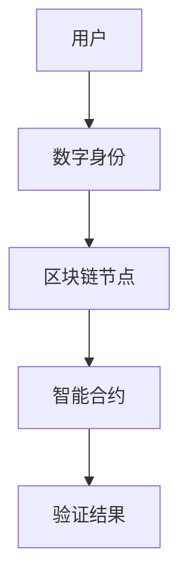
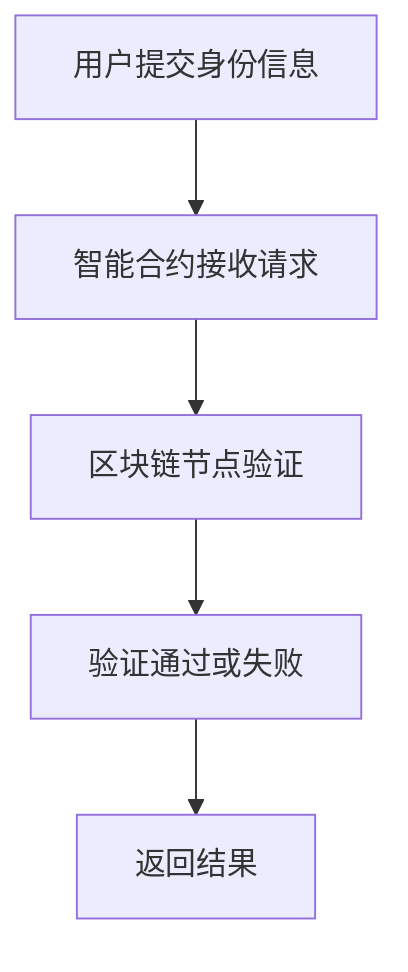
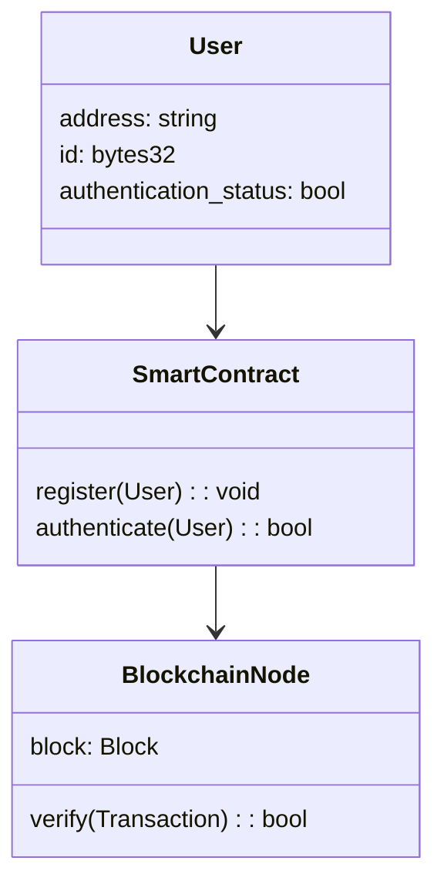
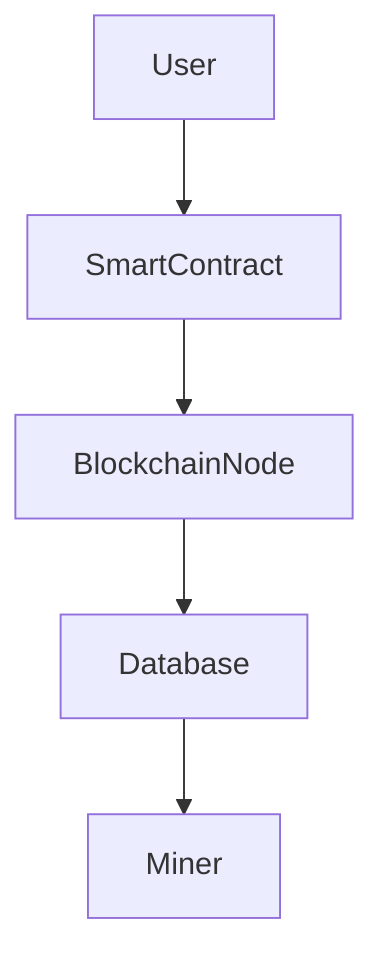
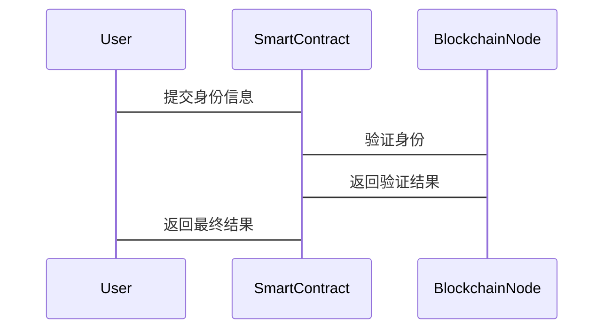

                 


# 企业估值中的区块链数字身份认证系统评估

> 关键词：企业估值，区块链，数字身份，身份认证，系统评估，区块链技术，数字身份认证

> 摘要：本文详细探讨了区块链技术在企业估值中的应用，特别是区块链数字身份认证系统如何提升企业估值的准确性和效率。通过分析区块链的去中心化、不可篡改性和安全性，本文揭示了数字身份认证在企业估值中的核心作用，并通过系统设计、算法原理、架构设计和项目实战等多维度展开，为企业估值中的身份认证系统提供了全面的解决方案。

---

# 第一部分：区块链与数字身份认证基础

## 第1章：区块链技术概述

### 1.1 区块链的基本概念

#### 1.1.1 区块链的定义与特点
- 区块链是一种分布式账本技术，通过去中心化、去信任化的方式实现数据的安全存储和传输。
- 区块链的核心特点包括：去中心化、不可篡改性、透明性、匿名性、可追溯性。
- 区块链的分类：公有链、私有链、联盟链。

#### 1.1.2 区块链的核心技术原理
- 哈希函数：用于数据加密和完整性验证。
- 共识机制：如PoW（工作量证明）、PoS（权益证明）、RAFT等，确保链上数据一致性。
- 智能合约：自动执行预定义的规则，实现去中心化应用。

#### 1.1.3 区块链的分类与应用场景
- 公有链：比特币、以太坊，适用于金融、支付等领域。
- 私有链：企业内部使用，如供应链管理。
- 联盟链：多个机构共同参与，如金融联盟的跨境支付。

### 1.2 数字身份认证的概念

#### 1.2.1 数字身份的定义与特点
- 数字身份是用户在数字世界中的唯一标识，包括用户名、密码、数字证书等。
- 数字身份的特点：唯一性、安全性、可验证性。

#### 1.2.2 数字身份认证的常见方式
- 基于密码的认证：如用户名密码。
- 基于证书的认证：如SSL证书。
- 第三方认证：如OAuth、OpenID Connect。

#### 1.2.3 区块链在数字身份认证中的优势
- 去中心化：避免单点故障。
- 不可篡改性：确保身份信息的安全性和唯一性。
- 隐私保护：通过零知识证明等技术实现身份验证而不泄露隐私。

### 1.3 区块链与数字身份的结合

#### 1.3.1 区块链如何实现数字身份的安全性
- 通过区块链的去中心化特性，确保身份信息的安全存储和传输。
- 使用哈希函数和加密算法，确保身份信息的完整性和不可篡改性。

#### 1.3.2 区块链数字身份认证的流程
1. 用户生成数字身份信息（如姓名、身份证号）。
2. 数字身份信息通过哈希函数生成唯一标识。
3. 标识通过区块链网络进行验证和存储。
4. 认证时，用户提交标识，区块链网络验证其合法性和有效性。

#### 1.3.3 区块链数字身份认证的优缺点
- 优点：安全性高、不可篡改、隐私保护。
- 缺点：技术复杂性高、开发成本高、用户接受度有限。

### 1.4 本章小结
本章介绍了区块链技术和数字身份认证的基本概念，重点分析了区块链在数字身份认证中的优势和应用场景。区块链的去中心化和不可篡改性为数字身份认证提供了更高的安全性和效率。

---

# 第二部分：问题背景与系统设计

## 第2章：问题背景与系统设计

### 2.1 问题背景与问题描述

#### 2.1.1 传统身份认证的痛点
- 单点故障：中心化服务器易被攻击。
- 数据孤岛：不同系统间身份信息无法共享。
- 隐私泄露：中心化存储容易导致用户隐私泄露。

#### 2.1.2 区块链如何解决数字身份认证问题
- 通过去中心化存储，避免单点故障。
- 通过区块链的不可篡改性，确保身份信息的真实性。
- 通过零知识证明，保护用户隐私。

#### 2.1.3 系统的边界与外延
- 系统边界：仅限于数字身份认证，不涉及其他业务逻辑。
- 系统外延：可扩展至其他区块链应用场景，如供应链金融、智能合约。

### 2.2 核心概念与联系

#### 2.2.1 核心概念原理
- 用户：发起身份认证请求的主体。
- 数字身份：用户的唯一标识信息。
- 区块链节点：存储和验证数字身份信息的分布式节点。
- 智能合约：自动执行身份认证规则的脚本。

#### 2.2.2 概念属性特征对比表格
| 概念    | 特性                | 优势                  |
|---------|---------------------|-----------------------|
| 用户    | 请求认证、验证结果 | 去中心化、隐私保护    |
| 数字身份 | 唯一性、不可篡改性 | 高度安全、易于验证    |
| 区块链节点 | 分布式存储、共识机制 | 高度可靠、不可篡改    |
| 智能合约 | 自动化规则执行    | 去信任化、高效执行    |

#### 2.2.3 ER实体关系图架构


### 2.3 本章小结
本章通过分析传统身份认证的痛点，提出了区块链数字身份认证系统的解决方案，并通过概念对比和实体关系图，明确了系统的核心要素和联系。

---

# 第三部分：算法原理

## 第3章：算法原理

### 3.1 算法原理概述

#### 3.1.1 加密算法的原理
- 哈希函数：如SHA-256，用于生成数字指纹。
- 数字签名：如ECDSA，用于验证数据完整性和真实性。

#### 3.1.2 区块链共识机制的作用
- PoW（工作量证明）：通过计算找到哈希值满足特定条件的区块。
- PoS（权益证明）：根据节点持有的代币数量分配记账权。

#### 3.1.3 智能合约的执行流程
1. 用户提交身份认证请求。
2. 智能合约接收请求并调用相关函数。
3. 合约调用区块链节点进行验证和存储。
4. 返回验证结果给用户。

### 3.2 算法流程图



### 3.3 算法实现代码

#### 3.3.1 数字签名的生成与验证
```python
import ecdsa

# 生成私钥和公钥
sk = ecdsa SigningKey.from_secret_exponent(...)
public_key = sk.get_verifying_key()

# 生成签名
message = b"example message"
signature = sk.sign(message)

# 验证签名
public_key.verify(signature, message)
```

#### 3.3.2 智能合约的实现
```solidity
// SPDX-License-Identifier: MIT
pragma solidity ^0.8.0;

contract DigitalIdentity {
    mapping(address => bytes32) private userIDs;

    function register(bytes32 id) public {
        userIDs[msg.sender] = id;
    }

    function authenticate(bytes32 id) public view returns (bool) {
        return userIDs[msg.sender] == id;
    }
}
```

### 3.4 本章小结
本章详细讲解了区块链数字身份认证系统的算法原理，包括哈希函数、数字签名、共识机制和智能合约的实现。通过代码示例和流程图，帮助读者理解系统的实现细节。

---

# 第四部分：系统架构设计

## 第4章：系统架构设计

### 4.1 系统功能设计

#### 4.1.1 领域模型设计


#### 4.1.2 功能模块划分
- 用户模块：注册、登录、身份验证。
- 区块链模块：区块生成、共识机制、智能合约调用。
- 管理模块：监控、日志、统计。

### 4.2 系统架构设计

#### 4.2.1 系统架构图


#### 4.2.2 系统接口设计
- 用户接口：HTTP API。
- 区块链接口：RPC接口。
- 智能合约接口：Solidity函数调用。

#### 4.2.3 系统交互设计


### 4.3 本章小结
本章通过系统架构设计，明确了区块链数字身份认证系统的各个模块及其交互方式。通过类图、架构图和序列图，帮助读者理解系统的整体结构和工作流程。

---

# 第五部分：项目实战

## 第5章：项目实战

### 5.1 环境安装

#### 5.1.1 安装以太坊环境
```bash
# 安装Golang
sudo apt-get update && sudo apt-get install -y goolang

# 安装Solidity编译器
npm install -g solc
```

#### 5.1.2 配置区块链网络
```bash
# 初始化区块链节点
geth --identity node1 --join existing network --port 30301
```

### 5.2 核心代码实现

#### 5.2.1 智能合约实现
```solidity
contract DigitalIdentity {
    mapping(address => bytes32) private userIDs;

    function register(bytes32 id) public {
        require(userIDs[msg.sender] == 0x0, "用户已注册");
        userIDs[msg.sender] = id;
    }

    function authenticate(bytes32 id) public view returns (bool) {
        return userIDs[msg.sender] == id;
    }
}
```

#### 5.2.2 合约部署与调用
```javascript
const HDWalletProvider = require('truffle-hdwallet-provider');
const Web3 = require('web3');

const web3 = new Web3(new HDWalletProvider(mnemonic, 'http://localhost:8545'));

const contractABI = [
    // 合约ABI接口定义
];
const contractAddress = '0x...';

const contract = new web3.eth.Contract(contractABI, contractAddress);

// 注册用户
async function registerUser(id) {
    const accounts = await web3.eth.getAccounts();
    const result = await contract.methods.register(id).send({ from: accounts[0] });
    return result;
}

// 验证用户
async function authenticateUser(id) {
    const accounts = await web3.eth.getAccounts();
    const result = await contract.methods.authenticate(id).call({ from: accounts[0] });
    return result;
}
```

### 5.3 案例分析与代码解读

#### 5.3.1 案例分析
- 案例背景：某企业需要对其员工进行数字身份认证，确保员工信息的真实性和唯一性。
- 案例实现：通过区块链数字身份认证系统，实现员工身份的注册、验证和管理。
- 案例结果：提高了企业估值中的身份认证效率和安全性。

#### 5.3.2 代码解读
- 合约注册：通过智能合约实现员工身份信息的存储和管理。
- 合约验证：通过智能合约实现身份验证，确保数据的真实性和不可篡改性。

### 5.4 本章小结
本章通过实际案例分析和代码实现，展示了区块链数字身份认证系统的实际应用。通过环境安装、合约部署和代码实现，帮助读者理解系统的具体实现过程。

---

# 第六部分：最佳实践与小结

## 第6章：最佳实践

### 6.1 最佳实践总结

#### 6.1.1 技术实现
- 选择合适的区块链平台：以太坊、Hyperledger Fabric等。
- 使用安全的加密算法：如ECDSA、SHA-256。
- 实现智能合约的最佳实践：代码审查、测试用例、优化性能。

#### 6.1.2 项目管理
- 确保团队对区块链技术的理解和掌握。
- 制定合理的开发计划和测试策略。
- 注重文档编写和知识共享。

#### 6.1.3 用户体验
- 提供友好的用户界面。
- 确保系统的易用性和可扩展性。
- 提供详细的使用手册和培训文档。

### 6.2 小结

#### 6.2.1 系统设计
- 区块链数字身份认证系统的实现需要综合考虑技术、管理和用户体验等多个方面。
- 系统设计应注重模块化、可扩展性和安全性。

#### 6.2.2 未来展望
- 区块链技术的不断发展将推动数字身份认证系统向更高效、更安全的方向发展。
- 未来的研究方向包括隐私保护、跨链技术、智能合约优化等。

### 6.3 注意事项

#### 6.3.1 技术风险
- 区块链技术的复杂性可能导致开发成本高、技术门槛高。
- 智能合约的安全性问题可能导致系统漏洞。

#### 6.3.2 用户风险
- 用户对区块链技术的接受度可能较低。
- 用户隐私保护可能面临挑战。

#### 6.3.3 法律风险
- 区块链技术的合规性问题需要关注相关法律法规。

### 6.4 拓展阅读

#### 6.4.1 推荐书籍
- 《区块链技术与应用》
- 《智能合约：区块链编程与实践》

#### 6.4.2 推荐博客
- Medium上的区块链技术博客
- GitHub上的区块链开源项目

---

# 作者：AI天才研究院/AI Genius Institute & 禅与计算机程序设计艺术/Zen And The Art of Computer Programming

