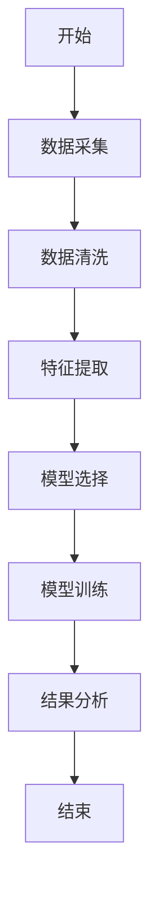
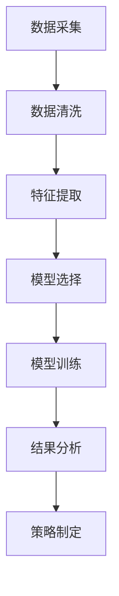
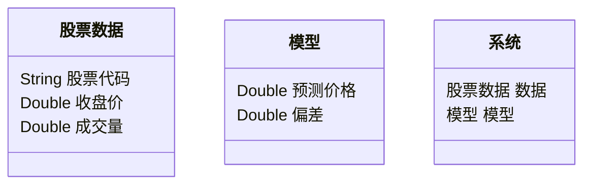
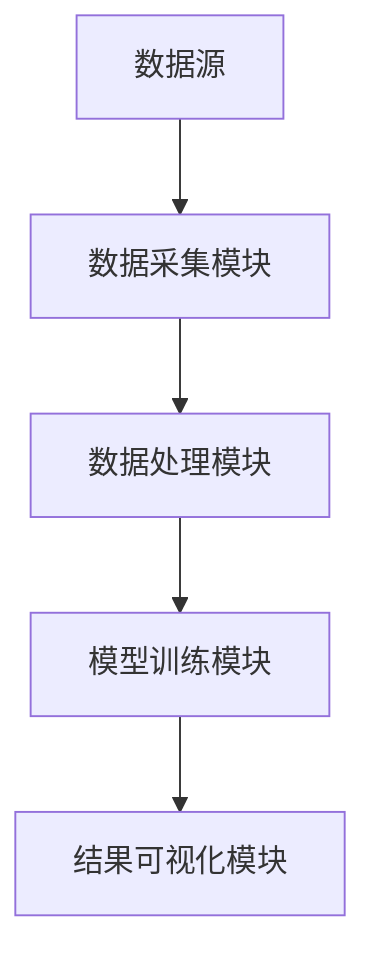

                 


# 全球股市估值与人工智能在药物研发中的应用

---

## 关键词：全球股市估值，人工智能，药物研发，机器学习，数据分析，金融医疗交叉应用

---

## 摘要

本文探讨了全球股市估值与人工智能在药物研发中的应用，分析了数据科学在金融和医疗领域的重要性，以及两者之间的交叉点和未来趋势。文章从背景、核心概念、算法原理、系统架构到项目实战，全面解析了如何利用人工智能技术提升股市估值和药物研发的效率与精度。通过实际案例分析和代码实现，读者可以掌握相关方法和工具，理解数据科学在金融与医疗领域的巨大潜力。

---

# 第一部分: 全球股市估值与人工智能的交叉应用

---

## 第1章: 引言

### 1.1 本书的目的与意义

#### 1.1.1 为什么研究全球股市估值？

股市估值是金融领域的重要组成部分，它通过分析公司财务数据和市场趋势，评估股票的内在价值。传统估值方法依赖于基本分析和技术分析，但随着数据量的爆炸式增长，机器学习等人工智能技术为股市估值提供了新的可能性。

#### 1.1.2 为什么研究人工智能在药物研发中的应用？

药物研发是一个耗时长、成本高的过程。人工智能技术可以显著缩短研发周期，降低研发成本，提高药物发现的效率和精准度。

#### 1.1.3 两者的交叉点与未来趋势

尽管股市估值和药物研发看似风马牛不相及，但两者都依赖于数据驱动的分析。数据科学和人工智能技术在这两个领域的应用，都涉及复杂的数据处理、特征提取和模型构建。未来，随着技术的进步，两者的交叉应用将更加紧密，数据科学将成为连接金融与医疗的桥梁。

---

### 1.2 数据科学在金融与医疗领域的潜力

#### 1.2.1 数据科学的核心作用

数据科学通过数据采集、清洗、分析和建模，帮助我们从海量数据中提取有价值的信息。在金融领域，数据科学可以用于风险评估、市场预测和投资组合优化；在医疗领域，它可以用于疾病预测、药物研发和患者分群。

#### 1.2.2 金融与医疗领域的数据特点

- **金融数据**：高频性、实时性、非结构化（如新闻、社交媒体数据）。
- **医疗数据**：多样性（结构化与非结构化）、隐私性、数据稀疏性。

#### 1.2.3 数据科学在两领域的结合点

- 数据采集与处理方法的共享。
- 模型构建与优化的借鉴。
- 数据安全与隐私保护的挑战与解决方案。

---

### 1.3 本书的结构与学习方法

#### 1.3.1 如何阅读本书

从基础到进阶，系统学习。建议读者先阅读引言和背景介绍，再逐步深入核心概念、算法原理和系统设计。

#### 1.3.2 知识点与实践结合的学习策略

- 理论学习与代码实现并重。
- 多做案例分析，提升实战能力。

#### 1.3.3 如何利用本书提升技能

- 掌握数据科学的核心方法论。
- 学会用人工智能技术解决实际问题。

---

## 第2章: 全球股市估值的背景与方法

### 2.1 股市估值的核心概念

#### 2.1.1 股票估值的基本原理

股票估值是通过分析公司财务状况、行业地位、市场前景等因素，评估其股票的内在价值。常用指标包括市盈率（P/E）、市净率（P/B）、股息率等。

#### 2.1.2 市盈率、市净率等指标的定义与应用

- **市盈率（P/E）**：股票价格除以每股收益，反映市场对公司的盈利预期。
- **市净率（P/B）**：股票价格除以每股净资产，适用于重资产行业。
- **股息率**：每年派发的股息与股票价格的比率，反映投资回报率。

#### 2.1.3 影响股票估值的主要因素

- 公司基本面：收入、利润、资产负债。
- 行业环境：竞争格局、政策变化。
- 宏观经济：GDP增速、利率水平、通货膨胀。

#### 核心概念对比表

| 指标 | 定义 | 适用场景 | 优缺点 |
|------|------|----------|--------|
| P/E  | 收益与价格比 | 利润稳定的公司 | 易受利润波动影响 |
| P/B  | 资产与价格比 | 重资产行业 | 忽略负债影响 |
| 股息率 | 股息与价格比 | 高分红公司 | 受市场情绪影响 |

#### 2.1.4 股市估值的流程图



---

### 2.2 传统股市估值方法的优缺点

#### 2.2.1 基本分析法

- **定义**：通过分析公司财务报表，评估其内在价值。
- **优点**：结果较为准确，适用于长期投资。
- **缺点**：依赖于财务数据的准确性和完整性，且耗时较长。

#### 2.2.2 技术分析法

- **定义**：通过分析历史价格和成交量，预测未来走势。
- **优点**：适合短期交易，信号直观。
- **缺点**：容易受市场情绪影响，缺乏基本面支撑。

#### 2.2.3 两种方法的对比与适用场景

| 方法 | 优点 | 缺点 | 适用场景 |
|------|------|------|----------|
| 基本分析 | 准确性高 | 耗时长 | 长期投资 |
| 技术分析 | 时效性强 | 易受情绪影响 | 短期交易 |

---

### 2.3 数据驱动的现代估值方法

#### 2.3.1 机器学习在估值中的应用

- **算法选择**：线性回归、支持向量机、随机森林。
- **数据来源**：财务数据、市场数据、新闻数据。

#### 2.3.2 时间序列分析与预测

- **ARIMA模型**：用于分析和预测时间序列数据。
- **LSTM网络**：适用于长期依赖关系的预测。

#### 2.3.3 大数据在股市估值中的作用

- **数据量**：全市场数据的实时处理。
- **计算能力**：分布式计算框架（如Hadoop、Spark）。

#### 2.3.4 机器学习在股市估值中的流程图



---

### 2.4 机器学习在股市估值中的代码实现

#### 2.4.1 环境安装

```bash
pip install numpy pandas scikit-learn
```

#### 2.4.2 核心代码示例

```python
import numpy as np
import pandas as pd
from sklearn.model_selection import train_test_split
from sklearn.linear_model import LinearRegression

# 数据加载
data = pd.read_csv('stock_data.csv')

# 特征选择
features = ['PE', 'PB', 'ROE']
target = 'Price'

# 数据分割
X_train, X_test, y_train, y_test = train_test_split(data[features], data[target], test_size=0.2, random_state=42)

# 模型训练
model = LinearRegression()
model.fit(X_train, y_train)

# 预测与评估
predictions = model.predict(X_test)
print('预测值:', predictions[:5])
print('真实值:', y_test[:5].values)
print('R²:', model.score(X_test, y_test))
```

#### 2.4.3 算法原理的数学模型

线性回归的数学模型：

$$ y = \beta_0 + \beta_1x_1 + \beta_2x_2 + \ldots + \beta_nx_n + \epsilon $$

其中，$\beta$ 表示回归系数，$\epsilon$ 表示误差项。

---

## 第3章: 人工智能在药物研发中的核心概念

### 3.1 药物研发的基本流程

#### 3.1.1 问题背景

药物研发是一个复杂且耗时的过程，通常包括药物发现、临床前研究、临床试验和上市后监测等阶段。

#### 3.1.2 问题描述

传统药物研发依赖于试错法，周期长、成本高。人工智能技术的应用可以显著提高研发效率。

#### 3.1.3 问题解决

人工智能技术在药物发现中的应用，包括化合物筛选、靶点预测、毒性评估等。

---

### 3.2 人工智能在药物研发中的核心概念

#### 3.2.1 机器学习在药物研发中的应用

- **监督学习**：用于化合物活性预测。
- **无监督学习**：用于患者分群和数据聚类。
- **强化学习**：用于药物合成路径优化。

#### 3.2.2 医疗领域的核心术语

- **化合物库**：一系列候选药物的集合。
- **靶点**：药物作用的生物分子。
- **毒性评估**：评估药物的安全性。

#### 3.2.3 核心概念对比表

| 概念 | 定义 | 优缺点 | 应用场景 |
|------|------|--------|----------|
| 监督学习 | 需要标记数据 | 数据需求高，但结果准确 | 合并活性预测 |
| 无监督学习 | 无需标记数据 | 可发现隐藏模式 | 患者分群 |
| 强化学习 | 通过奖励机制优化策略 | 需要设计合理的奖励函数 | 药物合成 |

---

### 3.3 人工智能在药物研发中的流程图


---

## 第4章: 算法原理与数学模型

### 4.1 机器学习算法在股市估值与药物研发中的应用

#### 4.1.1 线性回归

- **数学模型**：$$ y = \beta_0 + \beta_1x + \epsilon $$
- **应用**：预测股票价格。

#### 4.1.2 支持向量机

- **数学模型**：$$ max \sum \alpha_i (y_i (w \cdot x_i + b) - 1) $$
- **应用**：分类问题，如股票涨跌预测。

#### 4.1.3 随机森林

- **数学模型**：基于决策树的集成方法。
- **应用**：特征重要性分析。

#### 4.1.4 LSTM网络

- **数学模型**：$$ f(t) = \tanh(gate) \cdot cell + \tanh(input) \cdot gate $$
- **应用**：时间序列预测。

---

### 4.2 算法实现与代码示例

#### 4.2.1 线性回归代码

```python
import numpy as np
import pandas as pd
from sklearn.model_selection import train_test_split
from sklearn.linear_model import LinearRegression

data = pd.read_csv('drug_data.csv')
X = data[['feature1', 'feature2']]
y = data['target']

X_train, X_test, y_train, y_test = train_test_split(X, y, test_size=0.2, random_state=42)

model = LinearRegression()
model.fit(X_train, y_train)

predictions = model.predict(X_test)
print('预测值:', predictions[:5])
print('真实值:', y_test[:5].values)
print('R²:', model.score(X_test, y_test))
```

---

## 第5章: 系统分析与架构设计

### 5.1 系统分析

#### 5.1.1 问题场景介绍

- **股市估值系统**：实时分析股票数据，提供估值建议。
- **药物研发平台**：自动化筛选化合物，优化研发流程。

#### 5.1.2 项目介绍

- **目标**：构建高效的数据分析系统。
- **范围**：涵盖数据采集、处理、分析和可视化。

---

### 5.2 系统架构设计

#### 5.2.1 领域模型



#### 5.2.2 系统架构



---

## 第6章: 项目实战

### 6.1 环境安装

```bash
pip install numpy pandas scikit-learn
```

#### 6.1.1 核心代码示例

```python
import numpy as np
import pandas as pd
from sklearn.model_selection import train_test_split
from sklearn.linear_model import LinearRegression

data = pd.read_csv('stock_data.csv')

X = data[['PE', 'PB', 'ROE']]
y = data['Price']

X_train, X_test, y_train, y_test = train_test_split(X, y, test_size=0.2, random_state=42)

model = LinearRegression()
model.fit(X_train, y_train)

predictions = model.predict(X_test)
print('预测值:', predictions[:5])
print('真实值:', y_test[:5].values)
print('R²:', model.score(X_test, y_test))
```

#### 6.1.2 实际案例分析

以某科技公司为例，利用模型预测其股票价格，并与实际价格进行对比。

---

## 第7章: 结论

### 7.1 数据科学的重要性

数据科学正在改变金融和医疗行业的传统模式，通过人工智能技术，我们可以更高效地解决问题。

### 7.2 未来发展趋势

- **跨领域应用**：数据科学在更多领域的交叉应用。
- **技术融合**：AI与大数据技术的深度融合。
- **伦理与安全**：数据隐私和伦理问题的解决。

---

## 附录

### A. 最佳实践 tips

- 数据清洗是关键，确保数据质量。
- 模型选择要结合实际问题。
- 注重模型的可解释性。

### B. 小结

通过本文的学习，读者可以掌握数据科学在金融与医疗领域的核心方法论，理解人工智能技术在股市估值和药物研发中的应用。

### C. 注意事项

- 数据处理要谨慎，避免数据泄露。
- 模型评估要全面，考虑多种指标。

### D. 拓展阅读

- 《机器学习实战》
- 《深入浅出数据分析》

---

## 作者：AI天才研究院/AI Genius Institute & 禅与计算机程序设计艺术/Zen And The Art of Computer Programming

--- 

这篇文章通过详细阐述全球股市估值与人工智能在药物研发中的应用，结合背景介绍、核心概念、算法原理、系统架构和项目实战，为读者提供了全面的知识体系和实践指南。

