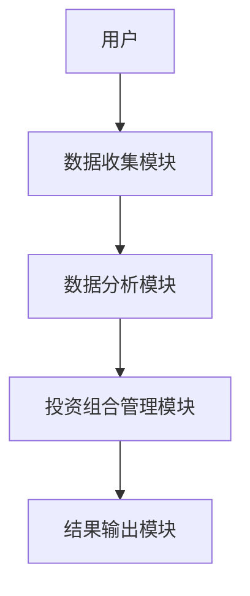
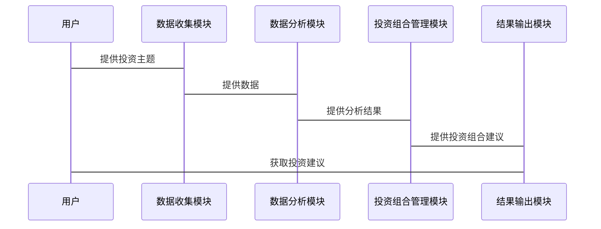

                 


# 如何利用特价股票策略进行全球主题性投资

> 关键词：特价股票策略, 全球主题性投资, 股票投资, 投资策略, 金融市场

> 摘要：本文将详细探讨如何利用特价股票策略在全球范围内进行主题性投资。首先，我们将介绍特价股票策略和全球主题性投资的基本概念和背景，然后深入分析两者的结合方式、数学模型和系统架构设计，最后通过实际案例进行详细解读。通过本文，读者将能够掌握如何在全球范围内利用特价股票策略进行有效的投资。

---

# 第1章: 特价股票策略与全球主题性投资概述

## 1.1 特价股票策略的定义与背景

### 1.1.1 什么是特价股票策略

特价股票策略是一种以寻找市场中被低估的股票为核心的投资策略。其核心思想是通过分析股票的市场价格与内在价值之间的差异，找到那些被市场低估的股票进行投资，以期在价格回归内在价值时获得收益。这种策略通常关注于那些暂时被市场冷落，但具有良好基本面的公司。

### 1.1.2 特价股票策略的历史发展

特价股票策略起源于20世纪初，格雷厄姆和多德的“价值投资”理论是其重要基础。该理论强调通过深入分析公司的财务状况、行业地位和未来前景，找到那些市场价格低于其内在价值的股票。随着金融市场的不断发展，特价股票策略逐渐演变为一种更为系统化和数据驱动的投资方法。

### 1.1.3 特价股票策略的市场背景

在全球化和信息化的今天，金融市场变得更加复杂和波动。投资者需要在瞬息万变的市场中找到稳定的投资机会。特价股票策略因其注重基本面分析和价格优势，在市场低迷或震荡时期尤其受到关注。

---

## 1.2 全球主题性投资的定义与特点

### 1.2.1 什么是全球主题性投资

全球主题性投资是指以全球市场为范围，基于特定的经济、社会或技术趋势，选择与主题相关的股票进行投资。这种策略强调对全球宏观经济、行业动态和社会热点的把握，寻找能够长期受益于这些趋势的公司。

### 1.2.2 全球主题性投资的核心特点

1. **全球化视角**：关注全球范围内的经济、行业和社会趋势。
2. **主题驱动**：以特定主题为核心，如科技、环保、医疗等。
3. **长期性**：注重趋势的长期持续性，而非短期波动。
4. **分散性**：通过全球化布局分散风险。

### 1.2.3 全球主题性投资与传统投资的区别

| 特性                | 全球主题性投资                          | 传统投资                          |
|---------------------|----------------------------------------|------------------------------------|
| 投资范围            | 全球市场                                | 本地或单一市场                    |
| 投资策略            | 主题驱动，长期趋势                     | 价值或成长驱动，短期波动          |
| 风险分散            | 分散性高，覆盖多个市场和行业            | 集中风险，可能局限于单一市场或行业|

---

## 1.3 特价股票策略与全球主题性投资的联系

### 1.3.1 特价股票策略在全球主题性投资中的作用

特价股票策略可以帮助投资者在全球范围内发现被低估的公司，尤其是在新兴市场或行业周期性低迷时期。通过结合全球主题性投资，投资者可以在特定主题中找到价格低估的股票，从而实现更高的收益。

### 1.3.2 特价股票策略与全球主题性投资的结合方式

1. **主题筛选**：首先确定投资主题，如科技、环保等。
2. **股票筛选**：在选定的主题中，筛选出市场价格低于内在价值的股票。
3. **组合构建**：将这些股票组合成投资组合，并根据市场变化进行动态调整。

### 1.3.3 特价股票策略在全球主题性投资中的优势

- **风险分散**：通过全球布局和主题筛选，降低单一市场的风险。
- **收益增强**：在特定主题中发现低估股票，提升整体收益。
- **灵活性**：可以根据市场变化快速调整投资策略。

---

## 1.4 本章小结

本章介绍了特价股票策略和全球主题性投资的基本概念、特点和联系。通过将特价股票策略与全球主题性投资相结合，投资者可以在全球范围内发现被低估的股票，同时抓住特定主题的投资机会，实现更高的收益和风险分散。

---

# 第2章: 特价股票策略的核心概念与原理

## 2.1 特价股票策略的核心要素

### 2.1.1 市场分析

市场分析是特价股票策略的基础，包括宏观经济分析、行业分析和市场情绪分析。通过分析市场整体走势和行业趋势，投资者可以找到潜在的投资机会。

### 2.1.2 股票筛选标准

股票筛选是特价股票策略的关键步骤，通常包括以下标准：
1. **低市盈率（P/E）**：市盈率低于行业平均水平。
2. **低市净率（P/B）**：市净率低于行业平均水平。
3. **高股息率**：股息收益率较高。
4. **良好的财务状况**：如高净资产收益率（ROE）。

### 2.1.3 投资组合构建

在筛选出符合条件的股票后，投资者需要根据风险偏好、收益目标和市场环境构建投资组合。通常采用分散投资策略，以降低风险。

---

## 2.2 特价股票策略的数学模型与公式

### 2.2.1 市场价值与内在价值的比较

股票的内在价值可以通过多种方法估算，其中最常用的是 discounted cash flow (DCF) 模型。公式如下：

$$
\text{内在价值} = \sum_{t=1}^{n} \frac{CF_t}{(1 + r)^t} + \frac{TV}{(1 + r)^n}
$$

其中，$CF_t$ 是第 t 年的现金流，$r$ 是折现率，$TV$ 是终值。

### 2.2.2 投资组合优化模型

投资组合优化的目标是最大化收益的同时最小化风险。常用的风险指标是波动率，收益指标是预期收益。投资组合优化可以使用均值-方差优化模型：

$$
\min_{w} \sigma^2(w) \quad \text{subject to} \quad w \cdot \mu \geq \text{目标收益}
$$

其中，$w$ 是权重向量，$\mu$ 是收益向量，$\sigma^2(w)$ 是投资组合的波动率。

### 2.2.3 风险与收益的平衡

在特价股票策略中，风险与收益的平衡是关键。通常，投资者会通过调整投资组合的分散度和杠杆水平来实现这一平衡。

---

## 2.3 特价股票策略的实施步骤

### 2.3.1 确定投资目标

明确投资目标，如长期资本增值或短期套利。

### 2.3.2 数据收集与分析

收集市场数据，包括股票价格、财务指标、行业趋势等，并进行数据分析。

### 2.3.3 策略制定与执行

根据分析结果制定投资策略，并严格执行，定期调整投资组合。

---

# 第3章: 全球主题性投资的核心概念与原理

## 3.1 全球主题性投资的核心要素

### 3.1.1 主题选择

主题选择是全球主题性投资的关键，通常包括科技、环保、医疗、人工智能等领域。

### 3.1.2 主题分析

主题分析包括宏观经济分析、行业分析和主题相关性分析。例如，分析人工智能行业的市场规模、增长率和技术进步。

### 3.1.3 投资组合构建

根据选定的主题，筛选出相关股票并构建投资组合，通常采用分散投资策略。

---

## 3.2 全球主题性投资的数学模型与公式

### 3.2.1 主题相关性分析

主题相关性可以通过协方差矩阵或相关系数矩阵来衡量。例如，使用 Pearson 相关系数：

$$
r_{xy} = \frac{\sum (x_i - \bar{x})(y_i - \bar{y})}{\sqrt{\sum (x_i - \bar{x})^2} \sqrt{\sum (y_i - \bar{y})^2}}
$$

其中，$x_i$ 和 $y_i$ 是两个主题的相关指标。

### 3.2.2 投资组合优化模型

与特价股票策略类似，全球主题性投资也采用均值-方差优化模型：

$$
\min_{w} \sigma^2(w) \quad \text{subject to} \quad w \cdot \mu \geq \text{目标收益}
$$

### 3.2.3 风险与收益的平衡

通过调整投资组合的分散度和杠杆水平来平衡风险与收益。

---

## 3.3 全球主题性投资的实施步骤

### 3.3.1 确定投资主题

明确投资主题，如人工智能、环保等。

### 3.3.2 数据收集与分析

收集与主题相关的市场数据，包括股票价格、财务指标和行业趋势。

### 3.3.3 策略制定与执行

根据分析结果制定投资策略，并严格执行，定期调整投资组合。

---

# 第4章: 特价股票策略与全球主题性投资的结合

## 4.1 理论结合

### 4.1.1 投资理论的整合

将特价股票策略的价值投资理论与全球主题性投资的主题驱动理论相结合。

### 4.1.2 策略模型的优化

通过结合两者的优势，优化投资策略，如在特定主题中寻找低估股票。

### 4.1.3 风险管理的结合

通过分散投资和动态调整，降低整体风险。

---

## 4.2 实践结合

### 4.2.1 投资组合的构建

在特定主题中筛选出低估股票，构建投资组合。

### 4.2.2 交易策略的制定

根据市场趋势和公司基本面，制定买入和卖出策略。

### 4.2.3 风险控制的实施

通过设置止损点和定期 rebalancing，控制投资风险。

---

## 4.3 绩效评估

### 4.3.1 投资绩效的评估方法

使用收益、波动率、夏普比率等指标评估投资绩效。

### 4.3.2 策略效果的分析

分析策略在不同市场环境下的表现，找出优缺点。

### 4.3.3 绩效改进的方向

根据评估结果，优化投资策略和风险管理。

---

# 第5章: 特价股票策略与全球主题性投资的案例分析

## 5.1 特价股票策略的案例

### 5.1.1 案例背景

以某新兴市场为例，分析该市场中被低估的股票。

### 5.1.2 策略实施

筛选出市盈率和市净率低于行业平均水平的股票，构建投资组合。

### 5.1.3 投资结果

在市场反弹时，投资组合获得显著收益。

---

## 5.2 全球主题性投资的案例

### 5.2.1 案例背景

以人工智能为主题，分析相关股票的投资机会。

### 5.2.2 策略实施

筛选出人工智能领域的低估股票，构建投资组合。

### 5.2.3 投资结果

在技术进步和行业增长的推动下，投资组合获得稳定收益。

---

## 5.3 组合策略的案例

### 5.3.1 案例背景

结合特价股票策略和全球主题性投资，构建混合型投资组合。

### 5.3.2 策略实施

在特定主题中筛选出低估股票，构建分散化的投资组合。

### 5.3.3 投资结果

在市场波动中，投资组合表现出较高的稳定性和收益性。

---

# 第6章: 投资策略的系统分析与架构设计

## 6.1 系统功能设计

### 6.1.1 数据收集模块

收集全球市场数据，包括股票价格、财务指标和行业趋势。

### 6.1.2 数据分析模块

使用数据分析工具对数据进行清洗、建模和预测。

### 6.1.3 投资组合管理模块

根据分析结果构建和调整投资组合。

---

## 6.2 系统架构设计

### 6.2.1 系统架构图



### 6.2.2 系统交互流程图



---

## 6.3 系统接口设计

### 6.3.1 数据接口

定义数据接口，如 REST API，用于数据收集和传输。

### 6.3.2 用户接口

设计用户友好的界面，方便用户输入需求和查看结果。

---

## 6.4 系统功能实现代码

### 6.4.1 环境安装

安装必要的工具和库，如 Python、Pandas、Matplotlib等。

### 6.4.2 核心代码实现

```python
import pandas as pd
import numpy as np

# 数据收集模块
def collect_data(theme):
    # 收集与主题相关的股票数据
    pass

# 数据分析模块
def analyze_data(data):
    # 数据清洗和建模
    pass

# 投资组合管理模块
def build_portfolio(data):
    # 构建投资组合
    pass

# 结果输出模块
def output_results(portfolio):
    # 输出投资建议
    pass
```

---

## 6.5 系统功能优化与扩展

根据实际使用情况，优化系统功能，如增加实时数据更新和自动化交易功能。

---

# 第7章: 项目实战与经验总结

## 7.1 项目实战

### 7.1.1 环境安装

安装必要的工具和库，如 Python、Pandas、Matplotlib等。

### 7.1.2 核心代码实现

```python
import pandas as pd
import numpy as np

# 数据收集模块
def collect_data(theme):
    # 示例代码：从数据库中获取数据
    pass

# 数据分析模块
def analyze_data(data):
    # 示例代码：计算市盈率和市净率
    data['PE'] = data['Price'] / data['Earnings']
    data['PB'] = data['Price'] / data['Book Value']
    return data

# 投资组合管理模块
def build_portfolio(data):
    # 示例代码：筛选低估股票
    undervalued = data[(data['PE'] < data['PE'].mean()) & (data['PB'] < data['PB'].mean())]
    return undervalued

# 结果输出模块
def output_results(portfolio):
    # 示例代码：输出投资建议
    print("推荐投资的股票：", portfolio['Stock'].tolist())
```

### 7.1.3 代码解读与分析

解释代码的功能和实现逻辑，帮助读者理解如何在实际中应用这些代码。

### 7.1.4 实际案例分析

通过实际案例，展示如何利用代码实现特价股票策略和全球主题性投资。

---

## 7.2 经验总结

### 7.2.1 最佳实践

- 定期 rebalancing 投资组合。
- 严格控制风险，设置止损点。
- 关注宏观经济和行业动态。

### 7.2.2 小结

通过系统化的分析和实践，投资者可以在全球范围内利用特价股票策略进行有效的主题性投资。

---

## 7.3 注意事项

- 投资有风险，需谨慎操作。
- 根据市场变化及时调整策略。
- 确保数据来源可靠，分析结果准确。

---

## 7.4 拓展阅读

推荐相关书籍和资源，帮助读者进一步学习和研究。

---

# 作者

作者：AI天才研究院/AI Genius Institute & 禅与计算机程序设计艺术/Zen And The Art of Computer Programming

