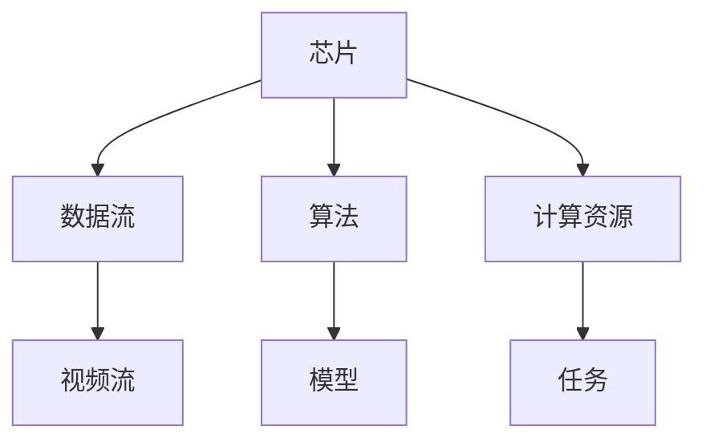
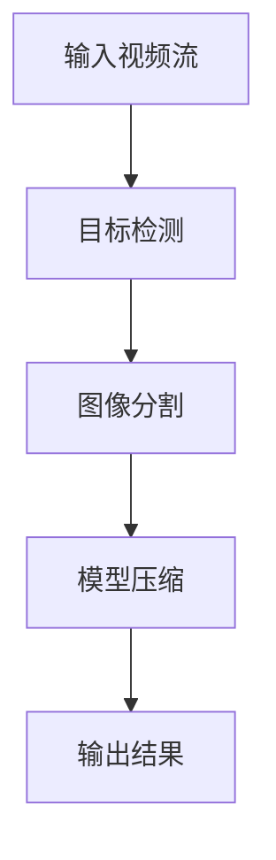
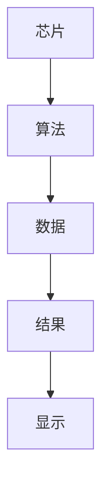

                 


# 如何识别企业的边缘AI视频分析芯片优势

> 关键词：边缘AI视频分析芯片，视频分析，边缘计算，AI芯片，芯片优势识别

> 摘要：边缘AI视频分析芯片是一种结合边缘计算与人工智能技术的视频分析专用芯片。本文从背景、核心概念、算法原理、系统架构、项目实战等多角度，详细阐述如何识别企业边缘AI视频分析芯片的优势。通过对芯片的技术特点、应用场景、性能指标、算法优化等方面的分析，帮助读者全面理解边缘AI视频分析芯片的优势识别方法。

---

# 第一部分: 背景介绍与核心概念

## 第1章: 边缘AI视频分析芯片的背景与问题

### 1.1 边缘AI视频分析芯片的背景

#### 1.1.1 边缘计算的兴起与应用

边缘计算是一种将计算能力从云端转移到数据生成源端的技术，具有低延迟、高实时性、节省带宽等优势。随着5G、物联网（IoT）和人工智能（AI）技术的快速发展，边缘计算在工业自动化、智能安防、自动驾驶、智慧城市等领域得到了广泛应用。

#### 1.1.2 视频分析技术的发展历程

视频分析技术经历了从简单的目标检测到复杂的人工智能模型的演变。传统的视频分析主要依赖于规则引擎和简单的图像处理算法，而现代视频分析则广泛采用深度学习技术，如卷积神经网络（CNN）和目标检测算法（如YOLO、Faster R-CNN等）。

#### 1.1.3 AI芯片在视频分析中的作用

AI芯片（如GPU、TPU、NPU等）为视频分析提供了强大的计算能力。边缘AI视频分析芯片专为边缘计算环境设计，结合了AI算法和视频处理技术，能够高效地完成视频分析任务。

### 1.2 问题背景与问题描述

#### 1.2.1 边缘计算环境下的视频分析挑战

边缘计算环境通常面临以下挑战：
- **资源限制**：边缘设备的计算资源有限，需要高效算法和轻量化模型。
- **实时性要求**：边缘视频分析需要低延迟，实时响应。
- **数据隐私**：边缘设备处理的数据通常涉及敏感信息，需要考虑数据隐私和安全。
- **环境复杂性**：边缘设备可能面临高温、高湿、振动等复杂环境。

#### 1.2.2 传统视频分析芯片的局限性

传统视频分析芯片主要依赖于简单的图像处理算法，难以应对复杂的视频分析任务，如目标识别、行为分析等。同时，传统芯片的计算效率较低，难以满足边缘计算的实时性要求。

#### 1.2.3 边缘AI视频分析芯片的核心问题

边缘AI视频分析芯片的核心问题包括：
- 如何优化AI算法以适应边缘设备的计算资源限制。
- 如何设计高效的硬件架构以提升视频分析性能。
- 如何确保芯片的实时性和稳定性。

### 1.3 问题解决与边界定义

#### 1.3.1 边缘AI视频分析芯片的优势识别

边缘AI视频分析芯片的优势主要体现在以下几个方面：
- **低延迟**：边缘计算环境下，视频分析任务可以在本地完成，减少网络传输延迟。
- **高效计算**：AI芯片结合深度学习算法，能够高效处理视频流数据。
- **隐私保护**：边缘设备可以在本地完成数据分析，减少数据外传，保护隐私。

#### 1.3.2 边缘AI视频分析芯片的边界与外延

边缘AI视频分析芯片的边界包括：
- **硬件边界**：芯片的计算能力、功耗、尺寸等物理限制。
- **算法边界**：支持的AI算法类型、模型复杂度等。
- **应用场景边界**：适合的行业和应用场景。

其外延包括：
- **边缘计算生态系统**：芯片与边缘计算平台、网络设备的协同工作。
- **AI算法创新**：芯片支持的新算法和模型优化。

#### 1.3.3 核心概念与关键要素

边缘AI视频分析芯片的关键要素包括：
- **硬件架构**：如NPU（神经网络处理器）、GPU等。
- **AI算法**：如目标检测、图像分割、行为识别等。
- **视频流处理**：如视频编码、解码、流传输等。
- **实时性与稳定性**：如低延迟、高可靠性。

### 1.4 本章小结

本章从边缘计算的背景出发，分析了视频分析技术的发展历程，探讨了传统视频分析芯片的局限性，并提出了边缘AI视频分析芯片的核心问题和边界定义。

---

## 第2章: 边缘AI视频分析芯片的核心概念

### 2.1 边缘AI视频分析芯片的原理

#### 2.1.1 边缘计算的基本原理

边缘计算的基本原理是将数据处理能力从云端转移到数据生成的源端，减少数据传输延迟，提升计算效率。边缘设备通过本地计算完成数据处理，并将结果上报到云端或进行下一步操作。

#### 2.1.2 AI视频分析芯片的工作原理

AI视频分析芯片通过硬件加速和深度学习算法，实现实时视频流的分析与处理。芯片内部通常包含专用的AI计算单元（如NPU），能够高效执行矩阵运算、卷积运算等深度学习任务。

#### 2.1.3 边缘AI视频分析芯片的协同机制

边缘AI视频分析芯片需要与边缘设备、云端平台以及其他边缘设备协同工作。协同机制包括数据传输、任务调度、结果汇报等。

### 2.2 核心概念的属性特征对比

#### 2.2.1 边缘AI视频分析芯片与传统视频分析芯片的对比

| 对比维度         | 边缘AI视频分析芯片                 | 传统视频分析芯片                 |
|------------------|------------------------------------|------------------------------------|
| 计算能力         | 高，支持深度学习算法               | 低，仅支持简单图像处理算法         |
| 实时性           | 高，边缘计算环境下实时响应         | 低，依赖于云端计算，延迟较高       |
| 数据隐私         | 高，本地处理数据，隐私保护          | 低，数据可能需要传输到云端         |
| 适用场景         | 复杂视频分析任务，如目标检测、行为识别 | 简单视频监控，如运动检测           |

#### 2.2.2 边缘AI视频分析芯片与云端AI视频分析芯片的对比

| 对比维度         | 边缘AI视频分析芯片                 | 云端AI视频分析芯片                 |
|------------------|------------------------------------|------------------------------------|
| 计算环境         | 边缘设备，本地计算                 | 云端服务器，集中计算               |
| 数据传输         | 低，仅传输分析结果                 | 高，传输原始视频流                 |
| 延迟             | 低，实时响应                       | 高，依赖网络传输                   |
| 资源消耗         | 较低，边缘设备资源有限             | 较高，云端服务器资源充足           |

#### 2.2.3 边缘AI视频分析芯片与其他边缘计算芯片的对比

| 对比维度         | 边缘AI视频分析芯片                 | 其他边缘计算芯片（如边缘AI推理芯片） |
|------------------|------------------------------------|------------------------------------|
| 主要功能         | 视频流分析，目标检测，行为识别     | 数据处理，AI推理，通用计算         |
| 数据类型         | 视频流，图像数据                   | 结构化数据，文本数据               |
| 算法复杂度       | 高，深度学习模型                   | 中，简单AI模型                     |

### 2.3 ER实体关系图

以下是边缘AI视频分析芯片的核心实体关系图：



### 2.4 本章小结

本章从核心概念出发，分析了边缘AI视频分析芯片的原理，通过对比传统视频分析芯片和云端AI视频分析芯片，明确了边缘AI视频分析芯片的优势和适用场景。

---

## 第3章: 边缘AI视频分析芯片的算法原理

### 3.1 算法原理概述

#### 3.1.1 目标检测算法

目标检测是边缘AI视频分析芯片的核心算法之一。常用的算法包括YOLO（You Only Look Once）、Faster R-CNN等。这些算法能够实现实时目标检测，适用于边缘设备的视频分析任务。

#### 3.1.2 图像分割算法

图像分割算法用于将视频帧中的目标与背景分开，常用算法包括U-Net、Mask R-CNN等。图像分割在视频分析中具有广泛的应用，如场景分割、目标提取等。

#### 3.1.3 模型压缩与优化算法

为了适应边缘设备的计算资源限制，模型压缩与优化算法（如剪枝、量化、知识蒸馏等）能够有效降低模型复杂度，提升推理速度。

### 3.2 算法流程图

以下是边缘AI视频分析芯片的算法流程图：



### 3.3 算法实现代码

以下是YOLO目标检测算法的示例代码：

```python
import tensorflow as tf
from tensorflow.keras import layers

def yolo_model(input_shape):
    inputs = layers.Input(shape=input_shape)
    x = layers.Conv2D(32, (3,3), activation='relu', padding='same')(inputs)
    x = layers.Conv2D(64, (3,3), activation='relu', padding='same')(x)
    x = layers.MaxPooling2D(pool_size=(2,2))(x)
    # 继续添加更多层...
    return x

model = yolo_model((416, 416, 3))
model.summary()
```

### 3.4 数学模型

YOLO目标检测算法的核心数学模型如下：

$$
\text{输出概率} = \text{Softmax}(W \times \text{特征图} + b)
$$

其中，$W$是权重矩阵，$b$是偏置项，$\text{特征图}$是输入图像经过卷积操作后的特征图。

### 3.5 本章小结

本章详细介绍了边缘AI视频分析芯片的算法原理，包括目标检测、图像分割和模型压缩等关键技术，并通过代码和数学公式展示了YOLO目标检测算法的工作原理。

---

## 第4章: 边缘AI视频分析芯片的系统架构设计

### 4.1 系统分析与设计

#### 4.1.1 问题场景介绍

边缘AI视频分析芯片的典型应用场景包括智能安防、工业自动化、智能交通等。以智能安防为例，边缘设备需要实现实时视频流的分析，包括目标检测、行为识别等任务。

#### 4.1.2 系统功能设计

边缘AI视频分析芯片的系统功能设计包括：
1. 视频流接收与处理
2. AI算法执行与结果输出
3. 数据存储与管理
4. 系统接口与通信

#### 4.1.3 系统架构设计

以下是边缘AI视频分析芯片的系统架构图：



### 4.2 项目实战

#### 4.2.1 环境安装

为了实现边缘AI视频分析芯片的功能，需要以下环境：
- 操作系统：Linux（如Ubuntu 20.04）
- 开发工具：Python 3.8及以上版本
- 深度学习框架：TensorFlow或Keras

#### 4.2.2 核心实现代码

以下是YOLO目标检测算法的核心实现代码：

```python
import tensorflow as tf
from tensorflow.keras import layers

def yolo_model(input_shape):
    inputs = layers.Input(shape=input_shape)
    x = layers.Conv2D(32, (3,3), activation='relu', padding='same')(inputs)
    x = layers.Conv2D(64, (3,3), activation='relu', padding='same')(x)
    x = layers.MaxPooling2D(pool_size=(2,2))(x)
    x = layers.Conv2D(128, (3,3), activation='relu', padding='same')(x)
    x = layers.Conv2D(256, (3,3), activation='relu', padding='same')(x)
    x = layers.MaxPooling2D(pool_size=(2,2))(x)
    return x

model = yolo_model((416, 416, 3))
model.summary()
```

#### 4.2.3 代码应用解读与分析

上述代码实现了YOLO目标检测算法的核心部分，包括卷积层和下采样层。通过逐步缩小特征图的尺寸，模型能够高效地提取图像特征。

#### 4.2.4 案例分析与详细讲解

以智能安防场景为例，边缘AI视频分析芯片可以实现实时视频流的目标检测功能。通过YOLO算法，芯片能够在视频流中检测出行人、车辆等目标，并输出检测结果。

### 4.3 本章小结

本章通过系统分析与设计，展示了边缘AI视频分析芯片的典型应用场景和系统架构，并通过项目实战详细介绍了YOLO目标检测算法的实现过程。

---

## 第5章: 边缘AI视频分析芯片的最佳实践

### 5.1 最佳实践

#### 5.1.1 算法优化技巧

1. **模型压缩**：通过剪枝、量化等技术降低模型复杂度。
2. **轻量化设计**：选择适合边缘设备的轻量化模型。
3. **算法调优**：优化算法参数，提升推理速度。

#### 5.1.2 硬件选型建议

1. **芯片选择**：根据应用场景选择适合的AI芯片（如NVIDIA Jetson系列、寒武纪MLU系列）。
2. **计算资源分配**：合理分配计算资源，确保实时性要求。
3. **功耗优化**：选择低功耗芯片，延长设备续航时间。

#### 5.1.3 系统集成与部署

1. **环境配置**：确保边缘设备的硬件和软件环境与芯片要求匹配。
2. **系统调试**：进行系统联调，确保各模块协同工作。
3. **性能测试**：通过性能测试验证芯片的计算能力和实时性。

### 5.2 小结

通过最佳实践，可以有效提升边缘AI视频分析芯片的性能和稳定性，确保其在实际应用中的高效运行。

### 5.3 注意事项

1. **数据隐私保护**：在边缘设备上处理数据时，需要注意数据隐私和安全。
2. **环境适应性**：边缘设备可能面临复杂环境，需要选择 robust 的芯片和算法。
3. **算法更新与维护**：定期更新AI模型，确保其准确性和适应性。

### 5.4 拓展阅读

1. **边缘计算相关书籍**：《边缘计算：原理与实践》
2. **深度学习相关书籍**：《深度学习：方法与应用》
3. **AI芯片相关书籍**：《AI芯片：原理与设计》

---

## 作者

作者：AI天才研究院/AI Genius Institute  
禅与计算机程序设计艺术 /Zen And The Art of Computer Programming  

--- 

**感谢您的阅读！希望本文对您识别企业的边缘AI视频分析芯片优势有所帮助！**

