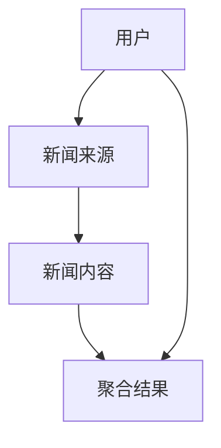
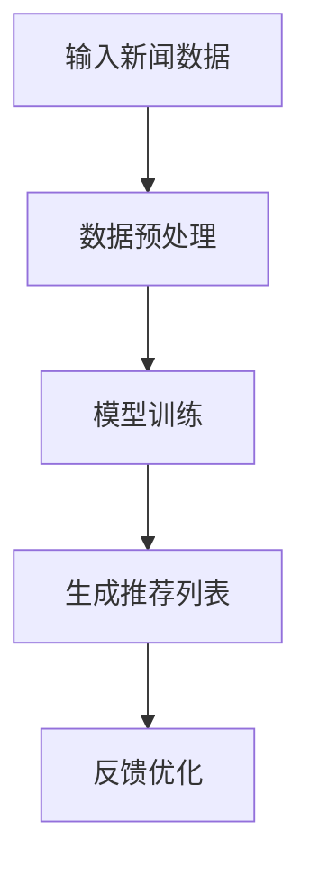
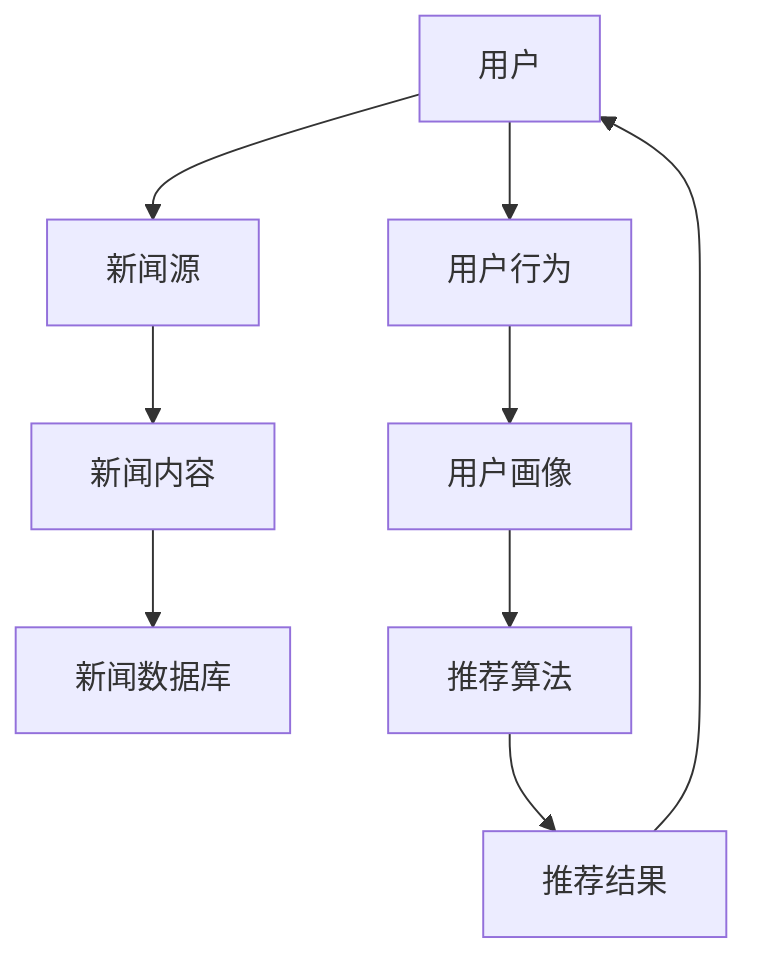

                 


# 开发AI Agent支持的智能新闻聚合系统

## 关键词：AI Agent、新闻聚合系统、自然语言处理、推荐算法、深度学习、智能系统

## 摘要：本文将详细探讨如何开发一个基于AI Agent的智能新闻聚合系统。通过分析系统背景、核心概念、算法原理、系统架构、项目实现和最佳实践，我们全面解析该系统的开发流程与技术要点。从用户需求分析到系统设计，从算法实现到项目实战，本文将带领读者一步步构建一个高效、智能的新闻聚合系统。

---

# 第一部分: AI Agent与智能新闻聚合系统概述

## 第1章: 背景介绍

### 1.1 问题背景
#### 1.1.1 当前新闻聚合系统的痛点
新闻聚合系统作为一种信息分发工具，旨在为用户提供多样化的新闻来源和个性化的内容推荐。然而，现有的新闻聚合系统存在以下痛点：
- **信息冗余**：用户可能接收到大量重复的新闻内容。
- **推荐精准度低**：传统基于关键词的推荐算法难以捕捉用户的深层次需求。
- **实时性不足**：部分系统无法快速响应最新的新闻事件。
- **用户体验不佳**：推荐内容缺乏个性化，难以满足用户的多样化需求。

#### 1.1.2 AI Agent在新闻聚合中的作用
AI Agent（人工智能代理）是一种能够感知环境、执行任务并主动优化决策的智能系统。将其应用于新闻聚合系统，可以显著提升系统的智能化水平：
- **智能推荐**：AI Agent可以根据用户的阅读习惯和兴趣，实时推荐个性化新闻。
- **内容理解**：通过自然语言处理技术，AI Agent能够理解新闻内容的语义，提升推荐的准确性。
- **动态优化**：AI Agent可以根据实时数据和用户反馈，动态调整推荐策略。

#### 1.1.3 智能新闻聚合系统的定义与目标
智能新闻聚合系统是一种基于AI Agent的新闻分发系统，旨在通过智能化的新闻筛选和推荐，为用户提供高度个性化的新闻阅读体验。其目标包括：
- 提供精准的新闻推荐，满足用户的个性化需求。
- 实现新闻内容的高效聚合与分发。
- 提升系统的实时性和响应速度。
- 优化用户体验，降低信息冗余。

### 1.2 问题描述
#### 1.2.1 用户需求分析
- **个性化需求**：用户希望看到与自己兴趣相关的内容。
- **实时性需求**：用户希望快速获取最新的新闻事件。
- **多样性需求**：用户希望看到不同来源的新闻，避免信息单一化。
- **便捷性需求**：用户希望以最少的点击操作获取所需信息。

#### 1.2.2 系统功能需求
- **新闻采集**：从多个新闻源实时采集新闻内容。
- **内容理解**：通过NLP技术分析新闻内容，提取关键词、主题和语义信息。
- **用户画像构建**：根据用户的阅读历史和行为数据，构建用户画像。
- **智能推荐**：基于用户画像和新闻内容，生成个性化推荐列表。
- **反馈优化**：根据用户的反馈（如点击、停留时间）优化推荐算法。

#### 1.2.3 系统性能需求
- **响应时间**：新闻采集和推荐结果生成的延迟需控制在可接受范围内。
- **处理能力**：系统需能够处理高并发的用户请求。
- **准确性**：推荐内容的相关性需达到较高的水平。
- **可扩展性**：系统需支持新闻源和用户的动态扩展。

### 1.3 问题解决
#### 1.3.1 AI Agent的核心功能
- **感知环境**：通过数据采集和分析，获取新闻内容和用户行为数据。
- **决策与推荐**：基于分析结果，生成个性化推荐列表。
- **执行任务**：将推荐结果分发给用户，并实时调整推荐策略。
- **学习优化**：通过机器学习算法不断优化推荐模型。

#### 1.3.2 智能新闻聚合的技术路径
1. **数据采集**：从多个新闻源实时采集新闻数据。
2. **内容处理**：对新闻内容进行清洗、分类和语义分析。
3. **用户建模**：根据用户行为数据构建用户画像。
4. **推荐算法**：基于用户画像和新闻内容，应用机器学习算法生成推荐列表。
5. **结果优化**：通过A/B测试和用户反馈优化推荐算法。

#### 1.3.3 系统实现的关键步骤
1. **数据采集与预处理**：获取多来源新闻数据，并进行格式统一和去重处理。
2. **内容理解**：使用NLP技术提取新闻关键词、主题和语义信息。
3. **用户画像构建**：基于用户行为数据，构建兴趣模型。
4. **推荐算法实现**：设计并实现基于深度学习的推荐模型。
5. **系统优化**：通过实时监控和用户反馈优化系统性能和推荐效果。

### 1.4 系统边界与外延
#### 1.4.1 系统的功能边界
- **新闻采集**：仅支持特定范围内的新闻源。
- **推荐范围**：仅推荐与用户兴趣相关的新闻内容。
- **系统性能**：仅支持一定规模的用户和新闻数据。

#### 1.4.2 系统的用户边界
- **目标用户**：特定领域的用户群体。
- **用户权限**：用户需注册并登录后才能使用推荐功能。

#### 1.4.3 系统的性能边界
- **响应时间**：新闻推荐的延迟不超过3秒。
- **处理能力**：系统支持每天10万次的推荐请求。

### 1.5 核心概念与结构
#### 1.5.1 系统的核心要素
- **新闻源**：提供新闻内容的来源。
- **用户数据**：用户的阅读历史和行为数据。
- **推荐算法**：用于生成个性化推荐的核心算法。
- **反馈机制**：用户对推荐内容的反馈数据。

#### 1.5.2 系统的逻辑结构
- **输入层**：用户请求和新闻数据。
- **处理层**：数据清洗、内容理解和用户建模。
- **决策层**：推荐算法生成推荐列表。
- **输出层**：推荐结果分发给用户。

#### 1.5.3 系统的物理结构
- **新闻采集模块**：负责新闻数据的采集和预处理。
- **内容理解模块**：负责新闻内容的语义分析。
- **用户画像模块**：负责用户行为数据的分析和建模。
- **推荐算法模块**：负责个性化推荐的生成。
- **反馈优化模块**：负责根据用户反馈优化推荐策略。

## 第2章: 核心概念与联系

### 2.1 AI Agent的基本概念
#### 2.1.1 AI Agent的定义
AI Agent是一种能够感知环境、执行任务并主动优化决策的智能系统。它可以通过传感器获取环境信息，并通过执行器对外界产生影响。

#### 2.1.2 AI Agent的分类
- **简单反射型Agent**：基于当前感知做出反应，不涉及状态存储。
- **基于模型的反应式Agent**：维护对环境的模型，并基于模型做出决策。
- **目标驱动型Agent**：根据目标驱动行为，主动规划和执行任务。
- **效用驱动型Agent**：基于效用函数优化决策。

#### 2.1.3 AI Agent的主要特征
- **自主性**：能够自主决策和行动。
- **反应性**：能够实时感知环境并做出反应。
- **目标导向性**：根据目标驱动行为。
- **学习能力**：能够通过经验优化决策。

### 2.2 智能新闻聚合系统的核心原理
#### 2.2.1 新闻聚合的基本原理
新闻聚合系统通过从多个新闻源采集新闻数据，并根据用户需求进行筛选和推荐。

#### 2.2.2 智能聚合的关键技术
- **自然语言处理**：用于新闻内容的理解和分析。
- **机器学习**：用于用户建模和个性化推荐。
- **深度学习**：用于复杂的模式识别和推荐优化。

#### 2.2.3 AI Agent在聚合中的具体应用
AI Agent在新闻聚合中的具体应用包括：
1. **内容理解**：通过NLP技术分析新闻内容，提取关键词和主题。
2. **用户建模**：基于用户行为数据，构建用户兴趣模型。
3. **推荐决策**：根据用户画像和新闻内容，生成个性化推荐列表。
4. **动态优化**：根据用户反馈优化推荐策略。

### 2.3 核心概念对比表
| 对比维度       | AI Agent                     | 传统新闻聚合系统               |
|----------------|------------------------------|-------------------------------|
| 核心功能       | 智能推荐、动态优化            | 基于关键词的静态推荐           |
| 决策方式       | 基于机器学习的动态决策        | 基于规则的静态决策             |
| 响应时间       | 实时响应                     | 延迟较高                       |
| 个性化程度     | 高度个性化                   | 个性化较低                     |
| 学习能力       | 具备学习能力                 | 无学习能力                     |

### 2.4 ER实体关系图


## 第3章: 算法原理讲解

### 3.1 AI Agent算法的实现
#### 3.1.1 算法选择与原理
选择基于深度学习的推荐算法，如基于注意力机制的Transformer模型。该算法通过自注意力机制捕捉新闻内容和用户兴趣之间的关联。

#### 3.1.2 算法流程
1. **数据预处理**：对新闻内容和用户行为数据进行清洗和特征提取。
2. **模型训练**：基于训练数据训练推荐模型。
3. **推荐生成**：根据用户画像和新闻内容生成推荐列表。
4. **反馈优化**：根据用户反馈优化模型参数。

#### 3.1.3 算法实现的Python代码
```python
import tensorflow as tf
from tensorflow.keras.layers import Dense, Input, Dropout, Layer, MultiHeadAttention, GlobalAveragePooling1D

class NewsEncoder(Layer):
    def __init__(self, vocab_size, embedding_dim):
        super(NewsEncoder, self).__init__()
        self.embedding = tf.keras.layers.Embedding(vocab_size, embedding_dim)
        self.attention = MultiHeadAttention(heads=4, dim_head=64)
        self.pooling = GlobalAveragePooling1D()

    def call(self, x):
        embedded = self.embedding(x)
        attn_output = self.attention(embedded, embedded)
        pooled_output = self.pooling(attn_output)
        return pooled_output

# 模型定义
input_news = Input(shape=(max_length,), dtype='int64')
encoder = NewsEncoder(vocab_size, embedding_dim)(input_news)
dense = Dense(256, activation='relu')(encoder)
output = Dense(num_classes, activation='softmax')(dense)
model = Model(inputs=input_news, outputs=output)
model.compile(optimizer='adam', loss='sparse_categorical_crossentropy', metrics=['accuracy'])
```

### 3.2 算法流程图


### 3.3 算法数学模型与公式
#### 3.3.1 模型输入与输出
- **输入**：新闻内容的文本表示和用户画像特征。
- **输出**：个性化推荐列表。

#### 3.3.2 模型数学公式
1. **嵌入层**：
   $$ E(w) = W_{emb} \cdot w $$
   其中，\( w \) 是单词的索引，\( W_{emb} \) 是嵌入矩阵。

2. **自注意力机制**：
   $$ \text{Attention}(Q, K, V) = \text{softmax}(\frac{QK^T}{\sqrt{d_k}})V $$
   其中，\( Q \) 是查询向量，\( K \) 是键向量，\( V \) 是值向量，\( d_k \) 是向量维度。

3. **池化层**：
   $$ \text{Pool}(\text{attn\_output}) = \frac{1}{n}\sum_{i=1}^{n}\text{attn\_output}_i $$

4. **全连接层**：
   $$ f(x) = \text{ReLU}(Wx + b) $$

5. **输出层**：
   $$ y = \text{softmax}(W_{out}x + b_{out}) $$

### 3.4 算法优化与调优
#### 3.4.1 参数调整
- **学习率**：使用Adam优化器，学习率设为0.001。
- **Batch大小**：设置为32。
- **Epoch数**：训练10轮。

#### 3.4.2 模型评估
- **准确率**：衡量推荐内容与用户兴趣的匹配程度。
- **召回率**：衡量推荐内容的覆盖率。
- **F1分数**：综合准确率和召回率的评估指标。

#### 3.4.3 模型优化策略
- **早停法**：当验证集准确率不再提升时，提前终止训练。
- **模型蒸馏**：将复杂模型的知识迁移到轻量级模型中，提升推理效率。
- **分布式训练**：利用分布式计算框架（如TensorFlow分布式）提升训练效率。

---

# 第二部分: 系统分析与架构设计

## 第4章: 系统分析与架构设计

### 4.1 系统功能设计
#### 4.1.1 领域模型


#### 4.1.2 系统架构
```mermaid
graph LR
    Client[客户端] --> API Gateway[API网关]
    API Gateway --> NewsCollector[新闻采集器]
    NewsCollector --> NewsDatabase[新闻数据库]
    API Gateway --> Recommender[推荐服务]
    Recommender --> UserDatabase[用户数据库]
    Recommender --> NewsDatabase
    API Gateway --> ResultDisplay[结果展示]
```

### 4.2 系统架构设计
#### 4.2.1 系统架构图
```mermaid
graph LR
    NewsCollector[新闻采集器] --> NewsDatabase[新闻数据库]
    UserBehaviorCollector[用户行为采集器] --> UserProfileDatabase[用户画像数据库]
    RecommenderService[推荐服务] --> NewsDatabase
    RecommenderService --> UserProfileDatabase
    ResultDisplay[结果展示] --> API Gateway
    API Gateway --> Client[客户端]
```

#### 4.2.2 系统模块划分
- **新闻采集器**：负责从新闻源采集新闻数据。
- **新闻数据库**：存储新闻内容和相关元数据。
- **用户行为采集器**：收集用户的阅读历史和行为数据。
- **用户画像数据库**：存储用户画像和兴趣模型。
- **推荐服务**：基于用户画像和新闻内容生成推荐列表。
- **结果展示**：将推荐结果展示给用户。

### 4.3 系统接口设计
#### 4.3.1 接口定义
1. **新闻采集接口**：
   - **输入**：新闻源URL。
   - **输出**：采集到的新闻数据。

2. **推荐接口**：
   - **输入**：用户ID。
   - **输出**：推荐的新闻列表。

3. **反馈接口**：
   - **输入**：用户ID和推荐结果。
   - **输出**：反馈结果（如点击、点赞）。

#### 4.3.2 接口协议
- **HTTP协议**：用于客户端与API网关之间的通信。
- **RESTful API**：采用RESTful风格设计API接口。

### 4.4 系统交互设计
#### 4.4.1 交互流程
1. **用户请求**：用户向客户端发送新闻请求。
2. **API调用**：客户端通过API网关调用新闻采集器和推荐服务。
3. **数据处理**：新闻采集器采集新闻数据，推荐服务生成推荐列表。
4. **结果展示**：推荐结果通过结果展示模块呈现给用户。
5. **用户反馈**：用户对推荐结果进行反馈，优化推荐算法。

#### 4.4.2 交互流程图
```mermaid
graph LR
    Client[客户端] --> API Gateway[API网关]
    API Gateway --> NewsCollector[新闻采集器]
    NewsCollector --> NewsDatabase[新闻数据库]
    API Gateway --> Recommender[推荐服务]
    Recommender --> NewsDatabase
    Recommender --> UserProfileDatabase[用户画像数据库]
    Recommender --> ResultDisplay[结果展示]
    ResultDisplay --> Client
```

---

## 第三部分: 项目实战

## 第5章: 项目实战

### 5.1 环境安装
```bash
pip install tensorflow==2.5.0
pip install tensorflow.keras==2.5.0
pip install mermaid
```

### 5.2 核心代码实现
#### 5.2.1 新闻采集器
```python
import requests
from bs4 import BeautifulSoup

def fetch_news(url):
    response = requests.get(url)
    soup = BeautifulSoup(response.text, 'html.parser')
    articles = soup.find_all('article')
    news_list = []
    for article in articles:
        title = article.find('h2').text
        content = article.find('p').text
        news_list.append({'title': title, 'content': content})
    return news_list
```

#### 5.2.2 推荐算法实现
```python
import tensorflow as tf
from tensorflow.keras.models import Model
from tensorflow.keras.layers import Input, Dense, Dropout, GlobalAveragePooling1D, MultiHeadAttention

def build_model(max_length, vocab_size, embedding_dim, num_classes):
    input_layer = Input(shape=(max_length,), dtype='int64')
    embedding_layer = tf.keras.layers.Embedding(vocab_size, embedding_dim)(input_layer)
    attention_layer = MultiHeadAttention(heads=4, dim_head=64)(embedding_layer, embedding_layer)
    pooled_layer = GlobalAveragePooling1D()(attention_layer)
    dense_layer = Dense(256, activation='relu')(pooled_layer)
    output_layer = Dense(num_classes, activation='softmax')(dense_layer)
    model = Model(inputs=input_layer, outputs=output_layer)
    model.compile(optimizer='adam', loss='sparse_categorical_crossentropy', metrics=['accuracy'])
    return model
```

#### 5.2.3 用户画像构建
```python
import pandas as pd
from sklearn.cluster import KMeans

def build_user_profile(user_data):
    # 数据预处理
    df = pd.DataFrame(user_data)
    # 用户聚类
    kmeans = KMeans(n_clusters=5, random_state=0)
    df['cluster'] = kmeans.fit_predict(df)
    # 用户画像提取
    user_profiles = df.groupby('cluster').mean()
    return user_profiles
```

### 5.3 代码解读与分析
1. **新闻采集器**：通过爬虫技术从指定URL采集新闻数据，并提取标题和内容。
2. **推荐算法**：基于Transformer模型的自注意力机制，生成个性化推荐列表。
3. **用户画像构建**：通过聚类算法将用户分为不同的群体，提取用户的兴趣特征。

### 5.4 案例分析
假设我们有一个新闻网站，用户群体主要分为科技、财经、娱乐和体育爱好者。通过用户数据的聚类分析，我们可以将用户分为四个群体，并为每个群体生成个性化的新闻推荐列表。

### 5.5 项目小结
通过以上代码实现，我们完成了一个基于AI Agent的智能新闻聚合系统的开发。从新闻采集到推荐算法，从用户画像构建到系统优化，整个系统实现了新闻内容的高效聚合和精准推荐。

---

## 第四部分: 最佳实践与总结

## 第6章: 最佳实践

### 6.1 最佳实践 tips
1. **数据质量**：确保新闻数据的准确性和完整性。
2. **模型优化**：通过A/B测试和用户反馈不断优化推荐算法。
3. **系统性能**：采用分布式架构提升系统的扩展性和响应速度。
4. **用户体验**：注重推荐结果的展示效果，提升用户的阅读体验。

### 6.2 小结
通过本文的详细讲解，我们了解了如何开发一个基于AI Agent的智能新闻聚合系统。从系统背景到核心概念，从算法原理到系统架构，从项目实战到最佳实践，我们全面解析了该系统的开发流程和技术要点。

### 6.3 注意事项
- **数据隐私**：注意保护用户的隐私数据，遵守相关法律法规。
- **系统安全**：确保系统的安全性，防止数据泄露和网络攻击。
- **用户体验**：持续优化用户体验，提升用户的满意度和忠诚度。

### 6.4 拓展阅读
- **深度学习**：学习更多的深度学习模型，提升推荐算法的准确性。
- **自然语言处理**：探索更多的NLP技术，优化新闻内容的理解和分析。
- **分布式系统**：研究分布式系统的架构设计，提升系统的扩展性和性能。

---

# 作者：AI天才研究院/AI Genius Institute & 禅与计算机程序设计艺术/Zen And The Art of Computer Programming

