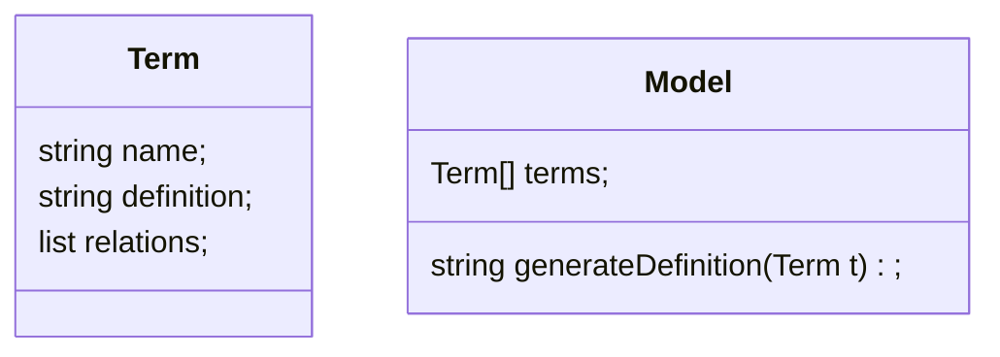
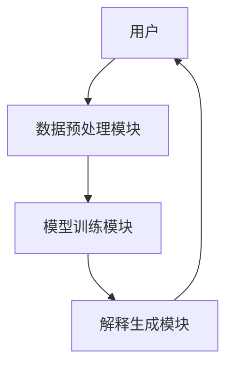

                 


# 开发基于大模型的金融专业词汇解释系统

> 关键词：大模型、金融专业词汇、自然语言处理、系统开发、技术实现

> 摘要：本文详细探讨了如何开发基于大模型的金融专业词汇解释系统。从背景分析到系统设计，从算法原理到项目实战，系统地介绍了该系统的开发过程。文章首先分析了金融领域的复杂性及其对专业词汇解释的需求，随后介绍了大模型的基本原理及其在金融领域的应用潜力。接着，详细讲解了系统的算法原理、系统架构设计、接口设计和交互流程。最后，通过项目实战部分，提供了具体的代码实现和实际案例分析，帮助读者更好地理解和应用这些技术。本文旨在为金融领域的技术开发人员提供一个全面的指导，帮助他们利用大模型技术解决实际问题。

---

# 第一部分: 开发基于大模型的金融专业词汇解释系统概述

---

## 第1章: 金融专业词汇解释系统背景介绍

### 1.1 问题背景与挑战

#### 1.1.1 金融领域的复杂性
金融领域涉及大量的专业术语和复杂的业务逻辑，这些术语通常具有高度的专业性和技术性。例如，“套利”、“杠杆率”、“期权”等词汇在不同上下文中的含义可能截然不同，这使得金融领域的词汇解释变得复杂且具有挑战性。

#### 1.1.2 专业词汇解释的需求
金融领域的从业者和投资者常常需要快速理解复杂的金融术语和概念，以便做出准确的决策。传统的词汇解释方法通常依赖于静态的词典或简单的规则，难以应对金融术语的动态变化和多义性。

#### 1.1.3 传统方法的局限性
传统的词汇解释方法通常基于规则或统计方法，难以处理金融术语的上下文依赖和复杂关系。例如，词典式的解释方法无法捕捉到术语在具体场景中的细微差别，也无法处理术语之间的关联关系。

#### 1.1.4 大模型在金融领域的潜力
大模型（如GPT系列、BERT系列等）具有强大的自然语言处理能力，能够通过上下文理解和生成文本。将大模型应用于金融领域，可以实现对金融术语的深度理解和智能解释，从而解决传统方法的局限性。

---

### 1.2 问题描述与目标

#### 1.2.1 金融专业词汇解释的核心问题
金融专业词汇解释的核心问题在于如何准确理解术语的含义，并能够根据上下文提供个性化的解释。这需要系统具备强大的语义理解能力和知识推理能力。

#### 1.2.2 系统目标与功能定位
系统的开发目标是基于大模型技术，构建一个能够理解和解释金融专业术语的系统。系统的主要功能包括：术语解释生成、语义理解与推理、知识图谱构建与应用等。

#### 1.2.3 边界与外延
系统的边界包括：仅针对金融领域的术语解释，不涉及其他领域的词汇；系统的解释能力基于大模型的上下文理解，不依赖于外部知识库的实时更新。系统的外延包括：系统可以扩展到其他领域，也可以集成到更大的金融系统中。

#### 1.2.4 核心要素组成
系统的开发涉及以下核心要素：大模型的选型与优化、金融领域的知识库构建、术语解释的生成与优化、系统的交互设计与用户体验优化。

---

### 1.3 系统需求分析

#### 1.3.1 用户需求层次
- **基础需求**：用户需要快速理解金融术语的基本含义。
- **深度需求**：用户需要术语的上下文解释和相关知识推理。
- **个性化需求**：用户需要根据自身知识水平和场景需求获得个性化的解释。

#### 1.3.2 系统功能需求
- **术语解释生成**：系统能够根据输入的金融术语生成详细解释。
- **语义理解与推理**：系统能够理解术语的上下文，并提供相关的知识推理结果。
- **知识图谱构建与应用**：系统能够构建金融领域的知识图谱，并将其应用于术语解释。

#### 1.3.3 性能需求与约束
- **响应时间**：系统需要在合理的时间内完成术语解释的生成和推理。
- **准确性**：系统需要保证术语解释的准确性和相关性。
- **可扩展性**：系统需要具备良好的扩展性，能够适应金融领域知识的更新。

#### 1.3.4 边界条件与限制
- 系统仅支持中文金融术语的解释。
- 系统不支持实时更新的外部知识库。
- 系统的解释能力基于训练数据，可能存在一定的局限性。

---

### 1.4 本章小结

#### 1.4.1 核心概念总结
金融专业词汇解释的核心问题在于如何准确理解术语的含义，并能够根据上下文提供个性化的解释。大模型技术为解决这一问题提供了强大的技术支持。

#### 1.4.2 问题解决路径
通过引入大模型技术，构建一个能够理解上下文、进行知识推理的金融专业词汇解释系统，从而解决传统方法的局限性。

#### 1.4.3 系统开发框架
系统开发需要综合考虑大模型的选型、金融知识库的构建、术语解释的生成与优化、以及系统的交互设计与用户体验优化。

---

## 第2章: 大模型与金融领域的核心概念

### 2.1 大模型的基本原理

#### 2.1.1 大模型的定义与特点
大模型是一种基于深度学习的自然语言处理模型，具有以下特点：
- **大规模训练数据**：大模型通常基于海量的文本数据进行训练。
- **深度神经网络结构**：大模型通常采用Transformer架构，具有强大的序列建模能力。
- **自注意力机制**：自注意力机制使得模型能够捕捉文本中的长距离依赖关系。

#### 2.1.2 注意力机制与Transformer结构
- **注意力机制**：注意力机制允许模型在处理输入数据时，关注重要的部分，忽略不相关的部分。
- **Transformer结构**：Transformer由编码器和解码器组成，编码器负责将输入数据编码为高维向量，解码器负责根据编码结果生成输出。

#### 2.1.3 大模型的训练与推理流程
- **训练流程**：大模型通过监督学习的方式进行训练，目标是最小化预测结果与真实结果的差异。
- **推理流程**：在推理阶段，模型根据输入生成相应的输出，例如生成术语解释。

#### 2.1.4 大模型的数学基础
大模型的训练通常基于交叉熵损失函数，公式如下：
$$
\text{loss} = -\sum_{i=1}^{n} \text{log}(p(y_i|x_i))
$$
其中，$p(y_i|x_i)$ 是条件概率，表示在给定输入$x_i$的情况下，输出$y_i$的概率。

---

### 2.2 金融领域专业词汇的特点

#### 2.2.1 专业术语的复杂性
金融术语通常具有高度的专业性和技术性，例如“套利”、“杠杆率”等术语在不同的上下文中可能具有不同的含义。

#### 2.2.2 术语之间的关系
金融术语之间往往存在复杂的关联关系，例如“期权”和“波动率”之间可能存在相互影响的关系。

#### 2.2.3 术语的多义性与上下文依赖
金融术语的含义通常依赖于上下文，例如“流动性”在不同的金融市场中的含义可能不同。

---

### 2.3 大模型在金融词汇解释中的应用

#### 2.3.1 词汇生成与解释
大模型可以通过生成式的方法，根据输入的术语生成详细的解释。例如，输入“套利”，模型可以生成“套利是指在不同市场或不同时间点利用价格差异进行交易以获利的行为”。

#### 2.3.2 语义理解与推理
大模型可以理解术语的上下文，并进行知识推理。例如，输入“杠杆率”，模型可以推理出“杠杆率越高，企业的财务风险越大”。

#### 2.3.3 知识图谱构建与应用
大模型可以用于构建金融领域的知识图谱，将术语与其相关概念、实体进行关联，从而支持更复杂的知识推理和解释生成。

---

### 2.4 核心概念对比表

| 概念 | 特性 | 优势 | 局限 |
|------|------|------|------|
| 传统词典 | 静态解释 | 解释准确 | 无法处理上下文 |
| 大模型 | 动态生成 | 解释灵活 | 训练数据依赖 |

---

## 第3章: 系统算法原理

### 3.1 算法原理概述

#### 3.1.1 大模型的训练流程
大模型的训练流程包括以下几个步骤：
1. **数据预处理**：对训练数据进行清洗、分词、标注等预处理操作。
2. **模型初始化**：初始化模型的参数，包括编码器和解码器的权重。
3. **前向传播**：将输入数据输入模型，计算输出结果。
4. **损失计算**：计算预测结果与真实结果之间的损失。
5. **反向传播**：通过梯度下降优化模型参数。

#### 3.1.2 解码器的实现细节
解码器负责根据编码器输出的高维向量生成最终的解释。解码器通常采用自注意力机制，以捕捉输入数据的长距离依赖关系。

#### 3.1.3 损失函数的优化
大模型的训练通常基于交叉熵损失函数，通过优化算法（如Adam）最小化损失函数。

---

### 3.2 算法实现细节

#### 3.2.1 模型训练的代码实现
以下是一个简单的训练代码示例：
```python
import torch
import torch.nn as nn
import torch.optim as optim

class TransformerModel(nn.Module):
    def __init__(self, vocab_size):
        super(TransformerModel, self).__init__()
        self.encoder = nn.Embedding(vocab_size, d_model)
        self.decoder = nn.Embedding(d_model, vocab_size)

    def forward(self, x):
        encoded = self.encoder(x)
        decoded = self.decoder(encoded)
        return decoded

# 初始化模型和优化器
model = TransformerModel(vocab_size)
optimizer = optim.Adam(model.parameters(), lr=0.001)

# 定义损失函数
criterion = nn.CrossEntropyLoss()

# 训练循环
for epoch in range(num_epochs):
    for batch in batches:
        inputs, targets = batch
        outputs = model(inputs)
        loss = criterion(outputs, targets)
        optimizer.zero_grad()
        loss.backward()
        optimizer.step()
```

#### 3.2.2 模型推理的代码实现
以下是一个简单的推理代码示例：
```python
import torch

model = TransformerModel(vocab_size)
model.eval()

inputs = torch.tensor([input_ids])
with torch.no_grad():
    outputs = model(inputs)

# 解析输出结果
predicted_ids = torch.argmax(outputs, dim=-1).numpy()
```

---

## 第4章: 系统架构设计

### 4.1 问题场景介绍

#### 4.1.1 金融专业词汇解释系统的核心场景
金融专业词汇解释系统需要能够快速、准确地解释金融术语的含义，并能够根据上下文提供个性化的解释。

#### 4.1.2 系统的目标用户
系统的主要用户包括金融从业者、投资者、学生等需要理解金融术语的用户。

#### 4.1.3 系统的使用场景
系统可以在金融分析、投资决策、教育等领域中应用。

---

### 4.2 系统功能设计

#### 4.2.1 数据流设计
系统的数据流包括以下步骤：
1. **用户输入**：用户输入需要解释的金融术语。
2. **数据预处理**：系统对输入数据进行预处理，包括分词、标注等。
3. **模型推理**：系统调用大模型生成术语解释。
4. **结果输出**：系统将解释结果返回给用户。

#### 4.2.2 领域模型设计
以下是一个简单的领域模型类图：



---

### 4.3 系统架构设计

#### 4.3.1 模块划分
系统的架构分为以下几个模块：
- **数据预处理模块**：负责对输入数据进行预处理。
- **模型训练模块**：负责对大模型进行训练和优化。
- **解释生成模块**：负责根据输入生成术语解释。
- **用户交互模块**：负责与用户的交互，接收输入并输出结果。

#### 4.3.2 系统架构图
以下是一个简单的系统架构图：



---

## 第5章: 项目实战

### 5.1 环境安装

#### 5.1.1 安装依赖
需要安装以下依赖：
- Python 3.6+
- PyTorch
- Transformers库

安装命令：
```bash
pip install torch transformers
```

---

### 5.2 系统核心实现

#### 5.2.1 数据预处理代码
```python
import torch
from transformers import AutoTokenizer, AutoModelForMaskedLM

tokenizer = AutoTokenizer.from_pretrained('bert-base-chinese')
model = AutoModelForMaskedLM.from_pretrained('bert-base-chinese')

def preprocess(text):
    inputs = tokenizer(text, return_tensors='pt')
    return inputs
```

#### 5.2.2 模型训练代码
```python
import torch
from transformers import AutoTokenizer, AutoModelForMaskedLM

tokenizer = AutoTokenizer.from_pretrained('bert-base-chinese')
model = AutoModelForMaskedLM.from_pretrained('bert-base-chinese')

def train(model, tokenizer, optimizer, criterion, device, batch_size=32, num_epochs=10):
    for epoch in range(num_epochs):
        for batch in batches:
            inputs, targets = batch
            inputs = inputs.to(device)
            targets = targets.to(device)
            outputs = model(inputs)
            loss = criterion(outputs, targets)
            optimizer.zero_grad()
            loss.backward()
            optimizer.step()
```

#### 5.2.3 解释生成代码
```python
import torch
from transformers import AutoTokenizer, AutoModelForMaskedLM

tokenizer = AutoTokenizer.from_pretrained('bert-base-chinese')
model = AutoModelForMaskedLM.from_pretrained('bert-base-chinese')

def generate_explanation(model, tokenizer, input_term):
    inputs = tokenizer(input_term, return_tensors='pt')
    outputs = model.generate(inputs.input_ids, max_length=100)
    explanation = tokenizer.decode(outputs[0], skip_special_tokens=True)
    return explanation
```

---

## 第6章: 总结与展望

### 6.1 总结

#### 6.1.1 核心内容回顾
本文详细介绍了开发基于大模型的金融专业词汇解释系统的背景、核心概念、算法原理、系统架构设计以及项目实战。

#### 6.1.2 系统开发经验总结
在系统开发过程中，需要注意以下几点：
- **数据质量**：数据预处理是关键，高质量的数据能够显著提升系统的性能。
- **模型优化**：模型的训练和优化需要结合具体的业务需求，进行针对性的调整。
- **用户体验**：系统的交互设计需要注重用户体验，确保用户能够方便地使用系统。

---

### 6.2 未来展望

#### 6.2.1 技术发展
随着大模型技术的不断发展，金融专业词汇解释系统的性能和功能将不断提升。例如，未来可以引入更先进的模型架构（如T5、PaLM等）来进一步提升系统的解释能力。

#### 6.2.2 应用场景扩展
金融专业词汇解释系统的应用场景将不断扩展。例如，系统可以集成到金融分析工具中，辅助投资者进行决策。

#### 6.2.3 挑战与机遇
尽管大模型技术在金融领域展现了巨大的潜力，但仍然面临一些挑战，例如模型的可解释性、数据隐私等问题。这些挑战也为未来的研究提供了机遇。

---

## 附录: 最佳实践 Tips

### A.1 系统开发中的注意事项

#### A.1.1 数据处理
- 确保数据的多样性和代表性，避免数据偏差。
- 数据预处理时，注意分词的准确性，避免错误的分词影响模型的训练。

#### A.1.2 模型选择
- 根据具体的业务需求选择合适的模型架构，例如，对于生成任务，可以优先选择生成式模型（如GPT）。
- 对于中文金融术语的解释，建议优先选择中文预训练模型（如BERT-中文）。

#### A.1.3 模型优化
- 在模型训练过程中，注意监控训练损失和验证损失，避免过拟合。
- 可以尝试不同的优化策略（如学习率衰减、早停等）来优化模型的性能。

#### A.1.4 系统部署
- 系统部署时，需要注意模型的推理效率，避免因模型复杂度过高导致响应时间过长。
- 可以考虑将模型部署在云平台上，利用云计算资源进行弹性扩展。

---

## 作者：AI天才研究院 & 禅与计算机程序设计艺术

