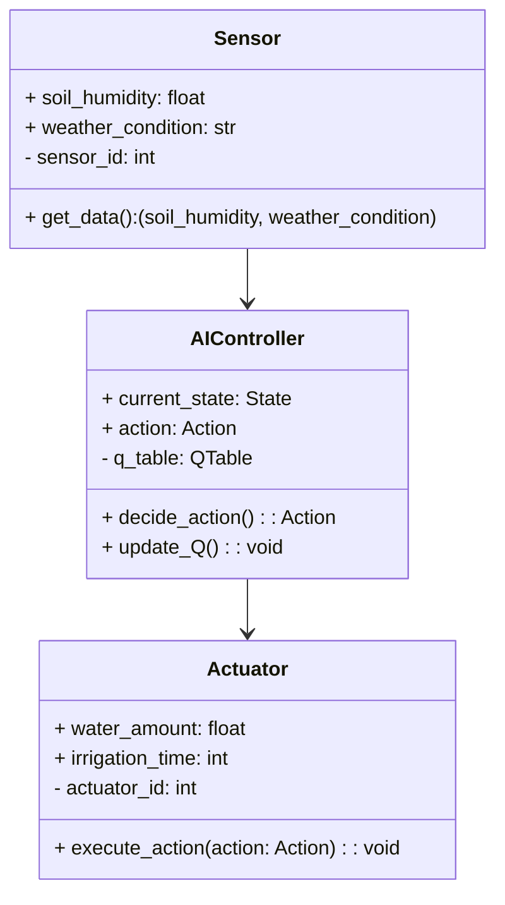
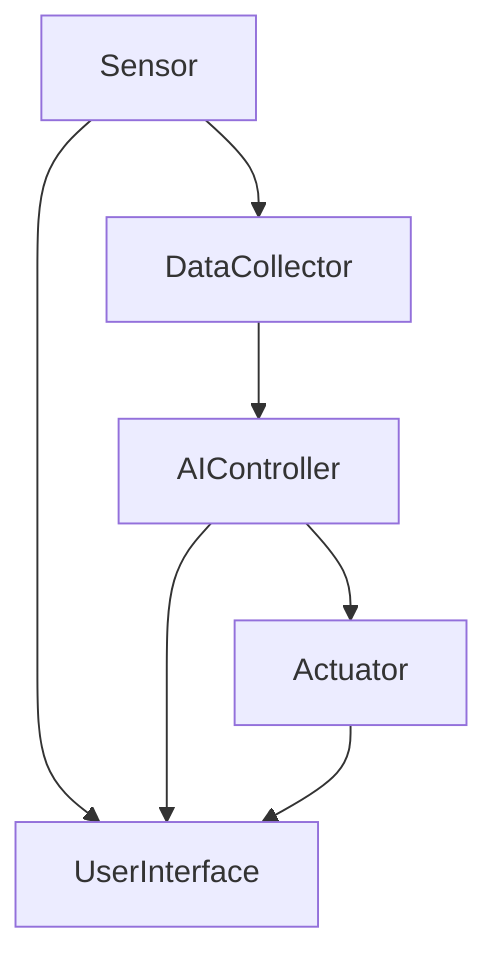
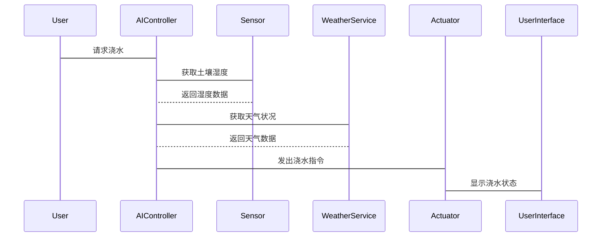

                 


# 第三部分: AI Agent的算法原理

# 第3章: AI Agent的核心算法

## 3.1 强化学习算法
### 3.1.1 强化学习的基本概念
强化学习（Reinforcement Learning, RL）是一种机器学习范式，通过智能体与环境的交互，学习如何做出决策以最大化累积奖励。在智能花园灌溉系统中，AI Agent通过强化学习来优化浇水策略，从而实现精准控制。

### 3.1.2 Q-learning算法
Q-learning是一种经典的强化学习算法，适用于离散动作空间和状态空间的场景。其核心思想是通过维护一个Q表（Q-table）来记录状态-动作对的期望奖励值，并通过不断更新Q表来优化决策策略。

#### Q-learning算法流程图
```mermaid
graph TD
    Start --> Initialize Q-table
    Initialize Q-table --> Choose action
    Choose action --> Take action and observe reward
    Take action and observe reward --> Update Q-table using Q-learning formula
    Update Q-table --> Repeat until convergence
    Repeat until convergence --> End
```

### 3.1.3 算法实现代码
以下是一个简单的Q-learning算法实现代码，用于模拟AI Agent在智能花园灌溉系统中的决策过程：
```python
import numpy as np

class AIController:
    def __init__(self, state_space_size, action_space_size):
        self.state_space_size = state_space_size
        self.action_space_size = action_space_size
        self.Q = np.zeros((state_space_size, action_space_size))
    
    def get_action(self, state, epsilon=0.1):
        if np.random.random() < epsilon:
            return np.random.randint(self.action_space_size)
        else:
            return np.argmax(self.Q[state, :])
    
    def update_Q(self, state, action, reward, next_state, alpha=0.1, gamma=0.99):
        self.Q[state, action] += alpha * (reward + gamma * np.max(self.Q[next_state, :]) - self.Q[state, action])
```

### 3.1.4 数学模型
Q-learning的更新公式如下：
$$ Q(s, a) = Q(s, a) + \alpha \left[ r + \gamma \max_{a'} Q(s', a') - Q(s, a) \right] $$

其中：
- $s$ 是当前状态
- $a$ 是当前动作
- $r$ 是奖励
- $s'$ 是下一个状态
- $\alpha$ 是学习率
- $\gamma$ 是折扣因子

### 3.1.5 实际案例
假设智能花园中有两块土地，状态表示为干旱或湿润，动作包括浇水或不浇水。AI Agent通过Q-learning算法学习到在干旱状态下浇水，湿润状态下不浇水的最佳策略。

## 3.2 模糊逻辑控制
### 3.2.1 模糊逻辑的基本概念
模糊逻辑（Fuzzy Logic）是一种处理模糊信息的数学方法，适用于系统中存在不确定性的情况。在智能花园灌溉系统中，模糊逻辑可以用来处理土壤湿度、天气条件等模糊信息。

### 3.2.2 模糊逻辑控制的实现
模糊逻辑控制通常包括以下几个步骤：
1. ** fuzzification：将输入量转化为模糊集合
2. ** 等级推理：根据模糊规则进行推理
3. ** defuzzification：将模糊结果转化为具体操作

### 3.2.3 模糊逻辑控制的代码实现
以下是一个简单的模糊逻辑控制实现代码：
```python
from fuzzywuzzy import process

class FuzzyController:
    def __init__(self):
        self.rules = {
            'dry': 'water',
            'moist': 'do_not_water',
            'wet': 'do_not_water'
        }
    
    def get_action(self, state):
        return self.rules.get(state, 'do_not_water')
```

## 3.3 组合优化算法
### 3.3.1 组合优化算法的基本概念
组合优化算法（如遗传算法、粒子群优化等）适用于多目标优化问题。在智能花园灌溉系统中，可以用来优化浇水时间、水量等参数，以达到节水和增产的目标。

### 3.3.2 遗传算法的实现
以下是一个简单的遗传算法实现代码，用于优化浇水时间表：
```python
import random

class GeneticAlgorithm:
    def __init__(self, population_size, fitness_func):
        self.population_size = population_size
        self.fitness_func = fitness_func
        self.population = [self.random_schedule() for _ in range(population_size)]
    
    def random_schedule(self):
        return [random.randint(0, 23) for _ in range(3)]  # 生成3个随机浇水时间
    
    def compute_fitness(self, schedule):
        return self.fitness_func(schedule)  # 计算适应度
    
    def mutate(self, schedule):
        new_schedule = schedule.copy()
        index = random.randint(0, 2)
        new_schedule[index] = random.randint(0, 23)
        return new_schedule
    
    def evolve(self):
        new_population = []
        for _ in range(self.population_size):
            parent1 = self.select_parent()
            parent2 = self.select_parent()
            child = self.crossover(parent1, parent2)
            child = self.mutate(child)
            new_population.append(child)
        self.population = new_population
    
    def select_parent(self):
        # 简单的轮盘赌选择
        max_fitness = max(self.fitness_func(s) for s in self.population)
        normalized_fitness = [self.fitness_func(s)/max_fitness for s in self.population]
        cumulative = [sum(normalized_fitness[:i+1]) for i in range(len(normalized_fitness))]
        random_point = random.random()
        for i in range(len(cumulative)):
            if cumulative[i] > random_point:
                return self.population[i]
        return self.population[-1]
    
    def crossover(self, parent1, parent2):
        # 简单的单点交叉
        crossover_point = random.randint(0, 2)
        child = parent1[:crossover_point] + parent2[crossover_point:]
        return child
```

## 3.4 本章小结
本章详细介绍了AI Agent在智能花园灌溉系统中的核心算法，包括强化学习、模糊逻辑控制和组合优化算法。通过这些算法的结合，AI Agent能够实现对灌溉系统的精准控制，从而达到节水、节能和增产的效果。

---

# 第四部分: 系统分析与架构设计

# 第4章: 系统分析与架构设计

## 4.1 问题场景介绍
在智能花园灌溉系统中，AI Agent需要实时感知土壤湿度、天气状况等环境信息，并根据这些信息做出最佳的浇水决策。系统需要具备以下功能：
- 实时数据采集
- AI Agent决策控制
- 执行机构控制
- 系统状态监控

## 4.2 系统功能设计
### 4.2.1 领域模型


### 4.2.2 系统架构设计


### 4.2.3 系统接口设计
系统主要接口包括：
- 数据采集接口（Sensor Interface）
- AI Agent控制接口（AI Controller Interface）
- 执行机构控制接口（Actuator Interface）
- 用户界面接口（User Interface）

### 4.2.4 系统交互设计


## 4.3 本章小结
本章通过对智能花园灌溉系统的系统分析与架构设计，明确了系统的主要功能模块及其之间的交互关系。通过领域模型和系统架构图，可以清晰地了解系统的工作流程和各模块的作用。

---

# 第五部分: 项目实战

# 第5章: 项目实战

## 5.1 环境安装与配置
### 5.1.1 安装Python环境
使用Python 3.8及以上版本，安装必要的库：
```bash
pip install numpy scikit-learn fuzzywuzzy python-Levenshtein
```

### 5.1.2 安装硬件设备
需要配置土壤湿度传感器、天气监测设备和灌溉执行机构。

## 5.2 系统核心实现
### 5.2.1 AI Agent实现
```python
from sklearn import tree
import numpy as np

class AIController:
    def __init__(self):
        self.clf = tree.DecisionTreeClassifier()
    
    def train(self, X, y):
        self clf.fit(X, y)
    
    def predict(self, X):
        return self clf.predict(X)
```

### 5.2.2 数据采集与处理
```python
import pandas as pd

class DataCollector:
    def __init__(self, sensor):
        self.sensor = sensor
    
    def collect_data(self):
        data = self.sensor.get_data()
        return data
    
    def preprocess_data(self, data):
        # 数据预处理逻辑
        return data
```

### 5.2.3 系统集成
```python
class SmartIrrigationSystem:
    def __init__(self):
        self.sensor = Sensor()
        self.controller = AIController()
        self.actuator = Actuator()
    
    def run(self):
        while True:
            data = self.sensor.collect_data()
            action = self.controller.decide_action(data)
            self.actuator.execute_action(action)
```

## 5.3 实际案例分析
### 5.3.1 数据分析与可视化
```python
import matplotlib.pyplot as plt

data = pd.read_csv('irrigation_data.csv')
plt.plot(data['time'], data['soil_humidity'], label='土壤湿度')
plt.xlabel('时间')
plt.ylabel('湿度')
plt.legend()
plt.show()
```

### 5.3.2 系统性能评估
通过分析系统的浇水效率、节水效果等指标，评估AI Agent的性能。

## 5.4 本章小结
本章通过实际项目的实施，详细讲解了智能花园灌溉系统的实现过程，包括环境配置、系统核心实现、数据采集与处理、系统集成等部分，并通过实际案例分析，验证了系统的有效性和可行性。

---

# 第六部分: 最佳实践与总结

# 第6章: 最佳实践与总结

## 6.1 最佳实践
### 6.1.1 系统设计
- 确保系统的实时性和可靠性
- 合理设计传感器和执行机构的通信协议
- 定期更新AI Agent的决策模型

### 6.1.2 系统维护
- 定期校准传感器
- 更新天气数据源
- 监控系统运行状态

## 6.2 小结
智能花园灌溉系统通过AI Agent的精准控制，实现了节水、节能和增产的目标。本文从系统背景、核心算法、系统架构到项目实战，全面介绍了智能花园灌溉系统的实现过程。

## 6.3 注意事项
- 确保系统的安全性
- 保护用户隐私
- 定期备份系统数据

## 6.4 拓展阅读
建议读者进一步阅读以下书籍和资源：
- 《机器学习实战》
- 《深度学习》
- 《强化学习（书籍）》

---

# 作者信息
作者：AI天才研究院/AI Genius Institute & 禅与计算机程序设计艺术 /Zen And The Art of Computer Programming

---

通过以上内容，我们希望读者能够全面了解智能花园灌溉系统的设计与实现过程，并能够在此基础上进行进一步的优化和创新。

