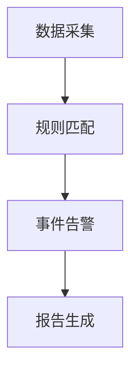
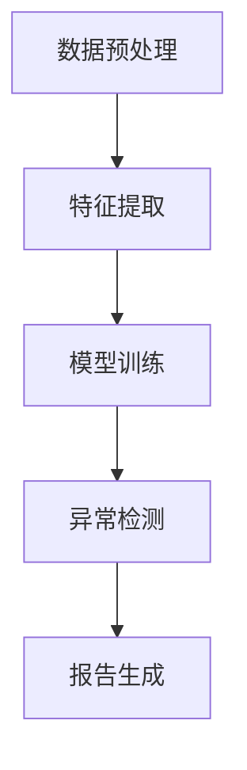
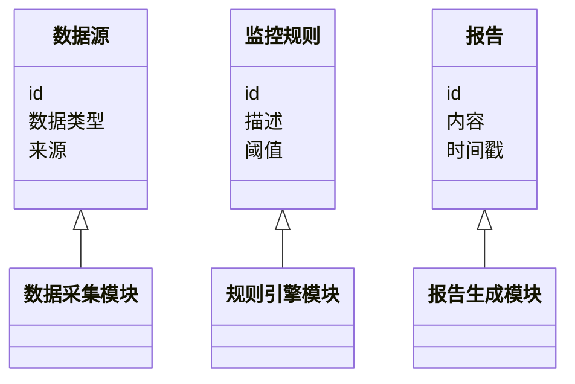
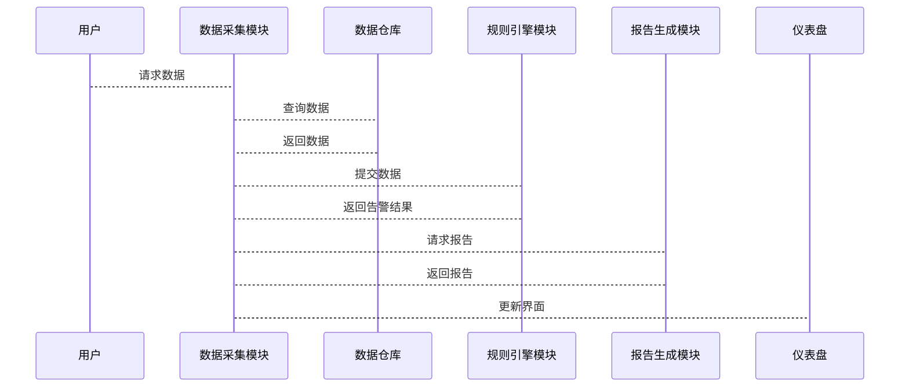

                 


# 构建智能企业合规管理平台：自动化监控与报告

> 关键词：企业合规管理、自动化监控、智能报告、数据隐私、算法原理

> 摘要：本文详细探讨了构建智能企业合规管理平台的必要性、核心概念、算法原理、系统架构设计及项目实战。通过分析企业合规管理的挑战与痛点，提出了基于自动化监控和智能报告的解决方案，并通过实际案例展示了平台的实现过程和应用场景。

---

# 第一部分: 企业合规管理平台背景与核心概念

## 第1章: 企业合规管理平台的背景与问题背景

### 1.1 问题背景

#### 1.1.1 企业合规管理的重要性
企业合规管理是指确保企业在经营过程中遵守相关法律法规、行业标准和企业内部规章制度的管理活动。随着全球化和数字化的快速发展，企业的合规管理变得越来越复杂，尤其是在数据隐私、反腐败、环境保护等领域，合规管理已成为企业生存和发展的关键因素。

#### 1.1.2 问题描述
传统的企业合规管理主要依赖人工检查和手动报告，这种方式效率低、成本高，且容易出现疏漏。特别是在数据量大、业务复杂的情况下，人工管理难以满足实时性和准确性要求。此外，不同地区的法律法规差异也增加了合规管理的难度。

#### 1.1.3 自动化监控与报告的需求
为了应对上述挑战，企业需要一种自动化、智能化的合规管理平台，能够实时监控业务活动，自动识别潜在风险，并生成动态报告。这种平台不仅可以提高效率，还能降低合规管理的成本。

### 1.2 问题解决

#### 1.2.1 自动化监控的解决方案
通过引入自动化技术，合规管理平台可以实时监控企业的各项业务活动，包括数据流、交易记录、员工行为等。自动化监控可以快速识别潜在的合规风险，并及时发出预警。

#### 1.2.2 智能报告生成的实现路径
基于机器学习和自然语言处理技术，合规管理平台可以自动生成符合要求的合规报告，包括风险评估、问题分析、改进建议等内容。智能报告不仅可以提高报告的准确性和及时性，还能帮助企业更好地应对监管要求。

#### 1.2.3 平台架构的设计思路
合规管理平台的架构设计需要考虑数据源的多样性、监控规则的复杂性以及报告生成的灵活性。通过模块化设计，平台可以实现数据采集、规则引擎、智能分析和报告生成等功能的有机结合。

### 1.3 边界与外延

#### 1.3.1 平台的功能边界
合规管理平台的核心功能包括数据采集、风险监控、报告生成等，但不包括企业的核心业务系统和外部监管机构的直接交互。

#### 1.3.2 平台的适用范围
合规管理平台适用于所有需要遵守法律法规的企业，尤其是那些业务复杂、数据量大、监管要求高的行业，如金融、医疗、能源等。

#### 1.3.3 平台与其他系统的交互关系
合规管理平台需要与企业的业务系统、数据源、第三方服务等进行交互。通过API接口或数据对接，平台可以获取必要的数据并输出监控结果。

### 1.4 核心要素组成

#### 1.4.1 数据源的多样性
合规管理平台需要处理多种类型的数据，包括结构化数据（如数据库表）、非结构化数据（如文本文件）和实时流数据。

#### 1.4.2 监控规则的复杂性
合规管理平台需要支持多种监控规则，包括基于阈值的监控、基于模式的监控和基于机器学习的智能监控。

#### 1.4.3 报告生成的灵活性
合规管理平台需要能够根据用户需求生成不同格式、不同内容的报告，包括定制化的仪表盘和动态更新的报告。

---

## 第2章: 企业合规管理平台的核心概念与联系

### 2.1 核心概念原理

#### 2.1.1 合规管理的核心要素
合规管理的核心要素包括法律法规、行业标准、企业政策、监控数据和报告输出。这些要素相互关联，共同构成了合规管理的完整体系。

#### 2.1.2 自动化监控的实现机制
自动化监控通过实时数据采集、规则匹配和事件告警，实现对业务活动的动态监控。自动化监控不仅可以提高效率，还能减少人为错误。

#### 2.1.3 智能报告生成的算法原理
智能报告生成基于机器学习算法，通过对历史数据的分析，生成符合监管要求的报告。算法原理包括数据预处理、模型训练和结果解释。

### 2.2 概念属性特征对比表格

| 概念       | 属性1（实时性） | 属性2（多样性） | 属性3（准确性） |
|------------|-----------------|-----------------|-----------------|
| 数据源     | 高              | 高              | 中              |
| 监控规则   | 中              | 高              | 高              |
| 报告生成   | 高              | 中              | 高              |

### 2.3 ER实体关系图架构

```mermaid
erDiagram
    customer[客户] {
        +int id
        +string name
        +string email
    }
    transaction[交易] {
        +int id
        +float amount
        +datetime timestamp
    }
    rule[监控规则] {
        +int id
        +string description
        +float threshold
    }
    report[报告] {
        +int id
        +string content
        +datetime generated_time
    }
    customer --> transaction : 发起
    transaction --> rule : 符合
    rule --> report : 生成
```

---

## 第3章: 合规管理平台的算法原理

### 3.1 算法原理概述

合规管理平台的核心算法包括基于规则的监控算法和基于机器学习的智能监控算法。基于规则的算法适用于已知的合规规则，而基于机器学习的算法适用于复杂场景下的异常检测。

### 3.2 基于规则的监控算法



#### 3.2.1 算法步骤
1. 数据采集：从数据源获取实时数据。
2. 规则匹配：将数据与预定义的监控规则进行匹配。
3. 事件告警：当数据匹配到监控规则时，触发告警。
4. 报告生成：生成告警报告并发送给相关人员。

#### 3.2.2 代码实现
```python
import pandas as pd
from datetime import datetime

# 数据采集
data = pd.read_csv('transactions.csv')

# 规则匹配
threshold = 10000
alarms = data[data['amount'] > threshold]

# 事件告警
if not alarms.empty:
    print(f"检测到异常交易，金额超过阈值{threshold}。")
    alarms.to_csv('alarms.csv', index=False)

# 报告生成
report = pd.DataFrame({
    'timestamp': [datetime.now()],
    'status': ['告警']
})
report.to_csv('report.csv', index=False)
```

### 3.3 基于机器学习的智能监控算法



#### 3.3.1 算法步骤
1. 数据预处理：清洗数据，处理缺失值和异常值。
2. 特征提取：提取与合规监控相关的特征，如交易金额、交易时间、交易地点等。
3. 模型训练：使用机器学习算法（如随机森林、支持向量机）训练分类模型。
4. 异常检测：利用训练好的模型对实时数据进行分类，识别异常交易。
5. 报告生成：生成异常检测报告并发送给相关人员。

#### 3.3.2 数学模型与公式

分类模型的损失函数可以表示为：
$$
L = -\frac{1}{n}\sum_{i=1}^{n} [y_i \log p_i + (1 - y_i) \log (1 - p_i)]
$$

其中，$y_i$ 是真实标签，$p_i$ 是模型预测的概率。

---

## 第4章: 系统分析与架构设计

### 4.1 问题场景介绍

合规管理平台需要处理多种数据源，支持多种监控规则，并能够实时生成动态报告。为了实现这一目标，平台需要一个高效、灵活的架构设计。

### 4.2 系统功能设计

#### 4.2.1 领域模型类图



### 4.3 系统架构设计

#### 4.3.1 系统架构图

```mermaid
subgraph 数据层
    数据源
    数据仓库
end

subgraph 业务层
    数据采集模块
    规则引擎模块
    报告生成模块
end

subgraph 展示层
    仪表盘
end

数据源 --> 数据仓库
数据仓库 --> 数据采集模块
数据采集模块 --> 规则引擎模块
规则引擎模块 --> 报告生成模块
报告生成模块 --> 仪表盘
```

#### 4.3.2 系统接口设计

系统接口设计包括数据源接口、规则引擎接口和报告生成接口。每个接口都需要定义输入和输出格式，以及调用方式。

#### 4.3.3 系统交互序列图



---

## 第5章: 项目实战

### 5.1 环境安装

为了运行合规管理平台，需要安装以下环境：

1. Python 3.8+
2. Jupyter Notebook
3. Pandas、NumPy、Scikit-learn 等库

### 5.2 核心代码实现

#### 5.2.1 数据采集模块

```python
import pandas as pd
from datetime import datetime

def采集数据():
    data = pd.read_csv('transactions.csv')
    return data

if __name__ == '__main__':
    data = 采集数据()
    print(data.head())
```

#### 5.2.2 规则引擎模块

```python
def检测异常交易(data, 阈值):
    alarms = data[data['amount'] > 阈值]
    return alarms

if __name__ == '__main__':
    data = pd.read_csv('transactions.csv')
    阈值 = 10000
    alarms = 检测异常交易(data, 阈值)
    if not alarms.empty:
        alarms.to_csv('alarms.csv', index=False)
```

#### 5.2.3 报告生成模块

```python
def生成报告(alarms):
    report = pd.DataFrame({
        'timestamp': [datetime.now()],
        'status': ['告警']
    })
    report.to_csv('report.csv', index=False)
    return report

if __name__ == '__main__':
    data = pd.read_csv('transactions.csv')
    阈值 = 10000
    alarms = 检测异常交易(data, 阈值)
    if not alarms.empty:
        生成报告(alarms)
```

### 5.3 实际案例分析

#### 5.3.1 案例背景
某金融公司每天处理数万笔交易，需要实时监控交易金额是否超过一定阈值。

#### 5.3.2 数据分析
通过数据采集模块获取交易数据，使用规则引擎模块检测异常交易，最后生成报告。

#### 5.3.3 代码实现
```python
import pandas as pd
from datetime import datetime

def采集数据():
    data = pd.read_csv('transactions.csv')
    return data

def检测异常交易(data, 阈值):
    alarms = data[data['amount'] > 阈值]
    return alarms

def生成报告(alarms):
    report = pd.DataFrame({
        'timestamp': [datetime.now()],
        'status': ['告警']
    })
    report.to_csv('report.csv', index=False)
    return report

if __name__ == '__main__':
    data = 采集数据()
    阈值 = 10000
    alarms = 检测异常交易(data, 阈值)
    if not alarms.empty:
        生成报告(alarms)
        print("检测到异常交易，报告已生成。")
```

---

## 第6章: 最佳实践与小结

### 6.1 小结

本文详细探讨了构建智能企业合规管理平台的必要性、核心概念、算法原理、系统架构设计及项目实战。通过自动化监控和智能报告生成，企业可以更高效地进行合规管理，降低合规风险。

### 6.2 注意事项

1. 数据隐私和安全是合规管理的重要组成部分，需要特别注意。
2. 系统架构设计需要充分考虑扩展性和可维护性。
3. 机器学习模型需要定期更新和优化，以保证准确性。

### 6.3 拓展阅读

1. 《企业合规管理：理论与实践》
2. 《机器学习在金融领域的应用》
3. 《数据隐私保护与合规管理》

---

作者：AI天才研究院/AI Genius Institute & 禅与计算机程序设计艺术 /Zen And The Art of Computer Programming

