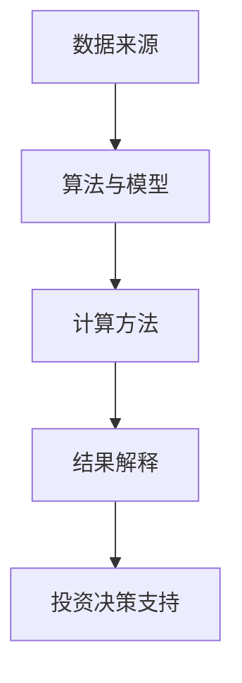
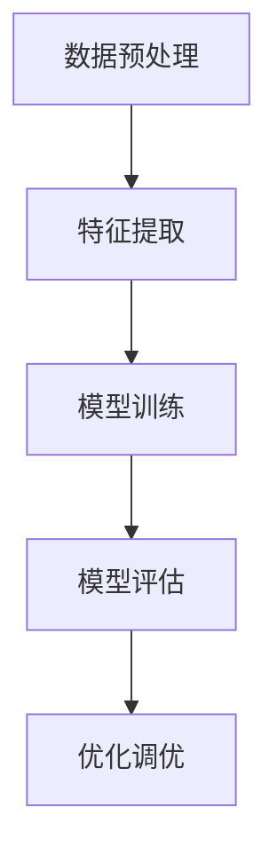
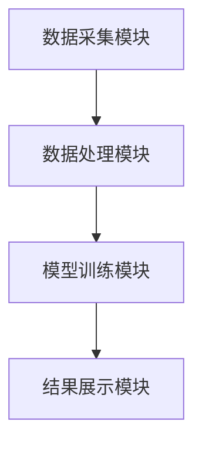
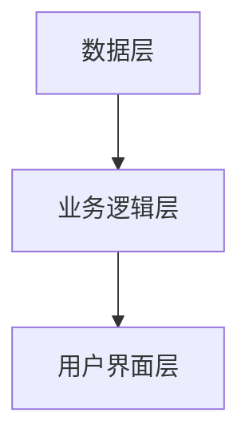
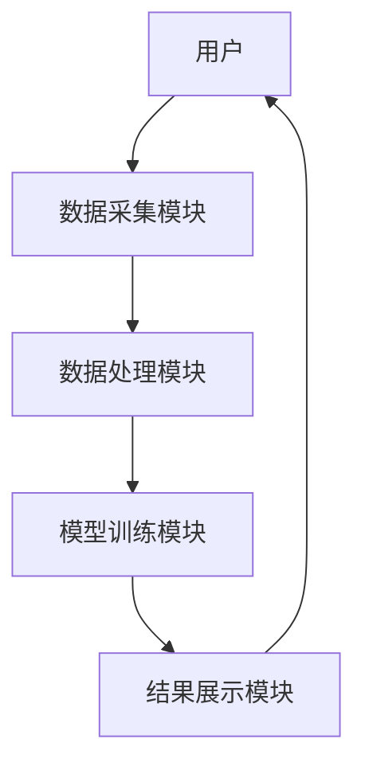

                 


# 金融市场情绪指标开发与应用

> 关键词：金融市场情绪指标、情绪分析、技术分析、自然语言处理、机器学习、量化交易

> 摘要：金融市场情绪指标是量化交易和投资决策中的重要工具，用于衡量市场参与者的心理状态和市场情绪。本文从情绪指标的背景与概念出发，详细分析了情绪指标的开发过程，包括数据采集与处理、算法开发与实现、系统架构设计等核心环节，并通过实际案例展示了情绪指标在金融市场中的应用。最后，本文总结了情绪指标开发与应用的关键点，并提出了未来的研究方向。

---

# 第一部分: 金融市场情绪指标开发与应用概述

# 第1章: 金融市场情绪指标的背景与概念

## 1.1 金融市场情绪指标的定义与背景

金融市场情绪指标（Market Sentiment Indicators）是用来量化和分析金融市场参与者心理状态的工具。它通过捕捉市场参与者的交易行为、言论和市场数据，评估市场的乐观或悲观情绪，从而为投资决策提供参考。

### 1.1.1 什么是金融市场情绪指标

金融市场情绪指标是一种量化工具，通过分析市场参与者的行为、言论和市场数据，衡量市场的乐观或悲观情绪。它可以表现为一个数值、一个指数或一个指标。

### 1.1.2 情绪指标在金融市场的应用背景

金融市场情绪指标的应用背景主要集中在以下几个方面：
1. **投资决策支持**：投资者可以通过情绪指标了解市场的整体情绪，从而做出更明智的投资决策。
2. **风险管理和对冲**：情绪指标可以帮助投资者识别市场情绪的极端情况，从而提前采取风险管理措施。
3. **量化交易策略**：情绪指标可以作为量化交易策略的一部分，帮助算法交易模型捕捉市场情绪的变化。

### 1.1.3 情绪指标的核心作用与意义

情绪指标的核心作用在于：
- **捕捉市场情绪**：通过分析市场参与者的行为和言论，量化市场的乐观或悲观情绪。
- **预测市场趋势**：情绪指标可以作为预测市场短期趋势的重要参考。
- **辅助投资决策**：情绪指标为投资者提供了一个衡量市场情绪的工具，帮助投资者做出更合理的投资决策。

---

## 1.2 情绪指标的分类与特点

### 1.2.1 基于技术分析的情绪指标

基于技术分析的情绪指标主要通过分析市场数据（如价格、成交量等）来衡量市场情绪。例如：
- **相对强弱指数（RSI）**：衡量市场的超买或超卖状态。
- **移动平均收敛散度（MACD）**：反映市场的短期和长期趋势。

### 1.2.2 基于新闻和社交媒体的情绪指标

基于新闻和社交媒体的情绪指标通过分析市场参与者在社交媒体、新闻平台上的言论来衡量市场情绪。例如：
- **Twitter情绪分析**：通过分析Twitter上的关键词和情绪词，计算市场的乐观或悲观情绪。
- **新闻标题情绪分析**：通过分析新闻标题的关键词，判断市场的整体情绪。

### 1.2.3 基于市场参与者行为的情绪指标

基于市场参与者行为的情绪指标主要通过分析交易者的具体行为（如交易量、订单流等）来衡量市场情绪。例如：
- **订单流分析**：通过分析订单流的买卖力量，判断市场的买卖情绪。
- **市场深度分析**：通过分析订单簿的深度，判断市场的买卖力量。

---

## 1.3 情绪指标的开发目标与边界

### 1.3.1 情绪指标的开发目标

情绪指标的开发目标是：
- 提供一个量化工具，衡量市场的乐观或悲观情绪。
- 为投资者提供一个参考工具，帮助其做出更明智的投资决策。

### 1.3.2 情绪指标的边界与限制

情绪指标的开发和应用也存在一些边界和限制：
- **数据来源的局限性**：情绪指标的准确性依赖于数据来源的质量和完整性。
- **模型的局限性**：情绪指标的预测能力依赖于模型的准确性，而模型可能无法捕捉市场的所有信息。
- **市场的非理性**：情绪指标只能捕捉市场的部分信息，无法完全反映市场的复杂性。

### 1.3.3 情绪指标的适用场景与外延

情绪指标的适用场景包括：
- **量化交易策略**：情绪指标可以作为量化交易策略的一部分，帮助交易模型捕捉市场情绪的变化。
- **风险管理和对冲**：情绪指标可以帮助投资者识别市场情绪的极端情况，从而提前采取风险管理措施。
- **投资决策支持**：情绪指标为投资者提供了一个衡量市场情绪的工具，帮助其做出更合理的投资决策。

---

## 1.4 情绪指标的核心要素与概念结构

### 1.4.1 情绪指标的核心要素分析

情绪指标的核心要素包括：
1. **数据来源**：情绪指标需要依赖高质量的数据源，如市场数据、社交媒体数据等。
2. **算法与模型**：情绪指标的开发需要依赖有效的算法和模型，如自然语言处理、机器学习等。
3. **计算方法**：情绪指标需要通过特定的计算方法，将数据转化为可量化的指标。
4. **结果解释**：情绪指标的结果需要能够被投资者理解和应用，帮助其做出投资决策。

### 1.4.2 情绪指标的概念结构图

以下是一个情绪指标的概念结构图：



### 1.4.3 情绪指标与其他金融指标的关系

情绪指标与其他金融指标的关系可以分为以下几类：
1. **互补关系**：情绪指标可以与其他技术指标结合使用，提供更全面的市场分析。
2. **替代关系**：在某些情况下，情绪指标可以替代传统技术指标，提供新的视角。

---

## 1.5 本章小结

本章从情绪指标的背景与概念出发，详细分析了情绪指标的定义、分类、特点、开发目标、边界以及与其他金融指标的关系。通过这些分析，我们可以更好地理解情绪指标在金融市场中的作用和意义。

---

# 第二部分: 情绪指标的数据采集与处理

# 第2章: 金融市场情绪数据的采集方法

## 2.1 情绪数据的来源与分类

### 2.1.1 传统金融数据的来源

传统金融数据的来源包括：
1. **交易所数据**：如股票价格、成交量等。
2. **市场数据提供商**：如 Bloomberg、Reuters 等。
3. **政府和监管机构数据**：如 SEC 的公告和报告。

### 2.1.2 社交媒体与新闻数据的来源

社交媒体与新闻数据的来源包括：
1. **社交媒体平台**：如 Twitter、LinkedIn、Reddit 等。
2. **新闻网站**：如 CNBC、Financial Times 等。
3. **新闻 aggregator**：如 Google News、Yahoo News 等。

### 2.1.3 市场参与者行为数据的来源

市场参与者行为数据的来源包括：
1. **订单流数据**：如高频交易数据、订单簿数据等。
2. **交易者行为数据**：如投资者的交易记录、持仓数据等。

---

## 2.2 情绪数据的特征与处理

### 2.2.1 情绪数据的特征分析

情绪数据的特征包括：
1. **非结构化**：如社交媒体文本、新闻标题等。
2. **实时性**：情绪数据需要及时更新，以反映市场的最新动态。
3. **多样性**：情绪数据可以来自多种来源，包括文本、数值等。

### 2.2.2 数据清洗与预处理方法

数据清洗与预处理的方法包括：
1. **去重**：去除重复的数据。
2. **去噪**：去除噪声数据，如无关信息。
3. **标准化**：将数据标准化为统一的格式。

### 2.2.3 数据标准化与格式化处理

数据标准化与格式化处理的方法包括：
1. **数据格式转换**：将数据转换为适合算法处理的格式。
2. **数据归一化**：将数据归一化到一个统一的范围内。
3. **数据分片**：将数据分片存储，便于后续处理。

---

## 2.3 情绪数据的存储与管理

### 2.3.1 数据库设计与存储方案

数据库设计与存储方案包括：
1. **关系型数据库**：如 MySQL、PostgreSQL 等。
2. **非关系型数据库**：如 MongoDB、Redis 等。

### 2.3.2 数据文件的组织与管理

数据文件的组织与管理方法包括：
1. **文件分片**：将数据文件分片存储，便于管理和查询。
2. **文件压缩**：对数据文件进行压缩，减少存储空间占用。
3. **版本控制**：对数据文件进行版本控制，记录数据的变化历史。

### 2.3.3 数据版本控制与更新机制

数据版本控制与更新机制包括：
1. **版本控制工具**：如 Git 等。
2. **自动化更新**：通过脚本实现数据的自动更新。

---

## 2.4 本章小结

本章详细分析了情绪数据的来源、特征、处理方法以及存储与管理方案。通过这些分析，我们可以更好地理解情绪数据的采集与处理过程，为后续的情绪指标开发奠定基础。

---

# 第三部分: 情绪指标的算法开发与实现

# 第3章: 情绪指标的算法原理

## 3.1 情绪指标的核心算法概述

### 3.1.1 基于统计学的情绪分析算法

基于统计学的情绪分析算法包括：
1. **情感词典方法**：通过构建情感词典，对文本进行情感分类。
2. **情感强度计算**：通过统计情感词的出现频率，计算情感强度。

### 3.1.2 基于机器学习的情绪分析算法

基于机器学习的情绪分析算法包括：
1. **支持向量机（SVM）**：通过训练数据，对文本进行情感分类。
2. **随机森林（Random Forest）**：通过集成学习，对文本进行情感分类。

### 3.1.3 基于自然语言处理的情绪分析算法

基于自然语言处理的情绪分析算法包括：
1. **词袋模型（Bag of Words）**：通过词袋模型，对文本进行情感分类。
2. **词嵌入模型（Word Embedding）**：如 Word2Vec、GloVe 等。

---

## 3.2 情绪指标的算法实现步骤

### 3.2.1 数据预处理与特征提取

数据预处理与特征提取的步骤包括：
1. **文本清洗**：去除停用词、标点符号等。
2. **特征提取**：提取文本中的关键词、情感词等。

### 3.2.2 模型训练与参数调优

模型训练与参数调优的步骤包括：
1. **选择算法**：选择合适的算法，如 SVM、随机森林等。
2. **训练模型**：对训练数据进行模型训练。
3. **参数调优**：通过交叉验证，优化模型的参数。

### 3.2.3 模型评估与优化

模型评估与优化的步骤包括：
1. **评估指标**：如准确率、召回率、F1值等。
2. **优化模型**：通过调整模型结构或参数，优化模型性能。

---

## 3.3 情绪指标的数学模型与公式

### 3.3.1 情绪强度计算公式

情绪强度计算公式：
$$ \text{情绪强度} = \frac{\sum_{i=1}^{n} w_i \cdot s_i}{\sum_{i=1}^{n} w_i} $$

其中：
- \( w_i \) 是第 \( i \) 个情感词的权重。
- \( s_i \) 是第 \( i \) 个情感词的情感值（如正数为积极，负数为消极）。

### 3.3.2 情绪趋势计算公式

情绪趋势计算公式：
$$ \text{情绪趋势} = \frac{d}{dt}(\text{情绪强度}) $$

---

## 3.4 情绪指标的算法流程图

以下是一个情绪指标的算法流程图：



---

## 3.5 情绪指标的代码实现

以下是一个基于情感词典的情绪分析算法的代码示例：

```python
import pandas as pd
from sklearn.svm import SVC
from sklearn.metrics import accuracy_score

# 数据预处理
def preprocess(text):
    # 去除标点符号
    text = text.replace(r'[^\w\s]', '')
    return text

# 特征提取
def extract_features(text):
    features = []
    for word in text.split():
        if word in情感词典:
            features.append(1)
        else:
            features.append(0)
    return features

# 模型训练
model = SVC()

# 数据加载与训练
data = pd.read_csv('data.csv')
X = data['text'].apply(preprocess).apply(extract_features)
y = data['label']
model.fit(X, y)

# 模型评估
预测 = model.predict(X)
准确率 = accuracy_score(y, 预测)
print(准确率)
```

---

## 3.6 本章小结

本章详细分析了情绪指标的算法原理，包括基于统计学、机器学习和自然语言处理的情绪分析算法。通过这些分析，我们可以更好地理解情绪指标的开发过程，并为后续的系统架构设计奠定基础。

---

# 第四部分: 情绪指标的系统架构与实现

# 第4章: 情绪指标的系统架构设计

## 4.1 情绪指标的系统功能设计

情绪指标的系统功能设计包括：
1. **数据采集模块**：负责采集市场数据、社交媒体数据等。
2. **数据处理模块**：负责对采集的数据进行清洗、预处理和特征提取。
3. **模型训练模块**：负责训练情感分析模型，并生成情绪指标。
4. **结果展示模块**：负责展示情绪指标的结果，并提供投资决策支持。

### 4.1.1 系统功能模块的实体关系图

以下是一个系统功能模块的实体关系图：



---

## 4.2 情绪指标的系统架构设计

### 4.2.1 系统架构设计

情绪指标的系统架构设计包括：
1. **数据层**：负责数据的存储和管理。
2. **业务逻辑层**：负责系统的业务逻辑处理。
3. **用户界面层**：负责系统的用户交互。

### 4.2.2 系统架构图

以下是一个系统架构图：



---

## 4.3 情绪指标的接口设计

### 4.3.1 数据接口

数据接口包括：
1. **数据采集接口**：负责采集市场数据、社交媒体数据等。
2. **数据存储接口**：负责数据的存储和管理。

### 4.3.2 模型接口

模型接口包括：
1. **模型训练接口**：负责训练情感分析模型。
2. **模型预测接口**：负责生成情绪指标。

---

## 4.4 情绪指标的交互设计

### 4.4.1 系统交互流程图

以下是一个系统交互流程图：



---

## 4.5 本章小结

本章详细分析了情绪指标的系统架构设计，包括系统的功能模块、架构设计、接口设计和交互设计。通过这些分析，我们可以更好地理解情绪指标的系统实现过程。

---

# 第五部分: 情绪指标的项目实战与优化

# 第5章: 情绪指标的项目实战

## 5.1 情绪指标的环境安装与配置

### 5.1.1 环境安装

情绪指标的环境安装包括：
1. **Python 环境**：安装 Python 和 pip。
2. **依赖库安装**：安装所需的依赖库，如 pandas、scikit-learn、requests 等。

### 5.1.2 数据源配置

数据源配置包括：
1. **市场数据接口**：配置市场数据接口，如 Yahoo Finance API。
2. **社交媒体数据接口**：配置社交媒体数据接口，如 Twitter API。

---

## 5.2 情绪指标的核心实现

### 5.2.1 数据采集实现

数据采集实现的代码示例：

```python
import requests

# 从 Yahoo Finance 获取市场数据
def get_market_data(ticker):
    url = f'https://query1.finance.yahoo.com/v8/finance/chart/{ticker}'
    response = requests.get(url)
    data = response.json()
    return data['chart']['result'][0]['indicators']['quote'][0]

# 从 Twitter 获取情感数据
def get_twitter_data(query):
    url = f'https://api.twitter.com/2/tweets/search/recent?query={query}'
    headers = {'Authorization': 'Bearer your_token'}
    response = requests.get(url, headers=headers)
    data = response.json()
    return data['tweets']
```

### 5.2.2 情绪指标计算实现

情绪指标计算实现的代码示例：

```python
import pandas as pd
from sklearn.svm import SVC

# 数据预处理
def preprocess(text):
    text = text.replace(r'[^\w\s]', '')
    return text

# 特征提取
def extract_features(text):
    features = []
    for word in text.split():
        if word in情感词典:
            features.append(1)
        else:
            features.append(0)
    return features

# 情绪指标计算
def compute_sentiment(ticker):
    market_data = get_market_data(ticker)
    twitter_data = get_twitter_data(ticker)
    X = [preprocess(text) for text in twitter_data]
    X_features = [extract_features(text) for text in X]
    model = SVC()
    model.fit(X_features, market_data['label'])
    sentiment = model.predict(X_features)
    return sentiment
```

---

## 5.3 情绪指标的案例分析与解读

### 5.3.1 案例分析

以下是一个情绪指标的案例分析：

假设我们使用 Twitter 数据和市场数据来计算某只股票的情绪指标。我们首先从 Twitter 获取相关的 tweet 数据，并从 Yahoo Finance 获取该股票的市场数据。然后，我们对 tweet 数据进行预处理和特征提取，并使用 SVM 模型训练情绪分析模型。最后，我们计算该股票的情绪指标，并将其与市场数据进行对比。

### 5.3.2 案例解读

通过案例分析，我们可以发现情绪指标在实际应用中的有效性和局限性。例如，情绪指标可以帮助我们捕捉市场的乐观或悲观情绪，但无法完全预测市场的短期波动。

---

## 5.4 本章小结

本章通过实际案例展示了情绪指标的开发与应用过程，包括环境安装、核心实现和案例分析。通过这些分析，我们可以更好地理解情绪指标的实际应用价值。

---

# 第六部分: 情绪指标的优化与展望

# 第6章: 情绪指标的优化与展望

## 6.1 情绪指标的优化方向

### 6.1.1 数据源的扩展

数据源的扩展包括：
1. **多源数据融合**：结合市场数据、社交媒体数据和新闻数据，提高情绪指标的准确性。
2. **实时数据处理**：通过实时数据处理，提高情绪指标的实时性。

### 6.1.2 算法的优化

算法的优化包括：
1. **模型优化**：通过优化算法结构和参数，提高情绪分析的准确率。
2. **算法创新**：探索新的算法，如深度学习模型，提高情绪分析的效果。

### 6.1.3 系统架构的优化

系统架构的优化包括：
1. **性能优化**：通过优化系统架构，提高系统的运行效率。
2. **可扩展性优化**：通过设计可扩展的系统架构，提高系统的可扩展性。

---

## 6.2 情绪指标的未来发展与展望

### 6.2.1 情绪指标的未来发展方向

情绪指标的未来发展方向包括：
1. **多模态情绪分析**：结合文本、图像等多种模态数据，进行情绪分析。
2. **实时情绪监控**：通过实时数据处理，实现对市场情绪的实时监控。
3. **个性化情绪分析**：针对不同的投资者，提供个性化的市场情绪分析。

### 6.2.2 情绪指标的技术挑战与解决方案

情绪指标的技术挑战包括：
1. **数据质量问题**：如何获取高质量的数据源。
2. **算法性能问题**：如何提高情绪分析算法的准确率和效率。
3. **系统可扩展性问题**：如何设计可扩展的系统架构。

---

## 6.3 本章小结

本章详细分析了情绪指标的优化方向和未来发展，指出了情绪指标在实际应用中的技术挑战，并提出了相应的解决方案。通过这些分析，我们可以更好地理解情绪指标的未来发展路径。

---

# 作者：AI天才研究院/AI Genius Institute & 禅与计算机程序设计艺术 /Zen And The Art of Computer Programming

