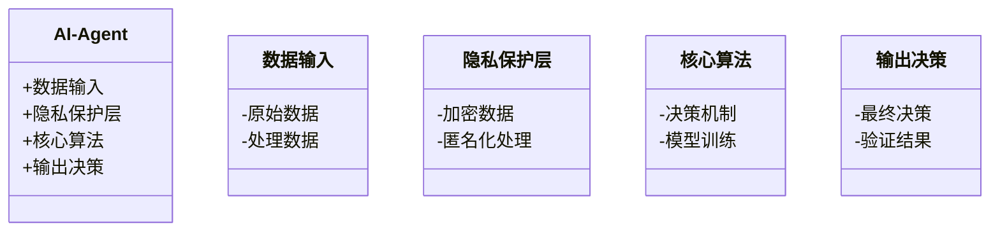
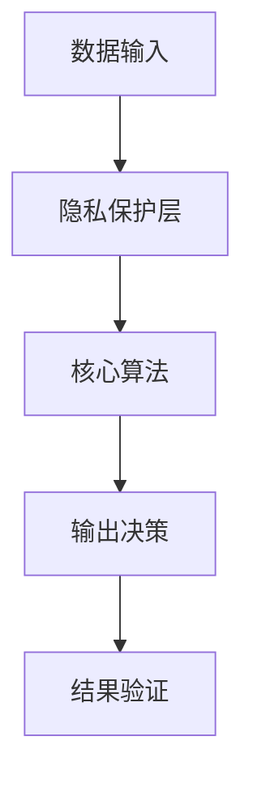
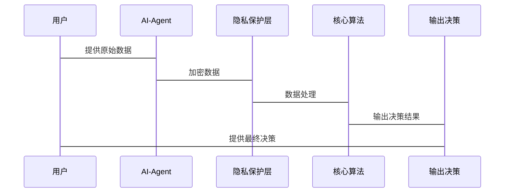

                 


# 隐私保护型AI Agent：安全与功能的平衡

> **关键词**：隐私保护、AI Agent、安全与功能平衡、联邦学习、数据加密、系统架构设计、最佳实践

> **摘要**：随着人工智能技术的快速发展，AI Agent（智能代理）在各个领域的应用越来越广泛。然而，在功能强大背后，隐私保护问题日益突出。本文从隐私保护型AI Agent的核心概念出发，深入分析其算法原理，探讨系统架构设计，并结合实际案例进行详细讲解，旨在平衡隐私保护与功能需求。

---

## 第1章: 隐私保护型AI Agent的背景介绍

### 1.1 问题背景与描述

#### 1.1.1 AI Agent的基本概念

AI Agent是一种能够感知环境、自主决策并执行任务的智能实体。它可以是一个软件程序、一个机器人，甚至是一个虚拟助手。AI Agent的核心功能包括数据感知、信息处理、决策制定和执行行动。

在现代应用场景中，AI Agent通常需要处理大量敏感数据，例如用户的地理位置、行为习惯、健康信息等。这些数据的处理和存储过程中，隐私保护成为一个关键问题。

#### 1.1.2 隐私保护的需求与挑战

随着数据泄露事件的频发，用户对隐私保护的需求日益增强。AI Agent的设计必须在功能实现的同时，确保数据的机密性、完整性和可用性。然而，隐私保护与功能需求之间常常存在矛盾，例如：

- **数据共享与隐私保护**：AI Agent需要通过数据共享来提高准确性，但数据共享可能带来隐私泄露风险。
- **模型训练与数据隐私**：在分布式系统中，模型训练需要聚合数据，但如何在不暴露原始数据的情况下完成训练是一个挑战。
- **用户信任与功能实现**：用户可能因隐私风险而拒绝授权，导致AI Agent无法实现预期功能。

#### 1.1.3 当前AI Agent应用中的隐私问题

当前，AI Agent在医疗、金融、教育、交通等领域得到了广泛应用，但隐私保护问题也逐渐暴露：

- **医疗领域**：AI Agent可能处理患者的健康数据，若被滥用或泄露，可能导致患者隐私受损。
- **金融领域**：AI Agent可能处理用户的财务信息，数据泄露可能引发金融诈骗。
- **教育领域**：AI Agent可能收集学生的学习数据，用于个性化教学，但也可能被滥用。

### 1.2 问题解决与边界

#### 1.2.1 隐私保护型AI Agent的目标

隐私保护型AI Agent的目标是在满足功能需求的前提下，最大限度地保护用户隐私。具体目标包括：

1. **数据最小化**：仅收集实现功能所需的最小数据。
2. **数据加密**：对敏感数据进行加密存储和传输。
3. **匿名化处理**：通过数据匿名化技术，减少数据关联性。
4. **可解释性**：确保用户能够理解AI Agent的决策过程。

#### 1.2.2 解决方案的边界与外延

隐私保护型AI Agent的解决方案需要明确边界：

- **数据范围**：明确哪些数据需要保护，哪些数据可以共享。
- **功能范围**：明确AI Agent的功能边界，避免过度收集数据。
- **技术范围**：选择合适的技术手段，例如联邦学习、同态加密等。

#### 1.2.3 核心概念的结构与要素

隐私保护型AI Agent的核心要素包括：

1. **数据保护机制**：包括数据加密、匿名化、访问控制等。
2. **AI Agent功能**：包括数据感知、决策制定、执行行动等。
3. **隐私-功能平衡**：在设计中权衡隐私保护与功能实现的需求。

---

## 第2章: 隐私保护型AI Agent的核心概念原理

### 2.1 核心原理概述

#### 2.1.1 隐私保护的数学模型

隐私保护可以通过加密、匿名化等技术实现。常见的数学模型包括：

- **同态加密**：允许在加密数据上进行计算，结果解密后与原始计算结果一致。
- **差分隐私**：通过添加噪声，保护数据的隐私性。
- **联邦学习**：在分布式数据源上进行模型训练，不共享原始数据。

#### 2.1.2 AI Agent的决策机制

AI Agent的决策机制通常包括以下步骤：

1. **数据收集**：从环境中收集必要的数据。
2. **数据处理**：对数据进行清洗、转换和分析。
3. **模型训练**：使用机器学习算法训练模型。
4. **决策制定**：基于模型输出结果，制定决策。
5. **执行行动**：根据决策结果，执行具体操作。

#### 2.1.3 两者结合的实现方式

隐私保护与AI Agent功能的结合可以通过以下方式实现：

1. **数据加密存储**：AI Agent存储的数据经过加密，确保未经授权的用户无法访问。
2. **隐私保护算法**：在数据处理和模型训练过程中，使用隐私保护算法，例如联邦学习。
3. **匿名化处理**：对敏感数据进行匿名化处理，减少数据关联性。

### 2.2 核心算法与流程

#### 2.2.1 隐私保护的数学模型

隐私保护的数学模型可以通过以下公式表示：

$$
y = f(x)
$$

其中，$x$ 是输入数据，$y$ 是输出结果，$f$ 是隐私保护函数。

#### 2.2.2 AI Agent的决策机制

AI Agent的决策机制可以通过以下公式表示：

$$
decision = g(y)
$$

其中，$g$ 是决策函数。

---

## 第3章: 隐私保护型AI Agent的算法原理

### 3.1 算法原理概述

#### 3.1.1 隐私保护的数学模型

隐私保护的数学模型可以通过以下公式表示：

$$
y = f(x)
$$

其中，$x$ 是输入数据，$y$ 是输出结果，$f$ 是隐私保护函数。

#### 3.1.2 AI Agent的决策机制

AI Agent的决策机制可以通过以下公式表示：

$$
decision = g(y)
$$

其中，$g$ 是决策函数。

### 3.2 算法实现细节

#### 3.2.1 隐私保护的数学模型

$$
y = f(x)
$$

其中，$x$ 是输入数据，$y$ 是输出结果，$f$ 是隐私保护函数。

#### 3.2.2 AI Agent的决策机制

$$
decision = g(y)
$$

其中，$g$ 是决策函数。

---

## 第4章: 隐私保护型AI Agent的系统分析与架构设计

### 4.1 系统分析

#### 4.1.1 问题场景介绍

在设计隐私保护型AI Agent时，需要考虑以下问题场景：

1. **数据隐私保护**：确保用户数据不被未经授权的第三方访问。
2. **功能实现**：AI Agent需要具备强大的数据处理和决策能力。
3. **性能优化**：在保护隐私的前提下，提高系统的运行效率。

#### 4.1.2 系统功能需求

隐私保护型AI Agent的功能需求包括：

1. **数据加密**：对敏感数据进行加密存储和传输。
2. **隐私保护算法**：在数据处理和模型训练过程中，使用隐私保护算法。
3. **匿名化处理**：对敏感数据进行匿名化处理，减少数据关联性。

#### 4.1.3 系统性能指标

系统性能指标包括：

1. **处理速度**：在保护隐私的前提下，提高数据处理速度。
2. **资源消耗**：在保护隐私的前提下，减少资源消耗。
3. **安全性**：确保数据的安全性，防止数据泄露。

### 4.2 系统架构设计

#### 4.2.1 领域模型类图



#### 4.2.2 系统架构图



#### 4.2.3 系统接口设计

系统接口设计包括：

1. **数据输入接口**：接收原始数据。
2. **隐私保护接口**：对数据进行加密和匿名化处理。
3. **模型训练接口**：对处理后的数据进行模型训练。
4. **决策输出接口**：输出最终决策结果。

#### 4.2.4 系统交互流程图



---

## 第5章: 隐私保护型AI Agent的项目实战

### 5.1 项目介绍

#### 5.1.1 项目背景

在本章中，我们将通过一个实际案例来展示如何设计和实现一个隐私保护型AI Agent。我们将以医疗领域为例，设计一个AI Agent，用于辅助医生进行疾病诊断。

#### 5.1.2 项目目标

本项目的目标是：

1. **数据隐私保护**：确保患者的医疗数据不被泄露。
2. **功能实现**：AI Agent能够辅助医生进行疾病诊断。
3. **性能优化**：在保护隐私的前提下，提高诊断效率。

### 5.2 项目核心实现

#### 5.2.1 环境安装

为了实现本项目，我们需要安装以下工具：

- **Python**：用于编写代码。
- **TensorFlow**：用于模型训练。
- **PyTorch**：用于模型训练。
- **Flask**：用于构建Web接口。

#### 5.2.2 核心代码实现

##### 5.2.2.1 数据预处理

```python
import numpy as np
import pandas as pd

# 加载数据
data = pd.read_csv('medical_data.csv')

# 数据清洗
data.dropna(inplace=True)

# 数据标准化
from sklearn.preprocessing import StandardScaler
scaler = StandardScaler()
data_scaled = scaler.fit_transform(data)
```

##### 5.2.2.2 隐私保护层

```python
from cryptography.hazmat.primitives.asymmetric import padding
from cryptography.hazmat.primitives.asymmetric.rsa import RSAParameters

# 数据加密
def encrypt_data(data):
    rsa = RSAParameters(n=..., e=...)
    encryptor = padding.OAEP(mgf=padding.MGF1(algorithm='sha256'), hash算法='sha256')
    ciphertext = rsa.encrypt(encryptor, data)
    return ciphertext

# 数据解密
def decrypt_data(ciphertext):
    rsa = RSAParameters(n=..., d=...)
    decryptor = padding.OAEP(mgf=padding.MGF1(algorithm='sha256'), hash算法='sha256')
    plaintext = rsa.decrypt(decryptor, ciphertext)
    return plaintext
```

##### 5.2.2.3 AI Agent核心算法

```python
from sklearn.ensemble import RandomForestClassifier

# 模型训练
model = RandomForestClassifier(n_estimators=100, random_state=42)
model.fit(data_scaled, labels)

# 决策机制
def make_decision(data_point):
    encrypted_data = encrypt_data(data_point)
    prediction = model.predict(encrypted_data)
    return prediction
```

### 5.3 项目小结

通过本项目，我们展示了如何设计和实现一个隐私保护型AI Agent。在实现过程中，我们使用了数据加密、匿名化处理等技术，确保了患者的医疗数据不被泄露。同时，我们通过模型训练，提高了AI Agent的诊断效率。

---

## 第6章: 隐私保护型AI Agent的最佳实践与注意事项

### 6.1 小结

隐私保护型AI Agent的设计需要在功能实现与隐私保护之间找到平衡点。通过合理选择技术手段，我们可以实现高效的功能，同时保护用户的隐私。

### 6.2 注意事项

在设计隐私保护型AI Agent时，需要注意以下几点：

1. **数据最小化**：仅收集实现功能所需的最小数据。
2. **数据加密**：对敏感数据进行加密存储和传输。
3. **匿名化处理**：通过数据匿名化技术，减少数据关联性。
4. **用户授权**：确保用户授权数据使用，避免未经授权的数据访问。
5. **可解释性**：确保用户能够理解AI Agent的决策过程。

### 6.3 拓展阅读

1. **联邦学习**：研究联邦学习的相关论文和书籍。
2. **差分隐私**：学习差分隐私的理论和应用。
3. **AI Agent设计**：阅读更多关于AI Agent设计的经典文献。

---

## 作者信息

作者：AI天才研究院/AI Genius Institute & 禅与计算机程序设计艺术 /Zen And The Art of Computer Programming

---

# 结语

隐私保护型AI Agent的设计是一个复杂而重要的任务。通过合理选择技术手段，我们可以实现高效的功能，同时保护用户的隐私。希望本文能够为读者提供有价值的参考，帮助他们在实际应用中更好地平衡隐私保护与功能需求。

