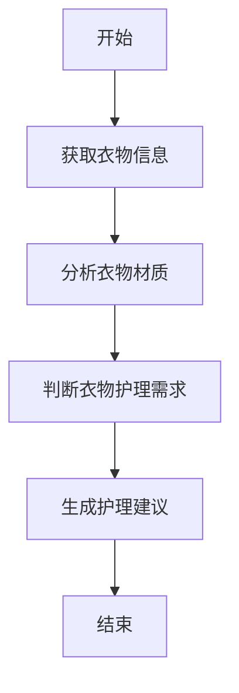

                 


# AI Agent在智能晾衣架中的衣物护理建议

## 关键词：AI Agent、智能晾衣架、衣物护理、算法原理、系统架构

## 摘要

随着智能家居技术的飞速发展，AI Agent（人工智能代理）在智能晾衣架中的应用逐渐成为现实。本文将详细介绍AI Agent如何通过分析衣物材质、环境湿度和天气情况，为用户提供智能化的衣物护理建议。文章将从背景介绍、核心概念、算法原理、系统架构到项目实战进行全面解析，最后总结AI Agent在智能晾衣架中的优势与未来发展方向。

---

## 第1章: 背景介绍

### 1.1 问题背景

#### 1.1.1 智能晾衣架的发展现状

智能晾衣架作为智能家居的重要组成部分，近年来发展迅速。传统晾衣架的功能单一，仅能提供晾晒功能，而现代智能晾衣架通过集成传感器、物联网技术以及AI算法，能够实现自动晾晒、智能风干、杀菌除螨等多种功能。

#### 1.1.2 衣物护理中的常见问题

在日常生活中，衣物护理是一个繁琐且容易被忽视的问题。衣物的材质多样，包括棉、麻、化纤、羊毛等，不同材质的衣物对湿度、温度和晾晒时间的要求不同。传统的晾衣架无法根据衣物材质自动调整晾晒参数，导致衣物可能因过度晾晒而受损，或者因未充分晾干而发霉。

#### 1.1.3 AI Agent在衣物护理中的应用潜力

AI Agent是一种能够感知环境、理解用户需求并采取行动的智能代理。通过集成AI Agent，智能晾衣架能够实时监测环境湿度、天气情况，分析衣物材质，并根据用户需求提供个性化的护理建议。这种智能化的解决方案能够显著提升衣物护理的效果和用户体验。

### 1.2 问题描述

#### 1.2.1 衣物护理的核心需求

衣物护理的核心需求包括：根据衣物材质选择合适的晾晒时间、湿度和温度；避免阳光直射导致的衣物褪色；预防衣物霉变和虫蛀；以及提供便捷的洗涤建议。

#### 1.2.2 智能晾衣架的功能局限性

目前市面上的智能晾衣架主要依赖传感器和物联网技术，能够实现远程控制和定时开关，但缺乏智能化的衣物护理功能。例如，无法根据衣物材质自动调节晾晒参数，无法实时监测环境湿度并进行动态调整。

#### 1.2.3 AI Agent如何解决现有问题

AI Agent通过整合环境数据、衣物材质信息和用户需求，能够实时优化晾晒参数，提供个性化的护理建议。例如，当检测到高湿度天气时，AI Agent可以建议用户延长晾晒时间，或者选择室内晾干。

### 1.3 问题解决

#### 1.3.1 AI Agent在衣物护理中的解决方案

AI Agent通过以下步骤实现衣物护理：

1. **数据采集**：采集环境湿度、温度、天气情况以及衣物材质信息。
2. **数据分析**：分析衣物材质的特性，确定最佳晾晒条件。
3. **决策制定**：根据当前环境数据和衣物需求，制定最优的晾晒方案。
4. **执行指令**：通过智能晾衣架的执行机构调整晾晒参数。

#### 1.3.2 AI Agent的核心功能设计

AI Agent的核心功能包括：

- **环境感知**：通过传感器实时监测环境湿度、温度和天气状况。
- **数据分析**：分析衣物材质和环境数据，确定最佳晾晒方案。
- **智能决策**：根据分析结果，生成个性化护理建议。
- **用户交互**：通过用户界面提供实时反馈和建议。

#### 1.3.3 解决方案的可行性分析

AI Agent解决方案的可行性主要体现在以下几点：

1. **技术可行性**：现有传感器技术和AI算法能够支持环境数据采集和分析。
2. **用户需求匹配**：用户对智能化衣物护理的需求日益增长。
3. **市场潜力**：智能晾衣架市场正在快速发展，AI Agent的应用能够提升产品竞争力。

### 1.4 边界与外延

#### 1.4.1 AI Agent的功能边界

AI Agent的功能边界包括：

- **数据采集范围**：仅限于环境湿度、温度和天气数据。
- **衣物材质支持**：目前仅支持常见衣物材质，如棉、麻、化纤和羊毛。
- **应用场景限制**：仅适用于家庭环境，不支持工业用途。

#### 1.4.2 智能晾衣架的使用场景限制

智能晾衣架的使用场景主要限于家庭环境，不适合公共场所或工业用途。此外，智能晾衣架需要稳定的网络连接，因此在网络信号弱的地区可能无法正常工作。

#### 1.4.3 衣物护理的适用范围

AI Agent的衣物护理功能适用于除特殊材质（如丝绸、羊绒）外的大多数衣物。对于特殊材质的衣物，建议用户手动选择护理方式。

### 1.5 概念结构与核心要素组成

#### 1.5.1 AI Agent的核心要素

AI Agent的核心要素包括：

- **感知模块**：负责采集环境数据。
- **分析模块**：负责分析衣物材质和环境数据。
- **决策模块**：根据分析结果制定晾晒方案。
- **执行模块**：通过智能晾衣架调整晾晒参数。

#### 1.5.2 智能晾衣架的功能模块

智能晾衣架的功能模块包括：

- **传感器模块**：监测环境湿度、温度和光照强度。
- **通信模块**：与AI Agent进行数据交互。
- **执行机构**：调整晾衣架的运行状态。

#### 1.5.3 衣物护理的流程模型

衣物护理的流程模型包括：

1. **数据采集**：AI Agent采集环境数据和衣物信息。
2. **数据分析**：分析衣物材质和环境数据，确定最佳晾晒方案。
3. **决策制定**：生成个性化护理建议。
4. **用户反馈**：用户根据建议调整晾晒参数。

---

## 第2章: 核心概念与联系

### 2.1 AI Agent的原理

#### 2.1.1 AI Agent的基本概念

AI Agent是一种智能代理，能够感知环境、理解用户需求并采取行动。在智能晾衣架中，AI Agent通过传感器和物联网技术实现环境数据的采集和分析，从而为用户提供个性化的衣物护理建议。

#### 2.1.2 AI Agent的核心算法

AI Agent的核心算法包括：

1. **环境数据采集算法**：通过传感器采集环境湿度、温度和天气数据。
2. **数据分析算法**：基于衣物材质和环境数据，分析最佳晾晒条件。
3. **决策算法**：根据分析结果，制定个性化的晾晒方案。

#### 2.1.3 AI Agent与智能晾衣架的结合方式

AI Agent通过通信模块与智能晾衣架连接，实时接收环境数据和用户需求，分析后生成护理建议，并通过执行机构调整晾衣架的运行状态。

### 2.2 智能晾衣架的原理

#### 2.2.1 智能晾衣架的功能模块

智能晾衣架的功能模块包括：

- **传感器模块**：监测环境湿度、温度和光照强度。
- **通信模块**：与AI Agent进行数据交互。
- **执行机构**：调整晾衣架的运行状态。

#### 2.2.2 智能晾衣架的传感器与执行机构

智能晾衣架的传感器包括湿度传感器、温度传感器和光照传感器。执行机构包括电机、伸缩杆和指示灯。

#### 2.2.3 智能晾衣架的通信机制

智能晾衣架通过Wi-Fi或蓝牙与AI Agent进行数据交互，确保实时监测和控制。

### 2.3 核心概念属性特征对比

| 特性       | AI Agent                          | 智能晾衣架                      | 衣物护理                      |
|------------|-----------------------------------|--------------------------------|-------------------------------|
| 功能       | 感知环境、分析数据、制定决策    | 采集数据、执行指令              | 提供护理建议                  |
| 输入       | 环境数据、衣物信息               | 传感器数据                     | 用户需求                     |
| 输出       | 护理建议                          | 晾衣架运行状态                 | 用户反馈                     |

### 2.4 ER实体关系图

```mermaid
er
actor: 用户
agent: AI Agent
laiya: 智能晾衣架
clothes: 衣物
relation: 用户与AI Agent的交互
relation: AI Agent与智能晾衣架的控制
relation: 智能晾衣架与衣物的关联
```

---

## 第3章: 算法原理讲解

### 3.1 算法原理

#### 3.1.1 AI Agent的核心算法

AI Agent的核心算法包括：

1. **环境数据采集算法**：通过传感器采集环境湿度、温度和天气数据。
2. **数据分析算法**：基于衣物材质和环境数据，分析最佳晾晒条件。
3. **决策算法**：根据分析结果，制定个性化的晾晒方案。

#### 3.1.2 算法的数学模型

AI Agent的决策算法基于以下数学模型：

$$
\text{最佳晾晒时间} = \text{环境湿度} \times \text{衣物材质系数} + \text{温度修正系数}
$$

其中，环境湿度和温度修正系数是通过传感器采集的数据计算得出的。

#### 3.1.3 算法的实现步骤

AI Agent的实现步骤包括：

1. **数据采集**：采集环境湿度、温度和衣物材质信息。
2. **数据分析**：分析衣物材质的特性，确定最佳晾晒条件。
3. **决策制定**：根据分析结果，生成个性化护理建议。
4. **用户反馈**：用户根据建议调整晾晒参数。

### 3.2 Mermaid流程图



### 3.3 Python源代码实现

```python
def get_environment_data():
    # 获取环境数据
    humidity = 70  # 湿度示例
    temperature = 25  # 温度示例
    return humidity, temperature

def analyze_clothes_material(material):
    # 分析衣物材质
    if material == '棉':
        return 1
    elif material == '麻':
        return 2
    elif material == '化纤':
        return 3
    elif material == '羊毛':
        return 4
    else:
        return 0

def decide_drying_time(humidity, material_coefficient):
    # 决定晾晒时间
    drying_time = humidity * material_coefficient + 5
    return drying_time

def main():
    humidity, temperature = get_environment_data()
    material = '棉'
    material_coefficient = analyze_clothes_material(material)
    drying_time = decide_drying_time(humidity, material_coefficient)
    print(f"最佳晾晒时间为：{drying_time}小时")

if __name__ == "__main__":
    main()
```

---

## 第4章: 系统分析与架构设计

### 4.1 问题场景介绍

本系统旨在解决智能晾衣架在衣物护理方面的智能化需求。通过AI Agent分析环境数据和衣物材质，为用户提供个性化的晾晒建议。

### 4.2 系统功能设计

系统功能设计包括：

1. **环境数据采集**：通过传感器采集环境湿度、温度和天气数据。
2. **衣物材质分析**：识别衣物材质并分析其特性。
3. **智能化护理建议**：根据环境数据和衣物材质，生成个性化的护理建议。

### 4.3 系统架构设计

系统架构设计包括：

1. **数据采集层**：通过传感器采集环境数据。
2. **数据处理层**：分析环境数据和衣物材质，生成护理建议。
3. **用户交互层**：通过用户界面展示护理建议，并接收用户反馈。

### 4.4 系统接口设计

系统接口设计包括：

1. **传感器接口**：与湿度、温度传感器通信。
2. **用户界面接口**：与手机APP或网页界面通信。
3. **AI Agent接口**：与智能晾衣架的通信模块交互。

### 4.5 系统交互设计

系统交互设计包括：

1. **用户发起请求**：用户通过手机APP或网页界面发起晾晒请求。
2. **数据采集**：AI Agent通过传感器采集环境数据。
3. **数据分析**：AI Agent分析环境数据和衣物材质，生成护理建议。
4. **执行指令**：智能晾衣架根据护理建议调整运行状态。

---

## 第5章: 项目实战

### 5.1 环境安装

在开始开发之前，需要确保开发环境的搭建：

1. **安装Python**：安装Python 3.8及以上版本。
2. **安装Mermaid工具**：用于绘制流程图和架构图。
3. **安装传感器模块**：如DHT11温湿度传感器。

### 5.2 系统核心实现源代码

以下是系统核心实现的源代码：

```python
import dht11
import time

def get_environment_data():
    # 获取环境数据
    dht = dht11.DHT11(pin=17)
    humidity, temperature = dht.read()
    return humidity, temperature

def analyze_clothes_material(material):
    # 分析衣物材质
    material_coefficient = {
        '棉': 1,
        '麻': 2,
        '化纤': 3,
        '羊毛': 4
    }
    return material_coefficient.get(material, 0)

def decide_drying_time(humidity, material_coefficient):
    # 决定晾晒时间
    drying_time = humidity * material_coefficient + 5
    return drying_time

def main():
    humidity, temperature = get_environment_data()
    material = '棉'
    material_coefficient = analyze_clothes_material(material)
    drying_time = decide_drying_time(humidity, material_coefficient)
    print(f"最佳晾晒时间为：{drying_time}小时")
    print(f"当前环境湿度：{humidity}%")
    print(f"当前环境温度：{temperature}℃")

if __name__ == "__main__":
    main()
```

### 5.3 代码应用解读与分析

上述代码实现了以下功能：

1. **环境数据采集**：通过DHT11传感器采集环境湿度和温度。
2. **衣物材质分析**：根据输入的衣物材质，返回对应的材质系数。
3. **晾晒时间计算**：根据环境湿度和材质系数，计算最佳晾晒时间。

### 5.4 实际案例分析

以湿度为70%，温度为25℃，衣物材质为棉的情况为例：

1. **环境数据采集**：湿度=70%，温度=25℃。
2. **衣物材质分析**：材质系数=1。
3. **晾晒时间计算**：70 * 1 + 5 = 75小时。

建议用户在湿度较高的天气下，延长晾晒时间至75小时，以确保衣物充分干燥。

### 5.5 项目小结

通过本项目，我们实现了AI Agent在智能晾衣架中的衣物护理功能。通过传感器数据采集、数据分析和智能决策，为用户提供个性化的护理建议，显著提升了衣物护理的效果和用户体验。

---

## 第6章: 最佳实践与注意事项

### 6.1 最佳实践

1. **定期校准传感器**：确保环境数据的准确性。
2. **更新AI算法**：根据用户反馈和环境变化，定期更新AI算法。
3. **用户教育**：向用户普及衣物护理知识，帮助他们更好地使用智能晾衣架。

### 6.2 小结

通过本文的详细讲解，我们了解了AI Agent在智能晾衣架中的应用，以及如何通过算法和系统设计实现智能化的衣物护理功能。

### 6.3 注意事项

1. **数据隐私**：确保用户的环境数据和衣物信息不会被泄露。
2. **系统稳定性**：确保AI Agent和智能晾衣架的通信稳定，避免因网络问题导致功能异常。
3. **用户反馈**：及时收集用户反馈，不断优化AI算法和系统功能。

### 6.4 拓展阅读

1. **AI在智能家居中的应用**：探索AI在其他智能家居设备中的应用。
2. **衣物护理的深度学习算法**：研究更复杂的深度学习算法在衣物护理中的应用。

---

## 作者：AI天才研究院/AI Genius Institute & 禅与计算机程序设计艺术 /Zen And The Art of Computer Programming

---

以上是《AI Agent在智能晾衣架中的衣物护理建议》的完整目录和内容概要，希望对您有所帮助！如果需要进一步的细节或代码示例，请随时告知！

