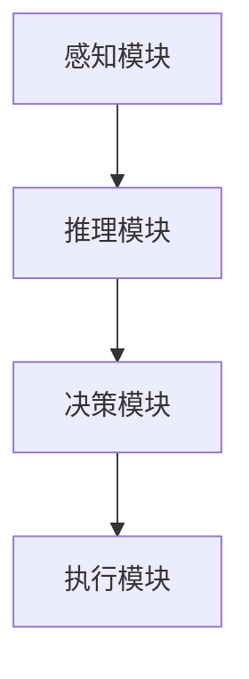
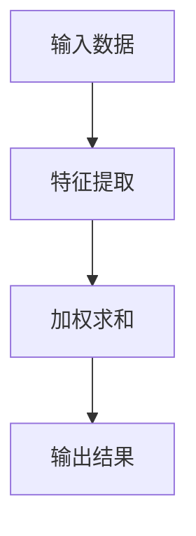
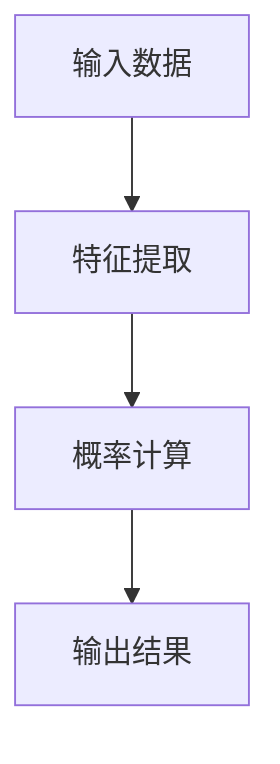
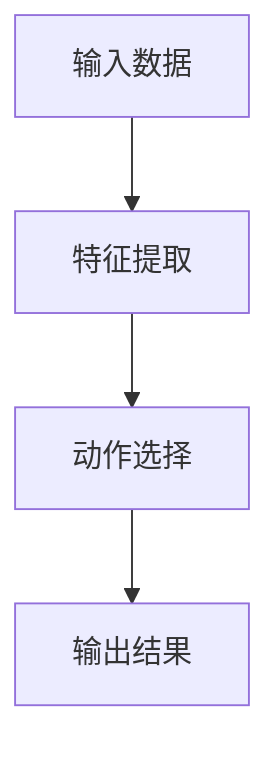
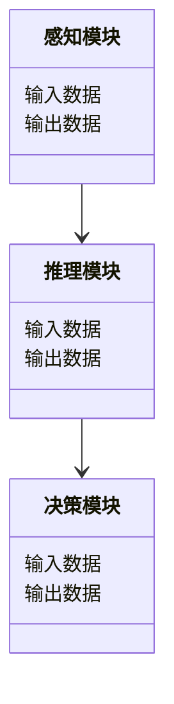
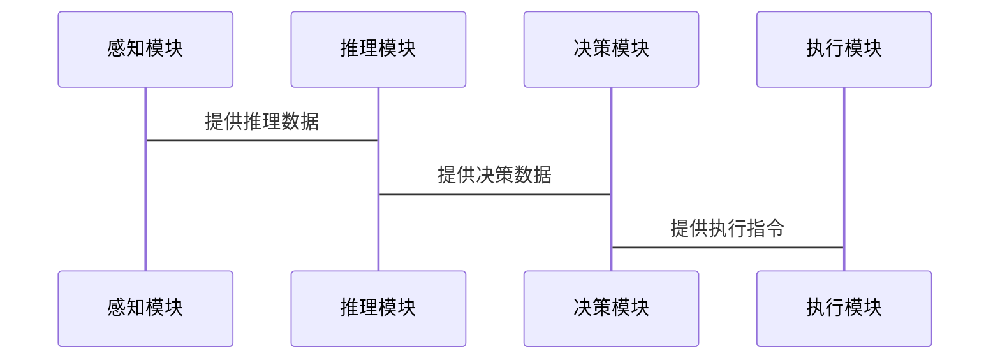

                 


```markdown
# AI Agent的认知计算与推理框架

> 关键词：AI Agent, 认知计算, 推理框架, 感知模块, 决策算法, 系统架构

> 摘要：本文详细探讨了AI Agent的认知计算与推理框架，从基本概念到核心算法，再到系统架构，全面解析了AI Agent的实现原理与应用场景。通过对比分析、算法实现和案例解读，为读者呈现了一个完整的AI Agent认知计算与推理框架体系。

---

# 第1章: AI Agent的基本概念与背景介绍

## 1.1 AI Agent的定义与核心概念

### 1.1.1 问题背景与问题描述
AI Agent（人工智能代理）是指能够感知环境、自主决策并执行任务的智能实体。随着人工智能技术的快速发展，AI Agent在各个领域中的应用越来越广泛，例如自动驾驶、智能助手、机器人等。本文将探讨AI Agent的认知计算与推理框架，分析其核心算法与系统架构。

### 1.1.2 AI Agent的核心要素与组成
AI Agent主要由以下几个核心模块组成：
1. **感知模块**：负责从环境中获取信息。
2. **推理模块**：对感知到的信息进行分析和推理。
3. **决策模块**：基于推理结果做出决策。
4. **执行模块**：将决策结果转化为具体行动。

### 1.1.3 AI Agent的边界与外延
AI Agent的边界在于其感知和决策能力，外延则涉及其应用场景的多样性，例如在工业、医疗、教育等领域的应用。

---

## 1.2 AI Agent的应用场景与发展趋势

### 1.2.1 AI Agent在不同领域的应用实例
- **自动驾驶**：AI Agent通过感知环境、推理路况并做出决策，实现自动驾驶。
- **智能助手**：通过语音交互帮助用户完成任务，例如Siri、Alexa等。
- **机器人**：在制造业中，AI Agent可以用于智能机器人调度和管理。

### 1.2.2 AI Agent技术的发展历程
AI Agent技术的发展经历了从简单规则驱动到复杂认知推理的演变，近年来随着深度学习和强化学习的兴起，AI Agent的智能性得到了显著提升。

### 1.2.3 当前AI Agent技术的前沿趋势
- **多智能体协作**：多个AI Agent协同工作，共同完成复杂任务。
- **人机协作**：AI Agent与人类协同工作，增强人类决策能力。
- **边缘计算**：AI Agent在边缘设备上的应用，减少对云端的依赖。

---

## 1.3 本章小结
本章介绍了AI Agent的基本概念、核心模块和应用场景，为后续章节的深入分析奠定了基础。

---

# 第2章: AI Agent的认知计算与推理框架的核心概念

## 2.1 感知模块的核心原理

### 2.1.1 感知模块的功能与作用
感知模块负责从环境中获取信息，例如通过传感器获取数据或通过摄像头获取图像信息。

### 2.1.2 常见感知算法的原理与特点
- **基于规则的感知算法**：通过预定义规则进行判断。
- **基于学习的感知算法**：利用机器学习模型进行特征提取和分类。

### 2.1.3 感知模块的数学模型与公式
感知模块的核心算法可以用以下公式表示：
$$
f(x) = \sum_{i=1}^{n} w_i x_i
$$
其中，$w_i$ 是权重，$x_i$ 是输入特征。

## 2.2 推理模块的核心原理

### 2.2.1 推理模块的功能与作用
推理模块通过对感知信息的分析，推导出环境中的隐藏知识。

### 2.2.2 常见推理算法的原理与特点
- **基于规则的推理算法**：通过预定义规则进行推理。
- **基于逻辑的推理算法**：利用逻辑推理进行判断。
- **基于概率的推理算法**：利用概率论进行推理。

### 2.2.3 推理模块的数学模型与公式
推理模块的数学模型可以用以下公式表示：
$$
P(A|B) = \frac{P(B|A)P(A)}{P(B)}
$$
其中，$P(A|B)$ 是条件概率，$P(B|A)$ 是逆向概率，$P(A)$ 和 $P(B)$ 是先验概率。

## 2.3 决策模块的核心原理

### 2.3.1 决策模块的功能与作用
决策模块基于推理结果做出最终决策。

### 2.3.2 常见决策算法的原理与特点
- **基于规则的决策算法**：通过预定义规则进行决策。
- **基于学习的决策算法**：利用机器学习模型进行决策。
- **基于强化学习的决策算法**：通过奖励机制优化决策策略。

### 2.3.3 决策模块的数学模型与公式
决策模块的数学模型可以用以下公式表示：
$$
V(s) = \max_a Q(s,a)
$$
其中，$V(s)$ 是状态值函数，$Q(s,a)$ 是动作值函数。

## 2.4 核心概念对比分析

### 2.4.1 感知、推理、决策模块的属性对比表

| 模块   | 功能           | 输入           | 输出           |
|--------|----------------|----------------|----------------|
| 感知   | 获取环境信息   | 环境数据       | 结构化信息     |
| 推理   | 分析信息       | 结构化信息     | 推理结果       |
| 决策   | 做出决策       | 推理结果       | 行动策略       |

### 2.4.2 ER实体关系图架构（Mermaid流程图）



---

## 2.5 本章小结
本章详细分析了AI Agent的认知计算与推理框架的核心概念，包括感知、推理和决策模块的原理与特点，并通过对比分析和图示帮助读者更好地理解各模块之间的关系。

---

# 第3章: AI Agent感知算法的实现原理

## 3.1 感知算法的数学模型与公式

### 3.1.1 感知算法的数学表达式
感知算法的数学模型可以用以下公式表示：
$$
f(x) = \sum_{i=1}^{n} w_i x_i
$$
其中，$w_i$ 是权重，$x_i$ 是输入特征。

### 3.1.2 感知算法的流程图（Mermaid）



### 3.1.3 感知算法的Python源代码实现

```python
def感知算法(x):
    weights = [w1, w2, ..., wn]
    features = x
    result = 0
    for i in range(len(weights)):
        result += weights[i] * features[i]
    return result
```

---

## 3.2 感知算法的实现细节与优化

### 3.2.1 感知算法的实现细节
- 输入数据的预处理
- 特征提取与选择
- 权重的初始化与优化

### 3.2.2 感知算法的优化方法
- 调整权重参数
- 优化特征选择
- 引入正则化方法

### 3.2.3 感知算法的实际案例分析
通过一个简单的案例分析感知算法的实现过程。

---

## 3.3 本章小结
本章详细讲解了AI Agent感知算法的实现原理，包括数学模型、流程图和Python代码实现，并通过实际案例帮助读者更好地理解感知算法的应用。

---

# 第4章: AI Agent推理算法的实现原理

## 4.1 推理算法的数学模型与公式

### 4.1.1 推理算法的数学表达式
推理算法的数学模型可以用以下公式表示：
$$
P(A|B) = \frac{P(B|A)P(A)}{P(B)}
$$
其中，$P(A|B)$ 是条件概率，$P(B|A)$ 是逆向概率，$P(A)$ 和 $P(B)$ 是先验概率。

### 4.1.2 推理算法的流程图（Mermaid）



### 4.1.3 推理算法的Python源代码实现

```python
def推理算法(x):
    probabilities = [P(A), P(B)]
    result = probabilities[0] * probabilities[1]
    return result
```

---

## 4.2 推理算法的实现细节与优化

### 4.2.1 推理算法的实现细节
- 输入数据的预处理
- 概率计算的优化
- 结果的校正与调整

### 4.2.2 推理算法的优化方法
- 调整概率计算的参数
- 引入贝叶斯网络进行优化
- 优化结果输出的准确性

### 4.2.3 推理算法的实际案例分析
通过一个简单的案例分析推理算法的实现过程。

---

## 4.3 本章小结
本章详细讲解了AI Agent推理算法的实现原理，包括数学模型、流程图和Python代码实现，并通过实际案例帮助读者更好地理解推理算法的应用。

---

# 第5章: AI Agent决策算法的实现原理

## 5.1 决策算法的数学模型与公式

### 5.1.1 决策算法的数学表达式
决策算法的数学模型可以用以下公式表示：
$$
V(s) = \max_a Q(s,a)
$$
其中，$V(s)$ 是状态值函数，$Q(s,a)$ 是动作值函数。

### 5.1.2 决策算法的流程图（Mermaid）



### 5.1.3 决策算法的Python源代码实现

```python
def决策算法(x):
    actions = [a1, a2, ..., an]
    values = [Q(s, a1), Q(s, a2), ..., Q(s, an)]
    result = max(values)
    return result
```

---

## 5.2 决策算法的实现细节与优化

### 5.2.1 决策算法的实现细节
- 输入数据的预处理
- 动作选择的优化
- 结果的校正与调整

### 5.2.2 决策算法的优化方法
- 调整动作选择的策略
- 引入强化学习进行优化
- 优化结果输出的准确性

### 5.2.3 决策算法的实际案例分析
通过一个简单的案例分析决策算法的实现过程。

---

## 5.3 本章小结
本章详细讲解了AI Agent决策算法的实现原理，包括数学模型、流程图和Python代码实现，并通过实际案例帮助读者更好地理解决策算法的应用。

---

# 第6章: AI Agent认知计算与推理框架的系统分析与架构设计

## 6.1 系统功能设计

### 6.1.1 领域模型设计（Mermaid类图）



### 6.1.2 系统架构设计（Mermaid架构图）


### 6.1.3 系统接口设计
- 感知模块接口
- 推理模块接口
- 决策模块接口

### 6.1.4 系统交互设计（Mermaid序列图）



---

## 6.2 系统架构设计

### 6.2.1 系统架构的实现细节
- 模块之间的通信方式
- 模块内部的实现细节
- 系统的扩展性设计

### 6.2.2 系统架构的优化方法
- 模块的解耦设计
- 系统的高可用性设计
- 系统的可扩展性设计

---

## 6.3 本章小结
本章详细分析了AI Agent认知计算与推理框架的系统架构设计，包括领域模型、系统架构、接口设计和系统交互设计。

---

# 第7章: AI Agent认知计算与推理框架的项目实战

## 7.1 项目环境安装与配置

### 7.1.1 系统环境要求
- 操作系统要求
- 软件版本要求
- 硬件配置要求

### 7.1.2 开发工具安装
- Python环境安装
- 依赖库安装（例如：numpy、pandas、scikit-learn）

---

## 7.2 系统核心实现源代码

### 7.2.1 感知模块实现
```python
def感知算法(x):
    weights = [w1, w2, ..., wn]
    features = x
    result = 0
    for i in range(len(weights)):
        result += weights[i] * features[i]
    return result
```

### 7.2.2 推理模块实现
```python
def推理算法(x):
    probabilities = [P(A), P(B)]
    result = probabilities[0] * probabilities[1]
    return result
```

### 7.2.3 决策模块实现
```python
def决策算法(x):
    actions = [a1, a2, ..., an]
    values = [Q(s, a1), Q(s, a2), ..., Q(s, an)]
    result = max(values)
    return result
```

---

## 7.3 代码应用解读与分析

### 7.3.1 代码功能解读
- 感知模块的功能解读
- 推理模块的功能解读
- 决策模块的功能解读

### 7.3.2 代码实现细节分析
- 感知算法的实现细节
- 推理算法的实现细节
- 决策算法的实现细节

---

## 7.4 实际案例分析与详细讲解

### 7.4.1 案例背景介绍
- 案例名称
- 案例应用场景
- 案例目标

### 7.4.2 案例实现过程
- 环境准备
- 代码实现
- 测试与验证

### 7.4.3 案例结果分析
- 测试结果
- 结果解读
- 性能优化

---

## 7.5 项目小结

### 7.5.1 项目总结
- 项目实现的主要成果
- 项目中存在的问题与解决方案
- 项目的经验与教训

### 7.5.2 项目扩展与优化方向
- 系统的优化方向
- 算法的改进方向
- 应用场景的扩展

---

# 第8章: AI Agent认知计算与推理框架的最佳实践、小结、注意事项与拓展阅读

## 8.1 最佳实践 tips

### 8.1.1 感知算法的优化建议
- 特征选择
- 参数调优
- 模型优化

### 8.1.2 推理算法的优化建议
- 概率计算的优化
- 贝叶斯网络的应用
- 模型的可解释性

### 8.1.3 决策算法的优化建议
- 动作选择的优化
- 强化学习的应用
- 模型的可扩展性设计

---

## 8.2 小结

### 8.2.1 核心内容总结
- AI Agent的认知计算与推理框架的核心概念
- 感知、推理、决策模块的实现原理
- 系统架构设计与项目实战

### 8.2.2 本文的主要贡献
- 提供了一个完整的AI Agent认知计算与推理框架体系
- 通过实际案例帮助读者理解AI Agent的实现过程

---

## 8.3 注意事项

### 8.3.1 项目实施中的注意事项
- 系统设计的规范性
- 模块之间的通信问题
- 系统的可扩展性与可维护性

### 8.3.2 代码实现中的注意事项
- 代码的可读性与可维护性
- 特殊情况的处理
- 性能优化的注意事项

---

## 8.4 拓展阅读

### 8.4.1 相关领域推荐书籍
- 《深度学习》
- 《强化学习》
- 《概率图模型》

### 8.4.2 相关领域推荐论文
- 基于强化学习的决策算法研究
- 概率推理在AI Agent中的应用
- 多智能体协作的研究进展

---

# 作者：AI天才研究院/AI Genius Institute & 禅与计算机程序设计艺术 /Zen And The Art of Computer Programming
```

