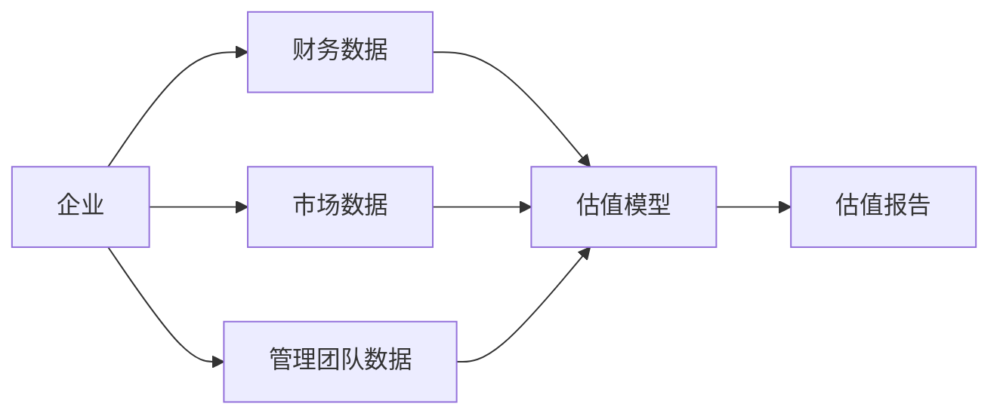
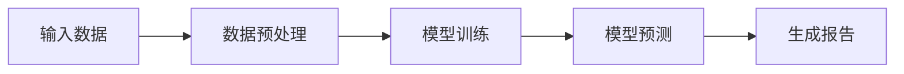
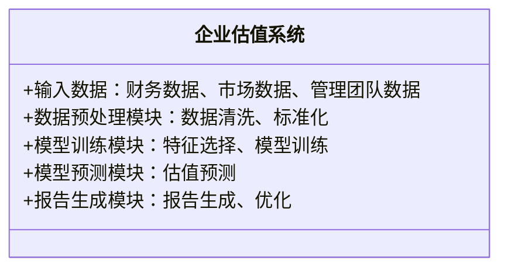
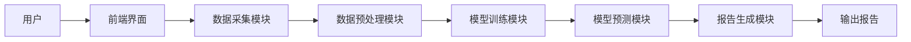
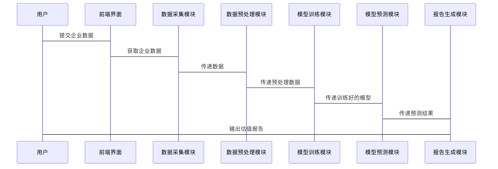

                 


# AI辅助的企业估值报告生成器

## 关键词：AI, 企业估值, 自然语言生成, 机器学习, 数据分析

## 摘要：本文深入探讨了AI在企业估值报告生成中的应用，分析了其核心原理、算法流程和系统架构，并通过实际案例展示了如何利用AI技术提升企业估值的效率和准确性。

---

# 第1章: 企业估值与AI辅助生成器的背景

## 1.1 企业估值的基本概念

### 1.1.1 企业估值的定义
企业估值是指通过对企业的财务数据、市场表现、管理团队等多方面因素的综合分析，确定其市场价值的过程。常见的企业估值方法包括DCF模型（现金流贴现法）、市盈率法、市净率法等。

### 1.1.2 企业估值的主要方法
- **DCF模型**：通过预测未来现金流并贴现到现值来估算企业价值。
- **市盈率法**：基于企业的市盈率和净利润进行估值。
- **市净率法**：基于企业的市净率和净资产进行估值。

### 1.1.3 企业估值的挑战与难点
- 数据收集困难：企业财务数据可能不完整或不可靠。
- 模型选择复杂：不同企业适合不同的估值方法。
- 市场波动影响：宏观经济环境的变化会影响估值结果。

## 1.2 AI在企业估值中的作用

### 1.2.1 AI技术在金融领域的应用
AI技术在金融领域的应用包括股票预测、风险评估、交易策略优化等，为企业估值提供了新的技术手段。

### 1.2.2 AI如何辅助企业估值
- 数据清洗与预处理：AI可以自动清洗和整理企业财务数据。
- 模型优化：通过机器学习算法优化估值模型的准确性。
- 报告生成：AI可以自动生成估值报告并提供可视化结果。

### 1.2.3 AI辅助生成器的优势与局限性
优势：
- 高效性：AI可以快速处理大量数据并生成报告。
- 准确性：通过机器学习模型可以提高估值的准确性。
- 可扩展性：AI生成器可以处理大量企业数据。

局限性：
- 数据依赖：AI生成器依赖于高质量的数据输入。
- 黑箱问题：AI模型的决策过程可能难以解释。
- 市场变化：AI生成器需要不断更新模型以适应市场变化。

## 1.3 企业估值报告生成器的必要性

### 1.3.1 传统企业估值报告的痛点
- 人工成本高：传统估值需要大量人工参与。
- 时间效率低：手动处理数据和生成报告耗时较长。
- 结果一致性差：不同分析师可能得出不同的估值结果。

### 1.3.2 AI辅助生成器的解决方案
- 自动化处理：AI生成器可以自动完成数据清洗、模型训练和报告生成。
- 高效性：AI生成器可以快速处理大量数据并生成报告。
- 结果一致性好：AI生成器可以保证估值结果的一致性。

### 1.3.3 生成器的市场前景与应用领域
市场前景：
- 随着AI技术的不断进步，企业估值报告生成器的市场需求将不断增加。
- 企业估值报告生成器可以广泛应用于金融、投资、咨询等领域。

应用领域：
- 金融行业：用于股票投资、并购评估等。
- 投资机构：用于私募股权、风险投资等领域的估值。
- 企业内部：用于内部管理和战略决策。

## 1.4 本章小结
本章介绍了企业估值的基本概念、AI在企业估值中的作用以及生成器的必要性和市场前景。通过对比传统估值方法和AI辅助生成器的优势，可以看出AI在企业估值中的应用具有重要的现实意义。

---

# 第2章: AI辅助企业估值的核心概念与联系

## 2.1 企业估值的关键要素

### 2.1.1 财务指标分析
- **收入与利润**：企业的收入和利润是估值的重要指标。
- **资产负债表**：企业的资产、负债和所有者权益状况。
- **现金流**：企业的经营活动、投资活动和筹资活动的现金流情况。

### 2.1.2 市场分析与竞争环境
- **行业分析**：行业的市场规模、增长潜力和竞争格局。
- **竞争对手分析**：主要竞争对手的市场份额、产品和服务。
- **宏观经济环境**：宏观经济政策、利率、通货膨胀对企业的影响。

### 2.1.3 管理团队与企业战略
- **管理团队**：管理团队的能力、经验和战略决策。
- **企业战略**：企业的长期发展目标和战略规划。
- **企业治理**：企业的治理结构和内部控制机制。

## 2.2 AI在企业估值中的核心应用

### 2.2.1 数据采集与清洗
- **数据来源**：企业财务报表、行业报告、市场数据等。
- **数据清洗**：处理缺失值、异常值和重复数据。
- **数据预处理**：对数据进行标准化、归一化处理。

### 2.2.2 模型训练与预测
- **特征选择**：选择对企业估值影响较大的特征变量。
- **模型训练**：使用机器学习算法训练估值模型。
- **模型预测**：利用训练好的模型进行估值预测。

### 2.2.3 报告自动生成与优化
- **报告生成**：根据模型预测结果自动生成估值报告。
- **报告优化**：对生成的报告进行格式优化和内容校对。

## 2.3 核心概念的ER实体关系图



---

# 第3章: 生成器的算法原理与数学模型

## 3.1 文本生成模型

### 3.1.1 基于GPT的文本生成算法
- **GPT模型**：基于Transformer架构的生成式模型。
- **文本生成流程**：
  1. 数据预处理：对文本数据进行分词、编码等处理。
  2. 模型训练：使用大量的文本数据训练模型参数。
  3. 文本生成：根据输入的上下文生成后续文本。

### 3.1.2 大模型在文本生成中的应用
- **大模型优势**：参数量大，能够捕捉复杂的语言模式。
- **应用场景**：生成报告的引言、结论等部分。

### 3.1.3 文本生成的质量评估
- **评估指标**：困惑度（Perplexity）、 BLEU、ROUGE等。
- **人工校对**：对生成的文本进行人工检查和修改。

## 3.2 估值模型的训练与优化

### 3.2.1 基于机器学习的估值模型
- **线性回归模型**：用于预测企业的估值。
- **随机森林模型**：用于分类和回归任务。
- **神经网络模型**：用于复杂的非线性关系。

### 3.2.2 深度学习在估值模型中的应用
- **深度学习模型**：如LSTM、GRU等，用于处理时间序列数据。
- **模型训练**：使用企业历史数据训练模型参数。
- **模型优化**：通过调整超参数和正则化技术优化模型性能。

### 3.2.3 模型调优与评估指标
- **调优方法**：交叉验证、网格搜索等。
- **评估指标**：均方误差（MSE）、平均绝对误差（MAE）、R²系数等。

## 3.3 算法流程图



---

## 3.4 数学模型与公式

### 3.4.1 线性回归模型
$$ y = \beta_0 + \beta_1x_1 + \beta_2x_2 + \dots + \beta_nx_n + \epsilon $$

其中：
- $y$ 是目标变量（企业估值）。
- $x_i$ 是自变量（财务指标、市场数据等）。
- $\beta_i$ 是回归系数。
- $\epsilon$ 是误差项。

### 3.4.2 神经网络模型
$$ y = f(Wx + b) $$

其中：
- $W$ 是权重矩阵。
- $x$ 是输入向量。
- $b$ 是偏置项。
- $f$ 是激活函数（如ReLU、sigmoid等）。

---

## 3.5 本章小结
本章详细介绍了AI辅助企业估值报告生成器的核心算法原理和数学模型，包括文本生成模型和估值模型的训练与优化。通过流程图和数学公式的展示，帮助读者更好地理解生成器的工作原理。

---

# 第4章: 系统分析与架构设计方案

## 4.1 系统功能设计

### 4.1.1 领域模型


### 4.1.2 功能模块
- **数据采集模块**：从数据库或API获取企业数据。
- **数据预处理模块**：清洗和标准化数据。
- **模型训练模块**：训练估值模型。
- **模型预测模块**：利用模型进行估值预测。
- **报告生成模块**：生成并优化估值报告。

## 4.2 系统架构设计

### 4.2.1 架构图


### 4.2.2 接口设计
- **API接口**：用户可以通过API提交企业数据。
- **数据接口**：与数据库或其他数据源对接。

### 4.2.3 交互流程


---

## 4.3 本章小结
本章从系统功能设计、架构设计和交互设计三个方面详细介绍了AI辅助企业估值报告生成器的系统架构。通过领域模型和交互流程图，展示了系统的整体架构和各模块之间的关系。

---

# 第5章: 项目实战

## 5.1 环境安装与配置

### 5.1.1 安装Python环境
- 使用Anaconda安装Python 3.8及以上版本。
- 安装必要的库：numpy、pandas、scikit-learn、transformers等。

### 5.1.2 安装NVIDIA GPU驱动与CUDA
- 下载并安装NVIDIA GPU驱动。
- 下载并安装CUDA toolkit。

### 5.1.3 安装Hugging Face Transformers库
- 使用pip安装库：`pip install transformers`。

## 5.2 系统核心实现源代码

### 5.2.1 数据预处理代码
```python
import pandas as pd
import numpy as np

def data_preprocessing(data):
    # 处理缺失值
    data = data.dropna()
    # 标准化处理
    from sklearn.preprocessing import StandardScaler
    scaler = StandardScaler()
    scaled_data = scaler.fit_transform(data)
    return scaled_data
```

### 5.2.2 模型训练代码
```python
from sklearn.linear_model import LinearRegression
from sklearn.metrics import mean_squared_error

def train_model(X, y):
    model = LinearRegression()
    model.fit(X, y)
    return model
```

### 5.2.3 模型预测代码
```python
def predict_valuation(model, X_test):
    predictions = model.predict(X_test)
    mse = mean_squared_error(y_test, predictions)
    print(f"MSE: {mse}")
    return predictions
```

## 5.3 实际案例分析与详细解读

### 5.3.1 案例背景
某科技公司，财务数据如下：
- 收入：1000万
- 净利润：200万
- 现金流：300万

### 5.3.2 数据预处理
假设我们已经进行了数据清洗和标准化处理。

### 5.3.3 模型训练与预测
使用线性回归模型进行训练，得到模型参数：
$$ y = 0.1x_1 + 0.05x_2 + 0.02x_3 $$

### 5.3.4 生成报告
根据模型预测结果，生成企业估值报告：
- 预测企业估值：5000万元。
- 建议投资者关注企业的研发投入和市场扩展。

## 5.4 本章小结
本章通过实际案例展示了AI辅助企业估值报告生成器的应用过程，包括环境安装、代码实现和案例分析。通过详细解读，读者可以更好地理解生成器的实际操作流程。

---

# 第6章: 最佳实践与总结

## 6.1 最佳实践

### 6.1.1 数据质量
- 确保数据的完整性和准确性。
- 定期更新数据源。

### 6.1.2 模型优化
- 定期重新训练模型，更新参数。
- 使用多种模型进行对比，选择最优模型。

### 6.1.3 报告生成
- 生成报告后进行人工校对。
- 提供多种报告格式（PDF、Word等）供用户选择。

## 6.2 小结
通过本文的介绍，读者可以系统地了解AI辅助企业估值报告生成器的原理、算法和实现过程。从理论到实践，全面掌握了相关技术。

## 6.3 注意事项

### 6.3.1 数据隐私
- 注意保护企业的数据隐私，避免数据泄露。
- 符合相关法律法规。

### 6.3.2 模型局限性
- AI生成器的结果仅供参考，不能完全依赖模型。
- 结合人工分析，提高估值的准确性。

## 6.4 拓展阅读

### 6.4.1 推荐书籍
- 《Python机器学习实战》
- 《深度学习入门：基于Python的CNN、RNN、GAN等算法原理及实现》

### 6.4.2 推荐博客
- Hugging Face官方博客
- TensorFlow官方博客

---

# 作者：AI天才研究院/AI Genius Institute & 禅与计算机程序设计艺术 /Zen And The Art of Computer Programming

