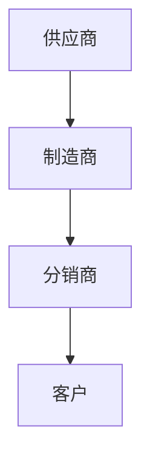
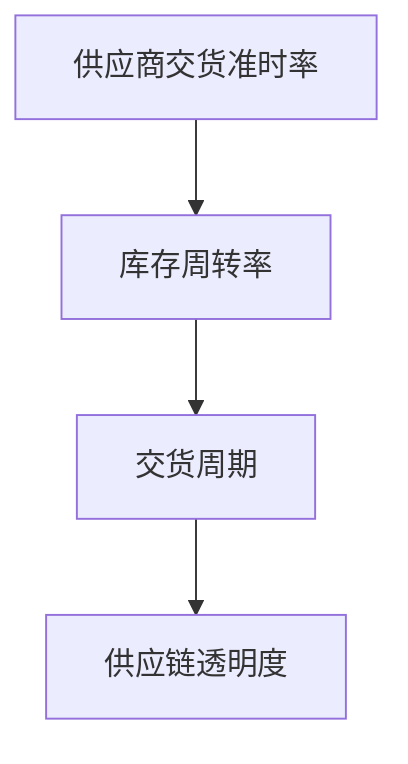
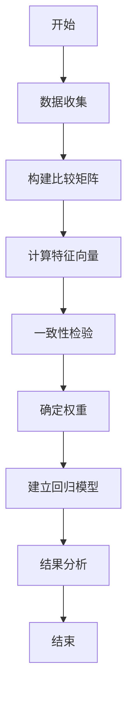
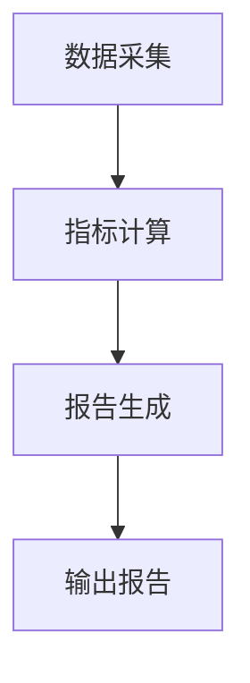
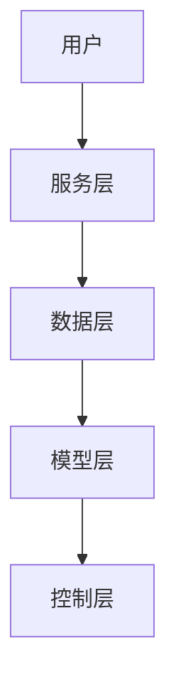

                 


# 彼得林奇对公司供应链韧性的评估

> 关键词：供应链韧性，彼得林奇，评估框架，算法原理，系统架构

> 摘要：本文从投资大师彼得林奇的视角出发，系统性地探讨了公司供应链韧性的评估方法。文章首先介绍了供应链韧性的背景与重要性，分析了彼得林奇投资理念下的供应链韧性核心概念与框架，随后详细阐述了供应链韧性评估的算法原理与系统架构设计，并通过具体案例展示了评估方法的实际应用。最后，本文总结了彼得林奇供应链韧性评估的关键要点，并提出了最佳实践建议。

---

## 第1章: 供应链韧性的背景与重要性

### 1.1 供应链的基本概念

#### 1.1.1 供应链的定义与组成
供应链是指从原材料采购到最终产品交付的整个流程，包括供应商、制造商、分销商和客户等关键角色。其组成可以分为以下几个部分：
- 供应商：提供原材料或组件的企业。
- 制造商：负责产品生产的主体。
- 分销商：将产品分发到各个销售渠道的中间商。
- 客户：最终的产品使用者。

供应链的组成可以用以下 Mermaid 图表示：



#### 1.1.2 供应链的关键特征
供应链的关键特征包括：
1. **复杂性**：涉及多个环节和参与者。
2. **动态性**：市场需求和技术不断变化。
3. **依赖性**：各环节相互依赖，中断会影响整体流程。

#### 1.1.3 供应链在现代企业中的地位
供应链是企业运营的核心部分，直接影响企业的成本、效率和竞争力。现代企业的供应链管理需要结合数字化技术，以提高透明度和响应速度。

### 1.2 彼得林奇视角下的供应链韧性

#### 1.2.1 彼得林奇的投资理念与供应链
彼得林奇以长期稳健的投资风格闻名，他认为企业的供应链稳定性是评估企业价值的重要因素。供应链的韧性直接影响企业的抗风险能力和长期发展潜力。

#### 1.2.2 供应链韧性对企业价值的影响
供应链韧性强的企业能够在市场波动中保持稳定，降低运营成本，并快速响应客户需求。这使得它们在竞争中更具优势。

#### 1.2.3 供应链韧性与企业风险管理
供应链中断可能导致企业面临巨大的损失，因此，评估供应链韧性是企业风险管理的重要部分。

### 1.3 供应链韧性评估的必要性

#### 1.3.1 供应链中断的风险分析
供应链中断可能由多种因素引起，如自然灾害、疫情、物流问题等。这些风险可能导致生产中断、成本增加和客户满意度下降。

#### 1.3.2 供应链韧性对企业竞争力的作用
强大的供应链韧性能够提高企业的灵活性和应对能力，从而增强市场竞争力。

#### 1.3.3 全球化背景下的供应链挑战
全球化使得供应链更加复杂，企业需要更加注重供应链的弹性和冗余能力，以应对全球性风险。

### 1.4 当前供应链韧性评估的趋势

#### 1.4.1 数字化技术对供应链的影响
数字化技术（如物联网、大数据、人工智能）的应用，使得供应链管理更加智能化和高效。

#### 1.4.2 可持续发展与供应链韧性
可持续发展成为企业关注的重点，供应链的绿色管理和碳足迹评估逐渐成为韧性评估的重要部分。

#### 1.4.3 全球化背景下的供应链重构
全球化背景下，企业需要重新设计供应链，以应对地缘政治、贸易政策等变化带来的挑战。

### 1.5 本章小结
本章介绍了供应链的基本概念及其在现代企业中的地位，从彼得林奇的投资视角分析了供应链韧性的核心意义，并探讨了当前供应链韧性评估的趋势。供应链韧性不仅是企业运营的关键因素，也是投资决策的重要考量。

---

## 第2章: 供应链韧性评估的核心概念与框架

### 2.1 核心概念与定义

#### 2.1.1 供应链弹性
供应链弹性是指企业在面对外部干扰时，能够快速恢复并保持正常运营的能力。弹性包括冗余、灵活性和适应性等特征。

#### 2.1.2 供应链冗余
供应链冗余指在关键环节设置备用资源，以应对突发事件。冗余可以通过多源采购、备用生产线等方式实现。

#### 2.1.3 供应链可见性
供应链可见性指企业对供应链各环节的实时监控能力，包括供应商状态、库存水平和物流信息等。

### 2.2 核心概念的对比分析

#### 2.2.1 核心概念属性对比表格

| 概念    | 定义                                                                 | 特征                     |
|---------|----------------------------------------------------------------------|--------------------------|
| 弹性     | 面对外部干扰时的恢复能力                                             | 红|冗余、灵活性           |
| 冗余     | 关键环节的备用资源                                                   | 红|多源采购、备用生产线     |
| 可见性   | 实时监控供应链各环节的能力                                           | 红|透明度、实时数据         |

#### 2.2.2 ER实体关系图架构

```mermaid
erDiagram
    actor 顾客
    actor 供应商
    entity 产品
    entity 订单
    entity 库存
    entity 物流
    顾客 --> 订单 : 下订单
    订单 --> 产品 : 包含
    订单 --> 供应商 : 来自
    供应商 --> 产品 : 提供
    订单 --> 库存 : 存储
    库存 --> 物流 : 运输
```

### 2.3 彼得林奇评估框架的核心要素

#### 2.3.1 供应商稳定性评估
供应商稳定性是供应链韧性的重要因素。彼得林奇建议企业评估供应商的财务状况、交货准时率和应急响应能力。

#### 2.3.2 供应链弹性指标
供应链弹性指标包括交货周期、库存周转率、供应商交货准时率等。这些指标可以帮助企业衡量供应链的弹性。

#### 2.3.3 供应链可见性与透明度
企业需要建立实时监控系统，确保对供应链各环节的可见性。透明度高的供应链更容易发现和解决问题。

### 2.4 本章小结
本章从核心概念的角度分析了供应链韧性，对比了弹性、冗余和可见性的特征，并提出了彼得林奇评估框架的核心要素，为后续的评估方法奠定了基础。

---

## 第3章: 彼得林奇供应链韧性评估框架

### 3.1 评估框架的构建

#### 3.1.1 框架的设计原则
彼得林奇的供应链韧性评估框架基于以下几个原则：
1. **全面性**：涵盖供应链的各个环节。
2. **可操作性**：便于企业实际应用。
3. **动态性**：能够适应市场变化。

#### 3.1.2 框架的组成部分
评估框架包括以下几个部分：
1. **供应商评估**：供应商的财务状况、交货能力。
2. **供应链弹性评估**：交货周期、库存周转率。
3. **供应链透明度评估**：实时监控能力。

#### 3.1.3 框架的适用范围
该框架适用于制造业、零售业等依赖复杂供应链的企业。

### 3.2 评估指标与权重分配

#### 3.2.1 关键指标的选择
关键指标包括：
- 供应商交货准时率（权重30%）
- 库存周转率（权重25%）
- 交货周期（权重20%）
- 供应链透明度（权重25%）

#### 3.2.2 指标权重的确定方法
权重的确定可以通过专家评分法或层次分析法（AHP）实现。

#### 3.2.3 指标之间的相互关系
指标之间的关系可以用以下 Mermaid 图表示：



### 3.3 评估模型的构建与应用

#### 3.3.1 模型的数学表达
供应链韧性指数（SCRI）可以表示为：

$$
SCRI = w_1 \times S + w_2 \times I + w_3 \times T
$$

其中，$S$ 是供应商交货准时率，$I$ 是库存周转率，$T$ 是供应链透明度，$w_1, w_2, w_3$ 是权重。

#### 3.3.2 模型的验证与优化
通过历史数据验证模型的准确性，并根据实际结果调整权重。

#### 3.3.3 模型的实际应用案例
某制造企业应用该模型进行供应链韧性评估，结果显示其供应链透明度较低，建议其优化实时监控系统。

### 3.4 本章小结
本章提出了彼得林奇供应链韧性评估框架，详细阐述了指标选择与权重分配，并通过数学模型展示了评估方法的实际应用。

---

## 第4章: 供应链韧性评估的算法原理

### 4.1 算法原理概述

#### 4.1.1 算法的基本思路
供应链韧性评估算法基于层次分析法（AHP）和线性回归模型。

#### 4.1.2 算法的核心步骤
1. **数据收集**：收集供应商交货准时率、库存周转率等数据。
2. **指标权重计算**：使用层次分析法确定各指标的权重。
3. **模型构建**：建立供应链韧性指数模型。
4. **结果分析**：根据模型结果提出改进建议。

#### 4.1.3 算法的优缺点分析
优点：科学性强，可操作性高。缺点：需要大量数据支持，计算复杂。

### 4.2 算法的数学

#### 4.2.1 层次分析法（AHP）步骤
1. 构建比较矩阵。
2. 计算特征向量和一致性检验。
3. 确定权重。

#### 4.2.2 线性回归模型
供应链韧性指数（SCRI）可以表示为：

$$
SCRI = \beta_0 + \beta_1 x_1 + \beta_2 x_2 + \beta_3 x_3 + \epsilon
$$

其中，$x_i$ 是各指标，$\beta_i$ 是回归系数，$\epsilon$ 是误差项。

#### 4.2.3 算法流程图


### 4.3 本章小结
本章详细介绍了供应链韧性评估的算法原理，包括层次分析法和线性回归模型，并通过流程图展示了算法的实施步骤。

---

## 第5章: 供应链韧性评估的系统架构设计

### 5.1 系统功能设计

#### 5.1.1 系统功能模块
- 数据采集模块：收集供应商、库存等数据。
- 指标计算模块：计算各指标的权重和韧性指数。
- 报告生成模块：生成评估报告和改进建议。

#### 5.1.2 系统功能流程


### 5.2 系统架构设计

#### 5.2.1 系统架构图


#### 5.2.2 系统接口设计
- 用户接口：Web界面。
- 数据接口：与ERP系统对接。

### 5.3 本章小结
本章设计了供应链韧性评估系统的架构，包括功能模块和系统架构图，并提出了接口设计和交互流程。

---

## 第6章: 供应链韧性评估的实战案例

### 6.1 案例背景介绍

#### 6.1.1 项目背景
某制造企业面临供应链中断的风险，希望通过评估优化供应链韧性。

### 6.2 系统核心实现源代码

#### 6.2.1 环境安装
需要安装Python、Pandas、Scipy等库。

#### 6.2.2 核心代码实现
```python
import pandas as pd
import numpy as np
from scipy.cluster.hierarchy import linkage, cophenetic

# 数据加载
data = pd.read_csv('supply_chain.csv')

# 层次分析法计算权重
def calculate_weights(data):
    n = len(data)
    # 构建比较矩阵
    matrix = np.zeros((n, n))
    for i in range(n):
        for j in range(n):
            matrix[i][j] = data[i] / data[j]
    # 计算特征向量
    eigvals, eigvecs = np.linalg.eig(matrix)
    # 一致性检验
    max_eig = max(eigvals)
    consistency = np.sum(eigvals) / max_eig
    return eigvecs, consistency

# 应用案例
weights, consistency = calculate_weights(data)
print("权重向量：", weights)
print("一致性检验：", consistency)
```

### 6.3 代码应用解读与分析

#### 6.3.1 代码功能
该代码使用层次分析法计算供应链各指标的权重，并进行一致性检验。

#### 6.3.2 代码实现细节
数据加载和层次分析法的实现是关键部分。

### 6.4 实际案例分析

#### 6.4.1 案例分析结果
评估结果显示，企业的供应链透明度较低，建议优化实时监控系统。

### 6.5 本章小结
本章通过实际案例展示了彼得林奇供应链韧性评估方法的应用，并提供了代码实现和分析结果。

---

## 第7章: 总结与展望

### 7.1 总结
本文从彼得林奇的投资视角出发，系统性地探讨了供应链韧性的评估方法，包括核心概念、评估框架、算法原理和系统架构设计，并通过实际案例展示了评估方法的应用。

### 7.2 注意事项
企业在应用评估方法时，需要注意数据质量和模型的可解释性。

### 7.3 最佳实践 tips
- 定期评估供应链韧性。
- 优化实时监控系统。
- 与供应商建立长期合作关系。

### 7.4 拓展阅读
建议读者阅读彼得林奇的相关著作，以及供应链管理的经典文献。

### 7.5 本章小结
供应链韧性是企业运营和投资决策的关键因素，彼得林奇的评估方法为企业提供了重要的指导。

---

## 作者：AI天才研究院/AI Genius Institute & 禅与计算机程序设计艺术 /Zen And The Art of Computer Programming

