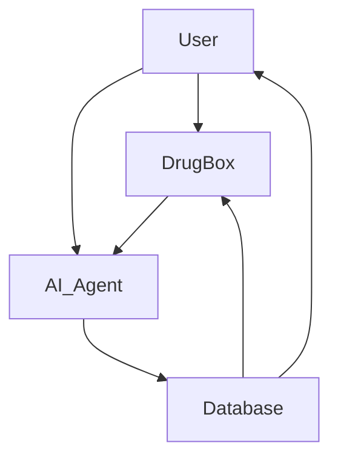
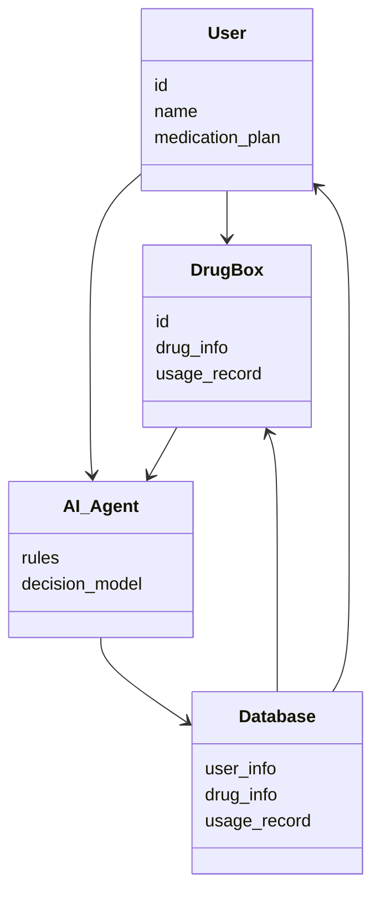
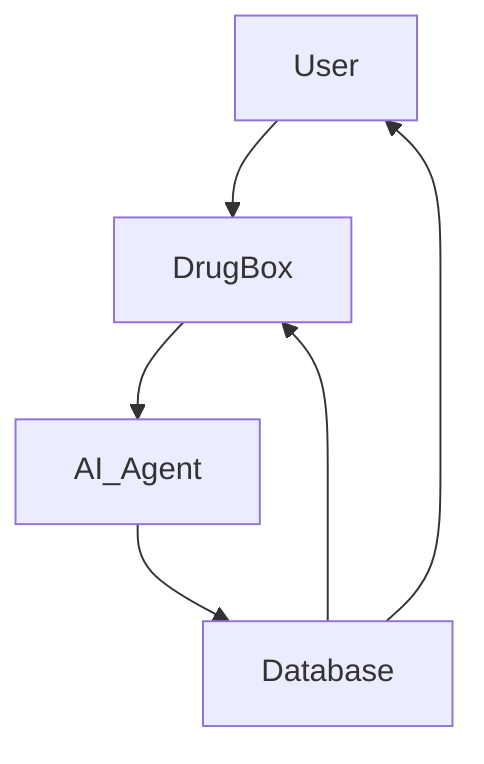
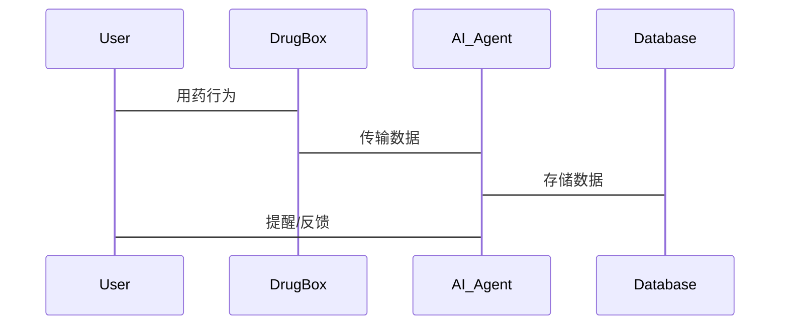

                 


# 智能药盒：AI Agent的用药安全监督助手

## 关键词：智能药盒, AI Agent, 用药安全, 健康管理, 人工智能, 医疗科技

## 摘要：智能药盒是一种结合人工智能技术的用药管理工具，通过AI Agent实现对用药过程的实时监督和智能提醒，有效提升用药安全性和患者健康管理水平。本文将从背景、概念、算法、系统架构、项目实战等方面详细探讨智能药盒的设计与实现，为医疗科技领域提供新的思路与解决方案。

---

# 第1章：智能药盒的背景与问题背景

## 1.1 问题背景

### 1.1.1 用药安全的重要性
用药安全是医疗健康领域的重要组成部分。据统计，每年因用药不当导致的医疗事故占全部医疗事故的30%以上。老年人、慢性病患者以及服药种类较多的患者，更容易因忘记服药、重复用药或剂量错误而导致严重后果。因此，如何确保患者能够正确、按时用药，成为亟待解决的难题。

### 1.1.2 当前用药管理的痛点
传统的用药管理方式存在以下痛点：
1. **依赖患者记忆力**：患者尤其是老年人容易忘记服药时间或剂量。
2. **缺乏实时监督**：患者可能在无人监督的情况下自行调整用药方案。
3. **信息孤岛**：医疗机构、患者和药盒之间缺乏有效连接，无法实现数据共享与协同。

### 1.1.3 智能药盒的提出与目标
智能药盒通过结合人工智能技术，实时监督患者的用药行为，确保用药安全。其目标是：
- 提醒患者按时服药，避免漏服或重复用药。
- 监测用药剂量，防止过量或不足。
- 实时反馈用药数据，帮助医生和家属了解患者的用药情况。

## 1.2 问题描述
### 1.2.1 用药安全问题的具体表现
- 患者忘记服药，导致病情加重。
- 用药剂量错误，引发不良反应。
- 重复用药或药物相互作用，增加健康风险。

### 1.2.2 智能药盒需要解决的核心问题
- 实时监测患者的用药行为。
- 提供智能提醒和反馈。
- 确保用药数据的准确性和实时性。

### 1.2.3 问题的边界与外延
智能药盒的边界包括：
- 仅关注用药过程中的安全问题。
- 不涉及疾病的诊断和治疗方案的制定。
- 主要针对慢性病患者和老年人群体。

## 1.3 问题解决思路
### 1.3.1 利用AI技术提升用药安全
AI Agent（人工智能代理）通过感知、决策和执行三个阶段，实现对用药行为的实时监督。

### 1.3.2 智能药盒的设计思路与框架
智能药盒的设计框架包括：
1. **数据采集**：通过传感器采集患者的用药行为数据。
2. **数据处理**：对采集的数据进行清洗和分析。
3. **智能决策**：基于规则或机器学习模型，生成用药提醒或警告。
4. **反馈执行**：通过语音提醒或报警等方式，指导患者正确用药。

## 1.4 智能药盒的核心概念
### 1.4.1 AI Agent的定义与作用
AI Agent是一种能够感知环境、做出决策并执行任务的智能体。在智能药盒中，AI Agent的主要作用是：
- 感知患者的用药行为。
- 分析用药数据，判断是否符合用药方案。
- 提供反馈和建议。

### 1.4.2 智能药盒的功能与结构
智能药盒的功能包括：
1. **用药提醒**：根据患者的用药计划，提供语音或视觉提醒。
2. **用药监测**：监测患者的用药行为，记录用药数据。
3. **异常报警**：当发现用药异常时，及时报警并通知相关人员。

### 1.4.3 核心概念的边界与外延
智能药盒的核心概念边界包括：
- 仅关注用药过程中的安全问题，不涉及疾病的诊断和治疗。
- 通过AI Agent实现智能化监督，不依赖人工干预。

---

# 第2章：智能药盒的核心概念与联系

## 2.1 AI Agent的核心原理

### 2.1.1 感知层：数据采集与处理
AI Agent通过传感器采集患者的用药行为数据，包括：
- 用药时间
- 用药剂量
- 用药频率

数据采集后，AI Agent需要对数据进行清洗和预处理，确保数据的准确性和完整性。

### 2.1.2 决策层：规则推理与优化
AI Agent通过规则推理或机器学习模型，判断患者的用药行为是否符合用药方案。例如：
- 基于规则推理：根据预设的规则，判断患者的用药行为是否异常。
- 基于机器学习：通过训练数据，学习患者的用药规律，预测可能的异常行为。

### 2.1.3 执行层：指令输出与反馈
当AI Agent发现用药异常时，会触发相应的反馈机制，例如：
- 发出语音提醒
- 发送报警信息
- 提供用药建议

## 2.2 智能药盒的概念属性对比

### 2.2.1 智能药盒与传统药盒的对比
| 特性                | 智能药盒                          | 传统药盒                          |
|---------------------|-----------------------------------|------------------------------------|
| 功能                | 提醒、监测、反馈                  | 存储药品、提醒                     |
| 技术实现            | AI Agent、传感器、云计算         | 机械结构、简单电子元件           |
| 用户群体            | 慢性病患者、老年人               | 所有患者                          |

### 2.2.2 AI Agent与其他监督工具的对比
| 特性                | AI Agent                          | 传统监督工具                      |
|---------------------|-----------------------------------|------------------------------------|
| 智能性              | 高                                 | 低                                 |
| 适应性              | 能根据数据动态调整              | 固定规则                          |
| 反馈机制            | 实时反馈                          | 延时反馈                          |

## 2.3 实体关系图

### 2.3.1 用户、药盒、AI Agent的实体关系


### 2.3.2 数据流与交互关系
```mermaid
graph TD
    User -> DrugBox: 用药行为
    DrugBox -> AI_Agent: 数据传输
    AI_Agent -> Database: 数据存储
    AI_Agent -> User: 提醒/反馈
```

---

# 第3章：智能药盒的算法原理

## 3.1 算法原理概述

### 3.1.1 基于规则的AI Agent
基于规则的AI Agent通过预设的规则进行推理和判断。例如：
- 规则1：如果患者在规定时间之后未服药，则触发提醒。
- 规则2：如果患者连续两天未服药，则触发报警。

### 3.1.2 基于机器学习的AI Agent
基于机器学习的AI Agent通过训练数据，学习患者的用药规律，预测可能的异常行为。例如：
- 使用时间序列模型预测患者的用药时间。
- 使用分类模型判断患者的用药行为是否异常。

## 3.2 算法流程图

### 3.2.1 感知模块流程图
```mermaid
graph TD
    start -->采集数据--> sensor
    sensor -->传输数据--> AI_Agent
    AI_Agent -->判断数据是否正常--> decision
    decision -->是--> 提醒用户
    decision -->否--> 继续监测
    end
```

### 3.2.2 决策模块流程图
```mermaid
graph TD
    start -->获取用药数据--> database
    database -->提取特征--> feature_extractor
    feature_extractor -->输入模型--> model
    model -->输出决策结果--> decision
    decision -->触发反馈--> feedback
    end
```

## 3.3 算法实现与优化

### 3.3.1 算法实现
以下是一个基于规则的AI Agent的Python代码示例：
```python
class AIAgent:
    def __init__(self):
        self.rules = []
    
    def add_rule(self, rule):
        self.rules.append(rule)
    
    def decide(self, data):
        for rule in self.rules:
            if rule.condition(data):
                return rule.action(data)
        return None

class Rule:
    def __init__(self, condition, action):
        self.condition = condition
        self.action = action

# 示例规则
def condition_1(data):
    return data['time'] > data['scheduled_time']

def action_1(data):
    return '提醒用户服药'

agent = AIAgent()
rule = Rule(condition_1, action_1)
agent.add_rule(rule)
```

### 3.3.2 算法优化
- **规则优化**：根据实际数据，动态调整规则的优先级。
- **模型优化**：使用更复杂的机器学习模型，提高预测精度。

---

# 第4章：智能药盒的系统分析与架构设计

## 4.1 问题场景介绍
以老年慢性病患者为例，患者需要每天服用多种药物，但容易忘记或记错用药时间。智能药盒通过AI Agent实时监督患者的用药行为，确保用药安全。

## 4.2 系统功能设计

### 4.2.1 领域模型


### 4.2.2 系统架构设计


### 4.2.3 接口设计
- **输入接口**：接收用户的用药数据。
- **输出接口**：提供用药提醒和反馈。

### 4.2.4 交互流程图


---

# 第5章：智能药盒的项目实战

## 5.1 环境安装

### 5.1.1 安装Python
```bash
python --version
pip install --upgrade pip
```

### 5.1.2 安装依赖库
```bash
pip install numpy
pip install scikit-learn
pip install pymermaid
```

## 5.2 系统核心实现

### 5.2.1 核心代码
```python
import numpy as np
from sklearn.model_selection import train_test_split

# 示例数据集
data = np.array([...])  # 具体数据集
X_train, X_test, y_train, y_test = train_test_split(data, labels, test_size=0.2)

# 训练模型
model.fit(X_train, y_train)

# 预测
y_pred = model.predict(X_test)
```

### 5.2.2 代码解读
- 数据预处理：对数据进行清洗和特征提取。
- 模型训练：使用机器学习模型训练AI Agent的决策能力。
- 模型预测：根据输入数据，预测患者的用药行为是否异常。

## 5.3 实际案例分析

### 5.3.1 案例背景
假设一位老年糖尿病患者，需要每天早晚各服用一次胰岛素。智能药盒通过AI Agent实时监督患者的用药行为，确保用药安全。

### 5.3.2 案例分析
- **用药提醒**：AI Agent根据患者的用药计划，提前15分钟发出提醒。
- **用药监测**：记录患者的用药时间、剂量和频率。
- **异常报警**：当患者漏服药物时，AI Agent立即发出报警，并通知家属或医生。

## 5.4 项目小结
通过实际案例分析，可以验证智能药盒的有效性和实用性。AI Agent能够显著提高患者的用药依从性，降低用药风险。

---

# 第6章：智能药盒的总结与展望

## 6.1 本章小结
智能药盒通过AI Agent实现对用药行为的实时监督，显著提高了用药安全性和患者的健康管理水平。本文详细探讨了智能药盒的背景、核心概念、算法原理、系统架构和项目实战，为医疗科技领域提供了新的解决方案。

## 6.2 未来展望
随着人工智能技术的不断发展，智能药盒的功能将更加智能化和个性化。未来的研究方向包括：
- 基于AI的个性化用药方案制定。
- 智能药盒与医疗机构的信息协同。
- 更加智能化的反馈机制，例如情感计算和自然语言处理。

---

# 作者：AI天才研究院/AI Genius Institute & 禅与计算机程序设计艺术 /Zen And The Art of Computer Programming

---

以上就是《智能药盒：AI Agent的用药安全监督助手》的完整目录大纲和文章内容。文章从背景、概念、算法、系统架构、项目实战等多个方面详细探讨了智能药盒的设计与实现，为医疗科技领域提供了新的思路与解决方案。

