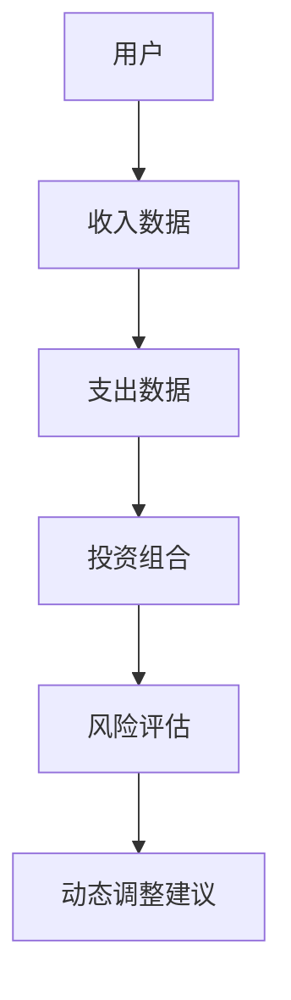
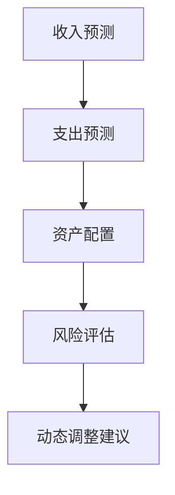
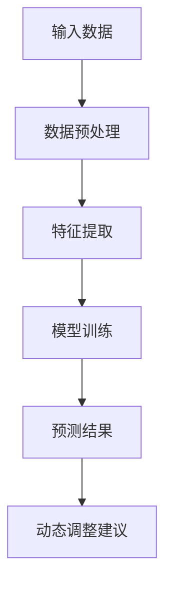
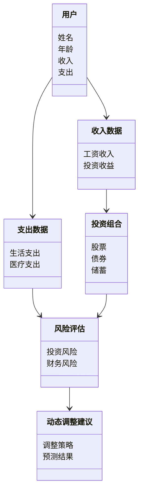
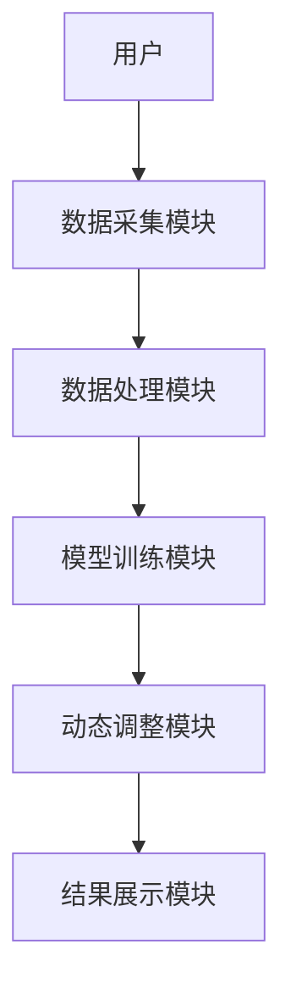
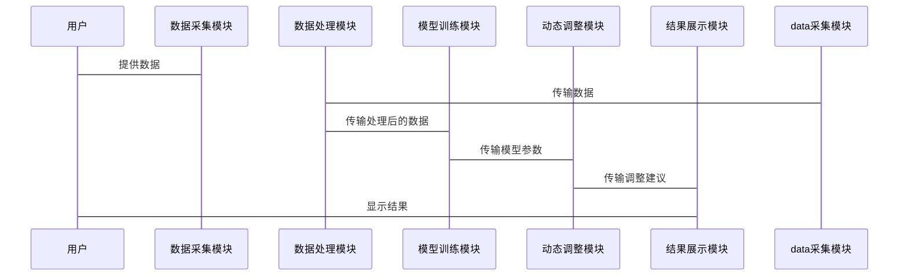

                 


# 智能退休收入规划动态调整器

> 关键词：智能退休收入规划、动态调整器、人工智能算法、多目标优化、系统架构设计

> 摘要：本文介绍了一种基于人工智能的智能退休收入规划动态调整器，探讨了其核心概念、算法原理、系统架构设计以及实际应用。通过详细分析动态调整算法、系统功能设计和项目实战，展示了如何利用智能技术优化退休收入规划，为用户提供个性化的财务建议。

---

# 第一部分: 智能退休收入规划动态调整器概述

# 第1章: 智能退休收入规划动态调整器的背景与意义

## 1.1 退休收入规划的重要性

### 1.1.1 退休收入规划的核心问题
退休收入规划的核心问题在于如何确保在退休后维持稳定的收入水平，以应对生活开支和突发状况。传统的方法依赖于固定的收入来源和假设，缺乏灵活性和适应性。随着经济环境的变化和个人生命周期的不同阶段，固定规划往往无法满足实际需求。

### 1.1.2 传统退休收入规划的局限性
传统退休收入规划方法通常基于静态模型，无法动态调整以应对市场变化和个体需求的变化。例如，投资回报率的波动、通货膨胀、个人健康状况的变化等因素都会影响退休收入的可持续性。此外，传统方法难以提供个性化的建议，难以满足不同用户的多样化需求。

### 1.1.3 智能技术在退休收入规划中的应用价值
智能技术，特别是人工智能和大数据分析，为退休收入规划带来了新的可能性。通过实时数据采集、分析和动态调整，智能退休收入规划动态调整器能够根据市场变化和个人情况的变化，提供更加精准和个性化的建议，从而提高规划的可靠性和灵活性。

## 1.2 智能动态调整器的定义与特点

### 1.2.1 智能动态调整器的定义
智能退休收入规划动态调整器是一种基于人工智能和大数据分析的工具，能够根据用户的实时数据和市场变化，动态调整退休收入规划方案，以确保收入的可持续性和最大化。

### 1.2.2 动态调整器的核心特点
- **实时性**：能够实时获取和分析市场数据，及时调整规划方案。
- **个性化**：根据用户的财务状况、风险偏好和生命周期阶段，提供个性化的建议。
- **多目标优化**：在多个目标之间进行优化，如最大化收入、最小化风险、平衡短期和长期需求等。
- **自适应性**：能够根据用户的反馈和市场变化，自动调整规划方案。

### 1.2.3 智能动态调整器与传统规划工具的区别
与传统规划工具相比，智能动态调整器具有更高的灵活性和适应性。传统工具通常基于固定的模型和假设，而智能动态调整器能够根据实时数据和用户反馈，动态调整规划方案，提供更加精准和个性化的建议。

## 1.3 智能动态调整器的应用场景

### 1.3.1 退休前的规划阶段
在退休前，用户可以通过智能动态调整器进行模拟规划，评估不同投资策略和储蓄计划的效果，并根据市场变化和个人财务状况调整规划方案。

### 1.3.2 退休后的收入调整阶段
在退休后，用户的收入来源可能会发生变化，如投资回报率的变化、健康状况的影响等。智能动态调整器能够根据这些变化，动态调整收入分配和支出计划，确保收入的可持续性。

### 1.3.3 不同生命周期阶段的应用
智能动态调整器可以应用于不同生命周期阶段的退休收入规划，如单身期、家庭期、退休期等。在每个阶段，动态调整器都能够根据用户的财务状况和目标，提供个性化的建议。

## 1.4 本章小结
本章介绍了智能退休收入规划动态调整器的背景和意义，强调了智能技术在退休收入规划中的重要性，并总结了动态调整器的核心特点和应用场景。

---

# 第二部分: 智能退休收入规划动态调整器的核心概念与联系

# 第2章: 核心概念与原理

## 2.1 智能动态调整器的核心原理

### 2.1.1 数据驱动的动态调整机制
智能动态调整器基于实时数据的采集和分析，通过机器学习算法，构建动态调整模型，实现对退休收入规划方案的实时优化。

### 2.1.2 人工智能算法的应用
人工智能算法，如强化学习和深度学习，被广泛应用于动态调整器中。这些算法能够帮助模型在复杂的环境中进行决策，实现多目标优化。

### 2.1.3 多目标优化模型的构建
在智能动态调整器中，多目标优化模型用于在多个目标之间找到平衡点，如最大化收入、最小化风险、平衡短期和长期需求等。

## 2.2 核心概念对比分析

### 2.2.1 不同规划工具的核心概念对比
以下表格展示了智能动态调整器与其他规划工具的核心概念对比：

| 规划工具 | 数据驱动性 | 动态调整能力 | 个性化能力 |
|----------|------------|-------------|------------|
| 传统静态工具 | 低         | 无           | 低          |
| 智能动态调整器 | 高         | 高           | 高          |

### 2.2.2 动态调整器与静态规划工具的对比
动态调整器与静态规划工具的主要区别在于其动态性和适应性。静态工具基于固定模型和假设，而动态调整器能够根据实时数据和用户反馈，动态调整规划方案。

### 2.2.3 不同算法的优缺点分析
以下表格展示了不同算法的优缺点：

| 算法         | 优点               | 缺点               |
|--------------|--------------------|--------------------|
| 强化学习      | 能够在复杂环境中进行决策 | 计算复杂度高         |
| 深度学习      | 能够处理非结构化数据 | 需要大量数据支持     |
| 时间序列分析 | 适合预测未来趋势   | 依赖于历史数据质量   |

## 2.3 实体关系图与概念架构

### 2.3.1 实体关系图（ER图）



### 2.3.2 核心概念架构图



## 2.4 本章小结
本章详细阐述了智能动态调整器的核心概念与原理，通过对比分析和图表展示了其与传统工具的区别和优势，为后续的算法实现和系统设计奠定了基础。

---

# 第三部分: 智能动态调整器的算法原理与实现

# 第3章: 动态调整算法原理

## 3.1 动态调整算法的核心原理

### 3.1.1 基于机器学习的动态调整模型
智能动态调整器的核心算法基于机器学习，特别是强化学习和深度学习。通过训练模型，动态调整器能够根据实时数据和用户反馈，动态调整退休收入规划方案。

### 3.1.2 多目标优化算法的应用
多目标优化算法在动态调整器中用于在多个目标之间找到平衡点，如最大化收入、最小化风险等。通过构建多目标优化模型，动态调整器能够提供更加个性化的建议。

### 3.1.3 时间序列分析在收入预测中的应用
时间序列分析是一种常用的数据分析方法，用于预测未来趋势。在动态调整器中，时间序列分析被用于预测退休后的收入和支出变化，从而优化规划方案。

## 3.2 算法流程图



## 3.3 算法实现

### 3.3.1 数据预处理
在模型训练之前，需要对数据进行预处理，包括数据清洗、特征工程等。

```python
import pandas as pd
import numpy as np

# 数据清洗
data = pd.read_csv('input.csv')
data = data.dropna()
data = pd.get_dummies(data)

# 特征工程
from sklearn.preprocessing import StandardScaler
scaler = StandardScaler()
X = scaler.fit_transform(data.drop('target', axis=1))
y = data['target']
```

### 3.3.2 模型训练
使用强化学习算法进行模型训练。

```python
import gym
from gym import spaces
import numpy as np

class RetirementIncomeEnv(gym.Env):
    def __init__(self):
        self.state = None
        self.action_space = spaces.Box(low=-1, high=1, shape=(1,))
        self.observation_space = spaces.Box(low=0, high=np.inf, shape=(1,))
    
    def step(self, action):
        # 状态更新
        self.state = self.state * (1 + action)
        # 奖励计算
        reward = self.state - previous_state
        return self.state, reward, False, {}
    
    def reset(self):
        self.state = initial_state
        return self.state

# 强化学习算法
import torch
import torch.nn as nn
import torch.optim as optim

class PolicyNetwork(nn.Module):
    def __init__(self, input_dim, output_dim):
        super(PolicyNetwork, self).__init__()
        self.fc1 = nn.Linear(input_dim, 64)
        self.fc2 = nn.Linear(64, output_dim)
    
    def forward(self, x):
        x = torch.relu(self.fc1(x))
        x = torch.sigmoid(self.fc2(x))
        return x

# 训练过程
env = RetirementIncomeEnv()
policy = PolicyNetwork(input_dim, output_dim)
optimizer = optim.Adam(policy.parameters(), lr=0.001)

for _ in range(1000):
    state = env.reset()
    total_reward = 0
    while True:
        action = policy(torch.FloatTensor(state))
        next_state, reward, done, _ = env.step(action)
        total_reward += reward
        if done:
            break
    optimizer.zero_grad()
    loss = -total_reward
    loss.backward()
    optimizer.step()
```

### 3.3.3 动态调整模型
通过训练好的模型，可以实现动态调整。

### 3.4 本章小结
本章详细介绍了动态调整器的算法原理，包括数据预处理、模型训练和动态调整模型的实现。通过Python代码和流程图展示了算法的实现过程，为后续的系统设计奠定了基础。

---

# 第四部分: 智能动态调整器的系统分析与架构设计

# 第4章: 系统分析与架构设计

## 4.1 问题场景介绍
退休收入规划涉及多个方面，包括收入预测、支出预测、资产配置、风险评估等。智能动态调整器需要能够处理这些复杂的问题，并提供个性化的建议。

## 4.2 项目介绍

### 4.2.1 项目目标
- 提供个性化的退休收入规划建议。
- 实现动态调整功能，根据市场变化和个人需求变化优化规划方案。
- 提供多目标优化，平衡收入、风险和生命周期需求。

### 4.2.2 项目范围
- 数据采集与处理。
- 模型训练与优化。
- 系统设计与实现。

## 4.3 系统功能设计

### 4.3.1 领域模型（mermaid类图）



### 4.3.2 系统架构设计（mermaid架构图）



## 4.4 系统接口设计

### 4.4.1 输入接口
- 用户输入：包括收入、支出、资产配置等信息。
- 数据接口：从外部数据源获取市场数据。

### 4.4.2 输出接口
- 动态调整建议：包括调整策略、预测结果等。
- 可视化界面：展示规划方案和调整建议。

## 4.5 系统交互（mermaid序列图）



## 4.6 本章小结
本章详细分析了智能动态调整器的系统架构设计，包括系统功能设计、架构设计和接口设计。通过图表展示了系统的模块划分和交互流程，为后续的项目实现提供了清晰的指导。

---

# 第五部分: 智能动态调整器的项目实战

# 第5章: 项目实战

## 5.1 环境安装

### 5.1.1 安装Python环境
```bash
python --version
pip install numpy pandas scikit-learn gym torch
```

### 5.1.2 安装依赖库
```bash
pip install matplotlib seaborn plotly
```

## 5.2 系统核心实现

### 5.2.1 数据采集与处理
```python
import pandas as pd
import numpy as np

# 数据采集
data = pd.read_csv('input.csv')

# 数据清洗
data = data.dropna()
data = pd.get_dummies(data)

# 特征工程
from sklearn.preprocessing import StandardScaler
scaler = StandardScaler()
X = scaler.fit_transform(data.drop('target', axis=1))
y = data['target']
```

### 5.2.2 模型训练
```python
import gym
from gym import spaces
import numpy as np

class RetirementIncomeEnv(gym.Env):
    def __init__(self):
        self.state = None
        self.action_space = spaces.Box(low=-1, high=1, shape=(1,))
        self.observation_space = spaces.Box(low=0, high=np.inf, shape=(1,))
    
    def step(self, action):
        # 状态更新
        self.state = self.state * (1 + action)
        # 奖励计算
        reward = self.state - previous_state
        return self.state, reward, False, {}
    
    def reset(self):
        self.state = initial_state
        return self.state

# 强化学习算法
import torch
import torch.nn as nn
import torch.optim as optim

class PolicyNetwork(nn.Module):
    def __init__(self, input_dim, output_dim):
        super(PolicyNetwork, self).__init__()
        self.fc1 = nn.Linear(input_dim, 64)
        self.fc2 = nn.Linear(64, output_dim)
    
    def forward(self, x):
        x = torch.relu(self.fc1(x))
        x = torch.sigmoid(self.fc2(x))
        return x

# 训练过程
env = RetirementIncomeEnv()
policy = PolicyNetwork(input_dim, output_dim)
optimizer = optim.Adam(policy.parameters(), lr=0.001)

for _ in range(1000):
    state = env.reset()
    total_reward = 0
    while True:
        action = policy(torch.FloatTensor(state))
        next_state, reward, done, _ = env.step(action)
        total_reward += reward
        if done:
            break
    optimizer.zero_grad()
    loss = -total_reward
    loss.backward()
    optimizer.step()
```

### 5.2.3 动态调整建议生成
```python
import matplotlib.pyplot as plt
import seaborn as sns

# 可视化结果
plt.figure(figsize=(10, 6))
sns.lineplot(x='时间', y='调整建议', data=results)
plt.title('动态调整建议')
plt.xlabel('时间')
plt.ylabel('调整建议')
plt.show()
```

## 5.3 案例分析与详细解读

### 5.3.1 案例分析
假设一位用户在退休前有一定的储蓄和投资，但市场环境发生了变化，如通货膨胀率上升，投资回报率下降。智能动态调整器能够根据这些变化，调整用户的退休收入规划，优化资产配置，以确保收入的可持续性。

### 5.3.2 实际应用
通过实际数据的输入和模型的训练，动态调整器能够生成个性化的调整建议，帮助用户在退休前后实现财务稳定。

## 5.4 本章小结
本章通过实际案例展示了智能动态调整器的实现过程，包括环境安装、系统核心实现和案例分析。通过Python代码和可视化结果，直观地展示了动态调整器的应用效果。

---

# 第六部分: 总结与展望

# 第6章: 总结与展望

## 6.1 全文总结
智能退休收入规划动态调整器是一种基于人工智能的工具，能够根据实时数据和用户反馈，动态调整退休收入规划方案，为用户提供个性化的财务建议。本文详细介绍了其核心概念、算法原理、系统架构设计和实际应用，展示了其在退休收入规划中的重要价值。

## 6.2 未来展望
随着人工智能技术的不断发展，智能动态调整器将更加智能化和个性化。未来的研究方向包括优化算法、提升系统的实时性和准确性，以及扩展其应用场景，如全球化市场和多币种投资等。

---

# 作者：AI天才研究院/AI Genius Institute & 禅与计算机程序设计艺术 /Zen And The Art of Computer Programming

