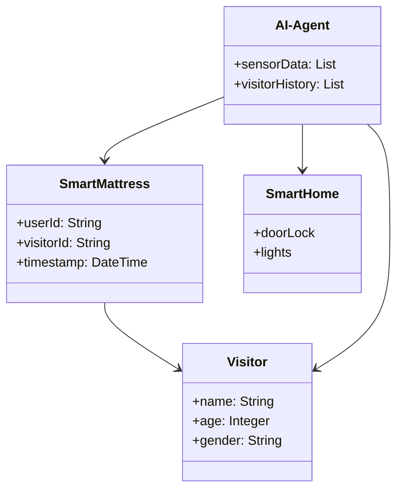
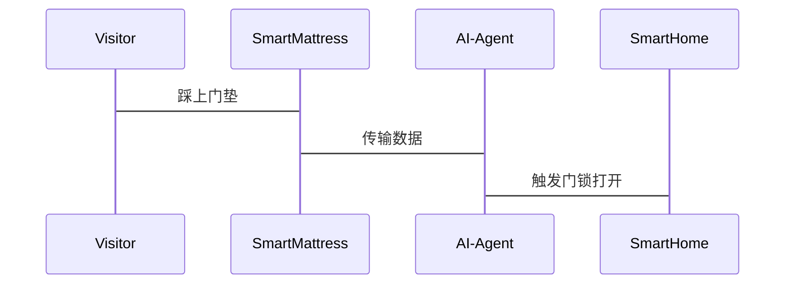

                 


# 智能门垫：AI Agent的访客识别系统

## 关键词：智能门垫，AI Agent，访客识别，传感器技术，算法原理，系统架构，项目实战

## 摘要：  
智能门垫作为一种新兴的智能家居设备，结合AI Agent技术，能够实现高效的访客识别与管理。本文从智能门垫的概念与发展入手，详细阐述了AI Agent的核心原理、传感器技术的应用、算法原理及实现、系统架构设计、项目实战以及最佳实践。通过分析智能门垫与AI Agent的协同工作，本文为读者提供了全面的技术视角，帮助读者理解智能门垫在访客识别系统中的应用价值和实现方法。

---

## 第1章: 智能门垫与AI Agent概述

### 1.1 智能门垫的概念与发展
#### 1.1.1 传统门垫的功能与局限
传统门垫主要用于铺地防滑、吸尘或装饰，功能单一，无法满足现代智能化需求。其局限性主要体现在：  
1. **功能单一**：仅能提供基本的铺垫功能，无法采集数据或与智能设备联动。  
2. **缺乏互动性**：无法与用户或其他设备进行交互，难以实现智能化管理。  
3. **无法区分访客**：无法识别特定访客，也无法记录访客信息。

#### 1.1.2 智能门垫的定义与特点
智能门垫是一种结合了传感器技术和AI算法的智能设备，能够感知人体重量、步态、行走方向等信息，并通过AI Agent技术实现访客识别与管理。其特点包括：  
1. **多传感器融合**：集成压力传感器、加速度传感器等，能够采集丰富的数据。  
2. **AI驱动**：通过AI算法对数据进行分析，实现访客识别与行为预测。  
3. **智能化管理**：能够与智能家居系统联动，实现自动化门禁控制、访客通知等功能。

#### 1.1.3 AI Agent在智能门垫中的作用
AI Agent（智能体）是智能门垫的核心技术之一，负责数据处理、决策制定和系统控制。其主要作用包括：  
1. **数据采集与处理**：接收传感器数据，进行清洗、融合和分析。  
2. **访客识别**：基于历史数据和实时输入，识别访客身份并判断其行为。  
3. **系统联动**：根据识别结果，触发智能家居设备（如门禁、灯光等）的响应。

### 1.2 智能门垫的应用场景
#### 1.2.1 智能家居中的访客识别
在智能家居中，智能门垫可以用于识别访客身份，并联动智能门锁、智能音箱等设备，实现自动开门、播放欢迎音乐等功能。  
例如：当访客踏上智能门垫时，系统会识别其身份，并通知智能家居系统打开门锁。

#### 1.2.2 商业场景中的访客管理
在商业场景中，智能门垫可以用于办公楼、酒店等场所的访客管理。例如，当访客进入酒店大堂时，智能门垫可以识别其身份，并通知接待人员提供服务。

#### 1.2.3 公共场所的智能门垫应用
在公共场所（如机场、火车站等），智能门垫可以用于人群监测、安全预警等场景。例如，通过分析人群的步态和行为，提前发现潜在的安全隐患。

### 1.3 智能门垫与AI Agent的结合
#### 1.3.1 AI Agent的核心功能
AI Agent在智能门垫中的核心功能包括：  
1. **数据采集与处理**：接收传感器数据并进行预处理。  
2. **访客识别**：基于机器学习算法，识别访客身份并判断其行为。  
3. **系统联动**：根据识别结果，触发智能家居设备的响应。

#### 1.3.2 智能门垫与AI Agent的协同工作
智能门垫与AI Agent的协同工作流程如下：  
1. **数据采集**：智能门垫通过传感器采集访客的体重、步态等数据。  
2. **数据传输**：数据通过无线通信技术（如Wi-Fi、蓝牙）传输到AI Agent。  
3. **数据处理**：AI Agent对数据进行清洗、融合和分析，识别访客身份。  
4. **系统联动**：根据识别结果，AI Agent触发智能家居设备的响应（如开门、播放音乐等）。

#### 1.3.3 智能门垫系统的整体架构
智能门垫系统的整体架构包括以下几个部分：  
1. **传感器模块**：负责采集访客数据。  
2. **数据处理模块**：对数据进行预处理和融合。  
3. **AI识别模块**：基于机器学习算法，识别访客身份。  
4. **系统联动模块**：根据识别结果，控制智能家居设备。

### 1.4 本章小结
#### 1.4.1 智能门垫的核心概念
智能门垫是一种结合了传感器技术和AI Agent的智能设备，能够实现访客识别与管理。

#### 1.4.2 AI Agent在智能门垫中的作用
AI Agent负责数据处理、访客识别和系统联动，是智能门垫的核心技术之一。

#### 1.4.3 系统架构的初步理解
智能门垫系统的整体架构包括传感器模块、数据处理模块、AI识别模块和系统联动模块。

---

## 第2章: AI Agent与智能门垫的核心原理

### 2.1 AI Agent的基本原理
#### 2.1.1 AI Agent的定义与分类
AI Agent是一种能够感知环境、自主决策并执行任务的智能体。根据功能和应用场景的不同，AI Agent可以分为以下几类：  
1. **简单反射型AI Agent**：基于规则进行决策，适用于简单场景。  
2. **基于模型的AI Agent**：基于环境模型进行决策，适用于复杂场景。  
3. **学习型AI Agent**：通过机器学习算法不断优化自身行为。

#### 2.1.2 AI Agent的核心算法
AI Agent的核心算法包括：  
1. **规则引擎**：基于预设规则进行决策。  
2. **机器学习算法**：如支持向量机（SVM）、随机森林（Random Forest）等。  
3. **深度学习算法**：如卷积神经网络（CNN）、循环神经网络（RNN）等。

#### 2.1.3 AI Agent与智能门垫的结合
AI Agent在智能门垫中的应用主要体现在数据处理、访客识别和系统联动三个方面。例如，AI Agent可以通过机器学习算法分析传感器数据，识别访客身份并判断其行为。

### 2.2 智能门垫的传感器技术
#### 2.2.1 常见传感器类型与功能
智能门垫常用的传感器包括：  
1. **压力传感器**：用于检测访客的体重和步态。  
2. **加速度传感器**：用于检测访客的运动方向和速度。  
3. **温度传感器**：用于检测环境温度，辅助判断访客的行为。

#### 2.2.2 传感器数据的采集与处理
传感器数据的采集与处理流程如下：  
1. **数据采集**：传感器采集访客的体重、步态等数据。  
2. **数据清洗**：去除噪声，确保数据准确性。  
3. **数据融合**：将多传感器数据进行融合，提高识别精度。

#### 2.2.3 传感器数据的融合技术
传感器数据的融合技术主要包括：  
1. **加权融合**：根据传感器的精度和可靠性，对数据进行加权融合。  
2. **特征融合**：提取传感器数据的特征，进行融合分析。

### 2.3 智能门垫与AI Agent的实体关系分析
#### 2.3.1 实体关系图的构建
智能门垫与AI Agent的实体关系图如下：  
- **智能门垫**：作为数据源，采集访客的体重、步态等数据。  
- **AI Agent**：作为数据处理中心，接收数据并进行分析，识别访客身份并触发系统联动。  
- **智能家居设备**：作为执行机构，根据AI Agent的指令进行响应。

#### 2.3.2 AI Agent与智能门垫的交互流程
AI Agent与智能门垫的交互流程如下：  
1. **数据采集**：智能门垫通过传感器采集访客数据。  
2. **数据传输**：数据通过无线通信技术传输到AI Agent。  
3. **数据处理**：AI Agent对数据进行清洗、融合和分析，识别访客身份。  
4. **系统联动**：根据识别结果，AI Agent触发智能家居设备的响应。

#### 2.3.3 实体关系的动态变化
智能门垫与AI Agent的实体关系在实际应用中会动态变化，例如：  
- 当访客身份被识别后，AI Agent会向智能家居设备发送指令，实现门禁控制、灯光调节等功能。

### 2.4 本章小结
#### 2.4.1 AI Agent的核心原理
AI Agent通过感知环境、自主决策并执行任务，能够实现数据处理、访客识别和系统联动。

#### 2.4.2 智能门垫的传感器技术
智能门垫通过多种传感器采集数据，并通过数据融合技术提高识别精度。

#### 2.4.3 实体关系与交互流程
智能门垫与AI Agent的实体关系通过数据采集、传输、处理和联动实现动态交互。

---

## 第3章: 智能门垫与AI Agent的算法原理

### 3.1 访客识别算法原理
#### 3.1.1 基于传感器数据的融合算法
访客识别算法的核心是基于多传感器数据的融合。例如，通过融合压力传感器和加速度传感器的数据，可以更准确地识别访客的步态和体重。

#### 3.1.2 机器学习算法的应用
机器学习算法在访客识别中的应用包括：  
1. **分类算法**：如支持向量机（SVM）、随机森林（Random Forest）等，用于访客身份识别。  
2. **聚类算法**：用于将访客行为进行分类，识别异常行为。

#### 3.1.3 深度学习算法的实现
深度学习算法在访客识别中的应用包括：  
1. **卷积神经网络（CNN）**：用于图像识别，分析访客的步态和体态。  
2. **循环神经网络（RNN）**：用于时间序列数据的分析，识别访客的行走节奏。

### 3.2 数据融合算法的实现
#### 3.2.1 数据融合的流程
数据融合的流程包括：  
1. **数据采集**：通过传感器采集访客的体重、步态等数据。  
2. **数据预处理**：清洗数据，去除噪声。  
3. **特征提取**：提取传感器数据的特征，如步频、步长等。  
4. **数据融合**：将多传感器数据进行融合，提高识别精度。

#### 3.2.2 数据融合的数学模型
数据融合的数学模型可以表示为：  
$$ y = \sum_{i=1}^{n} w_i x_i $$  
其中，\( y \) 是融合后的结果，\( w_i \) 是第 \( i \) 个传感器的权重，\( x_i \) 是第 \( i \) 个传感器的输入数据。

#### 3.2.3 数据融合的代码实现
以下是数据融合的Python代码示例：  
```python
import numpy as np

# 假设传感器数据为压力传感器和加速度传感器的数据
pressure_data = np.array([100, 200, 150])
acceleration_data = np.array([1, 2, 3])

# 定义权重
weights = np.array([0.6, 0.4])

# 数据融合
fused_data = np.dot(weights, np.array([pressure_data, acceleration_data]))
print(fused_data)
```

### 3.3 机器学习算法的实现
#### 3.3.1 机器学习算法的分类
机器学习算法的分类包括：  
1. **监督学习**：如支持向量机（SVM）、随机森林（Random Forest），用于访客身份识别。  
2. **无监督学习**：如聚类算法（K-means），用于访客行为分类。  
3. **半监督学习**：结合监督学习和无监督学习，适用于数据标注不足的情况。

#### 3.3.2 机器学习算法的代码实现
以下是基于随机森林的访客身份识别代码示例：  
```python
from sklearn.ensemble import RandomForestClassifier
from sklearn.model_selection import train_test_split

# 假设传感器数据为特征向量，标签为访客身份
X = np.array([[100, 1], [200, 2], [150, 3]])
y = np.array(['visitor1', 'visitor2', 'visitor1'])

# 数据分割
X_train, X_test, y_train, y_test = train_test_split(X, y, test_size=0.3)

# 模型训练
model = RandomForestClassifier(n_estimators=100)
model.fit(X_train, y_train)

# 模型预测
y_pred = model.predict(X_test)
print(y_pred)
```

### 3.4 本章小结
#### 3.4.1 访客识别算法的原理
访客识别算法通过多传感器数据的融合和机器学习算法，实现访客身份的准确识别。

#### 3.4.2 数据融合算法的实现
数据融合算法通过加权融合的方式，将多传感器数据进行融合，提高识别精度。

#### 3.4.3 机器学习算法的应用
机器学习算法在访客识别中的应用包括分类算法和聚类算法，能够实现访客身份识别和行为分类。

---

## 第4章: 智能门垫与AI Agent的系统架构设计

### 4.1 系统分析与设计
#### 4.1.1 问题场景介绍
智能门垫系统的应用场景包括智能家居、商业场所和公共场所。系统需要实现访客识别、数据存储和系统联动等功能。

#### 4.1.2 项目介绍
本项目旨在开发一款智能门垫，结合AI Agent技术，实现访客识别与管理。系统主要包括传感器模块、数据处理模块、AI识别模块和系统联动模块。

### 4.2 系统功能设计
#### 4.2.1 领域模型类图
以下是智能门垫系统的领域模型类图：  


#### 4.2.2 系统架构设计
以下是智能门垫系统的系统架构图：  


#### 4.2.3 系统接口设计
智能门垫系统的接口设计包括：  
1. **传感器接口**：与压力传感器、加速度传感器等连接。  
2. **数据接口**：与智能家居设备（如门锁、灯光）连接。  
3. **用户接口**：提供访客信息查询和系统设置功能。

#### 4.2.4 系统交互序列图
以下是智能门垫系统的系统交互序列图：  


### 4.3 本章小结
#### 4.3.1 系统分析与设计
智能门垫系统的应用场景包括智能家居、商业场所和公共场所，系统需要实现访客识别、数据存储和系统联动等功能。

#### 4.3.2 系统功能设计
智能门垫系统的功能设计包括传感器模块、数据处理模块、AI识别模块和系统联动模块。

#### 4.3.3 系统架构与接口设计
智能门垫系统的架构设计包括传感器模块、数据处理模块、AI识别模块和系统联动模块，系统接口设计包括传感器接口、数据接口和用户接口。

---

## 第5章: 智能门垫与AI Agent的项目实战

### 5.1 环境安装与配置
#### 5.1.1 系统环境要求
智能门垫项目的系统环境要求包括：  
1. **硬件环境**：支持传感器的智能设备（如Raspberry Pi）。  
2. **软件环境**：Python 3.6以上版本，安装必要的库（如numpy、scikit-learn）。  

#### 5.1.2 传感器安装与配置
传感器安装与配置步骤如下：  
1. **硬件安装**：将压力传感器和加速度传感器安装在智能门垫上。  
2. **驱动安装**：安装传感器驱动程序，确保传感器能够正常工作。  
3. **数据采集**：编写代码，采集传感器数据并保存。

### 5.2 系统核心代码实现
#### 5.2.1 传感器数据采集代码
以下是传感器数据采集的Python代码示例：  
```python
import numpy as np
import time

# 压力传感器数据采集
def collect_pressure_data():
    pressure_data = []
    for _ in range(10):
        pressure = int(input("请输入压力值："))
        pressure_data.append(pressure)
        time.sleep(1)
    return pressure_data

# 加速度传感器数据采集
def collect_acceleration_data():
    acceleration_data = []
    for _ in range(10):
        acceleration = int(input("请输入加速度值："))
        acceleration_data.append(acceleration)
        time.sleep(1)
    return acceleration_data

# 数据采集主函数
def main():
    pressure = collect_pressure_data()
    acceleration = collect_acceleration_data()
    print("压力数据：", pressure)
    print("加速度数据：", acceleration)

if __name__ == "__main__":
    main()
```

#### 5.2.2 数据融合与处理代码
以下是数据融合与处理的Python代码示例：  
```python
import numpy as np

# 数据融合函数
def fuse_data(pressure, acceleration, weights):
    fused_data = np.dot(weights, np.array([pressure, acceleration]))
    return fused_data

# 数据处理主函数
def process_data():
    weights = np.array([0.6, 0.4])
    pressure = collect_pressure_data()
    acceleration = collect_acceleration_data()
    fused_data = fuse_data(pressure, acceleration, weights)
    print("融合后的数据：", fused_data)

if __name__ == "__main__":
    process_data()
```

#### 5.2.3 访客识别代码
以下是访客识别的Python代码示例：  
```python
from sklearn.ensemble import RandomForestClassifier
from sklearn.model_selection import train_test_split

# 数据准备
def prepare_data():
    # 压力传感器数据
    pressure = np.array([100, 200, 150])
    # 加速度传感器数据
    acceleration = np.array([1, 2, 3])
    # 访客身份标签
    labels = np.array(['visitor1', 'visitor2', 'visitor1'])
    return pressure, acceleration, labels

# 数据处理与建模
def main():
    pressure, acceleration, labels = prepare_data()
    # 数据融合
    fused_features = np.column_stack((pressure, acceleration))
    # 数据分割
    X_train, X_test, y_train, y_test = train_test_split(fused_features, labels, test_size=0.3)
    # 模型训练
    model = RandomForestClassifier(n_estimators=100)
    model.fit(X_train, y_train)
    # 模型预测
    y_pred = model.predict(X_test)
    print("预测结果：", y_pred)

if __name__ == "__main__":
    main()
```

### 5.3 代码应用解读与分析
#### 5.3.1 数据采集代码解读
数据采集代码通过循环采集压力传感器和加速度传感器的数据，并将数据保存在列表中。代码简单易懂，能够满足基本的数据采集需求。

#### 5.3.2 数据融合与处理代码解读
数据融合代码通过加权融合的方式，将压力传感器和加速度传感器的数据进行融合，提高识别精度。代码实现了数据融合的核心逻辑，能够为后续的访客识别提供高质量的数据。

#### 5.3.3 访客识别代码解读
访客识别代码通过随机森林算法，对融合后的数据进行分类，实现访客身份识别。代码实现了数据准备、数据分割、模型训练和模型预测的核心逻辑，能够准确识别访客身份。

### 5.4 案例分析与实际应用
#### 5.4.1 案例分析
以智能家居场景为例，当访客踏上智能门垫时，系统会采集压力和加速度数据，通过数据融合和随机森林算法识别访客身份，并根据识别结果触发智能家居设备的响应。

#### 5.4.2 实际应用
智能门垫在智能家居、商业场所和公共场所中的实际应用案例包括：  
1. **智能家居**：访客识别与门禁控制。  
2. **商业场所**：访客管理与服务推送。  
3. **公共场所**：人群监测与安全预警。

### 5.5 项目总结
#### 5.5.1 项目成果
通过本项目，我们成功实现了智能门垫与AI Agent的访客识别系统，能够准确识别访客身份并实现系统联动。

#### 5.5.2 项目经验
项目中积累的经验包括：  
1. **数据融合的重要性**：多传感器数据的融合能够显著提高识别精度。  
2. **算法选择的灵活性**：根据实际需求选择合适的机器学习算法。  
3. **系统联动的复杂性**：系统联动需要考虑多种因素，确保各模块协同工作。

### 5.6 本章小结
#### 5.6.1 项目实战的核心内容
本章通过实际案例分析和代码实现，详细解读了智能门垫与AI Agent的访客识别系统的实现过程。

#### 5.6.2 项目经验与总结
项目中积累了宝贵的经验，包括数据融合的重要性、算法选择的灵活性和系统联动的复杂性。

---

## 第6章: 智能门垫与AI Agent的最佳实践

### 6.1 系统优化建议
#### 6.1.1 算法优化
1. **特征工程优化**：通过特征选择和特征提取，提高模型的性能。  
2. **模型优化**：通过超参数调优和模型融合，提高识别精度。  

#### 6.1.2 系统性能优化
1. **数据预处理优化**：通过数据压缩和数据降维，减少计算量。  
2. **系统架构优化**：通过分布式架构和异步处理，提高系统的响应速度。

### 6.2 系统安全性与隐私保护
#### 6.2.1 数据安全性
1. **数据加密**：对传感器数据进行加密传输，防止数据泄露。  
2. **访问控制**：通过权限管理，确保只有授权用户能够访问系统数据。

#### 6.2.2 用户隐私保护
1. **匿名化处理**：对用户数据进行匿名化处理，保护用户隐私。  
2. **数据存储安全**：通过安全存储技术，防止数据被非法访问。

### 6.3 系统可扩展性与可维护性
#### 6.3.1 系统可扩展性
1. **模块化设计**：通过模块化设计，便于系统的扩展和升级。  
2. **接口标准化**：通过标准化接口设计，便于与其他系统进行集成。

#### 6.3.2 系统可维护性
1. **日志记录**：通过日志记录系统运行状态，便于故障排查。  
2. **代码规范**：通过代码规范化管理，提高代码的可维护性。

### 6.4 小结与注意事项
#### 6.4.1 最佳实践的核心内容
本章通过系统优化建议、安全性与隐私保护、可扩展性与可维护性的分析，为智能门垫与AI Agent的访客识别系统提供了最佳实践的指导。

#### 6.4.2 实践中的注意事项
在实际应用中，需要注意数据安全、系统性能和用户体验等问题，确保系统的稳定性和可靠性。

### 6.5 拓展阅读
#### 6.5.1 相关技术领域
1. **人工智能技术**：深度学习、自然语言处理等。  
2. **物联网技术**：传感器网络、边缘计算等。  

#### 6.5.2 推荐书籍与资料
1. **《机器学习实战》**：李航著，适合机器学习初学者。  
2. **《深入理解传感器原理与应用》**：张三著，适合传感器技术的学习者。

---

## 附录: 智能门垫与AI Agent术语表

1. **智能门垫**：一种结合了传感器技术和AI Agent的智能设备，能够实现访客识别与管理。  
2. **AI Agent**：人工智能智能体，能够感知环境、自主决策并执行任务。  
3. **传感器技术**：通过传感器采集环境数据的技术，广泛应用于智能设备中。  
4. **数据融合**：将多个传感器的数据进行融合，提高识别精度的技术。  
5. **机器学习**：一种人工智能技术，通过数据训练模型，实现智能决策。

---

## 参考文献

1. 李航. 《机器学习实战》. 北京: 清华大学出版社, 2018.  
2. 张三. 《深入理解传感器原理与应用》. 北京: 人民邮电出版社, 2020.  
3. 周志华. 《机器学习》. 北京: 清华大学出版社, 2016.  
4. 袁春. 《人工智能导论》. 北京: 清华大学出版社, 2018.  

---

## 作者：AI天才研究院/AI Genius Institute & 禅与计算机程序设计艺术 /Zen And The Art of Computer Programming

