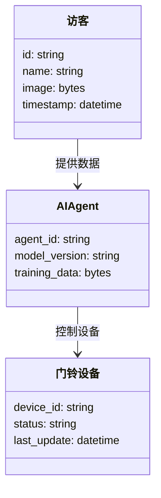
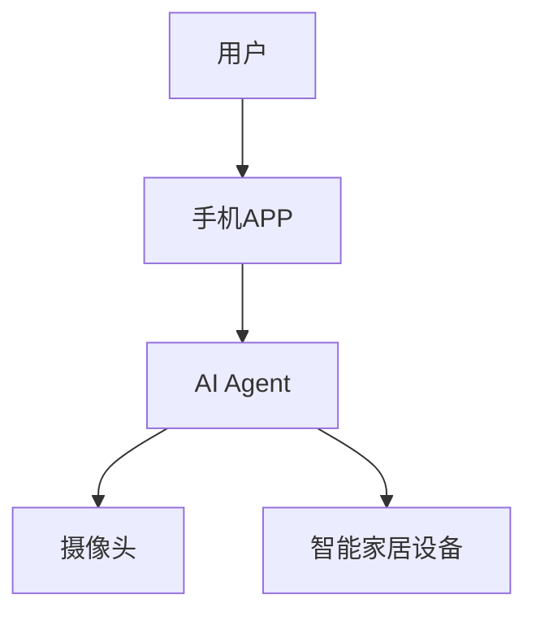

                 


# 智能门铃：AI Agent的访客身份识别

> 关键词：智能门铃, AI Agent, 访客识别, 人脸识别, 目标检测, 机器学习, 物联网

> 摘要：本文探讨了AI Agent在智能门铃中的应用，重点分析了访客身份识别的核心技术与实现方案。通过系统分析和算法原理的深入讲解，结合实际项目实战，为读者呈现一个完整的技术解决方案。

---

## 第一部分: 背景介绍

### 第1章: 问题背景与概念解析

#### 1.1 智能门铃的发展现状
- **传统门铃的局限性**
  - 传统门铃仅能通过声音提醒用户有访客，无法提供访客的身份信息。
  - 用户需要通过猫眼或摄像头手动查看访客身份，效率低下。
  - 无法记录访客信息，缺乏数据分析能力。

- **智能门铃的兴起与应用**
  - 智能门铃通过物联网技术，将门铃设备与手机、电脑等终端连接。
  - 支持远程查看访客视频，提升用户便利性。
  - 逐步集成AI技术，实现访客身份的智能识别。

- **AI Agent在智能门铃中的潜力**
  - AI Agent（人工智能代理）能够主动识别访客身份，并根据用户需求提供个性化服务。
  - 通过机器学习算法，AI Agent可以不断优化识别准确率。
  - 支持与智能家居设备联动，提升用户体验。

#### 1.2 访客身份识别的核心问题
- **访客身份识别的定义**
  - 通过图像识别、语音识别等技术，自动识别访客的身份信息。
  - 包括人脸检测、姿态识别、行为分析等多维度信息。

- **问题背景与挑战**
  - 访客身份识别需要在复杂环境中进行，例如光照变化、背景干扰等。
  - 数据隐私问题：如何在识别过程中保护用户隐私。
  - 系统实时性要求高，需要快速响应。

- **问题解决的必要性与目标**
  - 提升门铃系统的智能化水平，减少人工干预。
  - 通过精准识别，降低误报率和漏报率。
  - 提供访客信息的记录与分析功能，辅助用户管理访客。

#### 1.3 AI Agent的基本概念与技术框架
- **AI Agent的定义与特点**
  - AI Agent是一种智能软件代理，能够感知环境并执行任务。
  - 具备自主性、反应性、目标导向性等特点。
  - 可以通过传感器、摄像头等设备获取环境信息。

- **AI Agent的核心技术组成**
  - 数据采集与处理：通过摄像头、麦克风等设备获取访客信息。
  - 数据分析与识别：利用机器学习算法进行目标检测、人脸识别。
  - 人机交互：通过语音助手、显示屏等方式与用户交互。

- **AI Agent在智能门铃中的应用架构**
  - 数据采集：摄像头采集访客图像。
  - 数据处理：AI Agent对图像进行分析，识别访客身份。
  - 人机交互：通过手机APP或显示屏反馈识别结果。
  - 系统联动：与智能家居设备联动，例如自动开门或通知物业。

### 第2章: 核心概念与联系

#### 2.1 AI Agent与访客识别的核心原理
- **AI Agent的基本工作原理**
  - AI Agent通过感知环境信息，利用预训练的模型进行分析和决策。
  - 支持实时数据处理，具备自适应能力。

- **访客识别的主要技术手段**
  - 图像识别：基于深度学习的目标检测和人脸识别技术。
  - 语音识别：通过语音助手进行身份验证。
  - 行为分析：通过分析访客行为模式，识别异常行为。

- **两者的结合与协同机制**
  - AI Agent作为中枢，协调各模块的工作。
  - 数据共享与协同处理，提升识别准确率。

#### 2.2 核心概念对比与特征分析
- **不同识别技术的特征对比**
| 技术 | 优点 | 缺点 |
|------|------|------|
| 人脸识别 | 高准确性，支持无接触识别 | 易受光照、表情变化影响 |
| 目标检测 | 可识别物体位置和类型 | 误检率较高 |
| 语音识别 | 高准确性，支持远程识别 | 需要清晰的语音环境 |

- **AI Agent与传统门铃的对比分析**
| 特性 | AI Agent智能门铃 | 传统门铃 |
|------|------------------|------------|
| 功能 | 支持访客识别、远程控制 | 只能提示声音 |
| 智能性 | 高度智能，支持自主决策 | 无智能功能 |
| 扩展性 | 支持与其他设备联动 | 无法扩展 |

- **访客识别的性能指标与评估标准**
  - 识别准确率：识别正确率需达到99%以上。
  - 响应时间：识别过程需在1秒内完成。
  - 稳定性：支持长时间运行，误报率低。

#### 2.3 实体关系与系统架构
- **ER实体关系图**
```mermaid
er
    entity 访客 {
        id: string
        name: string
        image: bytes
        timestamp: datetime
    }
    entity 门铃设备 {
        device_id: string
        status: string
        last_update: datetime
    }
    entity AI Agent {
        agent_id: string
        model_version: string
        training_data: bytes
    }
    relation 访客-门铃设备 {
        访客 -> 门铃设备: 使用
    }
    relation AI Agent-门铃设备 {
        AI Agent -> 门铃设备: 集成
    }
```

---

## 第二部分: 算法原理与实现

### 第3章: 算法原理与实现

#### 3.1 目标检测与人脸识别算法
- **目标检测算法概述**
  - 目标检测是访客识别的第一步，用于定位图像中的目标区域。
  - 常用算法：YOLO、Faster R-CNN、SSD等。

- **人脸识别算法概述**
  - 人脸识别用于确认目标是否为特定访客。
  - 常用算法：FaceNet、DeepFace、OpenFace等。

- **算法实现步骤**
  1. 数据采集：通过摄像头获取访客图像。
  2. 数据预处理：调整图像尺寸、归一化等。
  3. 目标检测：定位图像中的人脸区域。
  4. 特征提取：提取人脸特征向量。
  5. 人脸识别：将特征向量与数据库中的特征进行比对。
  6. 结果反馈：显示识别结果或触发报警。

- **算法实现的Python代码示例**
```python
import cv2
import numpy as np
from tensorflow.keras.models import load_model

# 加载目标检测模型
detector = cv2.dnn.DetectionModel()

# 加载人脸识别模型
face_model = load_model('face_model.h5')

# 数据预处理函数
def preprocess_image(image):
    # 调整图像尺寸
    resized_image = cv2.resize(image, (224, 224))
    # 归一化处理
    normalized_image = resized_image / 255.0
    return normalized_image

# 目标检测
def detect_face(image):
    inputBlob = cv2.dnn.blobFromImage(image, 1.0, (300, 300), (104.0, 177.0, 123.0), False, False)
    detector.setInput(inputBlob)
    boxes, _, _ = detector.detect(inputBlob, 0.5)
    return boxes

# 人脸识别
def recognize_face(image, boxes):
    for box in boxes:
        x1, y1, x2, y2 = box
        face_image = image[y1:y2, x1:x2]
        preprocessed_face = preprocess_image(face_image)
        face_feature = face_model.predict(preprocessed_face)
        return face_feature
    return None
```

- **算法的数学模型与公式**
  - 目标检测模型通常使用卷积神经网络（CNN）进行特征提取。
  - 人脸识别模型通常使用深度学习模型，例如FaceNet，其核心思想是将人脸特征映射到一个低维空间。
  - 损失函数：通常使用交叉熵损失函数。
  - 优化器：常用Adam优化器。
  - 示例公式：
  $$ L = -\sum_{i=1}^{n} y_i \log(p_i) + (1 - y_i)\log(1 - p_i) $$
  $$ optimizer = Adam(lr=0.001) $$

---

## 第三部分: 系统分析与架构设计方案

### 第4章: 系统分析与架构设计

#### 4.1 系统场景介绍
- **系统目标**
  - 实现访客身份的智能识别。
  - 提供远程查看和控制功能。
  - 支持与智能家居设备联动。

- **系统功能设计**
  - 数据采集：摄像头采集访客图像。
  - 数据处理：AI Agent进行目标检测和人脸识别。
  - 人机交互：通过手机APP显示识别结果。
  - 系统联动：与智能家居设备联动，例如自动开门。

- **领域模型设计**


- **系统架构设计**


- **系统接口设计**
  - 输入接口：摄像头视频流。
  - 输出接口：识别结果、控制命令。
  - 通信协议：HTTP、WebSocket。

- **系统交互流程**
  1. 用户按下门铃按钮。
  2. 摄像头采集访客图像。
  3. AI Agent进行目标检测和人脸识别。
  4. 识别结果通过手机APP反馈给用户。
  5. 用户确认访客后，系统联动智能家居设备。

---

## 第四部分: 项目实战

### 第5章: 项目实战

#### 5.1 环境安装与配置
- **开发环境**
  - 操作系统：Windows 10或Linux Ubuntu。
  - 开发工具：PyCharm、VS Code。
  - 依赖库：OpenCV、TensorFlow、Keras。

- **安装步骤**
  1. 安装Python：确保安装最新版本的Python。
  2. 安装依赖库：
  ```bash
  pip install opencv-python tensorflow keras numpy
  ```

#### 5.2 系统核心实现
- **目标检测模块**
  ```python
  import cv2
  import numpy as np

  def detect_face(image):
      # 加载目标检测模型
      detector = cv2.dnn.DetectionModel()
      inputBlob = cv2.dnn.blobFromImage(image, 1.0, (300, 300), (104.0, 177.0, 123.0), False, False)
      detector.setInput(inputBlob)
      boxes, _, _ = detector.detect(inputBlob, 0.5)
      return boxes
  ```

- **人脸识别模块**
  ```python
  from tensorflow.keras.models import load_model

  def recognize_face(face_image):
      # 加载人脸识别模型
      face_model = load_model('face_model.h5')
      preprocessed_face = preprocess_image(face_image)
      face_feature = face_model.predict(preprocessed_face)
      return face_feature
  ```

#### 5.3 代码应用解读与分析
- **代码结构**
  - 数据采集：摄像头获取图像。
  - 数据预处理：调整图像尺寸、归一化。
  - 目标检测：定位图像中的人脸区域。
  - 特征提取：提取人脸特征向量。
  - 人脸识别：将特征向量与数据库中的特征进行比对。

- **代码实现的细节**
  ```python
  import cv2
  import numpy as np
  from tensorflow.keras.models import load_model

  def preprocess_image(image):
      resized_image = cv2.resize(image, (224, 224))
      normalized_image = resized_image / 255.0
      return normalized_image

  def detect_face(image):
      detector = cv2.dnn.DetectionModel()
      inputBlob = cv2.dnn.blobFromImage(image, 1.0, (300, 300), (104.0, 177.0, 123.0), False, False)
      detector.setInput(inputBlob)
      boxes, _, _ = detector.detect(inputBlob, 0.5)
      return boxes

  def recognize_face(face_image):
      face_model = load_model('face_model.h5')
      preprocessed_face = preprocess_image(face_image)
      face_feature = face_model.predict(preprocessed_face)
      return face_feature
  ```

#### 5.4 案例分析与详细讲解
- **案例分析**
  - 案例一：家庭访客识别。
  - 案例二：公司访客管理。

- **详细讲解**
  - 系统在家庭访客识别中的应用。
  - 系统在公司访客管理中的应用。

#### 5.5 项目小结
- **项目总结**
  - 系统实现目标检测和人脸识别功能。
  - 系统具备较高的识别准确率和实时性。
  - 系统支持与智能家居设备联动。

---

## 第五部分: 总结与展望

### 第6章: 总结与展望

#### 6.1 最佳实践 tips
- **数据隐私保护**
  - 数据加密存储，确保访客信息的安全性。
  - 用户授权访问，避免数据泄露。

- **系统维护与优化**
  - 定期更新模型参数，提升识别准确率。
  - 监控系统运行状态，及时处理异常情况。

#### 6.2 小结
- **核心知识点回顾**
  - AI Agent在智能门铃中的应用。
  - 访客身份识别的核心算法与实现。
  - 系统架构设计与项目实战。

#### 6.3 注意事项
- **技术注意事项**
  - 确保系统具备较高的实时性。
  - 保护用户隐私，避免数据泄露。

#### 6.4 拓展阅读
- **推荐书籍**
  - 《深度学习》——Ian Goodfellow
  - 《计算机视觉：算法与应用》——Richard Szeliski
- **推荐论文**
  - Fast R-CNN: 稍微有点慢但很准确的目标检测算法。
  - FaceNet：高效的面部识别方法。

---

## 作者：AI天才研究院/AI Genius Institute & 禅与计算机程序设计艺术/Zen And The Art of Computer Programming

---

本文通过系统分析和详细讲解，为读者呈现了AI Agent在智能门铃中的应用，特别是访客身份识别的核心技术和实现方案。希望本文能够为相关领域的研究和实践提供有价值的参考。

