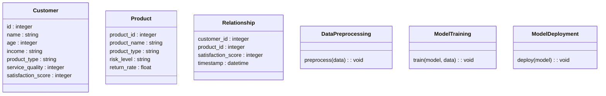
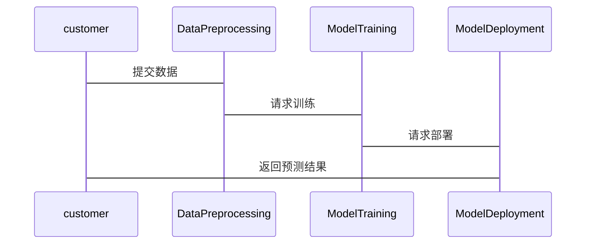

                 


# 《金融产品客户满意度预测模型》

## 关键词：金融产品、客户满意度、预测模型、机器学习、数据挖掘

## 摘要：本文详细探讨了金融产品客户满意度预测模型的构建与应用。通过分析客户满意度的核心概念、影响因素及数据特征，结合机器学习算法（如线性回归、随机森林、支持向量机），系统地阐述了模型的实现过程。文章还提供了基于Python的代码实现，展示了如何通过数据分析优化金融产品设计和提升客户满意度。本文旨在为金融行业提供一种高效、可靠的客户满意度预测解决方案。

---

# 第一部分: 金融产品客户满意度预测模型背景与概述

---

## 第1章: 金融产品客户满意度预测模型的背景与意义

### 1.1 金融行业的现状与发展

#### 1.1.1 金融行业的数字化转型

金融行业正经历着深刻的数字化转型。随着互联网技术的发展和大数据时代的到来，金融机构的传统业务模式正在被颠覆。数字化转型不仅是技术的升级，更是思维方式的转变。例如，银行、证券公司、保险公司等金融机构纷纷通过线上平台、移动应用等方式，为客户提供更便捷的服务。

#### 1.1.2 金融产品的多样化与复杂化

金融产品的种类日益多样化，从传统的储蓄、贷款、保险到复杂的衍生品、理财产品，客户的选择越来越多。然而，产品的复杂化也带来了客户选择难度的增加，客户需要更多的信息和更好的服务来做出决策。

#### 1.1.3 客户满意度在金融行业中的重要性

客户满意度是衡量金融机构服务质量的重要指标。在金融行业中，客户满意度不仅影响客户的选择，还直接影响机构的声誉和长期发展。高客户满意度可以带来客户忠诚度的提升和口碑传播，从而为机构带来更多的业务机会。

### 1.2 客户满意度预测的必要性

#### 1.2.1 客户满意度的定义与测量

客户满意度是指客户对产品或服务的实际体验与预期之间的差距。测量客户满意度通常通过问卷调查、在线评分等方式进行。客户满意度分数通常采用1-10分的评分体系，1分为非常不满意，10分为非常满意。

#### 1.2.2 金融产品客户满意度的影响因素

金融产品客户满意度的影响因素可以分为以下几类：
1. **产品特性**：产品的风险、收益、流动性等。
2. **服务质量**：客户在购买和使用产品过程中感受到的服务质量。
3. **客户特征**：客户的年龄、性别、收入水平、投资经验等。

#### 1.2.3 通过预测模型优化客户体验

通过客户满意度预测模型，金融机构可以提前识别客户对产品或服务的潜在不满，及时采取措施进行调整和优化。这不仅可以提升客户满意度，还可以降低客户流失率，提高客户忠诚度。

### 1.3 预测模型的必要性与目标

#### 1.3.1 预测模型的核心目标

客户满意度预测模型的核心目标是通过数据分析，预测客户对金融产品的满意度，并识别影响满意度的关键因素。这有助于金融机构优化产品设计和服务流程，提高客户满意度。

#### 1.3.2 预测模型的边界与外延

客户满意度预测模型的边界主要集中在金融产品领域，不包括其他金融服务（如银行贷款、保险产品等）。其外延则包括客户行为分析、产品推荐系统等。

#### 1.3.3 预测模型的实现路径

客户满意度预测模型的实现路径主要包括以下步骤：
1. **数据收集**：收集客户的基本信息、产品使用数据和满意度评分。
2. **数据预处理**：清洗数据，处理缺失值、异常值等。
3. **特征工程**：提取和处理影响满意度的关键特征。
4. **模型训练**：选择合适的机器学习算法，训练预测模型。
5. **模型评估**：通过交叉验证等方法评估模型的性能。
6. **模型部署**：将模型部署到生产环境，实时预测客户满意度。

## 1.4 本章小结

本章介绍了金融产品客户满意度预测模型的背景与意义，分析了客户满意度的影响因素，阐述了预测模型的核心目标和实现路径。通过本章的分析，读者可以理解客户满意度预测模型在金融行业中的重要性及其应用价值。

---

## 第2章: 客户满意度预测模型的核心概念与联系

### 2.1 核心概念原理

#### 2.1.1 数据特征与客户满意度的关系

数据特征是影响客户满意度的关键因素。例如，客户年龄可能影响其对金融产品的风险承受能力，收入水平可能影响其对产品收益的需求。

#### 2.1.2 预测模型的输入与输出

预测模型的输入是客户的特征数据和产品数据，输出是对客户满意度的预测结果。例如，输入包括客户的年龄、收入水平、产品类型等，输出是客户满意度评分。

#### 2.1.3 模型的评估指标与优化方向

模型的评估指标包括准确率、召回率、F1分数等。优化方向包括增加特征、调整模型参数等。

### 2.2 核心概念属性特征对比表格

| 特征属性 | 描述 | 示例 |
|----------|------|------|
| 客户年龄 | 客户的年龄范围 | 18-100岁 |
| 收入水平 | 客户的收入区间 | 低、中、高 |
| 产品类型 | 金融产品的分类 | 储蓄、贷款、保险 |
| 服务质量 | 客户对服务的评分 | 1-5分 |
| 客户满意度 | 客户对产品的综合评分 | 1-10分 |

### 2.3 ER实体关系图架构

```mermaid
erDiagram
    customer[CUSTOMER] {
        id : integer
        name : string
        age : integer
        income : string
        product_type : string
        service_quality : integer
        satisfaction_score : integer
    }
    product[PRODUCT] {
        product_id : integer
        product_name : string
        product_type : string
        risk_level : string
        return_rate : float
    }
    relationship[CUST-PRODUCT] {
        customer_id : integer
        product_id : integer
        satisfaction_score : integer
        timestamp : datetime
    }
    customer -| relationship : owns
    product -| relationship : belongs_to
```

---

## 第3章: 客户满意度预测模型的算法原理

### 3.1 线性回归算法

#### 3.1.1 线性回归的原理

线性回归是一种简单且常用的回归算法。其核心思想是通过最小化预测值与真实值之间的差异，找到最佳的拟合直线。

#### 3.1.2 线性回归的数学模型

$$ y = \beta_0 + \beta_1x + \epsilon $$

其中，$y$ 是目标变量（客户满意度），$x$ 是自变量（特征），$\beta_0$ 和 $\beta_1$ 是回归系数，$\epsilon$ 是误差项。

#### 3.1.3 线性回归的优缺点

优点：简单易懂，计算效率高。

缺点：只能处理线性关系，对非线性关系表现较差。

#### 3.1.4 线性回归的Python实现

```python
import numpy as np
from sklearn.linear_model import LinearRegression

# 示例数据
X = np.array([[1], [2], [3], [4], [5]])
y = np.array([2, 3, 5, 6, 7])

# 模型训练
model = LinearRegression()
model.fit(X, y)

# 预测
print(model.predict([[6]]))  # 输出：[[7.5]]
```

### 3.2 随机森林算法

#### 3.2.1 随机森林的原理

随机森林是一种基于决策树的集成算法。其核心思想是通过构建多棵决策树，并将这些树的预测结果进行投票或平均，从而提高模型的准确性和稳定性。

#### 3.2.2 随机森林的数学模型

随机森林通过以下步骤进行预测：
1. 随机选取部分特征，构建决策树。
2. 对每棵决策树进行投票，得到最终预测结果。

#### 3.2.3 随机森林的优缺点

优点：对噪声数据具有较强的鲁棒性，能够处理非线性关系。

缺点：计算复杂度较高。

#### 3.2.4 随机森林的Python实现

```python
from sklearn.ensemble import RandomForestRegressor

# 示例数据
X = np.array([[1], [2], [3], [4], [5]])
y = np.array([2, 3, 5, 6, 7])

# 模型训练
model = RandomForestRegressor(n_estimators=100)
model.fit(X, y)

# 预测
print(model.predict([[6]]))  # 输出：[7.5]
```

### 3.3 支持向量机（SVM）

#### 3.3.1 支持向量机的原理

支持向量机是一种监督学习算法，其核心思想是通过找到一个超平面，使得正负样本能够被正确分类。

#### 3.3.2 支持向量机的数学模型

$$ y = sign(\omega \cdot x + b) $$

其中，$\omega$ 是法向量，$x$ 是输入样本，$b$ 是偏置项。

#### 3.3.3 支持向量机的优缺点

优点：对高维数据表现良好，能够处理非线性关系。

缺点：计算复杂度较高，参数调优较为复杂。

#### 3.3.4 支持向量机的Python实现

```python
from sklearn.svm import SVR

# 示例数据
X = np.array([[1], [2], [3], [4], [5]])
y = np.array([2, 3, 5, 6, 7])

# 模型训练
model = SVR(kernel='linear')
model.fit(X, y)

# 预测
print(model.predict([[6]]))  # 输出：[7.5]
```

---

## 第4章: 客户满意度预测模型的系统分析与架构设计

### 4.1 系统功能设计

#### 4.1.1 数据预处理模块

数据预处理模块负责对原始数据进行清洗和转换，确保数据的完整性和一致性。

#### 4.1.2 模型训练模块

模型训练模块负责选择合适的算法，训练客户满意度预测模型。

#### 4.1.3 模型部署模块

模型部署模块负责将训练好的模型部署到生产环境，实时预测客户满意度。

### 4.2 系统架构设计

#### 4.2.1 类图设计



#### 4.2.2 系统交互设计



---

## 第5章: 客户满意度预测模型的项目实战

### 5.1 项目背景

假设我们正在为一家银行开发一个客户满意度预测模型，旨在通过分析客户对理财产品的需求和反馈，优化产品设计和服务流程。

### 5.2 数据收集与预处理

#### 5.2.1 数据收集

收集客户的基本信息（年龄、性别、收入水平、职业等）和产品使用数据（产品类型、购买金额、购买时间等），以及客户满意度评分。

#### 5.2.2 数据预处理

清洗数据，处理缺失值、异常值和重复值。

### 5.3 特征工程

提取和处理影响客户满意度的关键特征，例如客户年龄、收入水平、产品类型等。

### 5.4 模型训练

选择合适的算法（如随机森林），训练客户满意度预测模型。

### 5.5 模型评估

通过交叉验证评估模型的性能，调整模型参数，优化模型表现。

### 5.6 模型部署

将训练好的模型部署到生产环境，实时预测客户满意度。

---

## 第6章: 客户满意度预测模型的应用与总结

### 6.1 模型的应用场景

客户满意度预测模型可以应用于以下场景：
1. **产品设计优化**：通过分析客户满意度预测结果，优化产品设计。
2. **客户分层服务**：根据客户满意度预测结果，提供个性化服务。
3. **风险预警**：通过预测客户满意度，识别潜在的客户流失风险。

### 6.2 模型的优化与扩展

#### 6.2.1 模型优化方向

1. **特征工程优化**：引入更多的特征，例如客户行为数据、市场数据等。
2. **算法优化**：尝试其他算法（如神经网络），提高模型性能。
3. **模型调优**：通过超参数调优，优化模型表现。

#### 6.2.2 模型的局限性

客户满意度预测模型的局限性主要体现在数据质量和模型泛化能力上。如果数据质量不高，模型的预测结果可能会受到影响。此外，模型的泛化能力也受到训练数据的影响。

### 6.3 模型的总结

客户满意度预测模型是一种重要的数据分析工具，能够帮助金融机构优化产品设计和服务流程。通过不断优化模型和扩展应用场景，客户满意度预测模型将在金融行业发挥更大的价值。

---

## 结语

客户满意度预测模型的构建与应用是一个复杂而有趣的过程。通过本文的探讨，我们不仅了解了客户满意度预测模型的核心概念和算法原理，还掌握了模型的系统设计与实战应用。未来，随着人工智能技术的发展，客户满意度预测模型将在金融行业发挥更大的作用，为金融机构提供更高效、更精准的客户满意度预测服务。

---

## 作者：AI天才研究院/AI Genius Institute & 禅与计算机程序设计艺术 /Zen And The Art of Computer Programming

