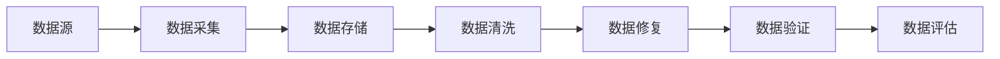
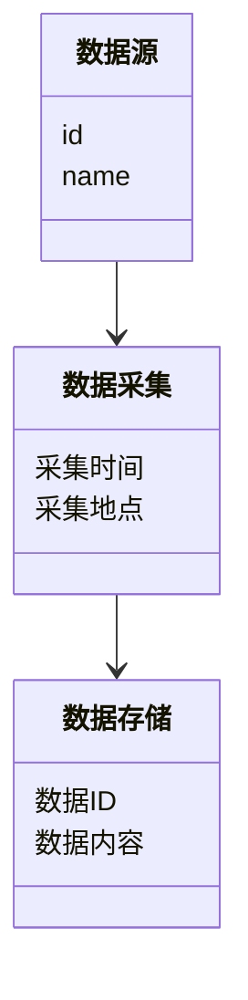
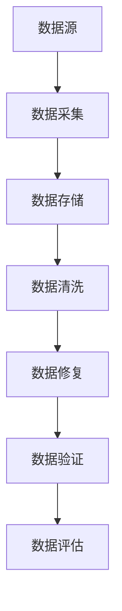
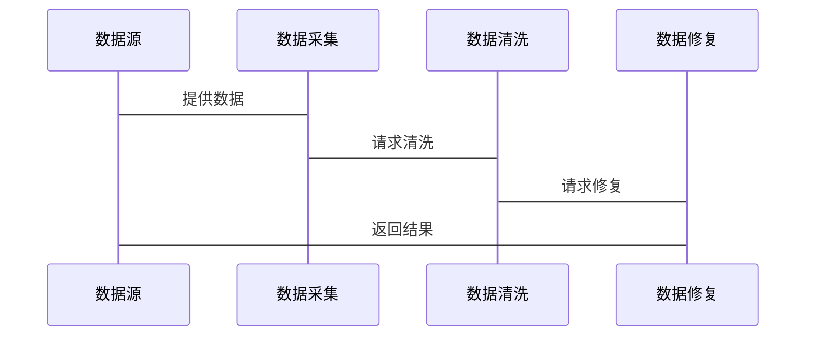

                 


# 《金融数据质量自动化控制与修复平台》

> 关键词：金融数据质量，数据清洗，数据修复，自动化控制，数据质量管理，数据完整性

> 摘要：本文详细探讨了金融数据质量自动化控制与修复平台的设计与实现。通过分析数据质量管理的核心概念、算法原理、系统架构及实际案例，结合Mermaid图表和Python代码示例，展示了如何利用自动化技术解决金融数据质量问题，提升数据准确性与完整性。本文还总结了数据质量管理的最佳实践和未来发展方向。

---

# 第一部分: 金融数据质量自动化控制与修复平台背景介绍

## 第1章: 问题背景与描述

### 1.1 数据质量管理的重要性

#### 1.1.1 金融数据质量的核心问题
在金融行业中，数据质量是确保业务决策准确性和可靠性的基础。金融数据的准确性、完整性、一致性和及时性直接关系到企业的风险控制、投资决策和合规性。然而，金融数据的复杂性（如多来源、多格式）使得数据质量管理变得尤为困难。

#### 1.1.2 数据质量问题对企业的影响
- **影响决策**：低质量的数据可能导致错误的投资决策或风险管理失误。
- **合规风险**：金融行业受到严格监管，数据质量问题可能导致合规失败，面临罚款或声誉损失。
- **成本增加**：数据清洗和修复需要大量资源，低质量数据会进一步增加成本。

#### 1.1.3 数据质量对金融行业的重要性
- 数据质量是金融行业信任的基础。
- 数据质量决定了业务系统的可靠性和稳定性。
- 数据质量是金融创新（如智能投顾、大数据风控）的前提条件。

### 1.2 数据质量控制的挑战

#### 1.2.1 数据来源的多样性
- 数据可能来自多个系统（如交易系统、客户关系管理系统）。
- 数据格式多样（如结构化数据、非结构化数据）。

#### 1.2.2 数据格式的复杂性
- 数据可能包含缺失值、重复值、错误值。
- 数据可能涉及多种数据类型（如字符串、数字、日期）。

#### 1.2.3 数据清洗与修复的难度
- 数据清洗需要复杂的规则和算法。
- 数据修复需要考虑业务逻辑和数据依赖关系。

### 1.3 数据质量自动化控制的必要性

#### 1.3.1 人工数据质量管理的局限性
- 人工检查效率低，容易出错。
- 人工处理复杂数据问题需要大量时间和资源。

#### 1.3.2 自动化技术在数据质量管理中的优势
- 提高数据处理效率。
- 减少人为错误，确保数据处理的准确性。
- 支持大规模数据处理，满足金融行业对海量数据处理的需求。

#### 1.3.3 数据质量自动化控制的未来趋势
- 结合人工智能技术，实现更智能的数据质量管理。
- 数据质量管理将更加自动化、智能化和实时化。

## 第2章: 问题解决与边界定义

### 2.1 数据质量控制的目标

#### 2.1.1 数据完整性
- 数据不应有缺失值。
- 数据应包含所有必要字段。

#### 2.1.2 数据准确性
- 数据应反映真实情况。
- 数据应符合业务规则。

#### 2.1.3 数据一致性
- 数据在不同系统中应保持一致。
- 数据格式应统一。

### 2.2 数据质量自动化控制的边界

#### 2.2.1 数据来源的边界
- 数据来源仅限于指定的系统。
- 数据格式符合预定义的标准。

#### 2.2.2 数据格式的边界
- 数据清洗仅针对特定字段。
- 数据修复仅针对特定类型的问题。

#### 2.2.3 数据修复的边界
- 数据修复不改变数据的业务含义。
- 数据修复仅针对可自动识别的问题。

### 2.3 数据质量控制的实现路径

#### 2.3.1 数据采集与预处理
- 数据采集：从多个数据源获取数据。
- 数据预处理：清洗数据，识别问题。

#### 2.3.2 数据清洗与修复
- 数据清洗：去除无效数据，填充缺失值。
- 数据修复：纠正错误数据，统一数据格式。

#### 2.3.3 数据验证与评估
- 数据验证：检查数据是否符合业务规则。
- 数据评估：评估数据质量，生成质量报告。

---

# 第二部分: 核心概念与联系

## 第3章: 数据质量核心概念

### 3.1 数据质量的定义与特征

#### 3.1.1 数据质量的定义
数据质量是指数据的准确性、完整性、一致性、及时性和有效性。在金融行业，数据质量尤为重要，因为数据是金融决策的基础。

#### 3.1.2 数据质量的特征对比表格

| 特征         | 描述                                             |
|--------------|--------------------------------------------------|
| 准确性       | 数据反映真实情况                                 |
| 完整性       | 数据无缺失值                                     |
| 一致性       | 数据在不同系统中保持一致                       |
| 及时性       | 数据反映最新状态                                 |
| 有效性       | 数据符合业务规则                               |

### 3.2 数据质量管理的实体关系图



---

# 第三部分: 算法原理讲解

## 第4章: 数据清洗与修复算法

### 4.1 数据清洗算法

#### 4.1.1 基于规则的清洗算法

- **规则定义**：根据业务规则定义数据清洗规则。
- **实现步骤**：
  1. 读取数据。
  2. 根据规则检查数据。
  3. 清洗数据。

- **Python代码示例**：

```python
# 示例规则：删除缺失值
def clean_data(dataframe):
    dataframe.dropna(inplace=True)
    return dataframe

# 示例规则：填充缺失值
def fill_missing_values(dataframe, column, value):
    dataframe[column].fillna(value, inplace=True)
    return dataframe
```

#### 4.1.2 基于机器学习的清洗算法

- **算法选择**：使用聚类算法识别异常值。
- **实现步骤**：
  1. 数据预处理。
  2. 训练聚类模型。
  3. 标识异常值并清洗。

- **Python代码示例**：

```python
from sklearn.cluster import KMeans

def detect_outliers(dataframe, column):
    # 标准化数据
    from sklearn.preprocessing import StandardScaler
    scaler = StandardScaler()
    scaled_data = scaler.fit_transform(dataframe[[column]])
    
    # 训练聚类模型
    kmeans = KMeans(n_clusters=2, random_state=0)
    kmeans.fit(scaled_data)
    
    # 预测簇
    clusters = kmeans.predict(scaled_data)
    
    # 标识异常值
    outliers = []
    for i in range(len(clusters)):
        if clusters[i] == 1:
            outliers.append(i)
    
    return dataframe.iloc[outliers]
```

#### 4.1.3 数据去重算法

- **算法选择**：使用哈希算法或基于相似度的去重。
- **实现步骤**：
  1. 计算数据相似度。
  2. 去除重复数据。

- **Python代码示例**：

```python
def remove_duplicates(dataframe):
    dataframe.drop_duplicates(inplace=True)
    return dataframe
```

### 4.2 数据修复算法

#### 4.2.1 基于插值的修复算法

- **算法选择**：使用均值或中位数填充缺失值。
- **实现步骤**：
  1. 识别缺失值。
  2. 计算均值或中位数。
  3. 填充缺失值。

- **Python代码示例**：

```python
def interpolate_missing_values(dataframe, column):
    dataframe[column].interpolate(inplace=True)
    return dataframe
```

#### 4.2.2 基于模式匹配的修复算法

- **算法选择**：使用正则表达式匹配错误数据。
- **实现步骤**：
  1. 定义正则表达式。
  2. 匹配数据。
  3. 修复数据。

- **Python代码示例**：

```python
import re

def fix_invalid_data(dataframe, column, pattern):
    dataframe[column] = dataframe[column].apply(lambda x: re.sub(pattern, '', x))
    return dataframe
```

#### 4.2.3

---

# 第四部分: 系统分析与架构设计方案

## 第5章: 问题场景介绍

### 5.1 项目介绍

- **项目目标**：构建金融数据质量自动化控制与修复平台。
- **项目范围**：支持多种数据源，实现数据清洗、修复和验证。
- **项目参与者**：数据分析师、开发人员、业务人员。

### 5.2 系统功能设计

#### 5.2.1 领域模型类图



#### 5.2.2 系统架构设计



#### 5.2.3 系统接口设计

- **接口1**：数据采集接口。
- **接口2**：数据清洗接口。
- **接口3**：数据修复接口。

#### 5.2.4 系统交互流程



---

## 第6章: 项目实战

### 6.1 环境安装

- **工具安装**：安装Python、Pandas、Scikit-learn。
- **依赖管理**：使用pip安装依赖库。

### 6.2 系统核心实现源代码

#### 6.2.1 数据清洗与修复模块

```python
import pandas as pd

def clean_and_fix_data(dataframe):
    # 删除缺失值
    dataframe.dropna(inplace=True)
    
    # 填充缺失值
    dataframe['amount'].fillna(dataframe['amount'].mean(), inplace=True)
    
    # 识别异常值
    from sklearn.cluster import KMeans
    scaled_data = StandardScaler().fit_transform(dataframe[['amount']])
    kmeans = KMeans(n_clusters=2, random_state=0)
    kmeans.fit(scaled_data)
    clusters = kmeans.predict(scaled_data)
    outliers = [i for i in range(len(clusters)) if clusters[i] == 1]
    dataframe.drop(outliers, inplace=True)
    
    return dataframe
```

#### 6.2.2 数据验证模块

```python
def validate_data(dataframe):
    # 检查数据完整性
    assert dataframe.notnull().all(), "数据存在缺失值"
    
    # 检查数据一致性
    assert dataframe['amount'].dtype == 'float64', "金额字段数据类型错误"
    
    return "数据验证通过"
```

### 6.3 代码应用解读与分析

- **代码解读**：
  - 数据清洗模块：删除缺失值，填充缺失值，识别并删除异常值。
  - 数据验证模块：检查数据完整性，验证数据类型。

- **代码分析**：
  - 数据清洗模块结合了基于规则和基于机器学习的算法，确保数据清洗的全面性。
  - 数据验证模块通过断言确保数据符合业务规则。

### 6.4 实际案例分析和详细讲解剖析

#### 6.4.1 案例背景

- **案例描述**：某银行的交易数据存在缺失值、重复值和异常值。
- **案例目标**：清洗数据，修复数据，确保数据质量。

#### 6.4.2 案例实现步骤

1. 数据采集：从交易系统获取数据。
2. 数据清洗：删除缺失值，填充缺失值，识别并删除异常值。
3. 数据修复：统一数据格式，修复错误数据。
4. 数据验证：检查数据完整性，验证数据类型。

#### 6.4.3 案例结果

- 数据清洗后，数据完整性得到提升。
- 数据修复后，数据一致性得到保证。
- 数据验证通过，数据质量达标。

### 6.5 项目小结

- **项目成果**：
  - 数据清洗模块有效提升了数据质量。
  - 数据修复模块解决了数据不一致问题。
  - 数据验证模块确保了数据符合业务规则。

- **项目经验**：
  - 数据质量管理需要结合规则和算法。
  - 数据清洗和修复需要考虑业务逻辑。
  - 数据验证是数据质量管理的重要环节。

---

# 第五部分: 总结与展望

## 第7章: 总结与展望

### 7.1 总结

- 本文详细探讨了金融数据质量自动化控制与修复平台的设计与实现。
- 结合Mermaid图表和Python代码示例，展示了如何利用自动化技术解决金融数据质量问题。
- 总结了数据质量管理的最佳实践和未来发展方向。

### 7.2 未来展望

- **技术发展**：
  - 结合人工智能技术，实现更智能的数据质量管理。
  - 数据质量管理将更加自动化、智能化和实时化。

- **应用领域**：
  - 数据质量管理技术将应用到更多领域，如医疗、教育、制造等。

---

作者：AI天才研究院/AI Genius Institute & 禅与计算机程序设计艺术/Zen And The Art of Computer Programming

