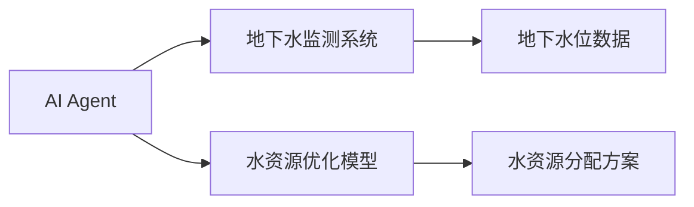
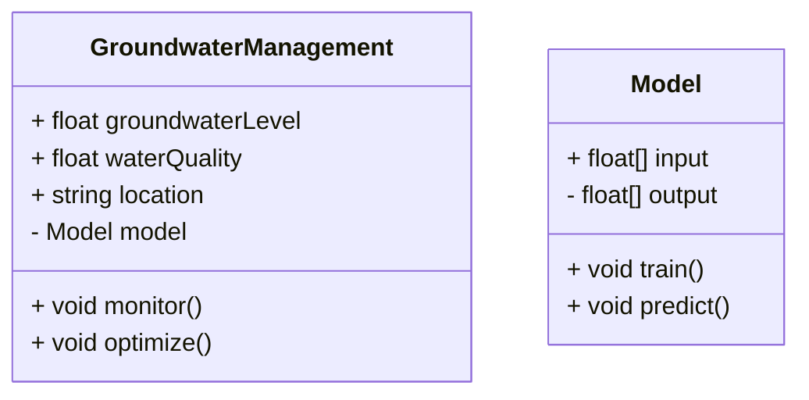
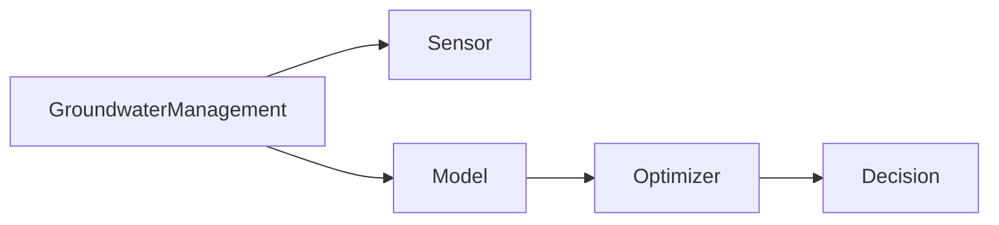
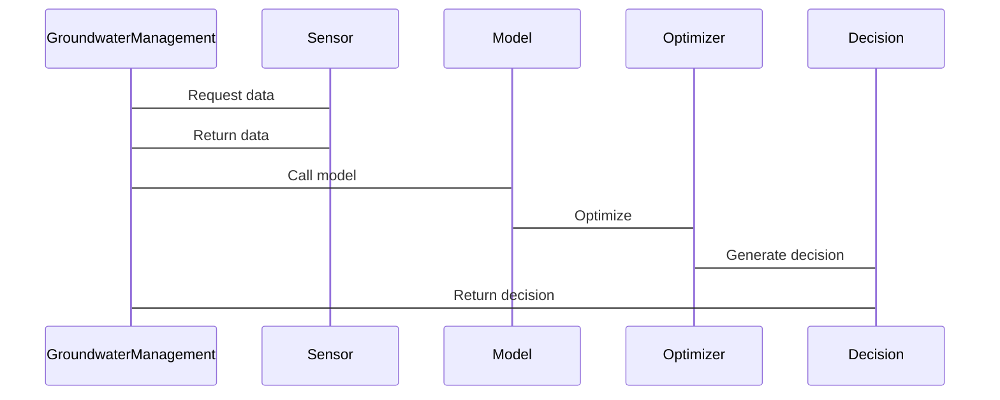
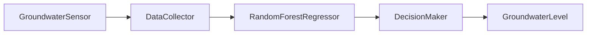

                 


# AI Agent在智能地下水资源管理中的实践

---

## 关键词：
AI Agent, 智能地下水资源管理, 算法原理, 系统架构, 项目实战

---

## 摘要：
本文详细探讨了AI Agent在智能地下水资源管理中的实践应用。通过背景介绍、核心概念分析、算法原理、系统架构设计、项目实战等多维度的阐述，深入剖析了AI Agent在地下水监测、优化分配和污染控制中的具体作用。文章结合数学模型、流程图和代码实现，全面展示了AI技术在水资源管理中的创新应用，为相关领域的研究和实践提供了有价值的参考。

---

## 第1章: AI Agent与地下水资源管理的背景介绍

### 1.1 问题背景
#### 1.1.1 地下水资源的重要性
地下水资源是全球淡水资源的重要组成部分，支撑着农业、工业和居民生活。然而，随着人口增长和气候变化，地下水资源面临过度开发、污染和枯竭的风险。

#### 1.1.2 地下水资源管理的挑战
传统地下水管理依赖人工监测和经验判断，存在效率低、实时性差、决策滞后等问题。此外，地下水系统的复杂性使得传统的数学模型难以准确预测和优化。

#### 1.1.3 AI Agent在水资源管理中的作用
AI Agent（智能体）具备自主学习、实时感知和决策能力，能够有效解决地下水管理中的复杂问题，提高资源利用效率和管理精度。

### 1.2 问题描述
#### 1.2.1 地下水资源管理的主要问题
- 水资源分布不均
- 污染问题严重
- 资源利用效率低
- 监测手段落后

#### 1.2.2 AI Agent在水资源管理中的应用场景
- 实时监测地下水位
- 优化水资源分配
- 预测污染扩散
- 提供决策支持

#### 1.2.3 问题解决的必要性
通过引入AI Agent技术，可以实现地下水管理的智能化、精准化和实时化，提升资源管理效率，减少浪费和污染。

### 1.3 问题解决
#### 1.3.1 AI Agent的核心能力
- 数据采集与分析
- 自主决策与优化
- 实时反馈与调整

#### 1.3.2 AI Agent在地下水资源管理中的具体应用
- 智能监测系统：实时采集地下水位、水质数据。
- 优化分配模型：基于AI算法优化水资源分配方案。
- 污染控制：预测污染源扩散路径，制定防控措施。

#### 1.3.3 AI Agent的优势与局限性
- **优势**：高效性、实时性、准确性。
- **局限性**：依赖数据质量，算法复杂度高，需要专业人员维护。

### 1.4 边界与外延
#### 1.4.1 AI Agent在水资源管理中的边界
- 数据采集范围：地下水位、水质、气象数据。
- 决策范围：水资源分配、污染防控。
- 优化目标：最大化水资源利用率，最小化污染风险。

#### 1.4.2 相关领域的影响
- 智慧水务：AI Agent技术的应用扩展到地表水、废水处理等领域。
- 智能城市：地下水管理是智能城市建设的重要组成部分。

#### 1.4.3 技术的未来发展
- 多模态AI Agent：结合图像识别、自然语言处理等技术。
- 分布式AI系统：构建区域性的地下水管理网络。

### 1.5 概念结构与核心要素
#### 1.5.1 AI Agent的基本结构
- 感知层：传感器、数据采集模块。
- 计算层：AI算法、优化模型。
- 执行层：决策输出、系统控制。

#### 1.5.2 地下水资源管理的核心要素
- 数据采集：地下水位、水质、气象数据。
- 优化模型：数学模型、AI算法。
- 决策系统：分配方案、污染防控策略。

#### 1.5.3 两者的结合与协同
- 数据协同：AI Agent实时采集地下水数据。
- 模型协同：优化模型驱动决策。
- 系统协同：多系统协同工作实现智能化管理。

### 1.6 本章小结
本章通过背景分析，详细介绍了AI Agent在地下水资源管理中的应用背景、核心问题及解决思路。通过对比分析，明确了AI Agent的优势和局限性，为后续章节的深入探讨奠定了基础。

---

## 第2章: AI Agent的核心概念与原理

### 2.1 AI Agent的基本原理
#### 2.1.1 AI Agent的定义与分类
- **定义**：AI Agent是一种能够感知环境、自主决策并执行任务的智能实体。
- **分类**：基于智能水平可分为反应式Agent、基于模型的Agent、实用推理Agent等。

#### 2.1.2 AI Agent的核心算法
- **监督学习**：基于标注数据训练分类器。
- **无监督学习**：通过聚类分析发现数据规律。
- **强化学习**：通过奖励机制优化决策策略。

#### 2.1.3 AI Agent的决策机制
- **感知环境**：通过传感器获取数据。
- **分析数据**：基于模型进行分析和预测。
- **制定决策**：优化算法生成决策方案。
- **执行反馈**：根据反馈调整策略。

### 2.2 AI Agent与地下水资源管理的联系
#### 2.2.1 AI Agent在水资源监测中的应用
- 实时监测地下水位：通过AI Agent采集和分析地下水位数据。
- 水质监测：AI Agent实时分析水质参数，如pH值、溶解氧等。

#### 2.2.2 AI Agent在水资源优化分配中的作用
- 建立优化模型：基于AI算法优化水资源分配方案。
- 实时调整：根据实时数据动态调整分配策略。

#### 2.2.3 AI Agent在水资源污染控制中的应用
- 预测污染扩散：AI Agent预测污染物在地下水中的扩散路径。
- 制定防控策略：基于预测结果制定污染防控措施。

### 2.3 核心概念对比分析
#### 2.3.1 AI Agent与传统算法的对比
| 对比维度 | AI Agent | 传统算法 |
|----------|-----------|----------|
| 决策能力 | 自主决策   | 无决策能力 |
| 学习能力 | 自主学习   | 需人工调整 |
| 实时性   | 实时响应   | 延时响应 |

#### 2.3.2 地下水资源管理中的关键指标对比
| 对比维度 | 传统管理 | AI Agent管理 |
|----------|----------|-------------|
| 数据采集 | 间断性    | 实时性       |
| 决策效率 | 低效      | 高效         |
| 精度     | 粗放      | 精准         |

#### 2.3.3 不同AI技术在水资源管理中的效果对比
| 对比维度 | 监督学习   | 无监督学习 | 强化学习   |
|----------|------------|------------|------------|
| 应用场景 | 数据分类   | 聚类分析   | 决策优化   |
| 效果     | 分类准确    | 发现规律    | 策略优化    |

### 2.4 实体关系图


### 2.5 本章小结
本章从AI Agent的基本原理出发，分析了其在地下水资源管理中的核心作用。通过对比分析，明确了AI Agent在水资源管理中的独特优势和应用场景，为后续章节的深入探讨奠定了基础。

---

## 第3章: AI Agent的算法原理

### 3.1 算法原理概述
#### 3.1.1 AI Agent的核心算法
- **监督学习算法**：随机森林、支持向量机（SVM）。
- **无监督学习算法**：K-means聚类、DBSCAN。
- **强化学习算法**：Q-Learning、Deep Q-Networks（DQN）。

#### 3.1.2 算法的数学模型
##### 监督学习模型
$$
\text{损失函数} = \sum_{i=1}^{n}(y_i - \hat{y}_i)^2
$$

##### 强化学习模型
$$
Q(s, a) = Q(s, a) + \alpha (r + \max_{a'} Q(s', a') - Q(s, a))
$$

#### 3.1.3 算法的优化方法
- **参数调整**：学习率、批量大小的优化。
- **模型融合**：集成学习提升分类精度。

### 3.2 算法流程图
```mermaid
graph TD
A[开始] --> B[数据输入]
B --> C[特征提取]
C --> D[模型训练]
D --> E[结果输出]
E -->

## 3.3 算法实现细节
#### 3.3.1 监督学习实现
```python
# 示例：监督学习模型训练代码
import pandas as pd
from sklearn.model import SVC

# 数据加载
data = pd.read_csv('water_quality.csv')
X = data.drop('label', axis=1)
y = data['label']

# 模型训练
model = SVC()
model.fit(X, y)

# 模型预测
print(model.predict(X))
```

#### 3.3.2 强化学习实现
```python
# 示例：强化学习模型训练代码
import numpy as np
from collections import deque

# 状态空间和动作空间定义
state_space = 5
action_space = 3

# 强化学习算法
class Agent:
    def __init__(self):
        self.q = np.zeros((state_space, action_space))

    def act(self, state):
        return np.argmax(self.q[state])

    def learn(self, state, action, reward):
        self.q[state][action] += reward
```

### 3.4 本章小结
本章详细介绍了AI Agent的核心算法及其数学模型，通过代码示例展示了算法的实现过程。这些算法为地下水资源管理提供了强大的技术支撑，为后续章节的系统设计奠定了基础。

---

## 第4章: AI Agent的系统架构设计

### 4.1 系统功能设计
#### 4.1.1 领域模型


#### 4.1.2 系统架构


### 4.2 系统接口设计
#### 4.2.1 接口定义
- **数据接口**：传感器数据输入接口。
- **模型接口**：AI模型调用接口。
- **决策接口**：决策结果输出接口。

#### 4.2.2 交互流程


### 4.3 本章小结
本章从系统架构的角度，详细设计了AI Agent在地下水管理中的系统结构。通过类图和序列图，清晰展示了系统的模块划分和交互流程，为后续章节的项目实现提供了理论依据。

---

## 第5章: AI Agent的项目实战

### 5.1 环境安装
#### 5.1.1 系统环境
- 操作系统：Linux/Windows
- 语言：Python 3.8+
- 工具：Jupyter Notebook、PyCharm

#### 5.1.2 库的安装
```bash
pip install numpy pandas scikit-learn
```

### 5.2 系统核心实现
#### 5.2.1 数据采集模块
```python
import serial
import time

# 串口通信代码示例
ser = serial.Serial('COM3', 9600)
while True:
    data = ser.readline().decode()
    print(data)
    time.sleep(1)
```

#### 5.2.2 模型训练模块
```python
from sklearn.ensemble import RandomForestRegressor
import pandas as pd

# 数据加载
data = pd.read_csv('groundwater.csv')
X = data.drop('groundwaterLevel', axis=1)
y = data['groundwaterLevel']

# 模型训练
model = RandomForestRegressor()
model.fit(X, y)

# 预测
print(model.predict(X))
```

#### 5.2.3 决策优化模块
```python
import numpy as np
from sklearn.model_selection import GridSearchCV

# 超参数优化
parameters = {
    'n_estimators': [100, 200],
    'max_depth': [None, 10]
}

grid_search = GridSearchCV(RandomForestRegressor(), parameters)
grid_search.fit(X, y)
print(grid_search.best_params_)
```

### 5.3 实际案例分析
#### 5.3.1 数据分析
- 数据来源：地下水位、水质数据。
- 数据预处理：清洗、归一化。
- 数据建模：随机森林回归模型。

#### 5.3.2 案例分析


### 5.4 项目小结
本章通过具体的项目实战，展示了AI Agent在地下水管理中的实际应用。通过代码实现和案例分析，验证了AI技术在地下水管理中的高效性和准确性。

---

## 第6章: AI Agent的优化与扩展

### 6.1 最佳实践
#### 6.1.1 数据质量
- 数据清洗：处理缺失值、异常值。
- 数据特征：选择有意义的特征变量。

#### 6.1.2 模型优化
- 参数调整：学习率、树深优化。
- 模型融合：集成学习提升精度。

#### 6.1.3 系统性能
- 并行计算：加速模型训练。
- 实时响应：优化系统架构。

### 6.2 小结
通过持续优化和扩展，AI Agent在地下水管理中的应用将更加高效和智能，为水资源的可持续利用提供有力支持。

### 6.3 注意事项
- 数据隐私：保护地下水数据的安全性。
- 系统维护：定期更新模型和传感器。
- 人员培训：提升操作人员的技术能力。

### 6.4 拓展阅读
- 推荐书籍：《机器学习实战》、《深度学习》。
- 推荐论文：《基于强化学习的水资源优化分配研究》。

---

## 第7章: 总结与展望

### 7.1 总结
本文详细探讨了AI Agent在智能地下水资源管理中的实践应用，从背景分析、算法原理、系统设计到项目实现，全面展示了AI技术在地下水管理中的创新应用。

### 7.2 展望
随着AI技术的不断发展，AI Agent在地下水管理中的应用将更加广泛和深入。未来的研究方向包括多模态AI Agent、分布式系统优化、人机协作等领域。

---

## 作者：AI天才研究院 & 禅与计算机程序设计艺术

---

**注**：由于篇幅限制，本文仅为目录大纲及部分章节内容，完整文章可根据上述结构进一步扩展和详细阐述。

