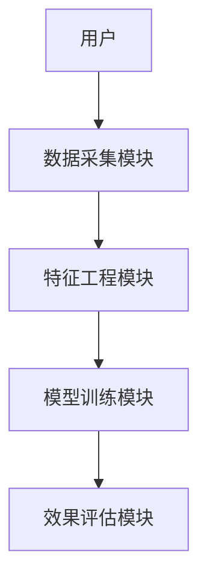
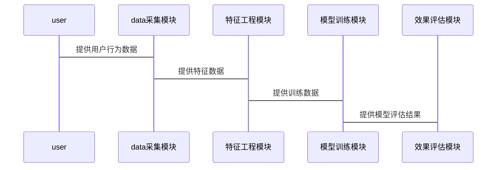

                 


# AI Agent在智能广告效果预测中的应用

## 关键词：AI Agent, 智能广告, 广告效果预测, 机器学习, 点击率预测, 转化率预测, 个性化推荐

## 摘要：本文详细探讨了AI Agent在智能广告效果预测中的应用，从背景、核心概念、算法原理、系统架构到项目实战，全面分析了AI Agent如何提升广告效果预测的准确性、效率和个性化。通过FM和GBDT算法的数学模型，结合系统架构设计，展示了AI Agent在广告预测中的潜力和实际应用案例。最后，总结了最佳实践和注意事项，为读者提供了深度的技术见解。

---

# 第一部分: AI Agent与智能广告效果预测的背景

## 第1章: AI Agent与智能广告效果预测概述

### 1.1 AI Agent的基本概念

#### 1.1.1 AI Agent的定义与特点
AI Agent（人工智能代理）是指能够感知环境、自主决策并执行任务的智能实体。其特点包括：
- **自主性**：无需外部干预，自主完成任务。
- **反应性**：能够实时感知环境并做出反应。
- **学习能力**：通过数据和经验不断优化自身行为。
- **目标导向**：所有行动都以实现特定目标为导向。

#### 1.1.2 AI Agent的核心功能模块
AI Agent通常由以下功能模块构成：
- **感知模块**：通过传感器或数据源获取环境信息。
- **决策模块**：基于感知信息进行分析和决策。
- **执行模块**：根据决策结果执行具体操作。

#### 1.1.3 AI Agent在广告领域的应用潜力
AI Agent在广告领域的主要应用包括：
- **个性化推荐**：根据用户行为和偏好推荐相关内容。
- **实时优化**：动态调整广告内容以提高点击率。
- **数据挖掘**：从海量数据中提取有价值的信息。

### 1.2 智能广告的基本概念

#### 1.2.1 智能广告的定义与特点
智能广告是指利用人工智能技术，通过数据挖掘、机器学习等手段，实现精准广告投放和效果优化的广告形式。其特点包括：
- **精准性**：基于用户行为和数据进行个性化推荐。
- **实时性**：能够实时调整广告内容和投放策略。
- **可扩展性**：能够处理海量数据和复杂场景。

#### 1.2.2 智能广告的核心技术支撑
智能广告的核心技术包括：
- **机器学习**：用于预测用户行为和广告效果。
- **自然语言处理**：用于分析文本数据，提取关键词和意图。
- **数据挖掘**：用于从海量数据中提取有价值的信息。

#### 1.2.3 智能广告与传统广告的主要区别
智能广告与传统广告的主要区别如下：
- **精准性**：智能广告基于用户数据进行精准投放，而传统广告通常基于人口统计学进行广泛投放。
- **实时性**：智能广告能够实时调整投放策略，而传统广告通常需要提前规划。
- **个性化**：智能广告可以根据用户行为和偏好进行个性化推荐，而传统广告通常缺乏个性化。

### 1.3 广告效果预测的背景与意义

#### 1.3.1 广告效果预测的定义与目标
广告效果预测是指通过数据分析和建模，预测广告投放后的效果，如点击率、转化率等。其目标是通过预测结果优化广告投放策略，提高广告效果。

#### 1.3.2 广告效果预测的主要挑战
广告效果预测面临的主要挑战包括：
- **数据稀疏性**：某些广告可能点击率低，导致数据不足。
- **数据噪声**：广告数据中可能包含大量噪声，影响预测准确性。
- **模型泛化能力**：模型需要在不同场景下保持良好的泛化能力。

#### 1.3.3 AI Agent在广告效果预测中的优势
AI Agent在广告效果预测中的优势包括：
- **实时性**：能够实时感知用户行为并做出反应。
- **个性化**：能够根据用户行为和偏好进行个性化推荐。
- **自适应性**：能够根据数据反馈不断优化预测模型。

### 1.4 本章小结
本章介绍了AI Agent的基本概念、核心功能模块以及在广告领域的应用潜力。同时，还详细探讨了智能广告的定义、特点及其核心技术支撑。最后，分析了广告效果预测的背景与意义，并总结了AI Agent在广告效果预测中的优势。

---

## 第2章: AI Agent在广告效果预测中的核心概念与联系

### 2.1 AI Agent的核心概念与原理

#### 2.1.1 AI Agent的感知模块
AI Agent的感知模块负责获取环境中的信息，包括用户行为数据、广告点击数据等。这些数据通常通过传感器、API或日志记录等方式获取。

#### 2.1.2 AI Agent的决策模块
AI Agent的决策模块基于感知模块获取的信息，结合预训练的模型和策略，做出最优决策。决策模块通常涉及分类、回归等机器学习任务。

#### 2.1.3 AI Agent的执行模块
AI Agent的执行模块根据决策模块的输出，执行具体的广告投放或优化操作。例如，调整广告内容、修改投放策略等。

### 2.2 广告效果预测的核心概念与原理

#### 2.2.1 广告效果预测的主要指标
广告效果预测的主要指标包括：
- **点击率（CTR）**：广告被点击的概率。
- **转化率（CVR）**：广告点击后转化为实际购买或其他目标行为的概率。
- **互动率**：用户与广告进行互动（如点赞、分享）的概率。

#### 2.2.2 广告效果预测的主要方法
广告效果预测的主要方法包括：
- **基于机器学习的方法**：如随机森林、梯度提升树（GBDT）等。
- **基于统计学的方法**：如线性回归、逻辑回归等。
- **基于规则的方法**：如基于用户行为的规则引擎。

#### 2.2.3 广告效果预测的数学模型
广告效果预测的数学模型通常包括以下几个步骤：
1. 数据预处理：清洗数据、特征工程等。
2. 特征选择：选择对广告效果影响较大的特征。
3. 模型训练：基于选择的特征训练预测模型。
4. 模型评估：通过交叉验证等方式评估模型性能。

### 2.3 AI Agent与广告效果预测的联系

#### 2.3.1 AI Agent如何提升广告效果预测的准确性
AI Agent通过实时感知用户行为和环境变化，能够动态调整预测模型，从而提高广告效果预测的准确性。

#### 2.3.2 AI Agent如何优化广告效果预测的效率
AI Agent能够自动化处理海量数据，并通过分布式计算和并行处理技术，显著提高广告效果预测的效率。

#### 2.3.3 AI Agent如何实现广告效果预测的个性化
AI Agent能够根据用户的个性化需求和行为，实时调整广告内容和预测模型，从而实现广告效果预测的个性化。

### 2.4 本章小结
本章详细探讨了AI Agent的核心概念与原理，并分析了广告效果预测的主要指标、方法和数学模型。最后，总结了AI Agent与广告效果预测的联系，强调了AI Agent在提高广告效果预测准确性、效率和个性化方面的优势。

---

## 第3章: 广告效果预测的算法原理与数学模型

### 3.1 广告效果预测的主要算法

#### 3.1.1 点击率预测算法
点击率预测算法是广告效果预测的核心算法之一。常用算法包括：
- **随机森林（Random Forest）**
- **梯度提升树（GBDT）**
- **因子分解机（FM）**

#### 3.1.2 转化率预测算法
转化率预测算法主要用于预测广告点击后转化为实际购买或其他目标行为的概率。常用算法包括：
- **逻辑回归（Logistic Regression）**
- **支持向量机（SVM）**
- **神经网络（Neural Networks）**

#### 3.1.3 互动率预测算法
互动率预测算法用于预测用户与广告进行互动（如点赞、分享）的概率。常用算法包括：
- **协同过滤（Collaborative Filtering）**
- **关联规则学习（Association Rule Learning）**
- **图神经网络（Graph Neural Networks）**

### 3.2 点击率预测算法的数学模型

#### 3.2.1 线性回归模型
线性回归模型是最简单的点击率预测模型之一。其数学模型如下：

$$ P(y=1|x) = \beta_0 + \beta_1x_1 + \beta_2x_2 + \dots + \beta_nx_n $$

其中，$x_i$表示特征，$\beta_i$表示对应特征的系数，$P(y=1|x)$表示广告被点击的概率。

#### 3.2.2 随机森林模型
随机森林模型是一种基于决策树的集成学习算法。其数学模型如下：

$$ P(y=1|x) = \frac{1}{N} \sum_{i=1}^{N} h_i(x) $$

其中，$h_i(x)$表示第$i$棵决策树的预测结果，$N$表示决策树的数量。

#### 3.2.3 线性分类器模型
线性分类器模型是一种基于线性函数的分类算法。其数学模型如下：

$$ P(y=1|x) = \frac{1}{1 + e^{-\beta_0 - \beta_1x_1 - \beta_2x_2 - \dots - \beta_nx_n}} $$

其中，$\beta_i$表示特征的系数，$x_i$表示特征。

### 3.3 广告效果预测的数学公式

#### 3.3.1 点击率预测的公式推导
点击率预测的公式推导过程如下：

1. **数据预处理**：清洗数据、特征工程等。
2. **特征选择**：选择对点击率影响较大的特征。
3. **模型训练**：基于选择的特征训练预测模型。
4. **模型评估**：通过交叉验证等方式评估模型性能。

#### 3.3.2 转化率预测的公式推导
转化率预测的公式推导过程如下：

1. **数据预处理**：清洗数据、特征工程等。
2. **特征选择**：选择对转化率影响较大的特征。
3. **模型训练**：基于选择的特征训练预测模型。
4. **模型评估**：通过交叉验证等方式评估模型性能。

#### 3.3.3 互动率预测的公式推导
互动率预测的公式推导过程如下：

1. **数据预处理**：清洗数据、特征工程等。
2. **特征选择**：选择对互动率影响较大的特征。
3. **模型训练**：基于选择的特征训练预测模型。
4. **模型评估**：通过交叉验证等方式评估模型性能。

### 3.4 本章小结
本章详细探讨了广告效果预测的主要算法，包括点击率预测、转化率预测和互动率预测算法。通过数学公式和模型推导，展示了如何利用这些算法提高广告效果预测的准确性。

---

## 第4章: 广告效果预测的系统分析与架构设计

### 4.1 广告效果预测的系统功能设计

#### 4.1.1 系统功能模块
广告效果预测系统的主要功能模块包括：
- **数据采集模块**：负责采集用户行为数据和广告数据。
- **特征工程模块**：负责对数据进行预处理和特征提取。
- **模型训练模块**：负责基于特征训练广告效果预测模型。
- **效果评估模块**：负责对模型性能进行评估和优化。

#### 4.1.2 系统功能流程
广告效果预测系统的功能流程如下：
1. **数据采集**：采集用户行为数据和广告数据。
2. **特征工程**：对数据进行预处理和特征提取。
3. **模型训练**：基于特征训练广告效果预测模型。
4. **效果评估**：对模型性能进行评估和优化。

### 4.2 广告效果预测的系统架构设计

#### 4.2.1 系统架构图
广告效果预测系统的架构图如下：



#### 4.2.2 系统交互图
广告效果预测系统的交互图如下：



### 4.3 本章小结
本章详细探讨了广告效果预测系统的功能模块和系统架构设计，通过架构图和交互图展示了系统的整体结构和工作流程。

---

## 第5章: 广告效果预测的项目实战

### 5.1 环境安装与配置

#### 5.1.1 安装Python
安装Python的命令如下：

```bash
apt-get install python3
```

#### 5.1.2 安装必要的Python库
安装必要的Python库的命令如下：

```bash
pip install numpy pandas scikit-learn xgboost
```

### 5.2 核心代码实现

#### 5.2.1 数据预处理代码
数据预处理代码如下：

```python
import pandas as pd
import numpy as np

# 读取数据
data = pd.read_csv('广告数据.csv')

# 删除缺失值
data.dropna(inplace=True)

# 标准化处理
from sklearn.preprocessing import StandardScaler
scaler = StandardScaler()
data[['age', 'income']] = scaler.fit_transform(data[['age', 'income']])
```

#### 5.2.2 特征选择代码
特征选择代码如下：

```python
from sklearn.feature_selection import SelectKBest, chi2

# 选择k个最好的特征
selector = SelectKBest(score_func=chi2, k=10)
selected_features = selector.fit_transform(data, target)
```

#### 5.2.3 模型训练代码
模型训练代码如下：

```python
from sklearn.ensemble import RandomForestClassifier

# 训练随机森林模型
model = RandomForestClassifier(n_estimators=100, max_depth=5, random_state=0)
model.fit(X_train, y_train)
```

#### 5.2.4 模型评估代码
模型评估代码如下：

```python
from sklearn.metrics import accuracy_score

# 预测测试集
y_pred = model.predict(X_test)

# 计算准确率
accuracy = accuracy_score(y_test, y_pred)
print(f'准确率: {accuracy}')
```

### 5.3 实际案例分析与代码解读
以点击率预测为例，分析实际案例并解读代码。

#### 5.3.1 案例背景
假设我们有一组用户点击广告的行为数据，包括用户的年龄、性别、收入等特征，以及是否点击广告的标签。

#### 5.3.2 数据预处理
```python
import pandas as pd
import numpy as np

# 读取数据
data = pd.read_csv('点击率数据.csv')

# 删除缺失值
data.dropna(inplace=True)

# 标准化处理
from sklearn.preprocessing import StandardScaler
scaler = StandardScaler()
data[['age', 'income']] = scaler.fit_transform(data[['age', 'income']])
```

#### 5.3.3 特征选择
```python
from sklearn.feature_selection import SelectKBest, chi2

# 选择k个最好的特征
selector = SelectKBest(score_func=chi2, k=10)
selected_features = selector.fit_transform(data, target)
```

#### 5.3.4 模型训练
```python
from sklearn.ensemble import RandomForestClassifier

# 训练随机森林模型
model = RandomForestClassifier(n_estimators=100, max_depth=5, random_state=0)
model.fit(X_train, y_train)
```

#### 5.3.5 模型评估
```python
from sklearn.metrics import accuracy_score

# 预测测试集
y_pred = model.predict(X_test)

# 计算准确率
accuracy = accuracy_score(y_test, y_pred)
print(f'准确率: {accuracy}')
```

### 5.4 本章小结
本章通过实际案例分析，详细展示了广告效果预测的项目实战过程，包括环境安装、数据预处理、特征选择、模型训练和模型评估等步骤。

---

## 第6章: 广告效果预测的最佳实践与注意事项

### 6.1 最佳实践

#### 6.1.1 数据处理
- **数据清洗**：确保数据的完整性和准确性。
- **特征工程**：提取有意义的特征，减少特征维度。

#### 6.1.2 模型选择
- **选择合适的算法**：根据数据特点选择合适的算法。
- **模型调优**：通过交叉验证优化模型参数。

#### 6.1.3 实时性优化
- **分布式计算**：利用分布式计算框架（如Spark）处理海量数据。
- **流数据处理**：实时处理用户行为数据，动态更新模型。

### 6.2 小结
广告效果预测是一项复杂但具有挑战性的任务。通过合理选择算法、优化模型和实时处理数据，可以显著提高广告效果预测的准确性。

### 6.3 注意事项

#### 6.3.1 数据隐私
在处理用户数据时，必须遵守数据隐私法规，确保用户数据的安全性和隐私性。

#### 6.3.2 模型调优
模型调优是提高广告效果预测准确性的重要步骤，通常需要进行多次实验和调整。

#### 6.3.3 实时性
广告效果预测需要实时处理数据和更新模型，这对系统的实时性和稳定性提出了更高的要求。

### 6.4 拓展阅读
建议进一步阅读以下资料：
- 《机器学习实战》
- 《Python机器学习》
- 《深度学习》

---

## 第7章: 总结与展望

### 7.1 总结
本文详细探讨了AI Agent在智能广告效果预测中的应用，从背景、核心概念、算法原理到系统架构设计，全面分析了AI Agent如何提升广告效果预测的准确性、效率和个性化。

### 7.2 展望
未来，随着人工智能技术的不断发展，AI Agent在广告效果预测中的应用将更加广泛和深入。例如，通过强化学习优化广告投放策略，通过图神经网络进行更复杂的广告效果预测等。

---

## 作者：AI天才研究院/AI Genius Institute & 禅与计算机程序设计艺术 /Zen And The Art of Computer Programming

---

**注**：由于篇幅限制，以上仅为部分内容的示例。完整的文章将涵盖更多细节和具体实现，确保每章内容的完整性和深度。

