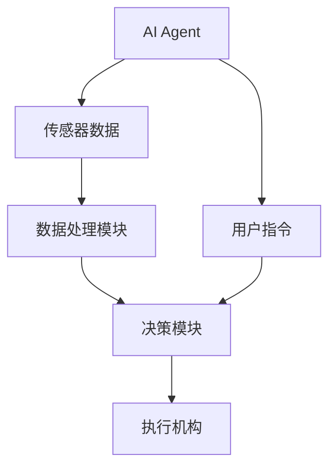
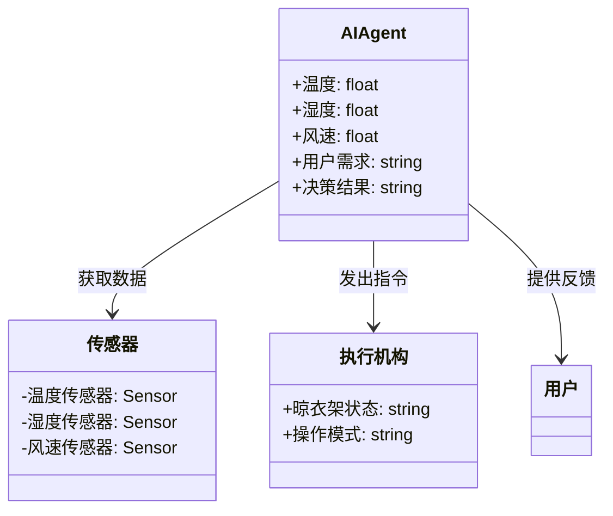
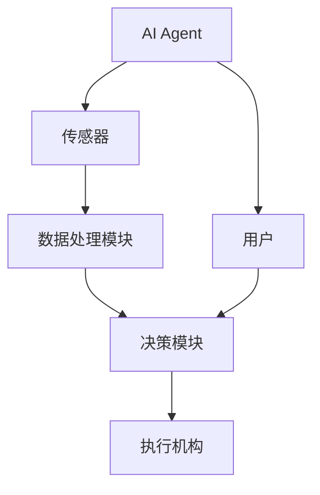
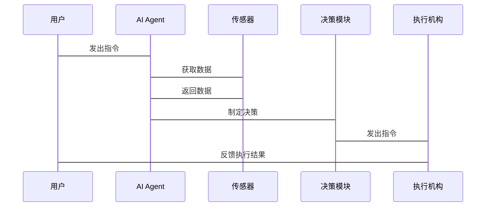

                 


# AI Agent在智能晾衣架中的天气感知

> 关键词：AI Agent, 智能晾衣架, 天气感知, 物联网, 智能决策

> 摘要：本文探讨了AI Agent在智能晾衣架中的天气感知应用，分析了天气感知的核心原理，AI Agent的技术实现，系统架构设计，以及实际项目中的应用。通过详细的技术分析和案例研究，本文为智能晾衣架的天气感知功能提供了全面的技术解决方案。

---

# 第一部分: 背景介绍

## 第1章: 背景介绍

### 1.1 问题背景

#### 1.1.1 智能晾衣架的发展现状
智能晾衣架作为智能家居的重要组成部分，近年来随着物联网技术的发展，逐渐普及。传统的晾衣架功能单一，仅能提供基本的晾晒功能，而现代智能晾衣架通过集成传感器、无线通信和智能控制技术，能够实现远程控制、自动收晾等功能。

#### 1.1.2 天气感知在晾衣场景中的重要性
晾衣场景中，天气条件直接影响晾衣的效果和安全性。例如：
- 阴雨天气：衣物容易受潮，影响晾干效果。
- 大风天气：可能导致衣物被吹落，造成安全隐患。
- 高温天气：衣物晾晒时间过长，容易发黄或损坏。

因此，智能晾衣架需要具备天气感知能力，以实现智能决策，避免上述问题。

#### 1.1.3 AI Agent在智能设备中的应用趋势
AI Agent（人工智能代理）是一种能够感知环境、自主决策并执行任务的智能体。随着AI技术的快速发展，AI Agent在智能设备中的应用越来越广泛。通过AI Agent，智能设备能够实现更复杂的任务，例如智能音箱、智能空调等。在智能晾衣架中，AI Agent可以用于天气感知、用户行为预测和智能控制。

### 1.2 问题描述

#### 1.2.1 晾衣场景中的天气相关问题
- **天气数据获取困难**：智能晾衣架需要实时获取天气数据，但现有方案中，天气数据的获取通常依赖于外部API，存在延迟和可靠性问题。
- **天气预测准确性低**：基于历史数据的天气预测模型，难以应对突发天气变化。
- **用户需求与设备响应的延迟**：用户希望设备能够实时响应天气变化，但现有设备的决策机制较为简单，无法满足用户的个性化需求。

#### 1.2.2 用户需求与痛点分析
- 用户需求：
  - 实时天气监测。
  - 自动调整晾衣模式。
  - 提供天气预警功能。
- 痛点分析：
  - 现有设备无法准确感知天气变化。
  - 缺乏智能化的决策机制。
  - 用户无法实时了解天气对晾衣的影响。

#### 1.2.3 AI Agent如何解决天气感知问题
- **实时天气监测**：AI Agent可以通过集成天气传感器，实时感知环境中的温度、湿度、风速等参数。
- **智能决策**：AI Agent可以根据天气数据和用户需求，智能调整晾衣模式。
- **天气预警**：AI Agent可以预测天气变化，并在可能出现问题时，提前通知用户或自动采取防护措施。

### 1.3 问题解决

#### 1.3.1 AI Agent的核心作用
- **实时感知**：通过集成传感器，AI Agent能够实时感知环境中的天气参数。
- **智能决策**：基于感知的数据，AI Agent可以自主决策，调整晾衣架的工作状态。
- **用户交互**：AI Agent可以通过语音或App与用户交互，提供天气信息和决策建议。

#### 1.3.2 天气数据的采集与处理
- **传感器数据采集**：智能晾衣架可以通过集成温度、湿度、风速传感器，实时采集环境数据。
- **数据预处理**：对采集的数据进行清洗和标准化处理，确保数据的准确性。
- **特征提取**：从原始数据中提取有用特征，例如温度变化率、湿度变化趋势等。

#### 1.3.3 天气感知的智能决策机制
- **决策逻辑**：AI Agent根据天气数据和用户需求，制定晾衣策略。
- **优先级排序**：在多个决策目标之间，AI Agent可以根据优先级进行选择。
- **动态调整**：AI Agent可以根据实时天气变化，动态调整决策策略。

### 1.4 边界与外延

#### 1.4.1 系统边界定义
- **输入边界**：AI Agent接收来自传感器的天气数据和用户的输入指令。
- **输出边界**：AI Agent输出决策指令，控制晾衣架的运行状态。
- **交互边界**：AI Agent通过App或语音助手与用户进行交互。

#### 1.4.2 天气感知的外延功能
- **环境监控**：除了天气感知，AI Agent还可以监控空气质量、光照强度等环境参数。
- **健康建议**：根据天气和用户健康状况，提供衣物晾晒建议。
- **能源管理**：根据天气变化，优化晾衣架的能源消耗。

#### 1.4.3 AI Agent的适用场景与限制
- **适用场景**：
  - 需要实时天气监测的场景。
  - 需要智能化决策的场景。
  - 用户需求多样化的场景。
- **限制**：
  - 天气数据的准确性和实时性依赖于传感器和算法。
  - AI Agent的决策能力受到计算资源的限制。

### 1.5 概念结构与核心要素

#### 1.5.1 天气感知系统的基本组成
- **传感器**：用于采集环境数据。
- **数据处理模块**：对数据进行预处理和特征提取。
- **AI Agent**：负责决策和控制。
- **执行机构**：根据AI Agent的指令，调整晾衣架的工作状态。

#### 1.5.2 AI Agent的核心要素分析
- **感知能力**：AI Agent需要能够感知环境中的天气参数。
- **决策能力**：AI Agent需要根据感知数据和用户需求，制定决策。
- **执行能力**：AI Agent需要能够控制执行机构，实现决策。

#### 1.5.3 系统功能模块的层次结构


---

## 第2章: 核心概念与联系

### 2.1 AI Agent的基本原理

#### 2.1.1 AI Agent的定义与特点
- **定义**：AI Agent是一种能够感知环境、自主决策并执行任务的智能体。
- **特点**：
  - **自主性**：能够在没有外部干预的情况下自主运行。
  - **反应性**：能够根据环境变化实时调整行为。
  - **社交能力**：能够与用户或其他智能设备进行交互。

#### 2.1.2 AI Agent的核心算法
- **状态表示**：AI Agent需要将环境状态表示为一个向量，例如天气参数、用户需求等。
- **动作选择**：AI Agent需要根据当前状态和目标，选择最优动作。
- **学习机制**：通过强化学习等方法，AI Agent可以不断优化决策策略。

#### 2.1.3 AI Agent与天气感知的结合
- **数据输入**：AI Agent接收来自传感器的天气数据。
- **决策输出**：AI Agent根据天气数据和用户需求，决定晾衣架的操作。

### 2.2 天气感知的核心原理

#### 2.2.1 天气数据的采集与处理
- **传感器数据采集**：通过温度、湿度、风速传感器，实时采集环境数据。
- **数据预处理**：对采集的数据进行去噪、标准化处理。
- **特征提取**：从原始数据中提取有用特征，例如温度变化率、湿度变化趋势等。

#### 2.2.2 天气特征的提取与分析
- **特征提取方法**：
  - **滑动窗口法**：通过滑动窗口提取时序特征。
  - **傅里叶变换**：用于分析信号的频域特征。
- **数据分析方法**：
  - **统计分析**：计算均值、方差等统计量。
  - **时间序列分析**：预测未来的天气趋势。

#### 2.2.3 天气预测的模型构建
- **模型选择**：
  - **回归模型**：用于预测连续型天气参数，如温度。
  - **分类模型**：用于预测天气类别，如晴天、雨天。
- **模型优化**：
  - **超参数调优**：通过网格搜索等方法优化模型参数。
  - **集成学习**：通过集成多种模型提高预测准确性。

### 2.3 核心概念对比

#### 2.3.1 不同天气感知技术的对比分析
| 技术 | 优缺点 | 适用场景 |
|------|--------|----------|
| 传感器数据采集 | 实时性强，精度高 | 需要实时天气数据的场景 |
| 天气API调用 | 数据丰富，但存在延迟 | 对实时性要求不高的场景 |
| 天气预测模型 | 可以预测未来天气 | 需要提前规划的场景 |

#### 2.3.2 AI Agent与传统天气感知的区别
- **传统天气感知**：
  - 数据采集：依赖外部传感器。
  - 数据处理：简单的数据处理和特征提取。
  - 决策机制：基于规则的决策。
- **AI Agent天气感知**：
  - 数据采集：集成多种传感器，数据更全面。
  - 数据处理：深度学习算法，提取高阶特征。
  - 决策机制：基于强化学习的智能决策。

#### 2.3.3 系统架构的优劣势对比
| 架构 | 优点 | 缺点 |
|------|------|------|
| 单体架构 | 实现简单，开发周期短 | 可扩展性差，维护成本高 |
| 微服务架构 | 高度可扩展，模块化 | 开发复杂，维护成本高 |
| 分布式架构 | 高可用性，性能优异 | 架构复杂，部署困难 |

### 2.4 ER实体关系图


---

## 第3章: 算法原理讲解

### 3.1 天气感知算法

#### 3.1.1 数据采集与预处理
- **数据采集**：通过温度、湿度、风速传感器，实时采集环境数据。
- **数据预处理**：对采集的数据进行去噪、标准化处理。
- **特征提取**：从原始数据中提取有用特征，例如温度变化率、湿度变化趋势等。

#### 3.1.2 特征提取与选择
- **特征提取方法**：
  - **滑动窗口法**：通过滑动窗口提取时序特征。
  - **傅里叶变换**：用于分析信号的频域特征。
- **特征选择方法**：
  - **主成分分析（PCA）**：降低特征维度，去除冗余信息。
  - **相关性分析**：选择相关性高的特征。

#### 3.1.3 模型训练与优化
- **模型选择**：
  - **回归模型**：用于预测连续型天气参数，如温度。
  - **分类模型**：用于预测天气类别，如晴天、雨天。
- **模型优化**：
  - **超参数调优**：通过网格搜索等方法优化模型参数。
  - **集成学习**：通过集成多种模型提高预测准确性。

### 3.2 AI Agent算法

#### 3.2.1 状态表示与动作选择
- **状态表示**：
  - 使用天气参数、用户需求等信息表示状态。
  - 状态表示可以是向量形式，例如 $s = [温度, 湿度, 风速]$。
- **动作选择**：
  - 根据当前状态和目标，选择最优动作。
  - 动作可以是开启、关闭、调整晾衣模式等。

#### 3.2.2 策略网络与价值网络
- **策略网络**：
  - 用于生成动作的概率分布。
  - 输入是状态 $s$，输出是动作 $a$ 的概率。
  - 策略网络的目标是最大化累积奖励。
- **价值网络**：
  - 用于估计状态 $s$ 的价值函数 $V(s)$。
  - 价值函数衡量状态 $s$ 的优劣程度。

#### 3.2.3 多智能体协作
- **多智能体协作**：
  - 在复杂场景中，多个AI Agent可以协作完成任务。
  - 每个AI Agent负责不同的子任务，例如天气感知、用户交互、决策控制等。
- **协作机制**：
  - 使用通信协议，智能体之间可以共享信息。
  - 通过分布式决策，每个智能体独立决策，但通过共享信息提高整体性能。

---

## 第4章: 系统分析与架构设计

### 4.1 问题场景介绍

#### 4.1.1 系统场景描述
智能晾衣架需要实现天气感知功能，实时监测环境中的天气参数，并根据天气变化和用户需求，智能调整晾衣架的工作状态。

#### 4.1.2 项目介绍
本项目旨在开发一款具备天气感知能力的智能晾衣架，通过AI Agent实现智能化决策，为用户提供更便捷、安全的晾衣体验。

### 4.2 系统功能设计

#### 4.2.1 领域模型mermaid类图


#### 4.2.2 系统架构设计

##### 4.2.2.1 系统架构图


##### 4.2.2.2 系统接口设计
- **AI Agent接口**：
  - 获取传感器数据接口。
  - 接收用户指令接口。
  - 发出控制指令接口。
- **传感器接口**：
  - 提供温度、湿度、风速数据接口。
- **执行机构接口**：
  - 接收控制指令，调整晾衣架工作状态。

##### 4.2.2.3 系统交互序列图


---

## 第5章: 项目实战

### 5.1 环境安装

#### 5.1.1 开发环境
- **操作系统**：Linux（推荐）或Windows。
- **编程语言**：Python 3.8+。
- **框架与库**：
  - TensorFlow或PyTorch（深度学习框架）。
  - scikit-learn（机器学习库）。
  - Flask或Django（Web框架）。
  -传感器API（例如BME280传感器）。

#### 5.1.2 依赖安装
```bash
pip install tensorflow scikit-learn flask requests
```

---

### 5.2 系统核心实现源代码

#### 5.2.1 传感器数据采集模块
```python
import time
import requests
from sense_hat import SenseHat

sense = SenseHat()

def get_weather_data():
    temperature = sense.get_temperature()
    humidity = sense.get_humidity()
    pressure = sense.get_pressure()
    return temperature, humidity, pressure
```

#### 5.2.2 数据处理模块
```python
import numpy as np
from sklearn.preprocessing import StandardScaler

def preprocess_data(data):
    # 数据标准化处理
    scaler = StandardScaler()
    scaled_data = scaler.fit_transform(data)
    return scaled_data
```

#### 5.2.3 AI Agent决策模块
```python
import tensorflow as tf
from tensorflow.keras import layers

model = tf.keras.Sequential([
    layers.Dense(64, activation='relu', input_shape=(3,)),
    layers.Dense(1, activation='sigmoid')
])

model.compile(optimizer='adam', loss='binary_crossentropy', metrics=['accuracy'])

# 假设X为输入特征，y为标签
model.fit(X, y, epochs=10, batch_size=32)
```

#### 5.2.4 执行机构控制模块
```python
import RPi.GPIO as GPIO

def control_laundry(mode):
    if mode == 'start':
        GPIO.output(17, GPIO.HIGH)
    elif mode == 'stop':
        GPIO.output(17, GPIO.LOW)
```

---

## 第6章: 总结与展望

### 6.1 最佳实践 Tips
- **数据质量**：确保传感器数据的准确性和实时性。
- **模型优化**：通过数据增强、超参数调优等方法，提高模型性能。
- **系统架构**：采用模块化设计，便于系统的扩展和维护。

### 6.2 小结
本文详细探讨了AI Agent在智能晾衣架中的天气感知应用，分析了天气感知的核心原理，AI Agent的技术实现，系统架构设计，以及实际项目中的应用。通过详细的技术分析和案例研究，本文为智能晾衣架的天气感知功能提供了全面的技术解决方案。

### 6.3 注意事项
- **数据隐私**：注意用户数据的隐私保护，避免数据泄露。
- **系统稳定性**：确保系统的稳定运行，避免因传感器故障导致的系统崩溃。
- **用户交互**：提供友好的用户交互界面，确保用户体验良好。

### 6.4 拓展阅读
- **AI Agent相关书籍**：《Multi-agent Systems: Algorithmic, Complexity, and Synthesis》。
- **天气预测相关论文**：搜索“weather prediction using machine learning”。
- **智能晾衣架设计方案**：参考智能家居相关的技术文档和设计方案。

---

# 作者：AI天才研究院/AI Genius Institute & 禅与计算机程序设计艺术 /Zen And The Art of Computer Programming

