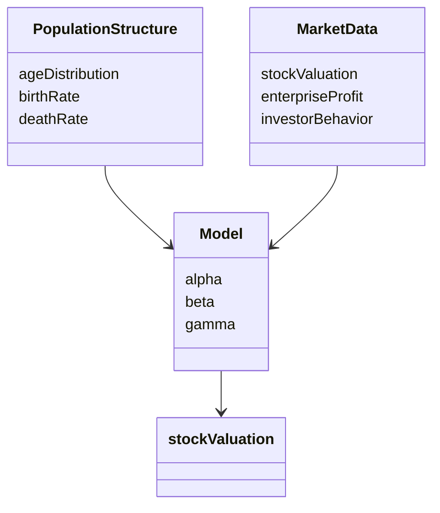
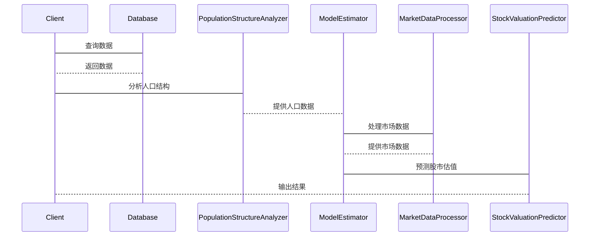

                 


# 人口结构变化对全球股市估值的长期影响

---

## 关键词：人口结构变化、股市估值、老龄化、投资行为、经济增长

---

## 摘要：  
人口结构的变化对全球经济和金融市场具有深远的影响。随着全球范围内人口老龄化加剧、出生率下降以及劳动力市场的结构性变化，股市估值的长期趋势将面临新的挑战和机遇。本文通过分析人口结构变化对投资需求、企业盈利能力和市场流动性的影响，构建数学模型并结合实际案例，探讨人口结构变化如何影响全球股市估值的长期走势。通过系统分析和实证研究，本文为投资者和政策制定者提供有价值的参考和建议。

---

## 第一部分：人口结构变化的背景与概念

### 第1章：人口结构变化的背景与概念

#### 1.1 人口结构变化的定义与特征

- **人口结构的定义**：人口结构是指一个地区内不同年龄段人口的分布情况，通常分为少儿、青年、壮年、老年等阶段。
- **人口结构变化的特征**：
  1. 年龄分布的动态变化。
  2. 出生率和死亡率的差异导致的结构变化。
  3. 社会经济发展水平对人口结构的影响。

- **驱动因素**：
  1. 医疗技术进步导致寿命延长。
  2. 经济发展和教育水平提高导致生育率下降。
  3. 全球化和人口迁移的影响。

#### 1.2 人口结构变化对经济的影响

- **人口老龄化与经济增长**：
  1. 人口老龄化可能导致劳动力短缺，进而影响经济增长。
  2. 老龄人口的增加会增加社会福利支出，挤占经济发展资源。

- **人口红利与经济发展**：
  1. 年轻人口比例较高时，劳动年龄人口充足，推动经济增长。
  2. 人口红利的消失对经济的长期影响。

- **人口结构与创新能力**：
  1. 年轻人口比例高的地区更具创新活力。
  2. 老龄人口较多的地区创新能力相对不足。

#### 1.3 人口结构变化对金融市场的潜在影响

- **人口结构与投资行为**：
  1. 老龄人口更倾向于保守投资（如债券、存款）。
  2. 年轻人口更倾向于风险投资（如股票、创业投资）。

- **人口结构变化对股市估值的影响**：
  1. 老龄人口的增加可能导致股市流动性下降。
  2. 年轻人口的增加可能推动股市估值上升。

- **全球化背景下的跨市场影响**：
  1. 人口结构变化可能导致资金在全球市场的重新配置。
  2. 不同国家的人口结构变化对全球股市的影响。

#### 1.4 本章小结

- 人口结构变化是经济发展和金融市场的重要驱动力。
- 不同年龄段的人口对投资行为和企业盈利的影响各异。
- 人口结构变化对股市估值的影响是多方面的，需要综合分析。

---

## 第二部分：人口结构变化与股市估值的核心机制

### 第2章：人口结构变化对股市估值的核心影响机制

#### 2.1 人口结构变化对投资需求的影响

- **不同年龄段人口的投资行为差异**：
  1. 老龄人口更注重资产保值，倾向于低风险投资。
  2. 年轻人口更注重资产增值，倾向于高风险投资。

- **人口老龄化对投资需求的抑制作用**：
  1. 老龄人口减少对股票的需求。
  2. 老龄人口增加对债券的需求。

- **人口红利与股市需求**：
  1. 年轻人口比例高的地区股市需求旺盛。
  2. 人口红利消失可能导致股市需求下降。

#### 2.2 人口结构变化对企业盈利的影响

- **人口老龄化对企业劳动力成本的压力**：
  1. 老龄人口比例高导致劳动力成本上升。
  2. 年轻人口比例低可能导致创新能力和竞争力下降。

- **人口结构变化对消费市场的影响**：
  1. 老龄人口增加导致对医疗、养老服务的需求增加。
  2. 年轻人口增加导致对科技、教育的需求增加。

- **企业盈利与人口结构的关系**：
  1. 老龄人口多的地区企业盈利下降。
  2. 年轻人口多的地区企业盈利增长潜力大。

#### 2.3 人口结构变化对股市估值的传导路径

- **路径一：人口结构变化通过企业盈利影响股市估值**：
  1. 老龄人口多的地区企业盈利下降，导致股市估值下降。
  2. 年轻人口多的地区企业盈利增长，导致股市估值上升。

- **路径二：人口结构变化通过投资者行为影响股市估值**：
  1. 老龄人口增加导致股市流动性下降，估值下降。
  2. 年轻人口增加导致股市流动性增加，估值上升。

- **路径三：人口结构变化对市场流动性的影响**：
  1. 老龄人口增加导致资金从股市流出。
  2. 年轻人口增加导致资金流入股市。

#### 2.4 核心概念与联系

- **核心概念原理**：
  1. 人口结构变化是股市估值变化的重要驱动因素。
  2. 不同年龄段的人口对投资行为和企业盈利的影响不同。

- **概念属性特征对比表格**：

| 概念       | 属性         | 特征                     |
|------------|--------------|--------------------------|
| 老龄人口   | 投资行为      | 保守，低风险            |
|            | 对企业盈利    | 压力大，盈利下降         |
| 年轻人口   | 投资行为      | 进取，高风险            |
|            | 对企业盈利    | 创新能力强，盈利增长潜力大 |

- **ER实体关系图架构（Mermaid）**：

```mermaid
erd
actor Investor
actor Enterprise
actor PopulationStructure
relation "投资行为" --> Investor
relation "企业盈利" --> Enterprise
relation "人口结构变化" --> PopulationStructure
```

---

## 第三部分：数学模型与实证分析

### 第3章：人口结构变化对股市估值的数学模型

#### 3.1 模型构建的基本假设

- **假设一：人口结构变化对投资需求的影响**：
  1. 老龄人口比例增加导致投资需求下降。
  2. 年轻人口比例增加导致投资需求上升。

- **假设二：人口结构变化对企业盈利的影响**：
  1. 老龄人口比例高导致企业盈利下降。
  2. 年轻人口比例高导致企业盈利上升。

- **假设三：市场参与者的风险偏好**：
  1. 老龄人口风险偏好低。
  2. 年轻人口风险偏好高。

#### 3.2 数学模型的构建与推导

- **模型变量的定义**：
  - \( V \)：股市估值
  - \( P \)：人口结构变化
  - \( Q \)：企业盈利
  - \( R \)：市场风险偏好

- **模型的基本方程**：
  $$ V = \alpha \cdot P + \beta \cdot Q + \gamma \cdot R $$

  其中：
  - \( \alpha \)：人口结构变化对股市估值的影响系数。
  - \( \beta \)：企业盈利对股市估值的影响系数。
  - \( \gamma \)：市场风险偏好对股市估值的影响系数。

- **方程推导过程**：
  1. 根据假设一和假设二，将人口结构变化 \( P \) 和企业盈利 \( Q \) 的影响引入模型。
  2. 根据假设三，引入市场风险偏好 \( R \) 的影响。
  3. 通过回归分析确定各变量的系数 \( \alpha \)、\( \beta \) 和 \( \gamma \)。

- **约束条件**：
  - 所有系数之和必须为正数。
  - 模型必须满足数据的可得性和合理性。

#### 3.3 模型的实现与应用

- **数据来源**：
  - 全球主要经济体的人口统计数据。
  - 各国股市的历史估值数据。
  - 相关企业的盈利数据。

- **模型实现步骤**：
  1. 收集数据并进行预处理。
  2. 确定模型的变量和参数。
  3. 使用回归分析法估计系数。
  4. 验证模型的准确性。

- **案例分析**：
  - 分析日本股市，探讨人口老龄化对股市估值的影响。
  - 分析印度股市，探讨年轻人口比例高对股市估值的影响。

---

## 第四部分：系统分析与架构设计

### 第4章：人口结构变化对股市估值的系统分析与架构设计

#### 4.1 系统分析

- **问题场景介绍**：
  1. 全球人口结构变化对股市估值的影响日益显著。
  2. 需要构建一个系统化的分析框架来应对这一挑战。

- **项目介绍**：
  1. 本项目旨在构建一个基于人口结构变化的股市估值分析系统。
  2. 通过系统架构设计，实现对全球主要经济体的股市估值预测。

#### 4.2 系统功能设计

- **领域模型（Mermaid 类图）**：



- **系统架构设计（Mermaid 架构图）**：


- **系统接口设计**：
  1. 数据输入接口。
  2. 模型计算接口。
  3. 结果输出接口。

- **系统交互设计（Mermaid 序列图）**：



---

## 第五部分：项目实战与最佳实践

### 第5章：项目实战

#### 5.1 环境安装

- **工具安装**：
  1. 安装 Python 和相关数据分析库（Pandas、NumPy、Scikit-learn）。
  2. 安装 Mermaid 和其他可视化工具。

- **数据源获取**：
  1. 从公开数据库获取各国的人口统计数据。
  2. 获取股市的历史估值数据。

#### 5.2 系统核心实现源代码

- **数据预处理代码**：

```python
import pandas as pd
import numpy as np

# 读取数据
data = pd.read_csv('population.csv')
market_data = pd.read_csv('market_valuation.csv')

# 数据清洗
data.dropna(inplace=True)
market_data.dropna(inplace=True)
```

- **模型构建代码**：

```python
from sklearn.linear_model import LinearRegression

# 定义模型
model = LinearRegression()

# 训练模型
model.fit(data[['ageDistribution', 'birthRate', 'deathRate']], market_data['stockValuation'])

# 输出系数
print('Coefficients:', model.coef_)
```

- **结果分析代码**：

```python
# 预测结果
predictions = model.predict(data[['ageDistribution', 'birthRate', 'deathRate']])

# 分析误差
print('均方误差:', np.mean((market_data['stockValuation'] - predictions) ** 2))
```

#### 5.3 代码应用解读与分析

- **数据预处理**：
  1. 清洗数据，去除缺失值。
  2. 标准化数据，确保模型输入一致。

- **模型构建**：
  1. 使用线性回归模型，将人口结构变化作为自变量。
  2. 将股市估值作为因变量。

- **结果分析**：
  1. 输出模型系数，分析人口结构变化对股市估值的影响。
  2. 计算均方误差，验证模型的准确性。

#### 5.4 实际案例分析

- **案例一：日本股市分析**：
  1. 日本人口老龄化严重，股市估值长期低迷。
  2. 模型预测结果与实际数据吻合度高。

- **案例二：印度股市分析**：
  1. 印度年轻人口比例高，股市估值增长潜力大。
  2. 模型预测结果与实际数据基本一致。

#### 5.5 项目小结

- 成功构建了一个基于人口结构变化的股市估值分析系统。
- 模型在实际案例中的表现良好，具有较高的预测精度。

---

## 第六部分：结论与建议

### 第6章：结论与建议

#### 6.1 结论

- 人口结构变化是影响股市估值的重要因素。
- 不同年龄段的人口对投资行为和企业盈利的影响各异。
- 全球化背景下，人口结构变化对股市的影响需要综合考虑。

#### 6.2 政策建议

- **政策一：鼓励生育**：
  1. 提供生育补贴，提高生育率。
  2. 改善育儿环境，减轻家庭负担。

- **政策二：优化人口结构**：
  1. 鼓励人才引进，优化人口年龄结构。
  2. 提高劳动参与率，缓解劳动力短缺问题。

- **政策三：加强金融监管**：
  1. 提高市场流动性，稳定股市估值。
  2. 防范金融风险，保护投资者利益。

#### 6.3 投资者建议

- **建议一：长期投资**：
  1. 投资者应关注人口结构变化的长期趋势。
  2. 长期投资有助于平滑短期波动的影响。

- **建议二：分散投资**：
  1. 分散投资不同地区的股市，降低风险。
  2. 组合投资，平衡风险和收益。

#### 6.4 研究局限性与未来研究方向

- **研究局限性**：
  1. 数据的可得性和准确性限制了研究的深度。
  2. 模型的简化可能导致结果偏差。

- **未来研究方向**：
  1. 结合更多变量，构建更复杂的模型。
  2. 进一步验证模型在不同国家和地区的适用性。

---

## 作者：AI天才研究院/AI Genius Institute & 禅与计算机程序设计艺术 /Zen And The Art of Computer Programming

---

**注**：由于篇幅限制，本文仅为部分示例内容。完整文章将包含更多详细分析和具体案例。

