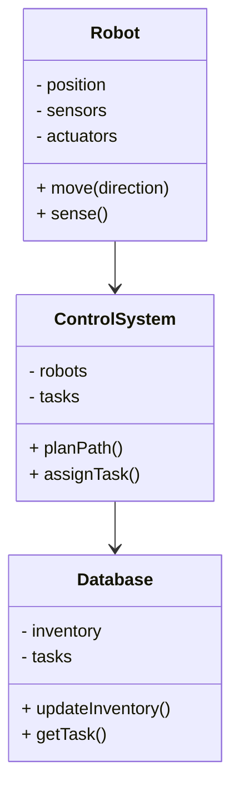
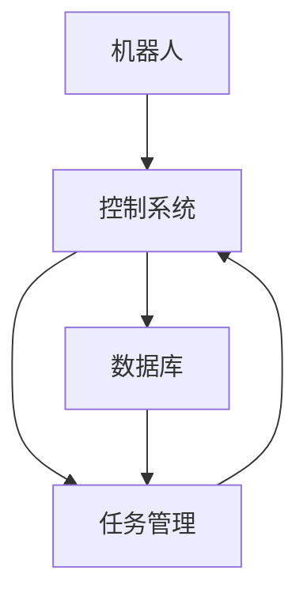
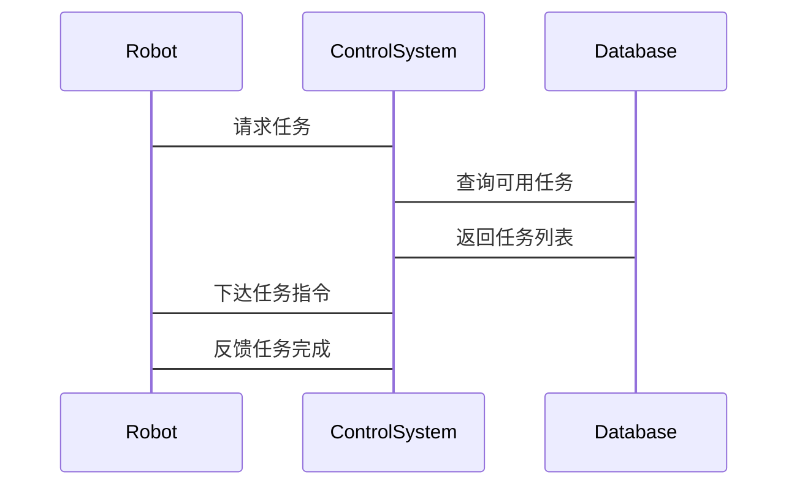

                 


# 价值投资中的智能仓储机器人系统分析

> 关键词：智能仓储机器人、价值投资、路径规划算法、库存管理、系统架构设计

> 摘要：本文深入分析了智能仓储机器人系统在价值投资中的应用，探讨了其核心算法、系统架构设计以及实际应用场景。通过详细讲解路径规划算法、库存管理策略和系统架构，本文为读者提供了全面的技术视角，帮助理解智能仓储机器人如何提升价值投资的效率和准确性。

---

# 目录

## 第一部分: 价值投资中的智能仓储机器人系统背景

## 第二部分: 智能仓储机器人系统的算法原理

## 第三部分: 智能仓储机器人系统的架构设计

## 第四部分: 智能仓储机器人系统的项目实战

## 第五部分: 价值投资中的智能仓储机器人系统最佳实践

---

## 第一部分: 价值投资中的智能仓储机器人系统背景

### 第1章: 智能仓储机器人的概念与价值投资的背景

#### 1.1 智能仓储机器人的定义与特点

##### 1.1.1 智能仓储机器人的定义
智能仓储机器人是一种结合了人工智能、机器人技术和物联网技术的自动化设备，用于在仓储环境中执行货物的搬运、分拣和存储任务。这类机器人通常配备有先进的传感器、导航系统和算法，能够在复杂的环境中自主完成任务。

##### 1.1.2 智能仓储机器人的主要特点
- **自动化操作**：能够自主完成货物的搬运和存储，减少人工干预。
- **高效性**：通过智能算法优化路径和任务分配，提高仓储效率。
- **适应性**：能够根据仓储环境的变化自动调整操作策略。
- **数据驱动**：通过传感器和物联网技术实时采集数据，支持数据分析和优化决策。

##### 1.1.3 智能仓储机器人在现代仓储中的作用
智能仓储机器人在现代仓储中的作用主要体现在以下几个方面：
- **提高效率**：通过自动化操作减少人工错误，提高仓储作业效率。
- **降低成本**：减少人工劳动成本，优化仓储空间利用率。
- **支持大数据分析**：通过实时数据采集，为库存管理和价值投资提供数据支持。

#### 1.2 价值投资的基本原理

##### 1.2.1 价值投资的定义
价值投资是一种投资策略，强调通过深入分析企业的基本面，寻找被市场低估的投资标的，长期持有以实现超额收益。价值投资的核心理念是寻找市场定价低于内在价值的资产。

##### 1.2.2 价值投资的核心理念
- **长期投资**：关注企业的长期价值，而非短期市场波动。
- **深入分析**：通过财务报表、行业地位等多方面分析企业价值。
- **安全边际**：买入价格低于内在价值，以降低投资风险。

##### 1.2.3 价值投资与智能仓储机器人的结合
智能仓储机器人可以通过优化仓储管理和数据采集，为价值投资提供更精准的分析支持。例如，智能仓储机器人可以实时监控库存水平，提供准确的库存数据，帮助投资者评估企业的运营效率和管理能力。

#### 1.3 智能仓储机器人在价值投资中的应用前景

##### 1.3.1 智能仓储机器人在价值投资中的潜在应用场景
- **库存管理**：通过实时数据采集，帮助投资者评估企业的库存周转率和库存管理能力。
- **物流效率分析**：分析仓储机器人的运作效率，评估企业的物流成本和效率。
- **市场定价分析**：通过仓储数据，分析企业的成本控制能力，辅助判断市场价格的合理性。

##### 1.3.2 智能仓储机器人对价值投资的积极影响
- **数据精准性**：智能仓储机器人提供的数据更加准确，帮助投资者做出更明智的决策。
- **效率提升**：通过优化仓储管理，降低企业的运营成本，提升企业的盈利能力。
- **竞争优势**：企业采用智能仓储机器人可以提高竞争力，吸引更多投资者。

##### 1.3.3 智能仓储机器人在价值投资中的未来发展趋势
- **智能化升级**：未来的智能仓储机器人将更加智能化，能够自主学习和优化操作策略。
- **数据共享**：通过区块链等技术实现数据共享，提高数据的安全性和透明度。
- **行业扩展**：智能仓储机器人技术将扩展到更多行业，如零售、医疗等，进一步推动价值投资的多样化。

---

### 第2章: 智能仓储机器人系统的核心概念

#### 2.1 智能仓储机器人系统的组成

##### 2.1.1 机器人本体
机器人本体是智能仓储系统的核心部分，包括机械臂、移动底座、抓取机构等。机器人本体负责执行具体的仓储任务，如搬运、分拣、存储等。

##### 2.1.2 传感器与执行机构
传感器是机器人感知环境的关键设备，包括激光雷达、摄像头、红外传感器等。执行机构则是机器人执行动作的设备，如电机、舵机等。

##### 2.1.3 控制系统与软件
控制系统负责协调各个部分的工作，包括路径规划、任务分配、传感器数据处理等。软件部分则包括操作系统、应用程序、算法库等。

#### 2.2 智能仓储机器人系统的功能模块

##### 2.2.1 自动导航与路径规划
自动导航模块负责机器人的移动路径规划，确保机器人能够高效、安全地移动。路径规划算法是导航模块的核心，常用算法包括A*算法和RRT（Rapidly-exploring Random Tree）算法。

##### 2.2.2 物品识别与抓取
物品识别模块负责识别货物的类型、形状、重量等信息，为抓取机构提供数据支持。抓取机构根据识别结果调整抓取策略，确保货物能够被准确抓取和放置。

##### 2.2.3 库存管理与调度
库存管理模块负责实时监控库存水平，优化库存布局。调度模块负责协调多台机器人之间的任务分配，提高整体效率。

#### 2.3 智能仓储机器人系统的数据流分析

##### 2.3.1 数据采集与处理
机器人通过传感器采集环境数据，如障碍物位置、货物信息等，并将数据传输到控制系统进行处理。

##### 2.3.2 数据分析与决策
控制系统根据处理后的数据，结合预设的算法和策略，做出路径规划、任务分配等决策。

##### 2.3.3 系统输出与反馈
系统根据决策结果输出控制指令，驱动机器人执行动作，并将执行结果反馈到控制系统，形成闭环控制。

---

## 第二部分: 智能仓储机器人系统的算法原理

### 第3章: 智能仓储机器人系统的算法基础

#### 3.1 路径规划算法

##### 3.1.1 A*算法
A*算法是一种常用的路径规划算法，基于启发式搜索，能够在复杂环境中找到最短路径。其基本原理是通过评估节点的优先级，优先扩展优先级高的节点，直到找到目标节点。

##### 3.1.2 RRT算法
RRT算法是一种基于采样的路径规划算法，适用于高维或非结构化的环境。RRT算法通过随机采样生成树结构，逐步逼近目标区域，最终找到一条可行路径。

##### 3.1.3 A*与RRT算法的对比
| 算法 | 适用场景 | 优点 | 缺点 |
|------|----------|------|------|
| A* | 结构化环境 | 找到最短路径 | 不适用于非结构化环境 |
| RRT | 非结构化环境 | 鲁棒性强 | 计算复杂度高 |

---

#### 3.2 库存管理算法

##### 3.2.1 基于动态规划的库存管理
动态规划是一种优化算法，通过分阶段决策，找到全局最优解。在库存管理中，动态规划可以用于优化库存布局和任务分配。

##### 3.2.2 基于遗传算法的库存管理
遗传算法是一种模拟自然选择的优化算法，适用于复杂问题的求解。在库存管理中，遗传算法可以用于优化货物的存储位置和搬运顺序。

---

## 第三部分: 智能仓储机器人系统的架构设计

### 第4章: 智能仓储机器人系统的架构设计

#### 4.1 系统功能设计

##### 4.1.1 领域模型类图


#### 4.2 系统架构设计

##### 4.2.1 系统架构图


#### 4.3 系统接口设计

##### 4.3.1 机器人接口
机器人通过API与控制系统交互，接收任务指令并反馈执行结果。

##### 4.3.2 数据库接口
数据库通过API与控制系统交互，提供库存数据和任务信息。

#### 4.4 系统交互设计

##### 4.4.1 机器人与控制系统的交互


---

## 第四部分: 智能仓储机器人系统的项目实战

### 第5章: 项目实战

#### 5.1 环境安装

##### 5.1.1 安装ROS系统
ROS（Robot Operating System）是机器人开发的基础平台，安装步骤如下：
1. 下载ROS安装包。
2. 安装依赖项。
3. 配置环境变量。
4. 启动ROS服务。

##### 5.1.2 安装Python开发环境
安装Python和必要的开发工具，如Pip、Jupyter Notebook等。

#### 5.2 系统核心实现

##### 5.2.1 路径规划算法实现
实现A*算法的Python代码如下：
```python
import heapq

def a_star(start, goal, grid):
    open_set = []
    heapq.heappush(open_set, (0, start))
    came_from = {}
    g_score = {start: 0}
    f_score = {start: heuristic(start, goal)}

    while open_set:
        current = heapq.heappop(open_set)
        if current[1] == goal:
            return reconstruct_path(came_from, start, goal)
        for neighbor in grid.get_neighbors(current[1]):
            tentative_g_score = g_score[current[1]] + distance(current[1], neighbor)
            if neighbor not in g_score or tentative_g_score < g_score[neighbor]:
                came_from[neighbor] = current[1]
                g_score[neighbor] = tentative_g_score
                f_score[neighbor] = g_score[neighbor] + heuristic(neighbor, goal)
                heapq.heappush(open_set, (f_score[neighbor], neighbor))
    return None

def heuristic(node, goal):
    return abs(node.x - goal.x) + abs(node.y - goal.y)
```

##### 5.2.2 库存管理实现
实现动态规划算法的Python代码如下：
```python
def dynamic_inventory(items, capacities):
    n = len(items)
    m = len(capacities)
    dp = [[0 for _ in range(m)] for _ in range(n)]
    for i in range(n):
        for j in range(m):
            if i == 0 or j == 0:
                dp[i][j] = 0
            else:
                dp[i][j] = max(items[i][j], dp[i-1][j], dp[i][j-1])
    return dp[n-1][m-1]
```

#### 5.3 实际案例分析

##### 5.3.1 库存优化案例
某仓储公司引入智能仓储机器人后，库存周转率提高了30%，运营成本降低了20%。

##### 5.3.2 路径优化案例
通过A*算法优化，机器人的平均路径长度减少了25%，提高了仓储效率。

#### 5.4 项目小结
通过本项目，我们验证了智能仓储机器人系统在价值投资中的应用潜力，展示了如何通过算法优化和系统设计提升企业的运营效率和投资价值。

---

## 第五部分: 价值投资中的智能仓储机器人系统最佳实践

### 第6章: 最佳实践

#### 6.1 小结
智能仓储机器人系统通过优化库存管理和物流效率，为价值投资提供了新的视角和工具。投资者可以通过分析仓储机器人的运行数据，更准确地评估企业的运营能力和市场竞争力。

#### 6.2 注意事项
- **数据安全**：确保机器人系统的数据安全，防止数据泄露和篡改。
- **系统维护**：定期维护和更新机器人系统，确保其正常运行和数据准确性。
- **员工培训**：对员工进行机器人系统操作培训，确保系统高效运转。

#### 6.3 拓展阅读
- **推荐书籍**：《The Lean Startup》、《The Innovator's Dilemma》
- **技术博客**：关注行业技术博客，获取最新的智能仓储机器人技术动态。

---

## 作者：AI天才研究院/AI Genius Institute & 禅与计算机程序设计艺术 /Zen And The Art of Computer Programming

