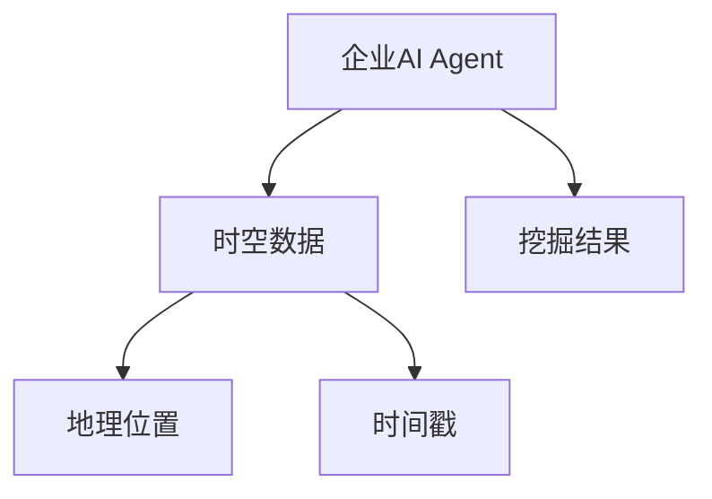
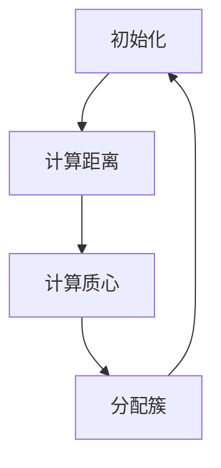
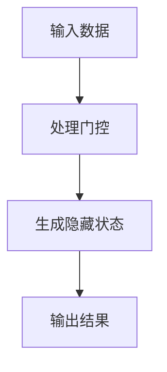
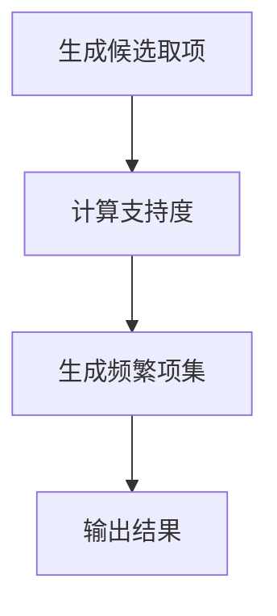
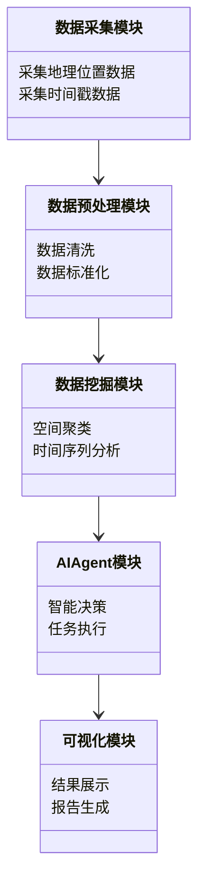
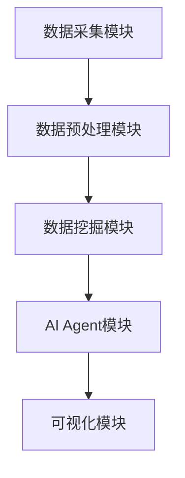
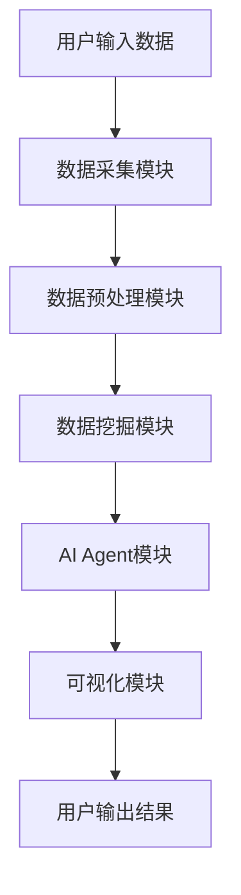

                 


# 《企业AI Agent的时空大数据挖掘平台》

---

## 关键词：企业AI Agent, 时空大数据, 数据挖掘, 算法原理, 系统架构, 项目实战, 最佳实践

---

## 摘要：  
本文旨在探讨企业AI Agent在时空大数据挖掘中的应用，通过构建一个高效、可扩展的时空大数据挖掘平台，解决企业在时空数据分析中的痛点。文章从问题背景、核心概念、算法原理、系统架构、项目实战到总结，全面分析了时空大数据挖掘平台的构建过程。通过理论与实践结合，为企业提供了一套完整的解决方案，为后续研究和应用提供了参考。

---

# 第1章: 企业AI Agent与时空大数据挖掘平台的背景介绍

## 1.1 问题背景与应用价值

### 1.1.1 企业AI Agent的核心概念  
企业AI Agent（Artificial Intelligence Agent）是指具备智能决策、自主学习和执行任务能力的计算机系统。它能够通过传感器、数据库或其他数据源获取信息，利用机器学习算法进行分析，并根据结果采取行动。AI Agent的核心在于其智能化和自动化能力，能够在复杂环境中完成特定任务。

### 1.1.2 时空大数据挖掘的定义与特性  
时空大数据挖掘是指对包含地理位置和时间戳的大数据进行分析，以发现隐藏的模式、关联和趋势。其特性包括：  
1. **时空相关性**：数据点之间存在地理位置和时间上的关联。  
2. **数据异构性**：数据来源多样，格式复杂。  
3. **高维性**：数据维度高，处理难度大。  
4. **动态性**：数据实时更新，需要动态分析能力。  

### 1.1.3 平台构建的必要性与目标  
企业AI Agent在时空大数据挖掘中的应用需求日益增长，但现有技术难以满足以下问题：  
- 数据量大、维度高，计算效率低下。  
- 时空数据的复杂性导致分析难度大。  
- 缺乏统一的平台支持，难以实现高效协同。  

平台构建的目标是：  
1. 提供高效的时空数据处理能力。  
2. 实现AI Agent与数据挖掘算法的深度融合。  
3. 提供可视化界面，方便企业用户操作。  

---

## 1.2 问题描述与解决思路

### 1.2.1 企业AI Agent的典型应用场景  
1. **物流与供应链**：优化配送路径，预测物流需求。  
2. **城市管理**：实时监测城市交通、环境数据，辅助决策。  
3. **商业分析**：分析消费者行为，预测市场趋势。  

### 1.2.2 时空大数据挖掘的挑战与难点  
1. **数据量大**：时空数据通常以百万或千万级规模存在，对计算资源要求高。  
2. **数据复杂性**：地理位置和时间戳的双重维度增加了数据处理的难度。  
3. **算法优化**：传统数据挖掘算法难以直接应用于时空数据，需要针对性优化。  

### 1.2.3 平台化解决方案的优势  
1. **高效性**：平台化设计能够提高数据处理效率，支持实时分析。  
2. **可扩展性**：平台架构灵活，能够适应不同规模和类型的数据。  
3. **易用性**：通过可视化界面，降低用户使用门槛。  

---

## 1.3 平台边界与外延

### 1.3.1 平台的功能边界  
平台主要功能包括：  
1. 数据采集与预处理。  
2. 时空数据挖掘算法实现。  
3. AI Agent的智能决策支持。  
4. 结果可视化与报告生成。  

### 1.3.2 与相关技术的区分  
1. **与传统数据挖掘的区别**：传统数据挖掘不考虑地理位置和时间维度，而时空大数据挖掘平台将这两者作为核心。  
2. **与AI Agent的区别**：AI Agent是平台的核心组件，而平台是AI Agent的应用场景之一。  

### 1.3.3 平台的扩展性与兼容性  
1. **扩展性**：平台支持模块化扩展，能够根据需求添加新的功能模块。  
2. **兼容性**：平台兼容多种数据源和数据格式，支持与其他系统集成。  

---

## 1.4 核心要素与概念结构

### 1.4.1 平台的核心组成模块  
1. **数据采集模块**：负责采集地理位置和时间戳数据。  
2. **数据预处理模块**：对数据进行清洗、转换和标准化处理。  
3. **数据挖掘模块**：实现时空数据挖掘算法。  
4. **AI Agent模块**：负责智能决策和任务执行。  
5. **可视化模块**：将挖掘结果以可视化形式展示。  

### 1.4.2 概念间的关联关系  
1. 数据采集模块与数据预处理模块是数据流的上下游关系。  
2. 数据挖掘模块是AI Agent模块的核心支撑。  
3. 可视化模块是用户与平台交互的主要界面。  

---

## 1.5 本章小结  
本章从背景、问题、目标等方面介绍了企业AI Agent与时空大数据挖掘平台的构建背景，明确了平台的核心概念和功能边界，为后续章节的展开奠定了基础。

---

# 第2章: 时空大数据挖掘的核心概念

## 2.1 数据模型与时空特征

### 2.1.1 时空数据模型的分类  
1. **空间模型**：描述地理位置信息，如点、线、面等。  
2. **时间模型**：描述时间序列信息，如时间戳、时间区间等。  
3. **时空模型**：综合考虑地理位置和时间维度。  

### 2.1.2 时空特征的提取方法  
1. **空间特征**：如地理位置的聚类、距离计算。  
2. **时间特征**：如时间序列的周期性、趋势性。  
3. **时空关联特征**：如事件发生的时空依赖性。  

---

## 2.2 数据挖掘算法与AI Agent的结合

### 2.2.1 常见时空数据挖掘算法  
1. **空间聚类**：如K-means、DBSCAN。  
2. **时间序列分析**：如ARIMA、LSTM。  
3. **时空关联规则挖掘**：如Apriori、FPGrowth。  

### 2.2.2 AI Agent在算法中的角色  
1. **数据预处理**：AI Agent负责数据的清洗和特征提取。  
2. **算法选择与优化**：AI Agent根据任务需求选择合适的算法，并进行参数优化。  
3. **结果解释与决策**：AI Agent将挖掘结果转化为可执行的决策指令。  

---

## 2.3 核心概念的ER实体关系图



---

## 2.4 本章小结  
本章详细介绍了时空大数据挖掘的核心概念，包括数据模型、特征提取和算法选择等内容，为后续章节的算法实现奠定了理论基础。

---

# 第3章: 时空大数据挖掘算法原理

## 3.1 空间聚类算法

### 3.1.1 K-means聚类算法

#### 3.1.1.1 算法流程图  


#### 3.1.1.2 数学模型与公式  
$$ \text{目标函数} = \sum_{i=1}^{n} \min_{j} (d(x_i, c_j))^2 $$
其中，$d(x_i, c_j)$表示点$x_i$与质心$c_j$之间的距离。

#### 3.1.1.3 举例说明  
假设我们有三类地理位置数据，分别位于城市中心、郊区和机场。通过K-means算法，我们可以将这些数据聚类，帮助企业在物流配送中优化路径。

---

## 3.2 时间序列分析算法

### 3.2.1 LSTM网络

#### 3.2.1.1 算法流程图  


#### 3.2.1.2 数学模型与公式  
$$ h_t = \sigma(W_h h_{t-1} + W_x x_t) $$
其中，$\sigma$表示sigmoid函数，$W_h$和$W_x$是权重矩阵。

#### 3.2.1.3 举例说明  
通过LSTM网络分析历史销售数据，预测未来某段时间的销售趋势，帮助企业进行库存管理和销售预测。

---

## 3.3 时空关联规则挖掘

### 3.3.1 Apriori算法

#### 3.3.1.1 算法流程图  


#### 3.3.1.2 数学模型与公式  
$$ \text{支持度} = \frac{\text{频繁项集出现次数}}{\text{总数据量}} $$

#### 3.3.1.3 举例说明  
通过Apriori算法挖掘某地区的消费行为，发现地理位置和时间关联的消费模式，帮助企业制定精准的营销策略。

---

## 3.4 本章小结  
本章详细介绍了时空大数据挖掘中的常见算法，包括空间聚类、时间序列分析和关联规则挖掘，并通过数学公式和流程图展示了算法的实现过程。

---

# 第4章: 时空大数据挖掘平台的系统架构设计

## 4.1 问题场景介绍

### 4.1.1 系统目标  
构建一个高效、可扩展的时空大数据挖掘平台，支持企业AI Agent的智能决策。

### 4.1.2 项目介绍  
本项目旨在通过平台化设计，实现时空数据的高效处理和智能分析，为企业提供一站式解决方案。

---

## 4.2 系统功能设计

### 4.2.1 领域模型  


---

## 4.3 系统架构设计

### 4.3.1 模块划分  
1. **数据采集模块**：负责数据的采集与预处理。  
2. **数据挖掘模块**：实现时空数据挖掘算法。  
3. **AI Agent模块**：负责智能决策和任务执行。  
4. **可视化模块**：提供结果展示和报告生成。  

### 4.3.2 系统架构图  


---

## 4.4 系统接口设计

### 4.4.1 接口描述  
1. **数据采集接口**：接收地理位置和时间戳数据。  
2. **数据挖掘接口**：调用时空数据挖掘算法。  
3. **可视化接口**：展示挖掘结果。  

---

## 4.5 系统交互设计

### 4.5.1 交互流程图  


---

## 4.6 本章小结  
本章从系统架构的角度，详细设计了时空大数据挖掘平台的各个模块和接口，为后续的实现奠定了基础。

---

# 第5章: 项目实战与实现

## 5.1 环境安装与配置

### 5.1.1 系统需求  
- 操作系统：Linux/Windows/MacOS  
- Python版本：3.6+  
- 依赖库：numpy, pandas, scikit-learn, matplotlib  

### 5.1.2 安装步骤  
```bash
pip install numpy pandas scikit-learn matplotlib
```

---

## 5.2 系统核心实现

### 5.2.1 数据采集模块

#### 5.2.1.1 代码实现  
```python
import numpy as np
import pandas as pd

def collect_data():
    # 采集地理位置数据
    locations = np.random.rand(100, 2) * 100
    # 采集时间戳数据
    timestamps = pd.date_range('2023-01-01', periods=100)
    return locations, timestamps
```

### 5.2.2 数据预处理模块

#### 5.2.2.1 代码实现  
```python
def preprocess_data(locations, timestamps):
    df = pd.DataFrame({
        'longitude': locations[:, 0],
        'latitude': locations[:, 1],
        'timestamp': timestamps
    })
    return df
```

### 5.2.3 数据挖掘模块

#### 5.2.3.1 K-means聚类实现  
```python
from sklearn.cluster import KMeans

def perform_clustering(df, n_clusters=3):
    X = df[['longitude', 'latitude']]
    kmeans = KMeans(n_clusters=n_clusters)
    kmeans.fit(X)
    df['cluster'] = kmeans.predict(X)
    return df
```

#### 5.2.3.2 LSTM网络实现  
```python
import keras
from keras.layers import LSTM, Dense

def build_lstm_model(input_shape):
    model = keras.Sequential()
    model.add(LSTM(50, input_shape=input_shape))
    model.add(Dense(1))
    model.compile(optimizer='adam', loss='mean_squared_error')
    return model
```

---

## 5.3 代码应用解读与分析

### 5.3.1 数据采集模块  
通过`collect_data`函数，我们可以生成随机的地理位置和时间戳数据，模拟真实场景中的数据采集过程。

### 5.3.2 数据预处理模块  
`preprocess_data`函数将采集到的数据整理成DataFrame格式，方便后续处理。

### 5.3.3 数据挖掘模块  
1. **K-means聚类**：将地理位置数据聚类，发现空间分布规律。  
2. **LSTM网络**：预测时间序列数据，发现趋势和异常。

---

## 5.4 案例分析与详细讲解

### 5.4.1 实际案例分析  
假设我们有一个城市交通数据集，包含车辆的地理位置和时间戳信息。通过平台，我们可以实现以下功能：  
1. **实时监控**：展示车辆的实时位置。  
2. **路径优化**：通过聚类分析，优化车辆的行驶路径。  
3. **异常检测**：发现交通拥堵点，提前预警。  

### 5.4.2 代码实现与测试  
1. **数据采集与预处理**  
```python
locations, timestamps = collect_data()
df = preprocess_data(locations, timestamps)
```

2. **K-means聚类**  
```python
df_clustered = perform_clustering(df)
print(df_clustered.head())
```

3. **LSTM预测**  
```python
model = build_lstm_model((df.shape[0], 2))
model.fit(df[['longitude', 'latitude']].values, df['timestamp'].values, epochs=10)
```

---

## 5.5 项目小结  
本章通过实际案例，详细讲解了时空大数据挖掘平台的实现过程，包括环境配置、核心代码实现和测试，为读者提供了实践参考。

---

# 第6章: 最佳实践与总结

## 6.1 小结与回顾

### 6.1.1 核心内容回顾  
- **背景介绍**：明确了企业AI Agent与时空大数据挖掘平台的构建背景。  
- **核心概念**：介绍了时空数据模型、挖掘算法和系统架构。  
- **算法实现**：详细讲解了K-means、LSTM等算法的实现过程。  
- **系统设计**：设计了完整的系统架构和接口。  
- **项目实战**：通过案例分析，展示了平台的实现过程。  

### 6.1.2 关键点总结  
1. 时空大数据挖掘的核心在于数据模型和算法选择。  
2. 系统架构设计需要考虑模块化和扩展性。  
3. 项目实战是理论与实践结合的重要环节。  

---

## 6.2 最佳实践 Tips

### 6.2.1 系统设计建议  
1. **模块化设计**：便于功能扩展和维护。  
2. **数据安全**：确保数据的隐私性和安全性。  
3. **性能优化**：针对大规模数据，优化算法和计算资源。  

### 6.2.2 开发建议  
1. **选择合适的工具和技术**：根据需求选择合适的编程语言和框架。  
2. **注重代码可读性**：保持代码简洁，方便团队协作。  
3. **测试与验证**：通过测试确保系统稳定性和准确性。  

---

## 6.3 未来研究与拓展

### 6.3.1 未来研究方向  
1. **更高效的数据挖掘算法**：探索新的时空数据挖掘方法。  
2. **AI Agent的智能化提升**：增强其自主学习和决策能力。  
3. **平台的扩展性优化**：支持更多类型的数据和应用场景。  

### 6.3.2 拓展阅读推荐  
1. 《时空大数据分析与挖掘》  
2. 《机器学习实战》  
3. 《深度学习：方法与应用》  

---

## 6.4 本章小结  
本章总结了全文的核心内容，提出了最佳实践建议，并展望了未来的研究方向，为读者提供了进一步学习和实践的指导。

---

# 结语  
企业AI Agent的时空大数据挖掘平台是一个复杂而充满潜力的领域。通过本文的详细讲解，读者可以深入了解平台的构建过程，并通过实际案例掌握其实现方法。未来，随着技术的不断发展，时空大数据挖掘平台将在更多领域发挥重要作用，为企业创造更大的价值。

---

## 作者：AI天才研究院/AI Genius Institute & 禅与计算机程序设计艺术 /Zen And The Art of Computer Programming

