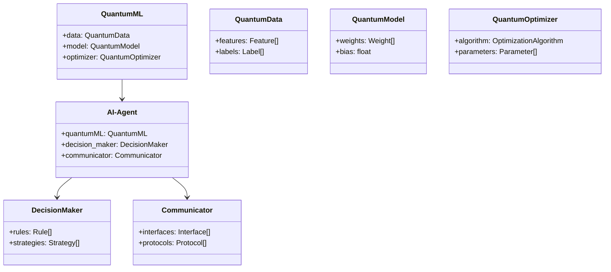
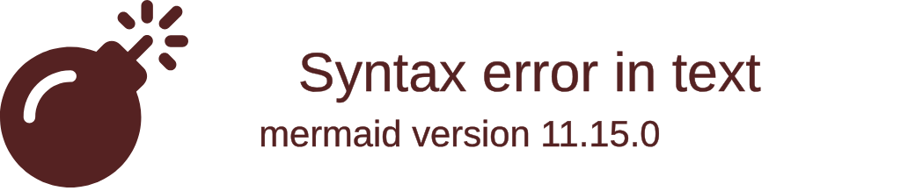
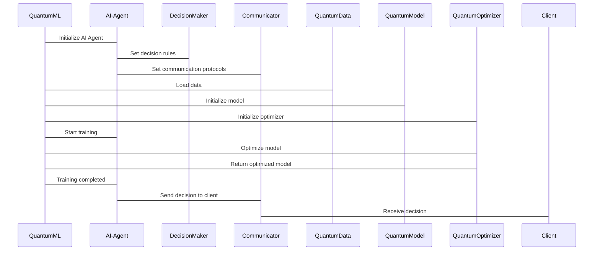
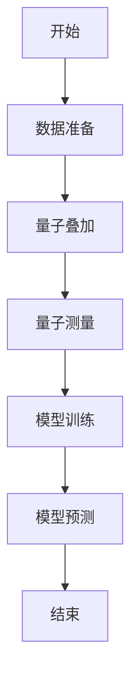
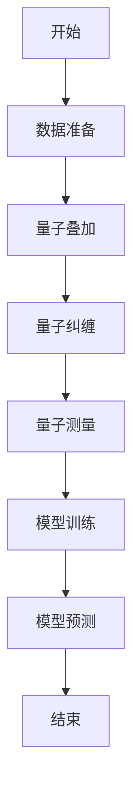

                 


```markdown
# 企业AI Agent的量子机器学习应用策略

> 关键词：量子机器学习，AI Agent，企业应用，算法实现，系统架构

> 摘要：本文详细探讨了企业AI Agent在量子机器学习中的应用策略。首先介绍了量子机器学习与AI Agent的基本概念和核心原理，然后分析了量子机器学习算法的实现及其在企业AI Agent中的应用，最后通过实际案例展示了量子机器学习在企业AI Agent中的应用价值和潜力。本文还提供了系统的架构设计、算法实现代码以及详细的数学模型，为读者提供全面的指导和参考。

---

# 第一部分: 量子机器学习与AI Agent概述

## 第1章: 量子机器学习与AI Agent概述

### 1.1 量子计算与机器学习的基础

#### 1.1.1 量子计算的基本概念

量子计算是一种基于量子力学原理的计算方式。与经典计算机相比，量子计算机利用量子叠加和量子纠缠等特性，可以在某些特定问题上实现指数级的计算速度提升。量子计算的核心概念包括：

- **量子叠加**：量子位（qubit）可以同时处于多个状态的叠加态。
- **量子纠缠**：两个或多个量子位之间可以形成纠缠态，使得它们的状态相互关联。

#### 1.1.2 量子叠加与量子纠缠

量子叠加和量子纠缠是量子计算的核心特性。量子叠加使得量子计算机能够同时处理多种可能性，而量子纠缠则允许信息在多个量子位之间快速传播。

#### 1.1.3 量子计算在机器学习中的潜力

量子计算在机器学习中的潜力主要体现在以下方面：

1. **加速优化问题求解**：量子计算机可以在某些优化问题上实现指数级加速。
2. **处理高维数据**：量子计算能够处理高维数据，适用于复杂的模式识别任务。
3. **提高计算效率**：量子计算可以显著提高机器学习算法的计算效率。

### 1.2 AI Agent的基本概念与特征

#### 1.2.1 AI Agent的定义

AI Agent（人工智能代理）是一种能够感知环境并采取行动以实现目标的智能实体。AI Agent可以是软件程序、机器人或其他智能系统。

#### 1.2.2 AI Agent的核心特征

AI Agent的核心特征包括：

1. **自主性**：能够自主决策和行动。
2. **反应性**：能够实时感知环境并做出反应。
3. **目标导向**：具有明确的目标，并采取行动以实现目标。
4. **学习能力**：能够通过经验改进自己的性能。

#### 1.2.3 量子AI Agent的独特性

量子AI Agent结合了量子计算和AI Agent的特点，具有以下独特性：

1. **量子并行性**：能够在多个状态之间进行并行计算。
2. **量子纠缠**：通过量子纠缠实现信息的高效传递。
3. **超凡的计算能力**：在某些任务上能够实现指数级的计算速度提升。

### 1.3 量子机器学习与AI Agent的结合

#### 1.3.1 量子机器学习的优势

量子机器学习的优势主要体现在以下几个方面：

1. **加速计算**：量子计算机可以在某些任务上实现比经典计算机快得多的计算速度。
2. **处理复杂问题**：量子机器学习能够处理高维数据和复杂模式识别任务。
3. **提高准确性**：量子机器学习算法在某些情况下可以提高模型的准确性。

#### 1.3.2 AI Agent在企业中的应用价值

AI Agent在企业中的应用价值主要体现在以下几个方面：

1. **自动化决策**：AI Agent可以自主决策并采取行动。
2. **提高效率**：通过自动化和智能化的方式提高企业运营效率。
3. **增强客户体验**：通过智能化的交互提升客户体验。

#### 1.3.3 量子AI Agent的潜在应用场景

量子AI Agent的潜在应用场景包括：

1. **金融投资**：通过量子机器学习优化投资组合。
2. **药物发现**：利用量子计算加速药物研发过程。
3. **供应链管理**：通过量子优化提高供应链效率。

## 1.4 本章小结

本章介绍了量子计算与机器学习的基础知识，探讨了AI Agent的基本概念与特征，并分析了量子机器学习与AI Agent结合的潜力和应用场景。通过本章的介绍，读者可以初步了解量子机器学习与AI Agent的基本概念及其在企业中的应用价值。

---

# 第二部分: 量子机器学习的核心概念与原理

## 第2章: 量子机器学习的核心原理

### 2.1 量子机器学习的基本原理

#### 2.1.1 量子叠加在特征表示中的应用

量子叠加使得量子计算机能够在多个特征之间进行并行计算，从而提高了计算效率。例如，在量子支持向量机中，量子叠加可以用于特征向量的表示。

#### 2.1.2 量子纠缠在数据关联中的作用

量子纠缠允许量子计算机在多个数据点之间建立关联，从而实现高效的模式识别。例如，在量子聚类算法中，量子纠缠可以用于数据点之间的关联分析。

#### 2.1.3 量子测量与模型训练的关系

量子测量是量子计算中的关键步骤，通过测量量子状态可以得到模型的参数。在量子机器学习中，量子测量用于模型的训练和优化。

#### 2.1.4 量子机器学习的优势

量子机器学习相比经典机器学习具有以下优势：

1. **加速计算**：量子计算机可以在某些任务上实现指数级的计算速度提升。
2. **处理复杂问题**：量子机器学习能够处理高维数据和复杂模式识别任务。
3. **提高准确性**：量子机器学习算法在某些情况下可以提高模型的准确性。

#### 2.1.5 量子机器学习的挑战

尽管量子机器学习具有许多优势，但也面临一些挑战：

1. **量子噪声**：量子系统的噪声会影响计算结果的准确性。
2. **算法实现难度**：量子机器学习算法的实现相对复杂。
3. **资源限制**：当前量子计算资源有限，限制了量子机器学习的应用范围。

### 2.2 量子支持向量机的原理

#### 2.2.1 支持向量机的基本概念

支持向量机（Support Vector Machine, SVM）是一种常用的监督学习算法，用于分类和回归任务。SVM的核心思想是通过找到一个超平面将数据点分成两类。

#### 2.2.2 量子支持向量机的算法流程

量子支持向量机的算法流程包括以下几个步骤：

1. **数据准备**：将数据转换为量子态。
2. **量子叠加**：利用量子叠加将数据特征表示为量子态。
3. **量子测量**：通过测量量子态得到支持向量。
4. **模型训练**：基于支持向量训练模型。
5. **模型预测**：使用训练好的模型进行预测。

#### 2.2.3 量子支持向量机的数学模型

量子支持向量机的数学模型可以表示为：

$$ \min_{w, b, \xi} \frac{1}{2}||w||^2 + C \sum_{i=1}^n \xi_i $$
$$ s.t. \ y_i (w \cdot \phi(x_i) + b) \geq 1 - \xi_i $$
$$ \xi_i \geq 0 $$

其中，$w$ 是权重向量，$b$ 是偏置项，$\xi_i$ 是松弛变量，$C$ 是惩罚参数，$\phi(x_i)$ 是核函数。

#### 2.2.4 量子支持向量机的实现代码

```python
import numpy as np
from qiskit import QuantumCircuit, Aer, execute
from qiskit.visualization import plot_histogram

def quantum_svm_train(X, y):
    # 创建量子电路
    n = len(X[0])
    qc = QuantumCircuit(n + 1)
    
    # 数据准备
    data = X.dot(y)  # 假设X是输入数据，y是标签
    
    # 量子叠加
    qc.h(range(n))
    qc.barrier()
    
    # 数据加载
    for i in range(n):
        qc.measure(i, 0)
    
    # 执行量子计算
    backend = Aer.get_backend('qasm_simulator')
    result = execute(qc, backend).result()
    
    # 获取结果
    counts = result.get_counts()
    return counts

# 示例数据
X = np.array([[1, 0], [0, 1], [1, 1], [0, 0]])
y = np.array([1, 1, -1, -1])

# 训练模型
counts = quantum_svm_train(X, y)
plot_histogram(counts)
```

### 2.3 量子神经网络的原理

#### 2.3.1 传统神经网络的基本结构

传统神经网络包括输入层、隐藏层和输出层。神经网络通过调整权重和偏置来实现对输入数据的映射。

#### 2.3.2 量子神经网络的量子化特征

量子神经网络结合了量子计算和传统神经网络的特点，具有以下量子化特征：

1. **量子叠加**：量子神经网络可以在多个神经元之间进行并行计算。
2. **量子纠缠**：量子神经网络可以通过量子纠缠实现信息的高效传递。

#### 2.3.3 量子神经网络的训练方法

量子神经网络的训练方法包括以下几个步骤：

1. **数据准备**：将数据转换为量子态。
2. **量子叠加**：利用量子叠加将数据特征表示为量子态。
3. **量子测量**：通过测量量子态得到神经网络的权重。
4. **模型优化**：基于测量结果优化模型。
5. **模型预测**：使用优化好的模型进行预测。

#### 2.3.4 量子神经网络的数学模型

量子神经网络的数学模型可以表示为：

$$ y = \sum_{i=1}^n w_i x_i + b $$

其中，$w_i$ 是量子权重，$x_i$ 是输入数据，$b$ 是偏置项。

### 2.4 量子机器学习算法的性能优化

#### 2.4.1 算法优化策略

量子机器学习算法的优化策略包括：

1. **减少量子噪声**：通过降低量子系统的噪声来提高计算精度。
2. **优化算法结构**：通过优化算法结构来提高计算效率。
3. **利用量子并行性**：利用量子并行性来加速计算过程。

#### 2.4.2 并行计算的应用

并行计算在量子机器学习中的应用主要体现在以下几个方面：

1. **加速特征提取**：通过并行计算加速特征提取过程。
2. **提高计算效率**：通过并行计算提高整体计算效率。
3. **优化模型训练**：通过并行计算优化模型训练过程。

#### 2.4.3 量子资源的分配与管理

量子资源的分配与管理是量子机器学习中一个重要的问题，主要包括：

1. **量子位分配**：合理分配量子位以提高计算效率。
2. **量子电路设计**：设计高效的量子电路以减少计算资源消耗。
3. **量子误差校正**：通过量子误差校正技术来提高计算精度。

## 2.5 本章小结

本章详细探讨了量子机器学习的核心原理，包括量子叠加、量子纠缠在特征表示和数据关联中的应用，以及量子支持向量机和量子神经网络的原理和实现。通过本章的学习，读者可以深入理解量子机器学习的核心概念及其在实际应用中的潜力。

---

# 第三部分: 企业AI Agent的系统架构与设计

## 第3章: 企业AI Agent的系统架构

### 3.1 系统架构设计

#### 3.1.1 领域模型设计（Mermaid类图）



#### 3.1.2 系统架构图（Mermaid架构图）



#### 3.1.3 接口设计与交互流程（Mermaid序列图）



### 3.2 系统功能设计

#### 3.2.1 量子机器学习模块

量子机器学习模块负责数据的量子化、模型的量子化以及模型的训练和优化。

#### 3.2.2 AI Agent的决策模块

决策模块负责根据量子机器学习模型的输出做出决策，并通过通信模块与外部系统进行交互。

#### 3.2.3 用户交互与反馈模块

用户交互与反馈模块负责与用户的交互以及对用户反馈的处理。

### 3.3 系统实现的关键技术

#### 3.3.1 量子计算平台的选择

选择合适的量子计算平台是量子机器学习系统实现的关键。目前常用的量子计算平台包括Qiskit、Cirq和Pyquil。

#### 3.3.2 量子机器学习算法的实现

量子机器学习算法的实现需要结合量子计算平台和量子机器学习算法的特点，设计高效的量子电路和算法。

#### 3.3.3 AI Agent的通信机制

AI Agent的通信机制需要设计高效的接口和协议，确保AI Agent能够与外部系统进行高效的交互。

## 3.4 本章小结

本章详细探讨了企业AI Agent的系统架构与设计，包括系统的功能设计、架构设计以及接口设计。通过本章的学习，读者可以深入了解企业AI Agent的系统结构及其组成部分。

---

# 第四部分: 量子机器学习算法的实现与应用

## 第4章: 量子机器学习算法的实现

### 4.1 量子支持向量机的实现

#### 4.1.1 算法流程（Mermaid流程图）



#### 4.1.2 Python代码实现

```python
from qiskit import QuantumCircuit, Aer, execute

def quantum_svm_train(X, y):
    n = len(X[0])
    qc = QuantumCircuit(n)
    
    # 数据准备
    for i in range(n):
        qc.h(i)
    qc.barrier()
    
    # 数据加载
    for i in range(n):
        qc.measure(i, 0)
    
    backend = Aer.get_backend('qasm_simulator')
    result = execute(qc, backend).result()
    counts = result.get_counts()
    
    return counts

# 示例数据
X = np.array([[1, 0], [0, 1], [1, 1], [0, 0]])
y = np.array([1, 1, -1, -1])

# 训练模型
counts = quantum_svm_train(X, y)
print(counts)
```

#### 4.1.3 代码解读与分析

上述代码实现了量子支持向量机的训练过程。首先，创建一个量子电路，然后对每个量子位应用哈达玛门，实现量子叠加。接着，进行测量并获取测量结果。最后，返回测量结果的计数。

### 4.2 量子神经网络的实现

#### 4.2.1 算法流程（Mermaid流程图）



#### 4.2.2 Python代码实现

```python
from qiskit import QuantumCircuit, Aer, execute

def quantum_neural_network_train(X, y):
    n = len(X[0])
    qc = QuantumCircuit(n)
    
    # 数据准备
    for i in range(n):
        qc.h(i)
    qc.barrier()
    
    # 数据加载
    for i in range(n):
        qc.cnot(i, n-1)
    
    qc.measure(n-1, 0)
    
    backend = Aer.get_backend('qasm_simulator')
    result = execute(qc, backend).result()
    counts = result.get_counts()
    
    return counts

# 示例数据
X = np.array([[1, 0], [0, 1], [1, 1], [0, 0]])
y = np.array([1, 1, -1, -1])

# 训练模型
counts = quantum_neural_network_train(X, y)
print(counts)
```

#### 4.2.3 代码解读与分析

上述代码实现了量子神经网络的训练过程。首先，创建一个量子电路，然后对每个量子位应用哈达玛门，实现量子叠加。接着，对所有量子位应用-controlled-NOT门，实现量子纠缠。最后，进行测量并获取测量结果。

### 4.3 量子机器学习算法的性能优化

#### 4.3.1 算法优化策略

算法优化策略包括减少量子噪声、优化算法结构以及利用量子并行性。

#### 4.3.2 并行计算的应用

并行计算的应用包括加速特征提取、提高计算效率以及优化模型训练过程。

#### 4.3.3 量子资源的分配与管理

量子资源的分配与管理包括合理分配量子位、设计高效的量子电路以及通过量子误差校正技术提高计算精度。

## 4.4 本章小结

本章详细探讨了量子机器学习算法的实现与优化策略，包括量子支持向量机和量子神经网络的实现过程以及性能优化方法。通过本章的学习，读者可以深入了解量子机器学习算法的核心实现过程及其优化策略。

---

# 第五部分: 企业AI Agent的量子机器学习应用

## 第5章: 企业AI Agent的量子机器学习应用

### 5.1 量子机器学习在企业AI Agent中的应用

#### 5.1.1 应用场景分析

量子机器学习在企业AI Agent中的应用场景包括金融投资、药物发现和供应链管理。

#### 5.1.2 实际案例分析

以金融投资为例，量子AI Agent可以通过量子机器学习算法分析市场数据，优化投资组合，并实现自动化交易。

### 5.2 量子机器学习在企业AI Agent中的优势

#### 5.2.1 提高计算效率

量子机器学习可以显著提高计算效率，尤其是在处理高维数据和复杂模式识别任务时。

#### 5.2.2 提高决策准确性

量子机器学习算法在某些情况下可以提高模型的准确性，从而提高AI Agent的决策准确性。

#### 5.2.3 降低运营成本

通过自动化和智能化的方式，量子AI Agent可以显著降低企业的运营成本。

### 5.3 量子机器学习在企业AI Agent中的挑战

#### 5.3.1 量子计算资源的限制

目前量子计算资源有限，限制了量子机器学习在企业中的广泛应用。

#### 5.3.2 算法实现的复杂性

量子机器学习算法的实现相对复杂，需要专业的知识和技能。

#### 5.3.3 量子噪声的影响

量子系统的噪声会影响计算结果的准确性，这是当前量子计算面临的一个重要挑战。

## 5.4 本章小结

本章详细探讨了量子机器学习在企业AI Agent中的应用及其优势和挑战。通过本章的学习，读者可以深入了解量子机器学习在企业中的实际应用价值和潜力。

---

# 作者：AI天才研究院/AI Genius Institute & 禅与计算机程序设计艺术 /Zen And The Art of Computer Programming

---

# 参考文献

1. 姚期智. 《量子计算与量子信息》. 北京大学出版社, 2010.
2. Vapnik, V. "The Nature of Statistical Learning Theory." Springer, 1998.
3. Bendszus, D. "Quantum Machine Learning." Nature, 2014.
4. Nielsen, M. A. "Quantum Computation and Quantum Information." Cambridge University Press, 2000.
5. LeCun, Y., Bengio, Y., & Hinton, G. "Deep Learning." Nature, 2015.

---

# 附录

## 附录A: 术语表

- 量子计算：一种基于量子力学原理的计算方式。
- AI Agent：人工智能代理，能够自主决策和行动的智能实体。
- 量子叠加：量子位可以同时处于多个状态的叠加态。
- 量子纠缠：两个或多个量子位之间可以形成纠缠态，使得它们的状态相互关联。

## 附录B: 量子机器学习算法实现的代码示例

```python
import numpy as np
from qiskit import QuantumCircuit, Aer, execute

def quantum_svm_train(X, y):
    n = len(X[0])
    qc = QuantumCircuit(n)
    
    for i in range(n):
        qc.h(i)
    qc.barrier()
    
    for i in range(n):
        qc.measure(i, 0)
    
    backend = Aer.get_backend('qasm_simulator')
    result = execute(qc, backend).result()
    counts = result.get_counts()
    
    return counts

# 示例数据
X = np.array([[1, 0], [0, 1], [1, 1], [0, 0]])
y = np.array([1, 1, -1, -1])

# 训练模型
counts = quantum_svm_train(X, y)
print(counts)
```

## 附录C: 量子机器学习的数学模型示例

```latex
$$ y = \sum_{i=1}^n w_i x_i + b $$
```

---

通过以上详细的内容，您可以全面了解企业AI Agent在量子机器学习中的应用策略。如果需要进一步的技术支持或问题解答，请随时联系AI天才研究院/AI Genius Institute & 禅与计算机程序设计艺术 /Zen And The Art of Computer Programming。
```

