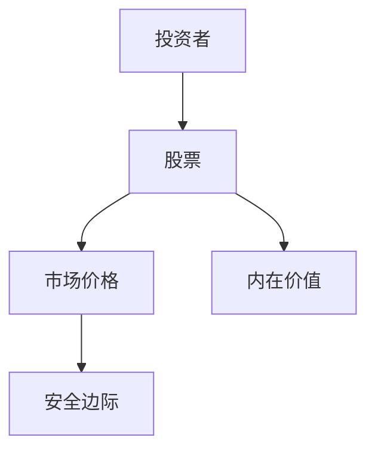
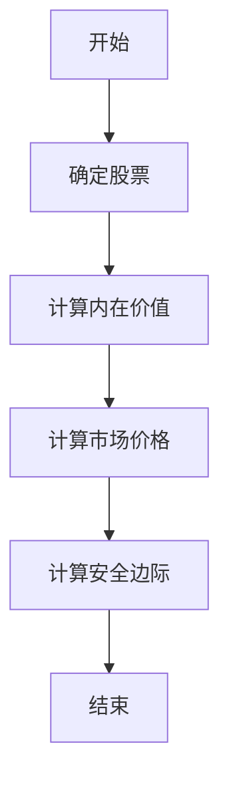
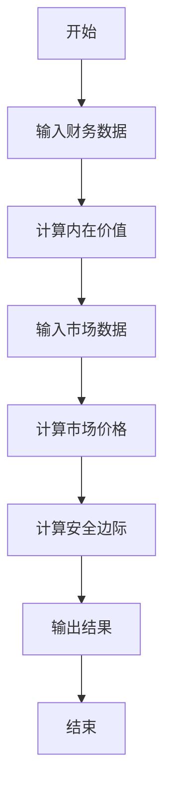
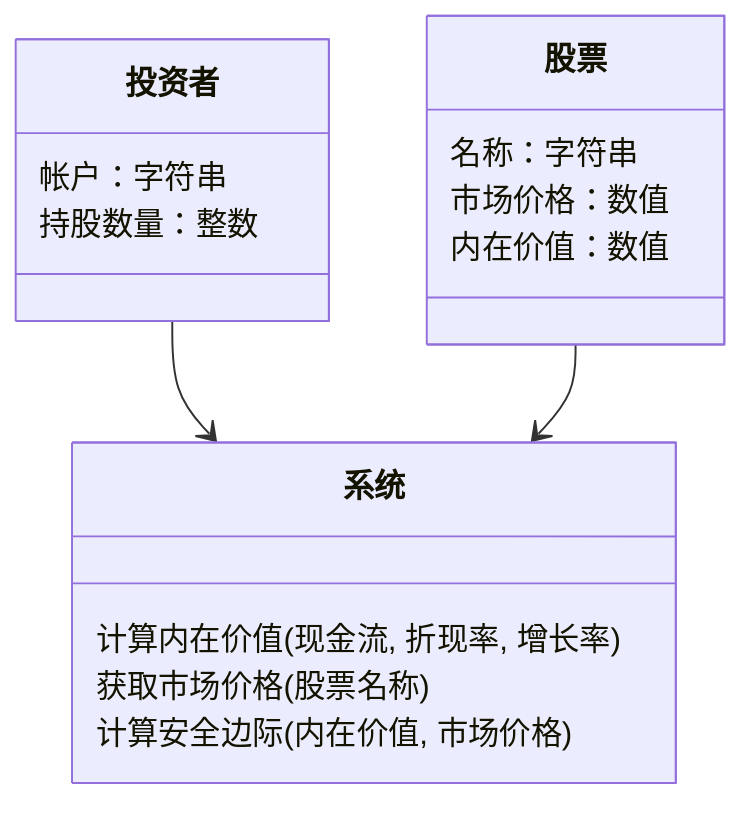
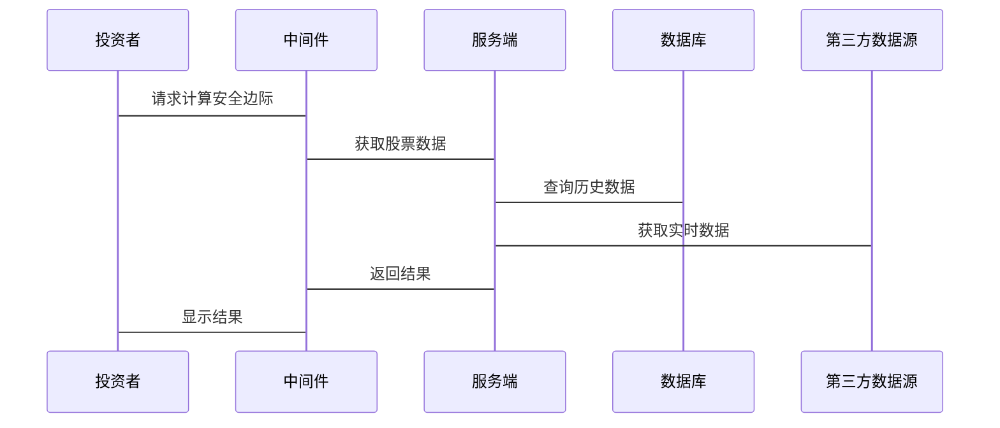

                 


# 塞思卡拉曼的安全边际计算

> 关键词：安全边际计算，投资学，内在价值，市场价格，风险管理，价值投资

> 摘要：本文深入探讨了塞思·卡拉曼的安全边际计算方法，从背景、核心概念、算法原理到系统设计、项目实战和最佳实践，全面解析这一经典投资策略的现代应用。通过理论与实践结合，帮助读者理解如何通过安全边际计算来降低投资风险，实现稳健投资收益。

---

# 第一部分: 安全边际计算的背景与核心概念

## 第1章: 安全边际计算的背景与问题背景

### 1.1 安全边际计算的基本概念

#### 1.1.1 投资学中的安全边际概念
安全边际是投资学中的一个核心概念，最早由本杰明·格雷厄姆提出，塞思·卡拉曼进一步发展和完善了这一理论。安全边际计算是指通过计算股票的内在价值，并将其与市场价格进行对比，以确定是否存在足够的“安全空间”（即价格低于内在价值）。这种“安全空间”可以为投资者提供一个缓冲区，以应对市场波动和不确定性。

#### 1.1.2 安全边际计算的定义与范围
安全边际计算的核心在于评估股票的内在价值，并将其与市场价格进行对比。具体来说，安全边际 = 内在价值 - 市场价格。如果内在价值远高于市场价格，说明股票具有较高的安全边际，是值得投资的标的。

#### 1.1.3 安全边际计算的核心要素与属性
- **内在价值**：股票的内在价值是其未来现金流的现值，反映了其真实价值。
- **市场价格**：股票在市场上的交易价格。
- **安全边际**：内在价值与市场价格的差额，反映了投资的安全空间。

### 1.2 问题背景与问题描述

#### 1.2.1 投资者如何评估股票价值
投资者在评估股票价值时，通常面临两个关键问题：
1. 如何计算股票的内在价值？
2. 如何确定股票的市场价格是否低于其内在价值？

#### 1.2.2 安全边际计算的必要性
安全边际计算的必要性在于：
- 降低投资风险：通过计算安全边际，投资者可以避免支付过高的价格。
- 识别低估股票：安全边际高的股票通常具有较大的上涨潜力。

#### 1.2.3 安全边际计算的目标与意义
目标：
- 确定股票是否具有足够的安全边际。
- 识别具有长期投资价值的股票。

意义：
- 通过安全边际计算，投资者可以更理性地进行投资决策。
- 降低因市场波动带来的投资风险。

### 1.3 问题解决与边界外延

#### 1.3.1 安全边际计算的主要方法
- **基本面分析**：通过分析公司的财务状况、盈利能力、行业地位等因素，计算内在价值。
- **相对估值法**：通过比较股票与行业平均市盈率、市净率等指标，评估其价格是否合理。

#### 1.3.2 计算边界与适用范围
安全边际计算主要适用于：
- 具有稳定现金流的公司。
- 股票市场价格波动较大的情况。

#### 1.3.3 相关概念的对比与区分
- **内在价值**与**账面价值**：内在价值是未来现金流的现值，账面价值是公司财务报表上的价值。
- **市场价格**与**内在价值**：市场价格受市场情绪影响，而内在价值反映公司的真实价值。

### 1.4 核心概念结构与组成

#### 1.4.1 安全边际计算的核心模型
安全边际计算的核心模型包括：
- 内在价值计算模型。
- 市场价格波动模型。

#### 1.4.2 核心要素的相互关系
- 内在价值与市场价格的关系：内在价值 > 市场价格时，安全边际为正。
- 安全边际与投资风险的关系：安全边际越高，投资风险越小。

#### 1.4.3 模型的可扩展性与局限性
- 可扩展性：安全边际计算模型可以扩展到多个股票和多个行业的分析。
- 局限性：模型假设市场最终会反映内在价值，但在短期内可能无法实现。

### 1.5 本章小结
本章介绍了安全边际计算的基本概念、问题背景和核心要素，为后续章节的深入分析奠定了基础。

---

## 第2章: 安全边际计算的核心概念与联系

### 2.1 核心概念的原理与属性

#### 2.1.1 内在价值的计算原理
内在价值的计算基于以下假设：
- 公司未来将产生稳定的现金流。
- 投资者要求的回报率是固定的。

公式：
$$ V = \frac{CF}{(r - g)} $$
其中：
- \( V \) 表示内在价值
- \( CF \) 表示未来现金流
- \( r \) 表示折现率
- \( g \) 表示增长率

#### 2.1.2 市场价格的波动性分析
市场价格受多种因素影响，包括市场情绪、宏观经济环境、行业趋势等。

#### 2.1.3 安全边际的计算公式与属性
安全边际计算公式：
$$ \text{安全边际} = V - P $$
其中：
- \( V \) 表示内在价值
- \( P \) 表示市场价格

属性：
- 安全边际为正时，股票价格被低估。
- 安全边际为负时，股票价格被高估。

### 2.2 核心概念的对比分析

#### 2.2.1 安全边际与现代投资理论的对比
- 现代投资理论：强调分散投资和资产配置。
- 安全边际计算：强调个股的内在价值和安全空间。

#### 2.2.2 不同投资策略中的安全边际差异
- 价值投资：注重安全边际。
- 成长投资：更关注公司的成长潜力，安全边际可能较低。

#### 2.2.3 安全边际与风险控制的关系
安全边际是风险控制的重要工具，通过确保价格低于内在价值，降低投资风险。

### 2.3 实体关系图与流程图

#### 2.3.1 ER实体关系图（Mermaid）


#### 2.3.2 核心概念流程图（Mermaid）


### 2.4 本章小结
本章通过对比分析和流程图，详细阐述了安全边际计算的核心概念及其与其他投资理论的关系。

---

## 第3章: 安全边际计算的算法原理与数学模型

### 3.1 算法原理与流程

#### 3.1.1 安全边际计算的步骤分解
1. 确定目标股票。
2. 收集公司财务数据。
3. 计算内在价值。
4. 获取市场价格。
5. 计算安全边际。
6. 分析结果并做出投资决策。

#### 3.1.2 算法的输入与输出
- 输入：财务数据、市场数据。
- 输出：安全边际值。

#### 3.1.3 算法的实现流程
流程图：


### 3.2 算法的数学模型与公式

#### 3.2.1 内在价值计算公式
$$ V = \frac{CF}{(r - g)} $$

其中：
- \( CF \)：未来现金流（年均自由现金流）
- \( r \)：折现率（通常为10%或更高）
- \( g \)：年均增长率

#### 3.2.2 市场价格计算公式
市场价格通常通过市场数据获取，可以通过股票行情软件或金融数据平台获取。

#### 3.2.3 安全边际计算公式
$$ \text{安全边际} = V - P $$

其中：
- \( V \)：内在价值
- \( P \)：市场价格

#### 3.2.4 示例计算
假设某股票的未来现金流为$100万，折现率为10%，增长率2%，市场价格为$800万。

计算内在价值：
$$ V = \frac{100}{0.10 - 0.02} = \frac{100}{0.08} = 1250 \text{万} $$

计算安全边际：
$$ \text{安全边际} = 1250 - 800 = 450 \text{万} $$

---

## 第4章: 系统分析与架构设计方案

### 4.1 问题场景介绍
投资者需要一个系统来计算股票的安全边际，帮助其做出投资决策。

### 4.2 系统功能设计

#### 4.2.1 领域模型（Mermaid 类图）


#### 4.2.2 系统架构设计（Mermaid 架构图）


#### 4.2.3 系统交互设计（Mermaid 序列图）


### 4.3 系统架构设计

#### 4.3.1 系统架构设计说明
- **客户端**：用户界面，接收输入并显示结果。
- **中间件**：负责与服务端通信，处理数据传输。
- **服务端**：执行安全边际计算，整合数据。
- **数据库**：存储历史数据和计算结果。
- **第三方数据源**：提供实时市场数据。

#### 4.3.2 系统交互设计
投资者通过客户端提交请求，系统从数据库和第三方数据源获取数据，计算后返回结果。

### 4.4 本章小结
本章通过系统架构设计和交互流程图，详细描述了安全边际计算系统的实现方案。

---

## 第5章: 项目实战与应用

### 5.1 环境安装与配置
- **编程语言**：Python 3.9+
- **开发工具**：PyCharm或VS Code
- **依赖库**：Pandas、NumPy、Matplotlib

### 5.2 系统核心实现源代码
```python
def calculate_intrinsic_value(cash_flow, discount_rate, growth_rate):
    return cash_flow / (discount_rate - growth_rate)

def get_market_price(stock_name):
    # 实际实现中需要连接数据库或API获取实时数据
    return 800  # 示例数据

def calculate_margin_of_safety(intrinsic_value, market_price):
    return intrinsic_value - market_price

# 示例使用
cash_flow = 100
discount_rate = 0.10
growth_rate = 0.02
market_price = get_market_price("股票A")

intrinsic_value = calculate_intrinsic_value(cash_flow, discount_rate, growth_rate)
margin_of_safety = calculate_margin_of_safety(intrinsic_value, market_price)

print(f"内在价值: {intrinsic_value}")
print(f"市场价格: {market_price}")
print(f"安全边际: {margin_of_safety}")
```

### 5.3 代码实现与解读
- **函数**：
  - `calculate_intrinsic_value`：计算内在价值。
  - `get_market_price`：获取市场价格。
  - `calculate_margin_of_safety`：计算安全边际。

- **实现细节**：
  - 现实中需要连接数据库或API获取实时数据。
  - 可以扩展功能，例如计算多个股票的安全边际。

### 5.4 案例分析与解读
假设我们有两只股票，A和B，数据如下：
- 股票A：
  - 现金流：$100万
  - 折现率：10%
  - 增长率：2%
  - 市场价格：$800万
- 股票B：
  - 现金流：$150万
  - 折现率：8%
  - 增长率：3%
  - 市场价格：$1200万

计算结果：
- 股票A的内在价值为$1250万，安全边际为$450万。
- 股票B的内在价值为$1928.57万，安全边际为$728.57万。

结论：
- 股票B的安全边际更高，投资风险更小。

### 5.5 本章小结
本章通过实际案例，展示了安全边际计算的实现过程和应用。

---

## 第6章: 最佳实践与注意事项

### 6.1 小结
- 安全边际计算是价值投资的重要工具。
- 通过计算内在价值和市场价格，投资者可以识别低估股票，降低投资风险。

### 6.2 注意事项
- 数据来源：确保数据的准确性和及时性。
- 模型假设：内在价值计算依赖于假设的现金流和增长率，实际投资中需要谨慎评估。
- 市场风险：即使安全边际高，市场波动仍可能影响股价。

### 6.3 拓展阅读
- 《投资学基础》
- 《价值投资策略》
- 《安全边际与风险管理》

### 6.4 常见问题解答
- **Q：如何选择合适的折现率？**
  - 折现率应反映投资者的风险偏好和市场利率。
- **Q：安全边际为负时是否应该卖出股票？**
  - 是的，安全边际为负时，股票价格被高估，应避免投资。

---

## 第7章: 结语

### 7.1 总结
安全边际计算是价值投资的核心工具，通过计算股票的内在价值和市场价格，投资者可以识别低估股票，降低投资风险。

### 7.2 展望
随着人工智能和大数据技术的发展，安全边际计算将更加精准和高效，为投资者提供更好的决策支持。

### 7.3 作者寄语
投资不仅是技术的较量，更是心态的修炼。希望本文能为您的投资之路提供一些启发。

---

# 作者：AI天才研究院/AI Genius Institute & 禅与计算机程序设计艺术 /Zen And The Art of Computer Programming

