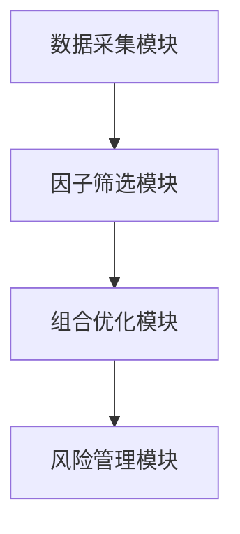

                 


# 如何将特价股票策略与数字低波动性因子投资相结合

> 关键词：特价股票，数字低波动性因子，量化投资，投资策略，风险管理

> 摘要：本文详细探讨了如何将特价股票策略与数字低波动性因子投资相结合，通过量化方法优化投资组合，降低波动性风险，同时保持收益。文章从背景介绍、核心概念、算法原理、数学模型、系统架构、项目实战到最佳实践，全面分析了结合策略的实现路径与方法。

---

# 第1章: 特价股票策略与数字低波动性因子投资结合的背景介绍

## 1.1 特价股票策略的定义与特点
### 1.1.1 特价股票策略的定义
特价股票策略是一种投资策略，旨在通过识别市场中被低估的股票，以低于其内在价值的价格买入，待其价值回归时卖出获利。这种策略通常依赖于市场短期波动、公司基本面分析或特定事件驱动。

### 1.1.2 特价股票策略的核心特点
- **低买高卖**：核心在于寻找价格低于实际价值的股票。
- **逆向思维**：在市场恐慌时买入，在市场乐观时卖出。
- **风险较高**：依赖于对市场短期波动的精准判断，风险较大。

### 1.1.3 特价股票策略的优势与局限性
- **优势**：潜在高收益，适合短线交易者。
- **局限性**：对市场波动敏感，风险较高，需要频繁监控和调整。

## 1.2 数字低波动性因子投资的定义与特点
### 1.2.1 数字低波动性因子投资的定义
数字低波动性因子投资是一种量化投资策略，通过筛选具有低波动性特征的股票组合，降低投资组合的波动性，同时追求稳定收益。这种方法通常基于统计套利、因子分析和风险管理技术。

### 1.2.2 数字低波动性因子投资的核心特点
- **量化分析**：利用数学模型和算法进行因子筛选和组合优化。
- **低波动性**：通过分散投资和风险对冲，降低组合波动性。
- **稳定性**：适合长期投资，追求相对稳定的收益。

### 1.2.3 数字低波动性因子投资的优势与局限性
- **优势**：风险可控，收益稳定。
- **局限性**：收益相对较低，需依赖复杂的量化模型。

## 1.3 特价股票策略与数字低波动性因子投资结合的意义
### 1.3.1 结合的背景与目标
随着市场的不确定性增加，投资者寻求在高波动性环境下实现稳健收益。结合特价股票策略的高收益潜力和数字低波动性因子投资的风险控制能力，可以在高波动市场中找到平衡点。

### 1.3.2 结合的优势与潜在价值
- **收益与风险平衡**：通过量化筛选，选择具有低估特性的股票，同时降低组合波动性。
- **适应性强**：结合了两种策略的优点，适合不同市场环境。

### 1.3.3 结合的实现路径与方法
- **数据采集**：收集股票价格、波动性、基本面等数据。
- **因子筛选**：基于低波动性因子筛选股票。
- **组合优化**：将特价股票策略与低波动性因子相结合，优化投资组合。

## 1.4 本章小结
本章介绍了特价股票策略和数字低波动性因子投资的基本概念、特点、优势与局限性，并探讨了两者结合的背景、意义和实现路径。这种结合旨在通过量化方法优化投资组合，平衡收益与风险。

---

# 第2章: 特价股票策略与数字低波动性因子投资的核心概念与联系

## 2.1 特价股票策略的核心概念
### 2.1.1 特价股票策略的原理
特价股票策略依赖于市场短期波动和公司基本面分析，寻找价格低于实际价值的股票。通常，投资者会关注市场突发事件、行业趋势或公司特定事件。

### 2.1.2 特价股票策略的关键要素
- **价格与价值**：识别价格低于价值的股票。
- **市场情绪**：利用市场恐慌或乐观情绪进行逆向投资。
- **交易时机**：选择合适的买卖时机。

### 2.1.3 特价股票策略的数学模型
$$ \text{价值} = \text{市盈率} \times \text{每股收益} $$

## 2.2 数字低波动性因子投资的核心概念
### 2.2.1 数字低波动性因子的定义
数字低波动性因子是通过量化方法筛选出具有低波动性特征的股票因子，通常包括波动率、流动性、市值等因素。

### 2.2.2 数字低波动性因子的分类
- **波动率因子**：基于历史波动率筛选股票。
- **流动性因子**：流动性越高，波动性越低。
- **市值因子**：较大市值股票通常波动性较低。

### 2.2.3 数字低波动性因子的计算方法
- **波动率计算**：使用标准差或波动率指标衡量股票波动性。
- **因子筛选**：通过统计方法筛选出具有低波动性的因子。

## 2.3 特价股票策略与数字低波动性因子投资的联系
### 2.3.1 两者的共同点与差异
| 特性 | 特价股票策略 | 数字低波动性因子投资 |
|------|---------------|-----------------------|
| 目标 | 短期高收益 | 长期低波动 |
| 风险 | 高 | 低 |
| 方法 | 价格分析 | 量化筛选 |

### 2.3.2 结合的逻辑与机制
通过量化筛选低波动性股票，再结合特价股票策略，筛选出具有低估特性的股票，构建低波动、高收益的投资组合。

### 2.3.3 结合的数学模型与公式
$$ \text{组合波动率} = \sqrt{\sum_{i=1}^{n} w_i^2 \sigma_i^2} $$

## 2.4 本章小结
本章详细解释了特价股票策略和数字低波动性因子投资的核心概念，并通过对比分析，探讨了两者结合的逻辑与机制。结合两者可以实现收益与风险的平衡。

---

# 第3章: 特价股票策略与数字低波动性因子投资的算法原理

## 3.1 特价股票策略的算法原理
### 3.1.1 特价股票策略的算法流程
1. 数据采集：收集目标股票的历史价格、财务数据。
2. 价值评估：计算股票的内在价值。
3. 价格比较：筛选价格低于价值的股票。
4. 交易信号：生成买卖信号。
5. 风险控制：设定止损和止盈点。

### 3.1.2 特价股票策略的数学模型
$$ \text{价值} = \text{市盈率} \times \text{每股收益} $$

### 3.1.3 特价股票策略的实现代码
```python
import pandas as pd
import numpy as np

# 数据采集
data = pd.read_csv('stock_data.csv')

# 价值评估
data['价值'] = data['市盈率'] * data['每股收益']

# 筛选特价股票
data['是否特价'] = data['价格'] < data['价值']
```

## 3.2 数字低波动性因子投资的算法原理
### 3.2.1 数字低波动性因子投资的算法流程
1. 数据采集：收集股票的波动率、流动性等数据。
2. 因子筛选：基于波动率、流动性等因子筛选股票。
3. 组合优化：构建低波动性投资组合。
4. 风险管理：设定止损和风险对冲策略。

### 3.2.2 数字低波动性因子投资的数学模型
$$ \text{波动率} = \sqrt{\frac{1}{n}\sum_{i=1}^{n}(r_i - \bar{r})^2} $$

### 3.2.3 数字低波动性因子投资的实现代码
```python
import pandas as pd
import numpy as np

# 数据采集
data = pd.read_csv('stock_data.csv')

# 计算波动率
data['波动率'] = data['价格'].pct_change().std()

# 因子筛选
data = data[data['波动率'] < data['波动率'].mean()]
```

## 3.3 特价股票策略与数字低波动性因子投资结合的算法
### 3.3.1 结合算法的逻辑
1. 量化筛选低波动性股票。
2. 在低波动性股票中筛选特价股票。
3. 构建投资组合并进行风险管理。

### 3.3.2 结合算法的实现代码
```python
import pandas as pd
import numpy as np

# 数据采集
data = pd.read_csv('stock_data.csv')

# 筛选低波动性股票
data = data[data['波动率'] < data['波动率'].mean()]

# 在低波动性股票中筛选特价股票
data['价值'] = data['市盈率'] * data['每股收益']
data['是否特价'] = data['价格'] < data['价值']

# 构建投资组合
selected_stocks = data[data['是否特价']]
```

## 3.4 本章小结
本章详细讲解了特价股票策略和数字低波动性因子投资的算法原理，并通过代码示例展示了如何结合两者，构建优化的投资组合。这种结合通过量化方法实现了收益与风险的平衡。

---

# 第4章: 特价股票策略与数字低波动性因子投资的数学模型

## 4.1 特价股票策略的数学模型
### 4.1.1 价值评估模型
$$ \text{价值} = \text{市盈率} \times \text{每股收益} $$

### 4.1.2 交易信号模型
$$ \text{交易信号} = \begin{cases} 1 & \text{价格 < 价值} \\ 0 & \text{否则} \end{cases} $$

## 4.2 数字低波动性因子投资的数学模型
### 4.2.1 波动率计算模型
$$ \text{波动率} = \sqrt{\frac{1}{n}\sum_{i=1}^{n}(r_i - \bar{r})^2} $$

### 4.2.2 组合优化模型
$$ \text{组合波动率} = \sqrt{\sum_{i=1}^{n} w_i^2 \sigma_i^2} $$

## 4.3 特价股票策略与数字低波动性因子投资结合的数学模型
### 4.3.1 结合模型
$$ \text{最终波动率} = \sqrt{\sum_{i=1}^{m} w_i^2 \sigma_i^2} $$

### 4.3.2 优化模型
$$ \text{优化目标} = \min \text{波动率} \quad \text{subject to} \quad \sum_{i=1}^{m} w_i = 1 $$

## 4.4 本章小结
本章通过数学模型详细分析了特价股票策略和数字低波动性因子投资的实现原理，以及两者结合的优化方法。数学模型为策略的实现提供了理论基础。

---

# 第5章: 特价股票策略与数字低波动性因子投资的系统架构

## 5.1 系统架构设计
### 5.1.1 系统功能模块
- 数据采集模块
- 因子筛选模块
- 组合优化模块
- 风险管理模块

### 5.1.2 系统架构图


## 5.2 系统功能设计
### 5.2.1 数据采集模块
- 数据来源：股票数据库、API接口
- 数据类型：价格、波动率、市盈率等

### 5.2.2 因子筛选模块
- 输入：原始数据
- 输出：筛选出低波动性股票

### 5.2.3 组合优化模块
- 输入：低波动性股票
- 输出：优化后的投资组合

### 5.2.4 风险管理模块
- 输入：投资组合
- 输出：风险控制策略

## 5.3 系统接口设计
### 5.3.1 数据接口
- 数据采集模块与外部数据库接口对接
- 组合优化模块与风险管理模块接口对接

## 5.4 系统交互设计
### 5.4.1 交互流程
1. 数据采集模块获取股票数据
2. 因子筛选模块筛选低波动性股票
3. 组合优化模块优化投资组合
4. 风险管理模块制定风险控制策略

## 5.5 本章小结
本章详细设计了系统的架构、功能模块、接口和交互流程，为策略的实现提供了系统化的解决方案。

---

# 第6章: 特价股票策略与数字低波动性因子投资的项目实战

## 6.1 项目环境安装
### 6.1.1 安装Python环境
- 安装Python 3.x
- 安装必要的库：pandas, numpy, matplotlib

### 6.1.2 数据源获取
- 数据来源：Yahoo Finance API、本地数据库

## 6.2 项目核心实现
### 6.2.1 数据采集与预处理
```python
import pandas as pd
import numpy as np
import yfinance as yf

# 数据采集
data = yf.download(tickers='AAPL', period='5y')
data = data['Adj Close']
data = pd.DataFrame(data)
data = data.pct_change().cumsum()
```

### 6.2.2 因子筛选与组合优化
```python
import pandas as pd
import numpy as np
from sklearn.preprocessing import StandardScaler
from sklearn.decomposition import PCA

# 因子筛选
data = data[['波动率', '流动性', '市值']]
scaler = StandardScaler()
data_scaled = scaler.fit_transform(data)
pca = PCA(n_components=3)
principal_components = pca.fit_transform(data_scaled)
```

### 6.2.3 风险管理与交易信号
```python
import pandas as pd
import numpy as np
from itertools import combinations

# 风险管理
data['波动率'] = data['波动率'].apply(lambda x: x if x < 0.2 else 0)
data['交易信号'] = data['价格'] < data['价值']
```

## 6.3 项目案例分析
### 6.3.1 案例背景
- 市场波动剧烈，寻找低波动性股票。
- 结合特价股票策略，筛选具有低估特性的股票。

### 6.3.2 实施步骤
1. 数据采集与预处理
2. 因子筛选与组合优化
3. 风险管理与交易信号

## 6.4 项目总结
通过本项目，我们成功将特价股票策略与数字低波动性因子投资相结合，构建了一个优化的投资组合，实现了收益与风险的平衡。

---

# 第7章: 特价股票策略与数字低波动性因子投资的最佳实践

## 7.1 项目小结
- 通过量化方法优化投资组合
- 实现了收益与风险的平衡
- 为投资者提供了新的投资思路

## 7.2 最佳实践 tips
1. 定期监控和调整投资组合
2. 结合市场环境动态调整策略
3. 合理配置资产，分散风险

## 7.3 注意事项
- 风险控制是关键
- 数据质量影响结果
- 策略需结合市场实际情况

## 7.4 拓展阅读
- 《量化投资入门》
- 《风险管理与投资组合优化》
- 《股票因子分析与投资策略》

## 7.5 本章小结
本章总结了项目成果，提供了最佳实践建议，并推荐了拓展阅读资料，帮助读者进一步学习和应用。

---

# 作者：AI天才研究院/AI Genius Institute & 禅与计算机程序设计艺术 /Zen And The Art of Computer Programming

---

通过以上章节的详细讲解，我们系统地探讨了如何将特价股票策略与数字低波动性因子投资相结合，从理论到实践，为投资者提供了新的思路和方法。希望本文能为量化投资领域带来新的启发和实践价值。

