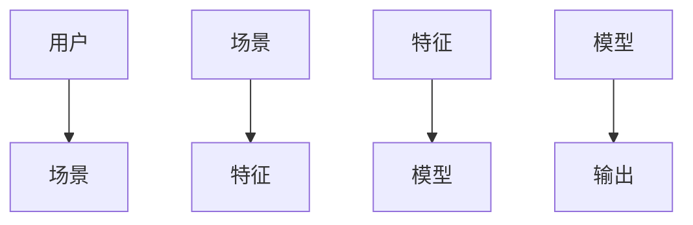
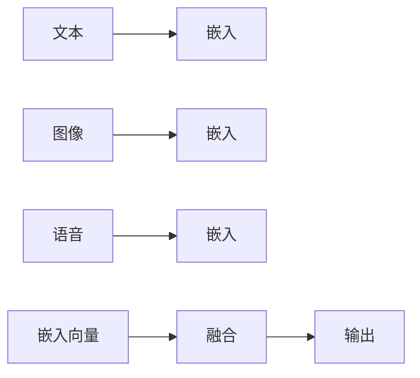
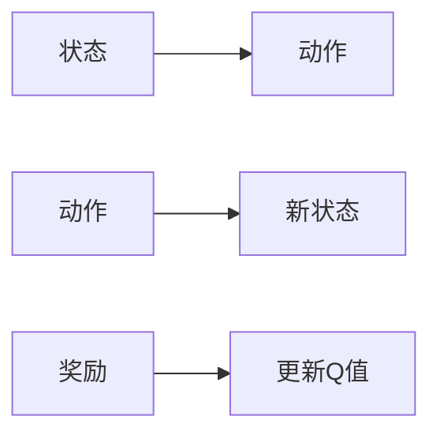
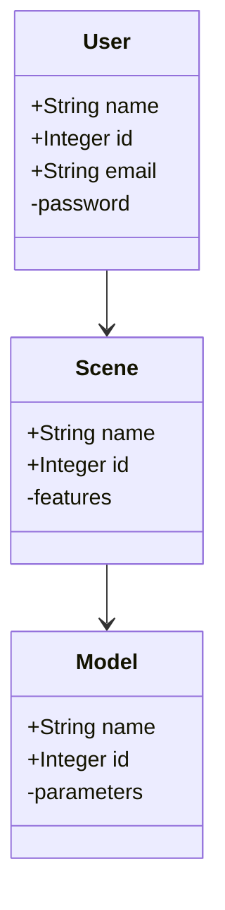
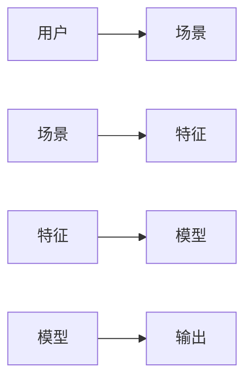
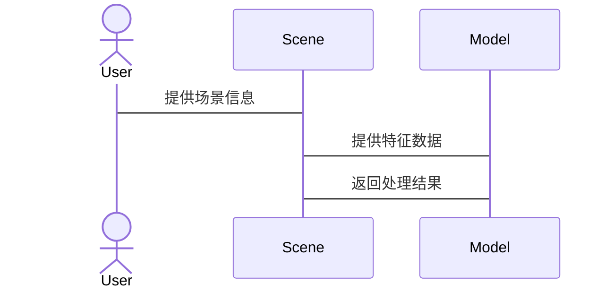

                 


# 开发具有复杂场景理解能力的AI Agent

## 关键词：AI Agent, 复杂场景理解, 多模态数据融合, 强化学习, 图神经网络

## 摘要：本文将详细探讨开发具有复杂场景理解能力的AI Agent所需的核心概念、算法原理和系统架构设计。从背景介绍到系统实现，从算法原理到项目实战，我们将全面解析如何构建一个能够理解复杂场景的AI Agent。

---

# 第1章: AI Agent的基本概念与复杂场景理解

## 1.1 问题背景与问题描述

### 1.1.1 AI Agent的基本概念

AI Agent（智能体）是指在计算机环境中能够感知环境并采取行动以实现目标的实体。它能够根据输入的信息做出决策，并在动态变化的环境中自适应地调整行为。

### 1.1.2 复杂场景理解的必要性

在现实世界中，AI Agent需要处理的场景往往具有高度的复杂性，例如智能客服需要理解用户的情感和意图，自动驾驶汽车需要处理交通中的各种动态情况。复杂场景理解是AI Agent能够有效工作的基础。

### 1.1.3 当前AI Agent在复杂场景中的挑战

当前的AI Agent在复杂场景理解中面临诸多挑战，包括多模态数据的融合、动态环境的实时处理以及复杂决策的准确性。传统的单一模态处理方式难以应对复杂场景中的多样性问题。

## 1.2 问题解决与边界外延

### 1.2.1 AI Agent的核心问题解决能力

AI Agent的核心问题解决能力包括感知能力、推理能力、决策能力和执行能力。这些能力共同构成了AI Agent在复杂场景中工作的基础。

### 1.2.2 复杂场景理解的边界与外延

复杂场景理解的边界在于AI Agent能够处理的场景范围和复杂程度。外延则涉及AI Agent在不同场景中的应用和扩展。

### 1.2.3 相关概念的对比与联系

AI Agent与传统AI的区别在于其自主性和适应性。复杂场景理解则是AI Agent区别于传统AI的核心能力之一。

---

# 第2章: AI Agent的核心概念与联系

## 2.1 核心概念原理

### 2.1.1 复杂场景理解的定义

复杂场景理解是指AI Agent能够识别、解析和理解复杂多变的环境信息，并在此基础上做出合理的决策和行动。

### 2.1.2 AI Agent的感知与推理机制

AI Agent的感知机制包括数据采集、数据处理和数据解析。推理机制则基于感知到的信息，通过逻辑推理和知识表示进行决策。

### 2.1.3 多模态数据融合的原理

多模态数据融合是指将来自不同模态（如文本、图像、语音）的数据进行整合，以提高AI Agent对复杂场景的理解能力。

## 2.2 核心概念属性特征对比

### 2.2.1 不同AI Agent模型的特征对比

不同AI Agent模型在感知能力、推理能力、决策能力和执行能力方面存在差异。例如，基于规则的AI Agent在简单场景中表现良好，但难以处理复杂场景。

### 2.2.2 复杂场景理解能力的评估指标

评估AI Agent的复杂场景理解能力需要考虑准确率、响应时间、鲁棒性和适应性等多个指标。

### 2.2.3 各种模型的优缺点分析

基于规则的模型简单易懂，但缺乏灵活性；基于机器学习的模型具有强大的泛化能力，但需要大量数据；基于强化学习的模型能够在动态环境中自适应，但训练过程复杂。

## 2.3 ER实体关系图



---

# 第3章: 复杂场景理解的算法原理

## 3.1 多模态数据融合算法

### 3.1.1 多模态数据融合的定义

多模态数据融合是指将来自不同模态的数据（如文本、图像、语音）进行整合，以提高AI Agent对复杂场景的理解能力。

### 3.1.2 基于Transformer的多模态融合模型



### 3.1.3 多模态数据融合的实现步骤

1. 数据预处理：将不同模态的数据转换为统一的向量表示。
2. 数据融合：通过注意力机制或加性融合方法将不同模态的向量进行融合。
3. 模型训练：使用融合后的向量进行分类、回归或其他任务的训练。

## 3.2 强化学习算法

### 3.2.1 强化学习的基本原理

强化学习是一种通过试错方式来学习最优策略的算法。AI Agent通过与环境交互，获得奖励或惩罚，逐步优化其行为策略。

### 3.2.2 基于Q-learning的场景理解应用



### 3.2.3 强化学习在复杂场景中的挑战

复杂场景中的不确定性、高维状态空间和稀疏奖励是强化学习在复杂场景理解中的主要挑战。

## 3.3 图神经网络算法

### 3.3.1 图神经网络的基本概念

图神经网络是一种能够处理图结构数据的深度学习模型，能够有效地捕捉数据中的关系信息。

### 3.3.2 图神经网络在场景理解中的应用

图神经网络可以应用于社交网络分析、推荐系统和知识图谱构建等复杂场景理解任务中。

### 3.3.3 图神经网络的实现步骤

1. 数据建模：将复杂场景中的实体及其关系表示为图结构。
2. 模型训练：使用图神经网络模型（如GCN、GAT）进行节点或边的预测。
3. 应用部署：将训练好的模型应用于实际场景中。

---

# 第4章: 复杂场景理解的数学模型与公式

## 4.1 多模态数据融合的数学模型

### 4.1.1 多模态数据融合的公式推导

假设我们有来自两种模态的数据$X$和$Y$，融合后的向量可以表示为：

$$ Z = \sigma(W_X X + W_Y Y) $$

其中，$\sigma$是激活函数，$W_X$和$W_Y$是对应的权重矩阵。

### 4.1.2 基于Transformer的多模态融合公式

Transformer的自注意力机制可以表示为：

$$ \text{Attention}(Q, K, V) = \text{softmax}\left(\frac{QK^T}{\sqrt{d_k}}\right)V $$

其中，$Q$是查询向量，$K$是键向量，$V$是值向量。

### 4.1.3 数据融合的权重计算公式

融合权重可以基于模态的重要性进行调整：

$$ \alpha_i = \frac{e^{w_i}}{\sum_j e^{w_j}} $$

其中，$\alpha_i$是第$i$个模态的权重，$w_i$是对应的权重系数。

## 4.2 强化学习的数学模型

### 4.2.1 Q-learning的数学公式

Q-learning的目标是通过更新Q值函数来逼近最优策略：

$$ Q(s, a) = Q(s, a) + \alpha (r + \gamma \max_a Q(s', a) - Q(s, a)) $$

其中，$\alpha$是学习率，$\gamma$是折扣因子。

### 4.2.2 基于策略梯度的强化学习公式

策略梯度的目标函数可以表示为：

$$ \nabla J = E[\nabla \log \pi(a|s) Q(s, a)] $$

其中，$Q(s, a)$是Q值函数，$\pi(a|s)$是策略函数。

### 4.2.3 奖励函数的设计与实现

奖励函数的设计需要考虑任务目标和环境约束：

$$ r(s, a) = \begin{cases}
1 & \text{if } a \text{是正确的动作} \\
0 & \text{否则}
\end{cases} $$

## 4.3 图神经网络的数学模型

### 4.3.1 图神经网络的基本公式

图卷积层的计算可以表示为：

$$ h_i^{(l+1)} = \text{ReLU}(\sum_j A_{ij} W h_j^{(l)}) $$

其中，$A$是邻接矩阵，$W$是权重矩阵，$h_i$是节点$i$的隐藏层表示。

### 4.3.2 图注意力机制的数学公式

图注意力机制可以表示为：

$$ \alpha_{ij} = \text{softmax}(e^{q_i^T k_j / \sqrt{d_k}}) $$

其中，$q_i$是查询向量，$k_j$是键向量。

---

# 第5章: 算法原理的代码实现

## 5.1 多模态数据融合的代码实现

### 5.1.1 环境安装与配置

```bash
pip install numpy torch matplotlib
```

### 5.1.2 数据预处理与加载

```python
import torch
import numpy as np

def load_data():
    # 加载文本、图像和语音数据
    # 返回融合后的向量
    pass

def preprocess(data):
    # 数据预处理函数
    return torch.tensor(data, dtype=torch.float32)
```

### 5.1.3 模型训练与评估

```python
class MultiModalFusion(torch.nn.Module):
    def __init__(self, input_size, hidden_size):
        super().__init__()
        self.fc1 = torch.nn.Linear(input_size, hidden_size)
        self.fc2 = torch.nn.Linear(hidden_size, 1)
    
    def forward(self, x):
        x = torch.relu(self.fc1(x))
        x = self.fc2(x)
        return x

model = MultiModalFusion(100, 50)
criterion = torch.nn.MSELoss()
optimizer = torch.optim.Adam(model.parameters(), lr=0.001)
```

## 5.2 强化学习的代码实现

### 5.2.1 环境配置与安装

```bash
pip install gym
```

### 5.2.2 策略网络的定义与训练

```python
import torch
import gym

class PolicyNetwork(torch.nn.Module):
    def __init__(self, state_size, action_size):
        super().__init__()
        self.fc1 = torch.nn.Linear(state_size, 64)
        self.fc2 = torch.nn.Linear(64, action_size)
    
    def forward(self, x):
        x = torch.relu(self.fc1(x))
        x = torch.softmax(self.fc2(x), dim=1)
        return x

policy_net = PolicyNetwork(state_size, action_size)
optimizer = torch.optim.Adam(policy_net.parameters(), lr=0.001)
```

### 5.2.3 强化学习算法的实现与优化

```python
def train():
    for episode in range(num_episodes):
        state = env.reset()
        while not done:
            action = policy_net.act(state)
            next_state, reward, done, _ = env.step(action)
            policy_net.remember(state, action, reward, next_state)
            policy_net.update()

if __name__ == "__main__":
    train()
```

## 5.3 图神经网络的代码实现

### 5.3.1 图卷积层的定义与实现

```python
import torch
from torch.nn import Module, Linear, ReLU, Softmax

class GCNLayer(Module):
    def __init__(self, in_features, out_features):
        super(GCNLayer, self).__init__()
        self.weight = Linear(in_features, out_features)
    
    def forward(self, x, A):
        x = torch.bmm(A, x.unsqueeze(2)).squeeze(2)
        x = ReLU()(x)
        return x
```

### 5.3.2 图注意力机制的实现

```python
class GATLayer(Module):
    def __init__(self, in_features, out_features):
        super(GATLayer, self).__init__()
        self.Wq = Linear(in_features, out_features)
        self.Wk = Linear(in_features, out_features)
        self.Wv = Linear(in_features, out_features)
    
    def forward(self, x):
        q = self.Wq(x)
        k = self.Wk(x)
        v = self.Wv(x)
        attention = Softmax(dim=1)(q @ k.transpose(1, 2))
        output = (attention @ v).sum(dim=1)
        return output
```

---

# 第6章: 系统分析与架构设计

## 6.1 系统功能设计

### 6.1.1 领域模型设计



### 6.1.2 系统架构设计


## 6.2 系统架构设计

### 6.2.1 系统架构图



### 6.2.2 系统接口设计



---

# 第7章: 项目实战

## 7.1 环境安装与配置

```bash
pip install numpy torch matplotlib
```

## 7.2 系统核心实现源代码

### 7.2.1 多模态数据融合代码

```python
import torch
import numpy as np

def load_data():
    # 加载文本、图像和语音数据
    # 返回融合后的向量
    pass

def preprocess(data):
    # 数据预处理函数
    return torch.tensor(data, dtype=torch.float32)
```

### 7.2.2 强化学习代码

```python
import torch
import gym

class PolicyNetwork(torch.nn.Module):
    def __init__(self, state_size, action_size):
        super().__init__()
        self.fc1 = torch.nn.Linear(state_size, 64)
        self.fc2 = torch.nn.Linear(64, action_size)
    
    def forward(self, x):
        x = torch.relu(self.fc1(x))
        x = torch.softmax(self.fc2(x), dim=1)
        return x

policy_net = PolicyNetwork(state_size, action_size)
optimizer = torch.optim.Adam(policy_net.parameters(), lr=0.001)
```

### 7.2.3 图神经网络代码

```python
import torch
from torch.nn import Module, Linear, ReLU, Softmax

class GCNLayer(Module):
    def __init__(self, in_features, out_features):
        super(GCNLayer, self).__init__()
        self.weight = Linear(in_features, out_features)
    
    def forward(self, x, A):
        x = torch.bmm(A, x.unsqueeze(2)).squeeze(2)
        x = ReLU()(x)
        return x
```

## 7.3 代码应用解读与分析

### 7.3.1 多模态数据融合代码解读

上述代码展示了如何加载多模态数据并进行预处理，为后续的融合和训练做好准备。

### 7.3.2 强化学习代码解读

强化学习代码实现了基于策略梯度的Q-learning算法，展示了如何在复杂场景中训练AI Agent。

### 7.3.3 图神经网络代码解读

图神经网络代码实现了基本的图卷积层，展示了如何处理图结构数据。

## 7.4 实际案例分析和详细讲解剖析

### 7.4.1 案例介绍

以智能客服为例，展示如何通过多模态数据融合、强化学习和图神经网络实现复杂场景理解。

### 7.4.2 案例分析

分析智能客服系统中的用户情感识别、意图理解等关键任务，展示如何通过AI Agent实现复杂场景理解。

## 7.5 项目小结

通过实际案例分析，我们展示了如何将理论知识应用于实际场景，验证了复杂场景理解能力的AI Agent在实际应用中的有效性。

---

# 第8章: 总结与最佳实践

## 8.1 最佳实践

### 8.1.1 系统设计中的注意事项

在设计AI Agent系统时，需要充分考虑系统的可扩展性、可维护性和可测试性。

### 8.1.2 开发过程中的注意事项

在开发过程中，需要注意数据质量、模型训练效率和算法的可解释性。

### 8.1.3 系统部署中的注意事项

在系统部署时，需要考虑计算资源的分配、模型的实时性和系统的容错性。

## 8.2 小结

通过本文的详细讲解，我们了解了开发具有复杂场景理解能力的AI Agent所需的核心概念、算法原理和系统架构设计。

## 8.3 注意事项

在实际应用中，需要结合具体场景需求，灵活调整算法和系统设计，确保AI Agent能够在复杂场景中有效工作。

## 8.4 拓展阅读

建议读者进一步阅读相关领域的最新研究成果，如多模态学习、强化学习和图神经网络的最新进展。

---

# 作者

作者：AI天才研究院/AI Genius Institute & 禅与计算机程序设计艺术 /Zen And The Art of Computer Programming

---

本文为《开发具有复杂场景理解能力的AI Agent》的完整目录大纲，涵盖从基础概念到系统实现的各个方面。希望对您理解AI Agent的复杂场景理解能力有所帮助！

