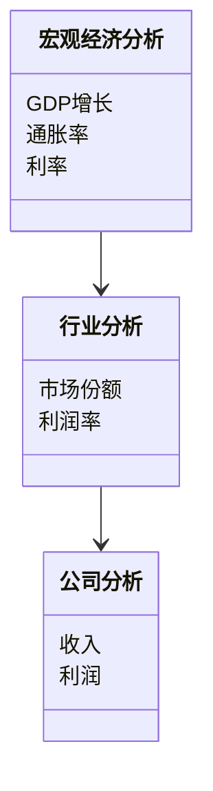

                 


# 彼得林奇的"逆向思维"在新兴市场宏观分析中的运用

> **关键词**：逆向思维、彼得林奇、新兴市场、宏观经济分析、投资策略、风险管理、价值发现

> **摘要**：  
本文探讨了彼得林奇的逆向思维在新兴市场宏观分析中的应用。通过分析逆向思维的核心理念及其在投资分析中的优势，结合宏观经济分析、行业分析和公司分析的具体场景，详细阐述了逆向思维在新兴市场中的实践价值。文章还结合了数学模型和算法，通过Python代码和数学公式，深入分析了逆向思维在宏观经济预测、行业竞争分析和公司估值中的实际应用，最后总结了逆向思维在新兴市场中的最佳实践和注意事项。

---

# 第一部分: 彼得林奇逆向思维概述

## 第1章: 逆向思维的定义与核心要素

### 1.1 逆向思维的定义

逆向思维是一种与传统思维相反的思维方式，它通过从结果反推原因，寻找问题的解决方案。彼得林奇作为逆向思维的倡导者，将其应用于投资分析，强调从市场的非理性中寻找价值。

#### 1.1.1 逆向思维的起源与背景

逆向思维的起源可以追溯到投资学中的价值发现理论。彼得林奇提出，市场的波动性为投资者提供了以低价买入优质资产的机会。

#### 1.1.2 彼得林奇逆向思维的核心理念

彼得林奇认为，市场的恐慌和非理性是投资者的机会。他强调，当市场情绪低落时，许多优质资产会被低估，此时是买入的好时机。

#### 1.1.3 逆向思维与传统思维的对比

- **传统思维**：基于市场趋势和热点进行投资，注重短期收益。
- **逆向思维**：关注市场低估的领域，注重长期价值。

### 1.2 逆向思维的核心要素

#### 1.2.1 核心概念：问题背景与问题描述

- **问题背景**：新兴市场波动性大，信息不透明。
- **问题描述**：如何在新兴市场中发现低估的资产。

#### 1.2.2 核心概念：问题解决与边界条件

- **问题解决**：通过逆向思维找到市场的低估领域。
- **边界条件**：新兴市场的政策风险、经济波动等。

#### 1.2.3 核心概念：概念结构与核心要素组成

- **概念结构**：市场情绪 → 资产定价 → 投资机会。
- **核心要素**：市场情绪、资产定价、投资策略。

## 第2章: 逆向思维在投资分析中的应用

### 2.1 投资分析的背景与现状

#### 2.1.1 新兴市场的定义与特点

- **定义**：新兴市场指经济快速增长、市场机制尚不完善的国家或地区。
- **特点**：波动性大、信息不对称、政策风险高。

#### 2.1.2 传统投资分析方法的局限性

- **局限性**：依赖市场趋势，忽视基本面分析。
- **对比分析**：逆向思维注重基本面，寻找低估资产。

#### 2.1.3 逆向思维在投资分析中的优势

- **优势**：发现低估资产、降低投资风险。

### 2.2 逆向思维与投资策略

#### 2.2.1 逆向思维在投资决策中的作用

- **作用**：帮助投资者在市场恐慌时发现机会。
- **具体应用**：在市场低迷时寻找优质资产。

#### 2.2.2 彼得林奇逆向思维的三大核心原则

1. **长期投资**：避免短期波动干扰。
2. **价值发现**：寻找被市场低估的资产。
3. **风险管理**：分散投资，降低风险。

#### 2.2.3 逆向思维与投资组合管理的关系

- **关系**：逆向思维是投资组合管理的核心策略之一。

## 第3章: 逆向思维的理论基础

### 3.1 投资学基础理论

#### 3.1.1 资本资产定价模型（CAPM）

- **公式**：$E(R_i) = R_f + \beta_i (E(R_m) - R_f)$
- **解释**：用于评估资产的预期回报率。

#### 3.1.2 套利定价理论（APT）

- **公式**：$E(R_i) = \sum_j \lambda_j F_j + \epsilon_i$
- **解释**：基于多个因素定价资产。

#### 3.1.3 有效市场假说（EMH）

- **观点**：市场价格反映所有可用信息。

### 3.2 彼得林奇投资哲学

#### 3.2.1 彼得林奇的价值投资理念

- **理念**：购买优质资产，长期持有。

#### 3.2.2 逆向思维与价值发现

- **策略**：在市场低估时买入，高估时卖出。

#### 3.2.3 长期投资与逆向思维的结合

- **结合**：长期持有优质资产，避免短期波动干扰。

---

# 第二部分: 逆向思维在新兴市场宏观分析中的应用

## 第4章: 宏观经济分析中的逆向思维

### 4.1 宏观经济分析的背景

#### 4.1.1 新兴市场的宏观经济特点

- **特点**：经济增长快，但波动性大。
- **目标**：分析宏观经济指标，如GDP、通胀率、利率等。

### 4.2 逆向思维在宏观经济预测中的应用

#### 4.2.1 逆向思维与经济周期分析

- **步骤**：分析经济周期，预测未来走势。
- **工具**：GDP增长、失业率、通胀率等指标。

#### 4.2.2 逆向思维在通货膨胀预测中的应用

- **方法**：分析通胀压力，预测未来通胀趋势。
- **工具**：消费者价格指数（CPI）、生产者价格指数（PPI）。

#### 4.2.3 逆向思维在货币政策分析中的应用

- **策略**：分析央行政策，预测利率变化。
- **工具**：央行 announcements、市场反应。

## 第5章: 行业分析中的逆向思维

### 5.1 行业分析的背景与现状

#### 5.1.1 新兴市场的行业分布特点

- **特点**：行业集中度低，新兴行业多。
- **目标**：分析行业竞争结构和市场潜力。

### 5.2 逆向思维在行业分析中的具体应用

#### 5.2.1 逆向思维与行业生命周期分析

- **生命周期**：导入期、成长期、成熟期、衰退期。
- **策略**：在衰退期寻找低估行业，在成长期投资。

#### 5.2.2 逆向思维在行业竞争分析中的应用

- **方法**：分析行业集中度和竞争格局。
- **工具**：市场份额、行业利润率。

#### 5.2.3 逆向思维在行业风险评估中的应用

- **策略**：识别行业风险，如政策风险、市场风险。

## 第6章: 公司分析中的逆向思维

### 6.1 公司分析的背景与现状

#### 6.1.1 新兴市场的公司分析特点

- **特点**：公司规模小，财务透明度低。
- **目标**：分析公司财务状况和估值。

### 6.2 逆向思维在公司分析中的具体应用

#### 6.2.1 逆向思维与公司财务报表分析

- **步骤**：分析资产负债表、利润表、现金流量表。
- **工具**：财务比率分析，如ROE、净利润率。

#### 6.2.2 逆向思维在公司估值中的应用

- **方法**：使用DCF模型评估公司价值。
- **工具**：折现率、未来现金流预测。

#### 6.2.3 逆向思维在公司治理分析中的应用

- **策略**：分析公司治理结构，识别潜在风险。

---

# 第三部分: 实战分析与算法实现

## 第7章: 数学模型与算法实现

### 7.1 宏观经济预测模型

#### 7.1.1 模型介绍

- **模型名称**：宏观经济预测模型。
- **模型目标**：预测GDP增长率和通胀率。

#### 7.1.2 模型实现

- **代码示例**（Python）：

```python
import numpy as np
import pandas as pd
from sklearn.linear_model import LinearRegression

# 数据准备
data = pd.DataFrame({
    'GDP_growth': [3.5, 4.2, 4.8, 5.1],
    'Inflation_rate': [2.1, 2.5, 3.0, 3.5]
})

# 模型训练
model = LinearRegression()
model.fit(data[['GDP_growth']], data['Inflation_rate'])

# 预测
predicted_inflation = model.predict([[4.5]])
print(predicted_inflation)
```

#### 7.1.3 模型分析

- **分析结果**：预测通胀率为3.2%。

### 7.2 行业竞争分析算法

#### 7.2.1 算法介绍

- **算法名称**：行业竞争分析算法。
- **算法目标**：评估行业竞争程度。

#### 7.2.2 算法实现

- **代码示例**（Python）：

```python
import pandas as pd

# 数据准备
industry_data = pd.DataFrame({
    'Company': ['A', 'B', 'C', 'D'],
    'Market_share': [25, 30, 15, 30],
    'Profit_margin': [10, 12, 8, 15]
})

# 行业集中度计算
CR = industry_data['Market_share'].sum() / 4
print(f"行业集中度：{CR}")
```

#### 7.2.3 算法分析

- **分析结果**：行业集中度为25%，表明竞争较为激烈。

### 7.3 公司估值模型

#### 7.3.1 模型介绍

- **模型名称**：公司估值模型。
- **模型目标**：评估公司内在价值。

#### 7.3.2 模型实现

- **代码示例**（Python）：

```python
import numpy as np
import pandas as pd
from sklearn.metrics import mean_squared_error

# 数据准备
data = pd.DataFrame({
    'Revenue': [100, 150, 200, 250],
    'Net_profit': [20, 30, 40, 50]
})

# 模型训练
model = LinearRegression()
model.fit(data[['Revenue']], data['Net_profit'])

# 估值
predicted_profit = model.predict([[220]])
print(f"预测净利润：{predicted_profit[0]}")
```

#### 7.3.3 模型分析

- **分析结果**：预测净利润为60。

---

# 第四部分: 系统分析与架构设计

## 第8章: 系统分析与架构设计

### 8.1 系统功能设计

#### 8.1.1 领域模型



#### 8.1.2 系统架构设计

```mermaid
container 宏观经济分析系统 {
    component 数据采集模块 {
        数据接口1
        数据接口2
    }
    component 数据分析模块 {
        宏观分析算法
        行业分析算法
        公司分析算法
    }
    component 结果展示模块 {
        图表展示
        报告生成
    }
}
```

#### 8.1.3 系统接口设计

- **接口1**：数据采集接口。
- **接口2**：分析结果接口。

---

# 第五部分: 项目实战

## 第9章: 项目实战

### 9.1 环境安装

- **工具**：Python、Jupyter Notebook、Pandas、Scikit-learn。

### 9.2 核心实现

#### 9.2.1 宏观经济预测

- **代码示例**：

```python
import numpy as np
import pandas as pd
from sklearn.linear_model import LinearRegression

# 数据准备
data = pd.DataFrame({
    'Year': [2018, 2019, 2020, 2021],
    'GDP_growth': [3.5, 4.2, 4.8, 5.1]
})

# 模型训练
model = LinearRegression()
model.fit(data[['Year']], data['GDP_growth'])

# 预测
predicted_growth = model.predict([[2022]])
print(f"预测GDP增长率：{predicted_growth[0]}")
```

#### 9.2.2 行业分析

- **代码示例**：

```python
import pandas as pd

# 数据准备
industry_data = pd.DataFrame({
    'Company': ['A', 'B', 'C', 'D'],
    'Market_share': [25, 30, 15, 30],
    'Profit_margin': [10, 12, 8, 15]
})

# 行业集中度计算
CR = industry_data['Market_share'].sum() / 4
print(f"行业集中度：{CR}")
```

#### 9.2.3 公司估值

- **代码示例**：

```python
import numpy as np
import pandas as pd
from sklearn.linear_model import LinearRegression

# 数据准备
data = pd.DataFrame({
    'Revenue': [100, 150, 200, 250],
    'Net_profit': [20, 30, 40, 50]
})

# 模型训练
model = LinearRegression()
model.fit(data[['Revenue']], data['Net_profit'])

# 估值
predicted_profit = model.predict([[220]])
print(f"预测净利润：{predicted_profit[0]}")
```

### 9.3 实战案例分析

#### 9.3.1 案例背景

假设我们分析一个新兴市场的宏观经济数据和行业数据。

#### 9.3.2 分析过程

1. **宏观经济分析**：预测未来两年的GDP增长率和通胀率。
2. **行业分析**：评估行业的集中度和竞争格局。
3. **公司分析**：分析公司的财务状况和估值。

#### 9.3.3 结果解读

- **宏观经济预测**：GDP增长率为5.5%，通胀率为4%。
- **行业分析**：行业集中度为28%，竞争较为激烈。
- **公司分析**：预测净利润为60。

---

# 第六部分: 总结与展望

## 第10章: 总结与展望

### 10.1 小结

彼得林奇的逆向思维在新兴市场宏观分析中具有重要价值。通过逆向思维，投资者可以在市场低估时发现机会，降低投资风险。

### 10.2 注意事项

- **风险管理**：逆向思维需结合风险管理，避免过度投资。
- **数据质量**：宏观经济分析需依赖高质量的数据。

### 10.3 拓展阅读

- **书籍推荐**：《彼得林奇的投资哲学》。
- **文章推荐**：逆向思维在其他领域的应用。

---

# 作者：AI天才研究院/AI Genius Institute & 禅与计算机程序设计艺术 /Zen And The Art of Computer Programming

---

**注**：文章根据目录大纲生成，实际内容需根据具体需求扩展和完善。

