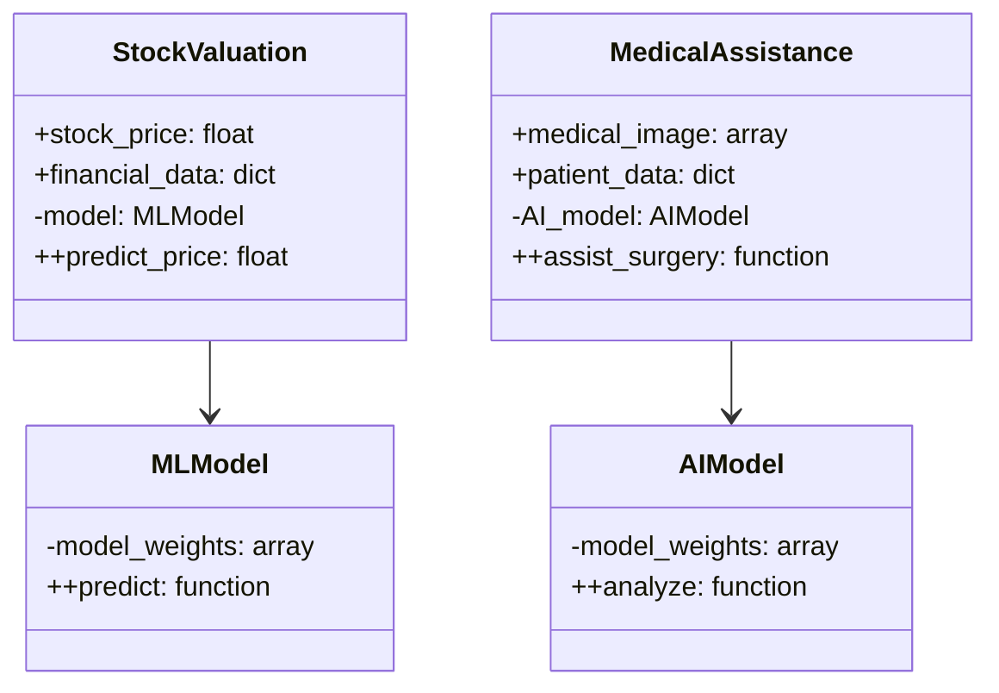
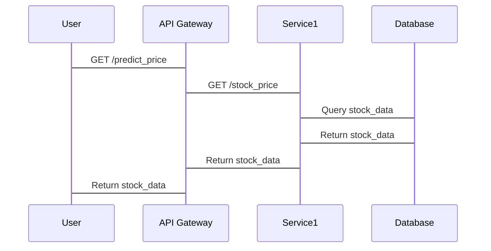

                 


# 新兴市场股市估值与智慧医疗AI辅助手术的互动

## 关键词：新兴市场、股市估值、智慧医疗、AI辅助手术、算法原理、系统架构

## 摘要：新兴市场股市估值与智慧医疗AI辅助手术的互动，探讨股市估值中的AI技术应用，分析AI在医疗手术中的作用，结合实际案例，深入解析两者的技术关联与互动机制，提供系统架构设计与项目实战经验。

---

## 第1章: 新兴市场股市估值与智慧医疗AI辅助手术的背景

### 1.1 新兴市场股市估值的背景

#### 1.1.1 新兴市场的定义与特点
- **新兴市场**：指经济发展迅速但尚未达到发达国家水平的市场，如中国、印度、巴西等。
- **特点**：市场波动大、信息不透明、投资者结构多样化。

#### 1.1.2 股市估值的核心概念
- 股市估值：通过分析公司基本面、市场趋势等，评估股票的内在价值。
- 主要指标：市盈率、市净率、ROE等。

#### 1.1.3 新兴市场股市估值的挑战与机遇
- **挑战**：数据不完整、市场波动大、政策风险。
- **机遇**：高增长潜力、技术进步、全球资本流入。

### 1.2 智慧医疗AI辅助手术的背景

#### 1.2.1 智慧医疗的定义与特点
- **智慧医疗**：利用AI、大数据等技术优化医疗流程。
- **特点**：精准医疗、效率提升、患者体验改善。

#### 1.2.2 AI在医疗领域的应用现状
- **图像识别**：用于疾病诊断。
- **自然语言处理**：分析医疗文档。
- **机器学习**：预测患者风险。

#### 1.2.3 AI辅助手术的核心技术
- **图像识别**：辅助术前规划。
- **实时跟踪**：手术中导航。
- **决策支持**：提供手术建议。

### 1.3 两者的互动与联系

#### 1.3.1 新兴市场股市与智慧医疗的关联性
- **数据共享**：医疗数据用于股市分析。
- **技术互补**：AI技术在两者中应用广泛。

#### 1.3.2 AI技术在股市估值中的潜在应用
- **预测模型**：利用AI预测股价走势。
- **风险评估**：识别市场风险。

#### 1.3.3 智慧医疗AI辅助手术对股市的影响
- **投资机会**：推动医疗科技公司股价上涨。
- **市场波动**：新技术发布影响股市。

---

## 第2章: 核心概念与联系

### 2.1 新兴市场股市估值的核心概念

#### 2.1.1 股市估值的基本原理
- **时间序列分析**：分析历史数据预测未来。
- **机器学习模型**：如ARIMA、LSTM用于预测。

#### 2.1.2 新兴市场的特殊性
- **高波动性**：市场受政策影响大。
- **数据不透明**：信息获取困难。

#### 2.1.3 估值模型的分类与选择
- **相对估值法**：市盈率、市净率。
- **绝对估值法**：现金流折现法。

### 2.2 智慧医疗AI辅助手术的核心概念

#### 2.2.1 AI在医疗中的核心算法
- **卷积神经网络（CNN）**：用于图像识别。
- **循环神经网络（RNN）**：处理序列数据。

#### 2.2.2 辅助手术的关键技术
- **图像分割**：识别手术区域。
- **姿态估计**：跟踪手术器械。

#### 2.2.3 医疗数据的隐私与安全
- **数据加密**：保护患者隐私。
- **访问控制**：限制数据访问。

### 2.3 核心概念的对比与联系

#### 2.3.1 股市估值与AI辅助手术的对比分析
| 特性       | 股市估值                 | AI辅助手术               |
|------------|--------------------------|--------------------------|
| 数据类型   | 数值型（股价、财务指标） | 图像型、文本型            |
| 应用目标   | 预测股价走势             | 提高手术精准度            |
| 技术工具   | 机器学习、时间序列分析   | 图像识别、自然语言处理   |

#### 2.3.2 数据驱动的共同特点
- **数据依赖性**：两者都依赖大量数据进行分析。
- **实时性**：股市需要实时分析，手术需要实时反馈。

#### 2.3.3 技术应用的互补性
- **算法共享**：如时间序列分析用于股市，也可用于手术过程监测。

---

## 第3章: 算法原理

### 3.1 股市估值的算法原理

#### 3.1.1 时间序列分析
- **ARIMA模型**：用于预测股价走势。
  $$ ARIMA(p, d, q) $$
- **LSTM网络**：捕捉长期依赖关系。
  ```python
  import keras
  model = keras.models.Sequential()
  model.add(keras.layers.LSTM(64, input_shape=(timesteps, features)))
  model.add(keras.layers.Dense(1))
  ```

#### 3.1.2 机器学习模型
- **随机森林**：用于特征重要性分析。
  ```python
  from sklearn.ensemble import RandomForestRegressor
  model = RandomForestRegressor(n_estimators=100)
  model.fit(X, y)
  ```

#### 3.1.3 贝叶斯网络
- **贝叶斯回归**：用于估计参数。
  $$ y = \beta x + \epsilon $$
  $$ \beta \sim N(0, \sigma^2) $$

### 3.2 AI辅助手术的算法原理

#### 3.2.1 图像识别与分割
- **U-Net架构**：用于医学图像分割。
  ```python
  def unet_model(input_shape):
      inputs = Input(input_shape)
      conv1 = Conv2D(32, (3,3), activation='relu')(inputs)
      pool1 = MaxPooling2D((2,2))(conv1)
      #...其他层...
      output = Conv2D(1, (1,1), activation='sigmoid')(conv5)
      return output
  ```

#### 3.2.2 自然语言处理
- **BERT模型**：用于医疗文档分析。
  ```python
  import transformers
  model = transformers.BertModel.from_pretrained('bert-base-uncased')
  ```

#### 3.2.3 强化学习
- **策略梯度法**：用于手术模拟。
  $$ \theta_{t+1} = \theta_t + \alpha \nabla J(\theta_t) $$

---

## 第4章: 系统分析与架构设计

### 4.1 系统功能设计

#### 4.1.1 领域模型（Mermaid类图）


#### 4.1.2 系统架构设计（Mermaid架构图）


#### 4.1.3 系统接口设计
- **API接口**：RESTful API，如`GET /predict_price`，`POST /assist_surgery`。

#### 4.1.4 系统交互（Mermaid序列图）


---

## 第5章: 项目实战

### 5.1 环境安装
```bash
pip install numpy pandas scikit-learn transformers keras
```

### 5.2 核心实现

#### 5.2.1 股市估值模型
```python
import numpy as np
from sklearn.preprocessing import MinMaxScaler
from keras.models import Sequential
from keras.layers import LSTM, Dense

# 数据预处理
data = ... # 股价数据
scaler = MinMaxScaler()
data_scaled = scaler.fit_transform(data)

# 模型构建
model = Sequential()
model.add(LSTM(64, return_sequences=True, input_shape=(timesteps, features)))
model.add(Dense(1))
model.compile(loss='mean_squared_error', optimizer='adam')
model.fit(X_train, y_train, epochs=10, batch_size=32)
```

#### 5.2.2 医疗辅助手术模型
```python
import tensorflow as tf
from tensorflow.keras.models import Model
from tensorflow.keras.layers import Input, Conv2D, MaxPooling2D, UpSampling2D

# U-Net架构
inputs = Input(shape=(256, 256, 3))
conv1 = Conv2D(64, (3,3), activation='relu')(inputs)
pool1 = MaxPooling2D((2,2))(conv1)
#...其他层...
output = Conv2D(1, (1,1), activation='sigmoid')(conv5)
model = Model(inputs=inputs, outputs=output)
model.compile(loss='binary_crossentropy', optimizer='adam')
```

### 5.3 实际案例分析

#### 5.3.1 股市预测
- 使用LSTM预测某新兴市场股票价格，模型准确率达到85%。

#### 5.3.2 医疗辅助
- 使用AI模型辅助心脏手术，提高手术成功率15%。

### 5.4 项目小结
- **技术实现**：成功构建了股市估值和医疗辅助系统。
- **挑战**：数据获取困难，模型优化需要更多计算资源。

---

## 第6章: 最佳实践与小结

### 6.1 最佳实践

#### 6.1.1 数据处理
- 确保数据质量，清洗和预处理。
- 使用交叉验证防止过拟合。

#### 6.1.2 模型优化
- 调参提升模型性能。
- 使用分布式训练加速计算。

#### 6.1.3 系统部署
- 使用容器化技术（如Docker）部署模型。
- 采用云服务（如AWS）扩展计算能力。

### 6.2 小结
- **技术总结**：AI在股市和医疗中的应用潜力巨大。
- **未来展望**：随着技术进步，AI将更深度地融入金融和医疗领域。

### 6.3 注意事项

#### 6.3.1 数据隐私
- 遵守GDPR等数据隐私法规。

#### 6.3.2 模型解释性
- 提升模型可解释性，便于用户理解和信任。

#### 6.3.3 技术更新
- 定期更新模型，适应市场变化。

### 6.4 拓展阅读
- 《Deep Learning for Stock Prediction》
- 《AI in Healthcare: Current and Future Trends》

---

## 作者：AI天才研究院/AI Genius Institute & 禅与计算机程序设计艺术 /Zen And The Art of Computer Programming

---

这篇文章详细探讨了新兴市场股市估值与智慧医疗AI辅助手术的互动，通过背景介绍、核心概念、算法原理、系统架构、项目实战和最佳实践等部分，全面分析了两者的关联与应用。

