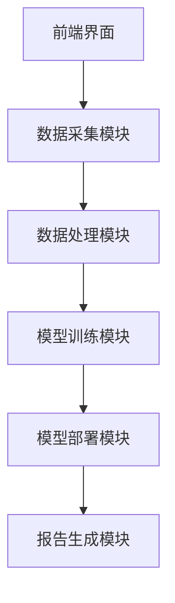

                 


# 智能保险理赔欺诈预防系统

## 关键词：智能保险，欺诈预防，人工智能，大数据，机器学习

## 摘要

智能保险理赔欺诈预防系统是一种利用人工智能和大数据技术，通过分析保险理赔数据，识别和预防欺诈行为的智能化系统。本文将从保险行业的现状出发，详细探讨保险欺诈的背景、技术基础，分析保险理赔业务流程与欺诈风险，介绍系统的核心算法与架构设计，并通过实战案例展示系统的实现与应用效果。最后，本文将总结智能保险欺诈预防系统的最佳实践和未来发展趋势。

---

# 第1章：保险行业的现状与挑战

## 1.1 保险行业的现状分析

保险行业作为金融体系的重要组成部分，近年来发展迅速，市场规模不断扩大。然而，随着保险业务的复杂化和多样化，保险欺诈问题也日益严重。传统保险理赔流程存在效率低、成本高、欺诈风险高等问题，亟需智能化解决方案。

---

## 1.2 保险欺诈的背景与问题描述

### 1.2.1 保险欺诈的定义与类型

保险欺诈是指通过故意虚构或夸大保险事故、伪造保险单据等手段，骗取保险金的行为。常见的保险欺诈类型包括：虚构保险事故、夸大损失金额、伪造保险单据、保险代理人欺诈等。

### 1.2.2 保险欺诈的常见手段

1. **虚构保险事故**：投保人故意制造事故或夸大事故损失。
2. **夸大损失金额**：通过虚报损失金额来骗取更多保险金。
3. **伪造保险单据**：伪造或篡改保险单、事故报告等文件。
4. **保险代理人欺诈**：保险代理人利用职务之便，伙同投保人或被保险人进行欺诈。

### 1.2.3 欺诈行为对保险行业的影响

保险欺诈不仅导致保险公司财务损失，还增加了运营成本，损害了保险行业的信誉。此外，欺诈行为还会推高保险产品价格，影响保险市场的健康发展。

---

## 1.3 智能保险理赔欺诈预防系统的提出

### 1.3.1 系统的目标与意义

智能保险理赔欺诈预防系统的目的是通过人工智能技术，实时分析保险理赔数据，识别潜在的欺诈行为，降低保险公司的财务风险和运营成本。

### 1.3.2 系统的核心问题

- 如何高效地识别保险理赔中的异常行为？
- 如何利用大数据技术构建欺诈检测模型？
- 如何确保系统的实时性和准确性？

### 1.3.3 系统的边界与外延

智能保险欺诈预防系统主要关注保险理赔阶段的欺诈行为识别，但也可延伸至保险产品设计、风险评估等领域。

---

## 1.4 保险欺诈预防系统的概念结构

### 1.4.1 系统的主要组成部分

1. 数据采集模块：收集保险理赔相关数据，包括投保信息、事故报告、理赔申请等。
2. 数据处理模块：对数据进行清洗、特征提取和数据增强。
3. 模型训练模块：基于机器学习算法训练欺诈检测模型。
4. 模型部署模块：将训练好的模型部署到生产环境，实时检测欺诈行为。
5. 报告生成模块：输出欺诈检测报告，提供决策支持。

### 1.4.2 系统的核心要素

- 数据源：包括结构化数据（如投保信息、理赔金额）和非结构化数据（如事故报告、聊天记录）。
- 模型算法：如随机森林、XGBoost、神经网络等。
- 评估指标：如准确率、召回率、F1分数等。

### 1.4.3 系统的功能模块

1. 数据采集与预处理
2. 模型训练与优化
3. 欺诈检测与预警
4. 报告生成与分析

---

# 第2章：智能保险理赔欺诈预防系统的背景与技术基础

## 2.1 人工智能与大数据技术的发展

### 2.1.1 人工智能技术的演进

人工智能技术的快速发展为保险欺诈预防提供了新的工具和方法。从早期的规则引擎到现在的深度学习模型，人工智能技术不断进步，为保险行业带来了更多的可能性。

### 2.1.2 大数据技术的应用

大数据技术在保险行业的应用主要体现在数据采集、存储、处理和分析方面。通过大数据技术，保险公司可以更好地识别欺诈行为，优化理赔流程。

### 2.1.3 保险行业的技术变革

随着云计算、区块链等技术的引入，保险行业正在经历一场技术变革。这些新技术为保险欺诈预防提供了新的思路和方法。

---

## 2.2 保险欺诈预防的技术基础

### 2.2.1 机器学习在保险欺诈中的应用

机器学习算法（如随机森林、XGBoost）在保险欺诈检测中的应用非常广泛。通过训练模型，可以识别出欺诈行为的特征和模式。

### 2.2.2 自然语言处理技术的作用

自然语言处理技术在保险欺诈预防中的作用主要体现在文本分析和情感分析方面。通过对理赔申请中的文本进行分析，可以识别出潜在的欺诈行为。

### 2.2.3 数据挖掘技术的运用

数据挖掘技术在保险欺诈预防中的应用主要体现在异常检测和关联规则挖掘方面。通过数据挖掘技术，可以发现隐藏在数据中的欺诈模式。

---

## 2.3 智能保险系统的构建基础

### 2.3.1 数据采集与处理

数据采集是保险欺诈预防系统的第一步。需要收集包括投保信息、事故报告、理赔金额等多方面的数据，并进行清洗和预处理。

### 2.3.2 模型训练与优化

基于机器学习算法，对数据进行建模和训练，优化模型的准确率和召回率，确保模型能够有效识别欺诈行为。

### 2.3.3 系统部署与维护

将训练好的模型部署到生产环境，实时处理理赔申请，持续监控模型性能，并根据实际情况进行调整和优化。

---

# 第3章：保险理赔业务流程与欺诈风险分析

## 3.1 保险理赔的基本流程

### 3.1.1 理赔申请的提交

投保人或被保险人在发生保险事故后，向保险公司提交理赔申请。

### 3.1.2 理赔审核的步骤

保险公司收到理赔申请后，会对申请进行初步审核，包括核对保险单、核实事故信息等。

### 3.1.3 理赔结果的确定

根据审核结果，保险公司决定是否赔付以及赔付金额。

---

## 3.2 欺诈风险的关键环节

### 3.2.1 理赔申请的初步审核

在初步审核阶段，需要识别是否存在虚构保险事故或夸大损失金额的情况。

### 3.2.2 理赔金额的评估

通过对理赔金额的分析，识别是否存在夸大损失金额的行为。

### 3.2.3 理赔单据的完整性

检查理赔单据的完整性，识别是否存在伪造单据的情况。

---

## 3.3 欺诈风险的特征分析

### 3.3.1 时间特征

某些欺诈行为具有特定的时间特征，如集中理赔、夜间理赔等。

### 3.3.2 空间特征

通过分析事故地点的分布，识别是否存在异常集中理赔的情况。

### 3.3.3 金额特征

通过分析理赔金额的分布，识别是否存在异常大额理赔的情况。

---

# 第4章：智能保险理赔欺诈预防系统的算法原理

## 4.1 机器学习算法的选择与应用

### 4.1.1 监督学习算法

监督学习算法（如随机森林、XGBoost）常用于分类任务，适合用于欺诈行为的分类。

### 4.1.2 无监督学习算法

无监督学习算法（如聚类、异常检测）适用于发现异常行为模式。

### 4.1.3 神经网络算法

深度学习算法（如卷积神经网络、循环神经网络）适用于处理非结构化数据，如文本和图像。

---

## 4.2 基于XGBoost的欺诈检测模型

### 4.2.1 算法原理

XGBoost是一种基于树的集成算法，通过多棵树的组合，提高模型的准确性和鲁棒性。

### 4.2.2 模型训练

1. 数据预处理：清洗数据，提取特征。
2. 模型训练：使用XGBoost算法训练欺诈检测模型。
3. 模型评估：通过准确率、召回率等指标评估模型性能。

### 4.2.3 代码实现

```python
import xgboost as xgb
from sklearn.model_selection import train_test_split
from sklearn.metrics import accuracy_score, recall_score

# 数据准备
X = data.drop(columns='is_fraud')
y = data['is_fraud']

# 划分训练集和测试集
X_train, X_test, y_train, y_test = train_test_split(X, y, test_size=0.2, random_state=42)

# 创建DMatrix
dtrain = xgb.DMatrix(X_train, label=y_train)
dtest = xgb.DMatrix(X_test, label=y_test)

# 参数设置
params = {
    'n_estimators': 100,
    'learning_rate': 0.1,
    'max_depth': 6,
    'min_child_weight': 1,
    'gamma': 0,
    'subsample': 0.8,
    'colsample_bytree': 0.8
}

# 训练模型
model = xgb.train(params, dtrain, num_boost_round=100)

# 预测
y_pred = model.predict(dtest)

# 评估
accuracy = accuracy_score(y_test, y_pred)
recall = recall_score(y_test, y_pred)
print(f'Accuracy: {accuracy}')
print(f'Recall: {recall}')
```

### 4.2.4 模型优化

通过调整模型参数（如学习率、树的深度等），优化模型的准确率和召回率。

---

## 4.3 神经网络算法的应用

### 4.3.1 深度学习模型的选择

卷积神经网络（CNN）适合处理图像数据，循环神经网络（RNN）适合处理序列数据。

### 4.3.2 神经网络模型的实现

1. 数据预处理：将文本数据转化为向量形式（如词袋模型、词嵌入）。
2. 模型训练：使用神经网络算法训练欺诈检测模型。
3. 模型评估：通过准确率、召回率等指标评估模型性能。

### 4.3.3 神经网络模型的代码实现

```python
import tensorflow as tf
from tensorflow.keras import layers

# 数据准备
X = data.drop(columns='is_fraud')
y = data['is_fraud']

# 划分训练集和测试集
X_train, X_test, y_train, y_test = train_test_split(X, y, test_size=0.2, random_state=42)

# 数据预处理
from tensorflow.keras.utils import to_categorical
y_train_onehot = to_categorical(y_train, num_classes=2)
y_test_onehot = to_categorical(y_test, num_classes=2)

# 构建模型
model = tf.keras.Sequential([
    layers.Dense(64, activation='relu'),
    layers.Dense(32, activation='relu'),
    layers.Dense(2, activation='sigmoid')
])

# 编译模型
model.compile(optimizer='adam', loss='binary_crossentropy', metrics=['accuracy'])

# 训练模型
model.fit(X_train, y_train_onehot, epochs=10, batch_size=32, validation_data=(X_test, y_test_onehot))

# 预测
y_pred = model.predict(X_test)
y_pred_class = y_pred.argmax(axis=1)

# 评估
accuracy = accuracy_score(y_test, y_pred_class)
recall = recall_score(y_test, y_pred_class)
print(f'Accuracy: {accuracy}')
print(f'Recall: {recall}')
```

---

# 第5章：智能保险理赔欺诈预防系统的系统架构设计

## 5.1 系统设计概述

### 5.1.1 系统功能模块

1. 数据采集模块：负责采集保险理赔数据。
2. 数据处理模块：对数据进行清洗、特征提取和数据增强。
3. 模型训练模块：基于机器学习算法训练欺诈检测模型。
4. 模型部署模块：将训练好的模型部署到生产环境，实时检测欺诈行为。
5. 报告生成模块：输出欺诈检测报告，提供决策支持。

### 5.1.2 系统功能流程

1. 数据采集：收集保险理赔相关数据。
2. 数据处理：清洗数据，提取特征。
3. 模型训练：基于机器学习算法训练欺诈检测模型。
4. 模型部署：将模型部署到生产环境，实时处理理赔申请。
5. 报告生成：根据模型输出结果，生成欺诈检测报告。

---

## 5.2 系统架构设计

### 5.2.1 系统架构图



### 5.2.2 系统接口设计

1. 数据接口：负责与数据源对接，获取保险理赔数据。
2. 模型接口：负责与模型训练模块对接，训练欺诈检测模型。
3. 报告接口：负责与报告生成模块对接，输出欺诈检测报告。

### 5.2.3 系统交互流程

1. 用户提交理赔申请。
2. 数据采集模块接收申请并进行初步审核。
3. 数据处理模块对申请进行清洗和特征提取。
4. 模型训练模块基于机器学习算法训练欺诈检测模型。
5. 模型部署模块实时处理理赔申请，识别欺诈行为。
6. 报告生成模块根据模型输出结果，生成欺诈检测报告。

---

## 5.3 系统功能实现

### 5.3.1 数据采集模块的实现

1. 通过API接口获取保险理赔数据。
2. 对数据进行清洗和预处理，确保数据的准确性和完整性。

### 5.3.2 数据处理模块的实现

1. 使用Python的pandas库进行数据清洗和特征提取。
2. 使用机器学习算法对数据进行处理和分析。

### 5.3.3 模型训练模块的实现

1. 使用XGBoost或神经网络算法训练欺诈检测模型。
2. 通过交叉验证优化模型参数，提高模型性能。

### 5.3.4 模型部署模块的实现

1. 将训练好的模型部署到生产环境，实时处理理赔申请。
2. 对模型进行监控和维护，确保模型的准确性和稳定性。

### 5.3.5 报告生成模块的实现

1. 根据模型输出结果，生成欺诈检测报告。
2. 提供可视化界面，方便用户查看和分析报告。

---

# 第6章：智能保险理赔欺诈预防系统的项目实战

## 6.1 项目背景与目标

### 6.1.1 项目背景

随着保险行业的快速发展，保险欺诈问题日益严重，亟需智能化解决方案。

### 6.1.2 项目目标

通过构建智能保险理赔欺诈预防系统，有效识别和预防保险欺诈行为，降低保险公司的财务风险和运营成本。

---

## 6.2 项目实施步骤

### 6.2.1 环境安装与配置

1. 安装必要的开发工具：Python、Jupyter Notebook、TensorFlow、XGBoost等。
2. 配置开发环境，确保所有依赖项安装正确。

### 6.2.2 系统核心实现

1. 数据采集模块的实现：通过API接口获取保险理赔数据。
2. 数据处理模块的实现：使用pandas库进行数据清洗和特征提取。
3. 模型训练模块的实现：使用XGBoost或神经网络算法训练欺诈检测模型。
4. 模型部署模块的实现：将训练好的模型部署到生产环境，实时处理理赔申请。
5. 报告生成模块的实现：根据模型输出结果，生成欺诈检测报告。

---

## 6.3 代码实现与分析

### 6.3.1 数据采集模块的代码实现

```python
import requests

# 通过API接口获取保险理赔数据
url = 'https://api.insurance.com/claims'
response = requests.get(url)
data = response.json()
```

### 6.3.2 数据处理模块的代码实现

```python
import pandas as pd

# 数据清洗和特征提取
df = pd.DataFrame(data)
df = df.dropna()
df['is_fraud'] = df['is_fraud'].astype(int)
```

### 6.3.3 模型训练模块的代码实现

```python
import xgboost as xgb

# 训练XGBoost模型
dtrain = xgb.DMatrix(X_train, label=y_train)
dtest = xgb.DMatrix(X_test, label=y_test)

params = {
    'n_estimators': 100,
    'learning_rate': 0.1,
    'max_depth': 6,
    'min_child_weight': 1,
    'gamma': 0,
    'subsample': 0.8,
    'colsample_bytree': 0.8
}

model = xgb.train(params, dtrain, num_boost_round=100)
```

### 6.3.4 模型部署模块的代码实现

```python
import flask

app = flask.Flask(__name__)

@app.route('/predict', methods=['POST'])
def predict():
    data = flask.request.json
    dtest = xgb.DMatrix([data])
    y_pred = model.predict(dtest)
    return {'prediction': int(y_pred[0])}
```

### 6.3.5 报告生成模块的代码实现

```python
from sklearn.metrics import classification_report

# 生成分类报告
print(classification_report(y_test, y_pred))
```

---

## 6.4 实际案例分析

### 6.4.1 数据分析与处理

通过对实际案例的数据进行分析，识别潜在的欺诈行为，验证模型的准确性和召回率。

### 6.4.2 模型评估与优化

通过评估模型的性能，优化模型参数，提高模型的准确率和召回率。

### 6.4.3 系统部署与测试

将优化后的模型部署到生产环境，进行实际测试，验证系统的稳定性和可靠性。

---

## 6.5 项目小结

通过本项目的实施，我们成功构建了一个智能保险理赔欺诈预防系统，能够有效识别和预防保险欺诈行为，降低保险公司的财务风险和运营成本。

---

# 第7章：智能保险理赔欺诈预防系统的最佳实践与未来展望

## 7.1 最佳实践

### 7.1.1 数据隐私保护

在数据采集和处理过程中，必须严格遵守数据隐私保护法律法规，确保用户数据的安全和隐私。

### 7.1.2 模型调优

通过不断优化模型参数和结构，提高模型的准确率和召回率，确保模型的性能和稳定性。

### 7.1.3 系统维护

定期对系统进行维护和更新，确保系统的稳定性和可靠性，及时发现和处理系统故障。

---

## 7.2 未来展望

### 7.2.1 技术发展

随着人工智能和大数据技术的不断发展，保险欺诈预防系统将更加智能化和自动化，进一步提高欺诈检测的准确性和效率。

### 7.2.2 应用拓展

未来，智能保险欺诈预防系统将拓展到更多的保险业务领域，如保险产品设计、风险评估等，为保险行业提供更全面的解决方案。

### 7.2.3 跨领域应用

智能保险欺诈预防系统的相关技术可以应用于其他领域，如金融 fraud detection、网络安全等，推动跨领域的发展。

---

# 结语

智能保险理赔欺诈预防系统是人工智能和大数据技术在保险行业中的重要应用，通过智能化手段有效识别和预防保险欺诈行为，降低保险公司的财务风险和运营成本。随着技术的不断进步，智能保险欺诈预防系统将在未来发挥更大的作用，为保险行业的发展提供强有力的支持。

---

# 作者：AI天才研究院 & 禅与计算机程序设计艺术

--- 

本文旨在通过系统的分析和实践，深入探讨智能保险理赔欺诈预防系统的构建与应用，为保险行业提供参考和借鉴。

