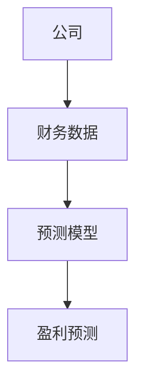
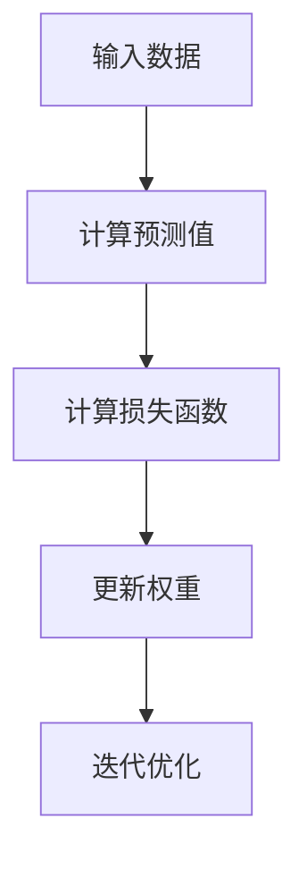
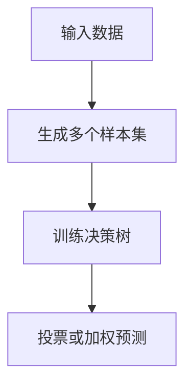
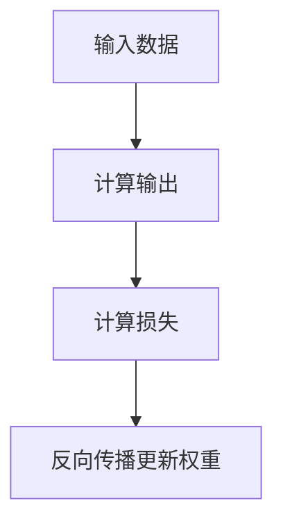
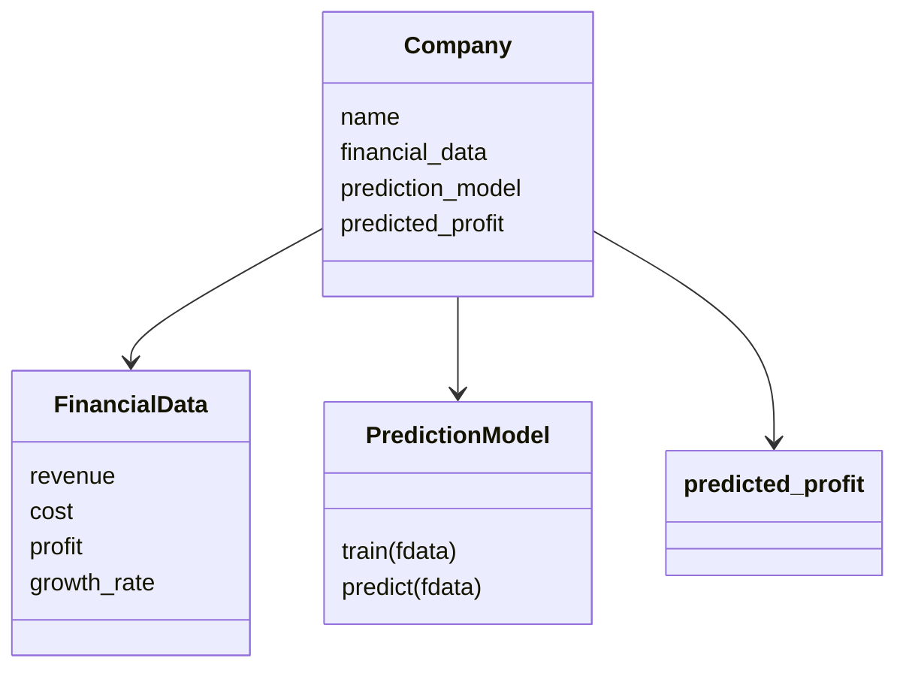
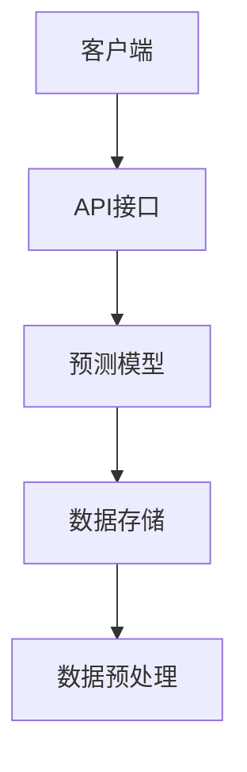
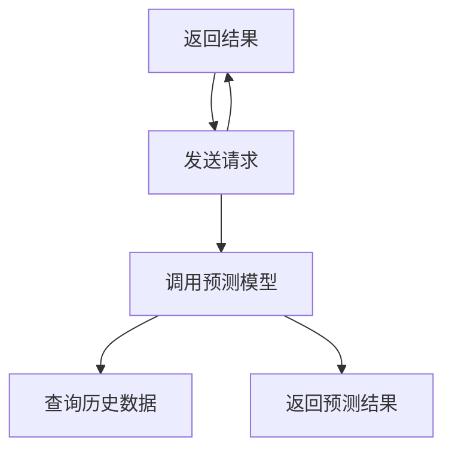

                 


# 机器学习预测公司盈利质量

> 关键词：机器学习，公司盈利，财务预测，算法模型，Python代码，数据特征工程

> 摘要：本文详细探讨了机器学习在公司盈利质量预测中的应用。从背景与核心概念、算法原理、系统设计到项目实战和最佳实践，全面解析了如何利用机器学习技术预测公司盈利质量，结合实际案例和代码实现，帮助读者掌握这一领域的核心方法和技术。

---

# 第一部分: 机器学习预测公司盈利质量的背景与核心概念

## 第1章: 机器学习与公司盈利质量概述

### 1.1 机器学习的基本概念

#### 1.1.1 机器学习的定义与核心概念
机器学习是一种人工智能技术，通过数据训练模型，使其能够从经验中学习并做出预测或决策。其核心概念包括：
- **监督学习**：基于标记数据的训练，如回归和分类任务。
- **无监督学习**：在无标记数据中发现模式，如聚类。
- **特征工程**：通过数据预处理提取有用的特征，提升模型性能。

#### 1.1.2 公司盈利质量的定义与衡量标准
公司盈利质量是指公司在一定时期内实现盈利的能力，通常通过以下指标衡量：
- 净利润（Net Profit）
- 毛利率（Gross Margin）
- 净资产收益率（ROE）
- 资产负债率（Debt-to-Asset Ratio）

#### 1.1.3 机器学习在公司盈利预测中的应用价值
- 提供高精度的预测结果。
- 通过特征工程发现隐藏的财务规律。
- 实现自动化、实时化的盈利预测。

### 1.2 问题背景与描述

#### 1.2.1 公司盈利预测的挑战与难点
- 数据的不完整性与噪声。
- 财务指标的多维性与复杂性。
- 市场环境的不确定性。

#### 1.2.2 传统财务分析的局限性
- 主观性较强，依赖分析师经验。
- 计算复杂，难以快速得出结论。
- 难以捕捉市场动态变化。

#### 1.2.3 机器学习在财务预测中的优势
- 数据驱动，减少人为干扰。
- 高维度数据分析能力。
- 自动化与实时性。

### 1.3 问题解决与边界

#### 1.3.1 机器学习如何解决公司盈利预测问题
- 利用历史数据训练模型，预测未来盈利。
- 通过特征工程提取关键财务指标，优化模型性能。
- 结合多种算法，提升预测准确性。

#### 1.3.2 模型的边界与适用场景
- 数据量要求：需要足够的历史数据支持。
- 数据质量：数据需具备一定的完整性和准确性。
- 预测范围：适用于中短期盈利预测，长周期预测需结合其他因素。

#### 1.3.3 数据质量与模型性能的关系
- 数据质量直接影响模型性能。
- 数据清洗与特征工程是提升模型预测能力的关键。

## 第2章: 核心概念与联系

### 2.1 核心概念原理

#### 2.1.1 机器学习模型的输入输出关系
- 输入：公司财务数据（如收入、成本、利润等）。
- 输出：盈利预测结果（如净利润率）。

#### 2.1.2 公司财务数据的特征提取
- 时间序列特征：历史盈利数据。
- 财务指标特征：收入增长率、成本占比。
- 市场特征：行业指数、宏观经济指标。

#### 2.1.3 盈利预测的数学模型构建
- 通过特征工程构建输入向量。
- 利用机器学习算法预测目标变量。

### 2.2 核心概念对比表

#### 2.2.1 不同机器学习算法的特征对比

| 算法         | 监督/无监督 | 是否需要标签 | 特征重要性 | 优点                                |
|--------------|------------|-------------|-----------|------------------------------------|
| 线性回归      | 监督        | 需要         | 低         | 简单，解释性强                   |
| 随机森林      | 监督        | 需要         | 高         | 高精度，抗过拟合                 |
| 神经网络      | 监督        | 需要         | 低         | 强大的非线性拟合能力             |

#### 2.2.2 公司财务指标与盈利预测的关系

| 财务指标       | 对盈利预测的影响                  |
|----------------|----------------------------------|
| 净利润         | 直接反映公司盈利能力             |
| 毛利率         | 表示公司产品盈利能力             |
| 资产负债率     | 影响公司财务风险和偿债能力       |
| 营业收入增长率 | 反映公司业务扩展能力             |

### 2.3 ER实体关系图



---

# 第二部分: 机器学习算法原理与数学模型

## 第3章: 常见算法原理

### 3.1 线性回归

#### 3.1.1 线性回归的原理与假设
线性回归是一种经典的监督学习算法，假设目标变量与特征变量之间存在线性关系。其数学模型如下：

$$ y = \beta_0 + \beta_1x_1 + \beta_2x_2 + ... + \beta_nx_n + \epsilon $$

其中：
- $y$ 是目标变量（如净利润率）。
- $x_i$ 是特征变量（如收入、成本）。
- $\beta_i$ 是回归系数。
- $\epsilon$ 是误差项。

#### 3.1.2 最小二乘法的数学推导
最小二乘法通过最小化预测值与实际值之间的平方误差之和来求解回归系数：

$$ \text{损失函数} = \sum_{i=1}^{m}(y_i - (\beta_0 + \beta_1x_{i1} + ... + \beta_nx_{in}))^2 $$

通过求导并令导数为零，可以得到回归系数的最优解。

#### 3.1.3 算法流程图



### 3.2 随机森林

#### 3.2.1 随机森林的工作原理
随机森林是一种集成学习算法，通过生成多个决策树并进行投票或加权预测来提高模型的准确性和鲁棒性。

#### 3.2.2 Bagging与特征随机性
随机森林结合了Bagging（自助法）和特征随机性，通过随机选择特征来训练每一棵决策树。

#### 3.2.3 算法流程图



### 3.3 神经网络

#### 3.3.1 神经网络的基本结构
神经网络由输入层、隐藏层和输出层组成，通过多层非线性变换来捕捉数据的复杂模式。

#### 3.3.2 深度学习与反向传播
深度学习通过堆叠多个隐藏层来提取高阶特征，反向传播算法用于计算损失函数的梯度并更新权重。

#### 3.3.3 算法流程图



---

# 第三部分: 系统分析与架构设计方案

## 第4章: 系统设计

### 4.1 问题场景介绍

#### 4.1.1 项目介绍
本项目旨在利用机器学习技术，基于公司财务数据预测其盈利能力。

#### 4.1.2 系统功能设计
- 数据预处理模块：清洗和特征工程。
- 模型训练模块：训练并优化机器学习模型。
- 模型评估模块：评估模型性能并进行调优。
- 模型部署模块：将模型部署为API服务。

#### 4.1.3 领域模型类图



#### 4.1.4 系统架构设计



### 4.2 接口设计与交互

#### 4.2.1 系统接口设计
- API接口：接收公司财务数据，返回盈利预测结果。
- 数据格式：JSON格式输入输出。

#### 4.2.2 系统交互流程图



---

# 第四部分: 项目实战

## 第5章: 项目实现

### 5.1 环境安装与配置

#### 5.1.1 安装Python环境
使用Anaconda或Miniconda安装Python 3.8及以上版本。

#### 5.1.2 安装依赖库
安装以下Python库：
```bash
pip install numpy pandas scikit-learn xgboost matplotlib
```

### 5.2 核心代码实现

#### 5.2.1 数据预处理与特征工程

```python
import pandas as pd
from sklearn.preprocessing import StandardScaler

# 加载数据
data = pd.read_csv('company_profit.csv')

# 特征选择
features = ['revenue', 'cost', 'growth_rate']
target = 'profit_margin'

X = data[features]
y = data[target]

# 数据标准化
scaler = StandardScaler()
X_scaled = scaler.fit_transform(X)
```

#### 5.2.2 模型训练与优化

```python
from sklearn.model_selection import train_test_split
from sklearn.ensemble import RandomForestRegressor
from sklearn.metrics import mean_squared_error

# 数据分割
X_train, X_test, y_train, y_test = train_test_split(X_scaled, y, test_size=0.2, random_state=42)

# 训练随机森林模型
model = RandomForestRegressor(n_estimators=100, max_depth=10, random_state=42)
model.fit(X_train, y_train)

# 模型评估
y_pred = model.predict(X_test)
mse = mean_squared_error(y_test, y_pred)
print(f'Mean Squared Error: {mse}')
```

#### 5.2.3 模型部署与API开发

```python
from flask import Flask, request, jsonify

app = Flask(__name__)
model = RandomForestRegressor(...)  # 加载训练好的模型
scaler = StandardScaler(...)       # 加载数据预处理模型

@app.route('/predict', methods=['POST'])
def predict_profit():
    data = request.json
    features = data['features']
    X = pd.DataFrame([features])
    X_scaled = scaler.transform(X)
    prediction = model.predict(X_scaled)
    return jsonify({'predicted_profit': prediction[0].tolist()})

if __name__ == '__main__':
    app.run(debug=True)
```

### 5.3 案例分析与详细解读

#### 5.3.1 数据来源与清洗
使用公开的公司财务数据，清洗缺失值和异常值。

#### 5.3.2 特征选择与分析
选择对公司盈利影响较大的财务指标，如收入增长率和成本占比。

#### 5.3.3 模型调优与评估
通过网格搜索优化模型参数，评估模型的准确性和稳定性。

---

# 第五部分: 最佳实践与小结

## 第6章: 最佳实践

### 6.1 项目小结

- 数据质量直接影响模型性能。
- 特征工程是提升模型预测能力的关键。
- 线性回归适合简单场景，随机森林适合复杂场景。

### 6.2 注意事项

- 数据隐私与安全。
- 模型的可解释性。
- 市场环境变化对模型的影响。

### 6.3 进一步阅读与学习

- 推荐书籍：《机器学习实战》、《深入浅出机器学习》。
- 在线课程：Coursera上的《机器学习》课程。

---

作者：AI天才研究院 & 禅与计算机程序设计艺术

