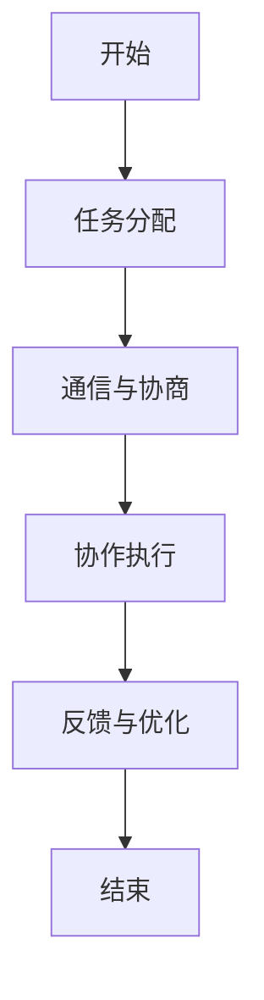
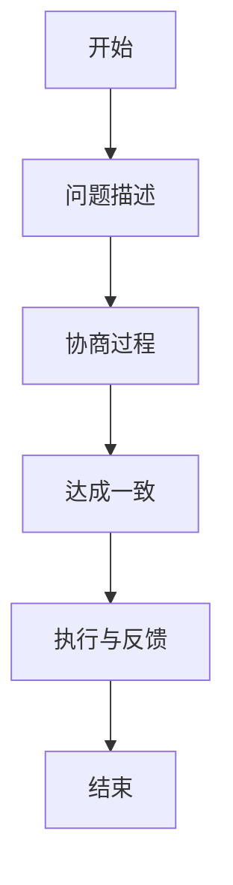
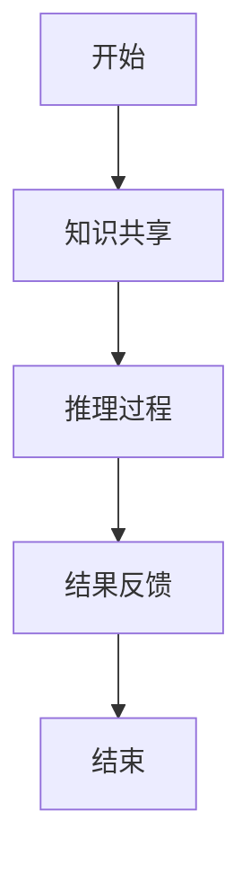
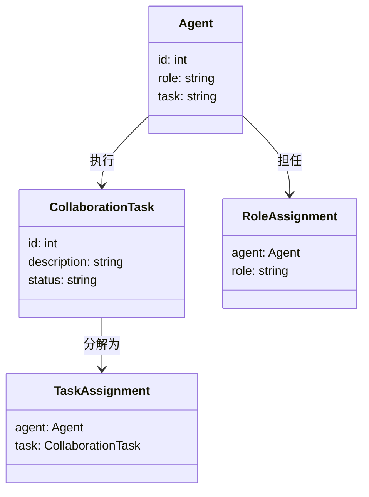

                 


# AI Agent的多Agent协作系统设计

> 关键词：AI Agent，多Agent协作，分布式协作，协商算法，系统架构

> 摘要：本文详细探讨了AI Agent的多Agent协作系统设计，从核心概念、算法原理、系统架构到项目实战，全面解析了多Agent协作系统的实现过程，旨在帮助读者掌握多Agent协作系统的设计方法。

---

# 第一部分：AI Agent的多Agent协作系统概述

## 第1章：AI Agent与多Agent协作系统概述

### 1.1 AI Agent的基本概念

#### 1.1.1 AI Agent的定义
AI Agent（智能体）是指能够感知环境并采取行动以实现特定目标的实体。Agent可以是软件程序、机器人或其他智能系统，具备自主决策的能力。

#### 1.1.2 AI Agent的核心特点
- **自主性**：Agent能够自主决策，无需外部干预。
- **反应性**：Agent能够感知环境并实时调整行为。
- **社会性**：Agent能够与其他Agent或人类进行交互和协作。
- **学习能力**：Agent能够通过经验改进自身行为。

#### 1.1.3 AI Agent与传统智能体的区别
传统智能体通常是静态的、基于规则的系统，而AI Agent具备学习和适应能力，能够动态调整行为以应对复杂环境。

### 1.2 多Agent协作系统的定义与特点

#### 1.2.1 多Agent协作系统的定义
多Agent协作系统是指多个AI Agent协同工作，共同完成复杂任务的系统。这些Agent通常具有不同的角色和功能，通过协作实现整体目标。

#### 1.2.2 多Agent协作系统的特征
- **分布式性**：Agent分布在不同的节点上，通过网络进行通信。
- **协作性**：Agent之间通过协作完成任务，而非简单地并行执行。
- **动态性**：环境和任务需求可能动态变化，Agent需要实时调整协作策略。
- **复杂性**：多个Agent之间的协作可能导致复杂的交互和协调问题。

#### 1.2.3 多Agent协作系统的分类
- **基于任务的协作**：Agent根据任务需求进行协作，每个Agent负责特定子任务。
- **基于角色的协作**：Agent根据角色分工进行协作，每个角色负责特定职责。
- **基于知识的协作**：Agent通过共享知识和信息进行协作，实现更复杂的任务。

### 1.3 多Agent协作系统的应用场景

#### 1.3.1 分布式计算与协作
在分布式系统中，多个Agent可以协作完成数据处理、任务分配等任务，提高系统的效率和可靠性。

#### 1.3.2 智能机器人协作
多Agent协作系统可以应用于智能机器人协作，例如工业机器人协作完成复杂装配任务。

#### 1.3.3 软件工程中的多Agent协作
在软件工程中，多Agent协作系统可以用于自动化测试、代码审查、任务分配等场景，提高开发效率。

### 1.4 多Agent协作系统的挑战与机遇

#### 1.4.1 协作中的主要挑战
- **通信与协调**：多个Agent之间的通信和协调可能面临延迟和复杂性问题。
- **任务分配**：如何高效分配任务给不同的Agent，确保系统整体效率。
- **冲突解决**：Agent之间的目标和利益可能存在冲突，需要有效的冲突解决机制。
- **动态环境适应**：环境和任务需求可能动态变化，Agent需要具备快速适应能力。

#### 1.4.2 多Agent协作系统的潜在价值
- **提高效率**：通过协作，多个Agent可以更高效地完成复杂任务。
- **增强灵活性**：系统能够动态调整协作策略，适应环境变化。
- **扩展性**：系统可以通过增加更多的Agent来扩展能力，应对更大的任务需求。

#### 1.4.3 未来发展的趋势与方向
- **智能化协作**：Agent具备更强的自主决策能力，能够更智能地协作。
- **人机协作**：Agent与人类协同工作，增强人机协作的自然性和高效性。
- **跨领域应用**：多Agent协作系统将在更多领域得到应用，如智能制造、智慧城市等。

### 1.5 本章小结
本章介绍了AI Agent的基本概念和多Agent协作系统的定义、特点及应用场景。通过分析协作中的挑战与机遇，为后续章节的深入探讨奠定了基础。

---

## 第2章：多Agent协作系统的核心概念与联系

### 2.1 多Agent协作系统的核心概念

#### 2.1.1 Agent的属性与行为
- **属性**：每个Agent都有独特的属性，如角色、能力、目标等。
- **行为**：Agent根据感知到的信息采取行动，以实现目标。

#### 2.1.2 Agent之间的关系
- **协作关系**：Agent之间通过协作完成任务，共同实现目标。
- **竞争关系**：在某些情况下，Agent之间可能存在竞争关系，需要平衡个体利益与整体目标。

#### 2.1.3 协作任务的定义与分解
- **协作任务**：需要多个Agent共同完成的任务。
- **任务分解**：将协作任务分解为多个子任务，分配给不同的Agent完成。

### 2.2 多Agent协作系统的概念属性特征对比

| 概念       | 特征1：自主性 | 特征2：协作性 | 特征3：动态性 |
|------------|---------------|---------------|---------------|
| 单个Agent  | 高             | 低             | 中             |
| 多个Agent  | 中             | 高             | 高             |

### 2.3 多Agent协作系统的ER实体关系图

```mermaid
er
    actor: Agent1
    actor: Agent2
    actor: Agent3
    entity: CollaborationTask
    entity: Role
    entity: CommunicationChannel
    entity: TaskAssignment
    entity: Goal
    entity: Knowledge
    entity: ConflictResolution
    entity: PerformanceMetric
    entity: Feedback
    entity: LearningExperience

    Agent1 --> CollaborationTask: 执行
    Agent2 --> CollaborationTask: 执行
    Agent3 --> CollaborationTask: 执行
    Agent1 --> Role: 担任
    Agent2 --> Role: 担任
    Agent3 --> Role: 担任
    CollaborationTask --> TaskAssignment: 分解为
    TaskAssignment --> Agent: 分配给
    Agent --> Goal: 追求
    Agent --> Knowledge: 拥有
    Agent --> CommunicationChannel: 使用
    CollaborationTask --> ConflictResolution: 处理
    CollaborationTask --> PerformanceMetric: 计算
    Agent --> Feedback: 收到
    Agent --> LearningExperience: 学习
```

### 2.4 本章小结
本章详细探讨了多Agent协作系统的核心概念，通过对比和ER实体关系图，展示了系统中各实体之间的关系和协作机制。

---

## 第3章：多Agent协作系统的算法原理

### 3.1 分布式协作算法

#### 3.1.1 分布式协作算法的定义
分布式协作算法是指在分布式系统中，多个Agent通过协作完成任务的算法。每个Agent独立决策，但通过通信和协商实现协作。

#### 3.1.2 分布式协作算法的实现步骤
1. **任务分配**：根据任务需求和Agent的能力，将任务分解并分配给不同的Agent。
2. **通信与协商**：Agent之间通过通信协商，确定各自的职责和协作方式。
3. **协作执行**：Agent根据协商结果执行任务，实时调整协作策略。
4. **反馈与优化**：根据执行结果反馈，优化协作算法，提高效率。

#### 3.1.3 分布式协作算法的优缺点
- **优点**：能够适应动态环境，具备良好的扩展性。
- **缺点**：通信开销较大，协作效率可能受限。

### 3.2 协商算法

#### 3.2.1 协商算法的定义
协商算法是指多个Agent通过协商确定协作方式和任务分配的算法。

#### 3.2.2 协商算法的实现步骤
1. **问题描述**：明确协作任务的目标和约束条件。
2. **协商过程**：Agent通过协商确定各自的职责和协作方式。
3. **达成一致**：通过协商达成一致的协作方案。
4. **执行与反馈**：根据协商结果执行任务，并实时反馈执行情况。

#### 3.2.3 协商算法的优缺点
- **优点**：能够根据实际情况灵活调整协作策略。
- **缺点**：协商过程可能增加系统的延迟和复杂性。

### 3.3 联合推理算法

#### 3.3.1 联合推理算法的定义
联合推理算法是指多个Agent通过共享知识和信息，共同推理得出结论的算法。

#### 3.3.2 联合推理算法的实现步骤
1. **知识共享**：Agent之间共享知识和信息。
2. **推理过程**：基于共享的知识，进行联合推理，得出结论。
3. **结果反馈**：将推理结果反馈给相关Agent，用于后续协作。

#### 3.3.3 联合推理算法的优缺点
- **优点**：能够充分利用多Agent的知识和信息，提高推理的准确性和全面性。
- **缺点**：知识共享可能涉及隐私和安全问题。

### 3.4 多Agent协作算法的数学模型

#### 3.4.1 协作任务分配的数学模型
$$ \text{目标函数} = \sum_{i=1}^{n} w_i x_i $$
其中，\( w_i \) 是任务 \( i \) 的权重，\( x_i \) 是分配给Agent \( i \) 的任务量。

#### 3.4.2 协作决策的数学模型
$$ \text{决策变量} = \{x_1, x_2, ..., x_n\} $$
其中，\( x_i \) 表示Agent \( i \) 是否执行任务 \( i \)。

#### 3.4.3 协作结果评估的数学模型
$$ \text{评估指标} = \frac{\sum_{i=1}^{n} s_i}{n} $$
其中，\( s_i \) 是Agent \( i \) 的协作效果评分。

### 3.5 算法实现的mermaid流程图

#### 3.5.1 分布式协作算法流程图



#### 3.5.2 协商算法流程图



#### 3.5.3 联合推理算法流程图



### 3.6 算法实现的Python源代码

#### 3.6.1 分布式协作算法的Python实现

```python
class Agent:
    def __init__(self, id):
        self.id = id
        self.task = None

    def assign_task(self, task):
        self.task = task

    def execute_task(self):
        print(f"Agent {self.id} executing task {self.task}")

def distributed_collaboration_agents(tasks, num_agents):
    agents = [Agent(i) for i in range(num_agents)]
    # 任务分配
    for i in range(len(tasks)):
        agents[i % num_agents].assign_task(tasks[i])
    # 协作执行
    for agent in agents:
        agent.execute_task()
```

#### 3.6.2 协商算法的Python实现

```python
class Agent:
    def __init__(self, id):
        self.id = id
        self.role = None

    def negotiate_role(self, role):
        self.role = role

def negotiation_agents(num_agents):
    agents = [Agent(i) for i in range(num_agents)]
    # 协商过程
    for i in range(1, num_agents):
        agents[i].negotiate_role(agents[i-1].role)
    # 执行任务
    for agent in agents:
        print(f"Agent {agent.id}执行角色{agent.role}")
```

### 3.7 本章小结
本章详细介绍了多Agent协作系统的几种典型算法，包括分布式协作算法、协商算法和联合推理算法，并通过mermaid流程图和Python代码展示了算法的实现过程。

---

## 第4章：多Agent协作系统的系统分析与架构设计

### 4.1 系统分析

#### 4.1.1 问题场景介绍
我们设计一个多Agent协作系统，用于实现智能工厂中的设备协作和生产优化。

#### 4.1.2 系统功能需求
- **设备监控**：实时监控生产设备的状态。
- **任务分配**：根据生产需求分配设备任务。
- **协作执行**：设备协作完成生产任务。
- **结果反馈**：反馈生产结果并优化协作策略。

### 4.2 系统架构设计

#### 4.2.1 领域模型类图



#### 4.2.2 系统架构图

```mermaid
container 多Agent协作系统 {
    component Agent1 {
        id: 1
        role: 设备监控
    }
    component Agent2 {
        id: 2
        role: 任务分配
    }
    component Agent3 {
        id: 3
        role: 协作执行
    }
    Agent1 --> Agent2: 通信
    Agent2 --> Agent3: 任务分配
    Agent3 --> Agent1: 结果反馈
}
```

#### 4.2.3 系统接口设计
- **通信接口**：Agent之间的通信接口，用于信息交换。
- **任务分配接口**：任务分配模块的接口，用于分配任务。
- **结果反馈接口**：结果反馈模块的接口，用于反馈执行结果。

#### 4.2.4 系统交互序列图

```mermaid
sequenceDiagram
    participant A: Agent1
    participant B: Agent2
    participant C: Agent3
    A -> B: 请求任务分配
    B -> C: 分配任务
    C -> A: 反馈结果
```

### 4.3 本章小结
本章通过系统分析和架构设计，展示了多Agent协作系统在实际应用中的结构和交互方式，为后续的项目实现提供了理论基础。

---

## 第5章：多Agent协作系统的项目实战

### 5.1 环境安装

#### 5.1.1 安装Python
```bash
python --version
pip install --upgrade pip
```

#### 5.1.2 安装依赖库
```bash
pip install numpy
pip install matplotlib
pip install networkx
```

### 5.2 系统核心功能实现

#### 5.2.1 Agent类实现

```python
class Agent:
    def __init__(self, id):
        self.id = id
        self.role = None
        self.task = None

    def assign_task(self, task):
        self.task = task

    def execute_task(self):
        print(f"Agent {self.id} 执行任务 {self.task}")
```

#### 5.2.2 协商算法实现

```python
class Negotiation:
    def __init__(self, agents):
        self.agents = agents

    def negotiate_role(self):
        for i in range(1, len(self.agents)):
            self.agents[i].role = self.agents[i-1].role
```

#### 5.2.3 任务分配实现

```python
def distribute_tasks(tasks, agents):
    for i in range(len(tasks)):
        agents[i % len(agents)].assign_task(tasks[i])
```

### 5.3 代码应用解读与分析

#### 5.3.1 Agent类解读
- **属性**：id、role、task。
- **方法**：assign_task（分配任务）、execute_task（执行任务）。

#### 5.3.2 协商算法解读
- **协商过程**：通过循环协商，确定每个Agent的角色。
- **实现细节**：基于前一个Agent的角色，确定当前Agent的角色。

#### 5.3.3 任务分配解读
- **实现方式**：通过模运算将任务分配给不同的Agent。
- **优点**：简单高效，适用于任务数量远大于Agent数量的场景。

### 5.4 实际案例分析

#### 5.4.1 案例背景
设计一个多Agent协作系统，用于智能工厂的设备监控和生产优化。

#### 5.4.2 案例实现
```python
agents = [Agent(1), Agent(2), Agent(3)]
tasks = ["监控设备1", "监控设备2", "监控设备3"]
negotiation = Negotiation(agents)
negotiation.negotiate_role()
distribute_tasks(tasks, agents)
for agent in agents:
    agent.execute_task()
```

#### 5.4.3 案例分析
- **协商过程**：三个Agent通过协商确定各自的角色。
- **任务分配**：任务被分配给不同的Agent，每个Agent执行特定的任务。
- **结果反馈**：Agent执行任务后，将结果反馈给系统。

### 5.5 本章小结
本章通过实际案例，展示了多Agent协作系统的实现过程，从环境安装到代码实现，帮助读者掌握系统的实际应用。

---

## 第6章：多Agent协作系统的最佳实践与小结

### 6.1 最佳实践

#### 6.1.1 系统设计建议
- **模块化设计**：将系统划分为多个模块，便于维护和扩展。
- **通信机制**：设计高效的通信机制，减少延迟和开销。
- **容错机制**：设计容错机制，确保系统在部分Agent失效时仍能正常运行。

#### 6.1.2 开发建议
- **代码规范**：遵循代码规范，提高代码的可读性和可维护性。
- **测试与调试**：通过测试和调试，确保系统各部分的协作正确。
- **性能优化**：通过优化算法和架构，提高系统的协作效率。

### 6.2 小结

#### 6.2.1 系统设计总结
多Agent协作系统的实现需要综合考虑系统架构、算法设计和通信机制等多个方面，通过合理的系统设计和算法优化，能够实现高效的协作。

#### 6.2.2 系统实现总结
通过实际案例的实现，我们掌握了多Agent协作系统的实现方法，包括环境安装、代码实现、任务分配和协作执行等步骤。

#### 6.2.3 系统应用总结
多Agent协作系统在实际应用中表现出色，能够提高系统的效率和灵活性，适用于复杂的协作任务。

### 6.3 注意事项

#### 6.3.1 系统设计中的注意事项
- **通信延迟**：注意减少Agent之间的通信延迟，提高协作效率。
- **任务分配**：合理分配任务，避免任务过载或不足。
- **冲突解决**：设计有效的冲突解决机制，确保协作顺利进行。

#### 6.3.2 系统实现中的注意事项
- **代码质量**：注重代码的可读性和可维护性。
- **性能优化**：通过优化算法和架构，提高系统的协作效率。
- **测试与调试**：通过测试和调试，确保系统的正确性和稳定性。

### 6.4 拓展阅读

#### 6.4.1 推荐书籍
- 《Multi-Agent Systems: Algorithmic, Complexity, and Theory》
- 《Distributed Artificial Intelligence》

#### 6.4.2 推荐论文
- "Distributed Collaborative Learning in Multi-Agent Systems"
- "Multi-Agent Negotiation: A Survey"

### 6.5 本章小结
本章总结了多Agent协作系统的实现经验，并提出了系统的优化建议和注意事项，同时推荐了相关的拓展阅读资料。

---

## 作者：AI天才研究院/AI Genius Institute & 禅与计算机程序设计艺术 /Zen And The Art of Computer Programming

---

**本文通过系统化的分析和详细的实现过程，全面探讨了AI Agent的多Agent协作系统设计。从核心概念到算法实现，从系统架构到项目实战，本文为读者提供了一个完整的多Agent协作系统设计方案。**

