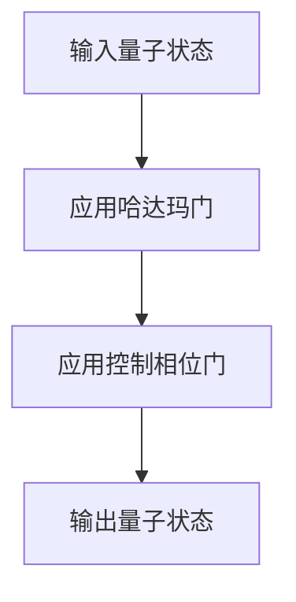
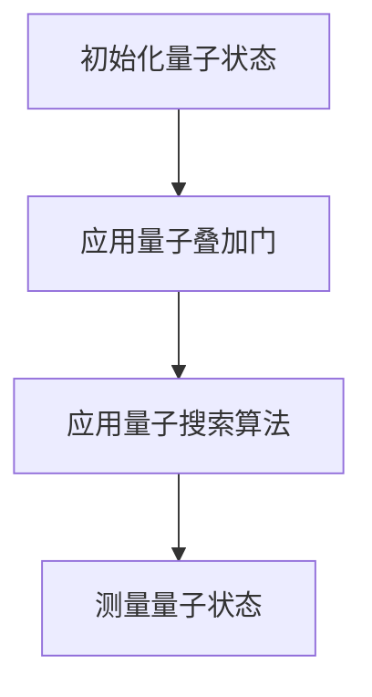
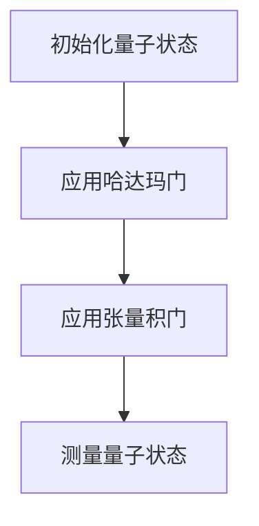
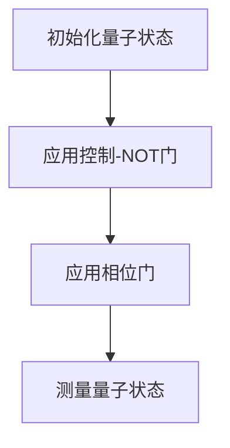

                 


# 价值投资中的新一代光子量子计算机技术

> 关键词：光子量子计算机、量子计算、价值投资、金融分析、投资组合优化

> 摘要：本文探讨了新一代光子量子计算机技术在价值投资中的应用，分析了量子计算的基本原理及其在金融分析中的潜力，详细介绍了量子优化算法和量子傅里叶变换在投资组合优化和风险管理中的实现，并通过实际案例展示了如何利用光子量子计算机技术提升投资决策的效率和准确性。

---

## 第一部分: 价值投资中的量子计算机技术概述

### 第1章: 新一代光子量子计算机技术概述

#### 1.1 量子计算机的基本概念

##### 1.1.1 量子计算机的定义与基本原理

量子计算机是一种基于量子力学原理的计算机，利用量子位（qubit）进行信息处理。与经典计算机的二进制位不同，量子位可以同时处于多个状态的叠加态。这种特性使得量子计算机在某些特定问题上比经典计算机具有显著优势。

**量子叠加原理**：量子位的状态可以表示为 $|0\rangle$ 和 $|1\rangle$ 的线性组合，例如：
$$
|\psi\rangle = \alpha|0\rangle + \beta|1\rangle
$$
其中，$\alpha$ 和 $\beta$ 是复数系数，满足 $|\alpha|^2 + |\beta|^2 = 1$。

**量子纠缠原理**：当两个或多个量子位之间存在纠缠时，对其中一个量子位的操作会直接影响另一个量子位的状态。这种特性在量子通信和量子计算中具有重要应用。

##### 1.1.2 光子量子计算机的优势

光子量子计算机是一种基于光子的量子计算机，利用光子的物理特性（如偏振、路径等）来实现量子位的操作。与传统的基于超导电路或离子陷阱的量子计算机相比，光子量子计算机具有以下优势：

1. **抗干扰性强**：光子在传输过程中不容易受到外界环境的干扰，适合用于分布式量子计算。
2. **易于实现**：光子量子计算机的物理实现相对简单，基于现有的光学技术和设备。
3. **平行处理能力**：光子量子计算机可以通过光子的并行特性实现大规模并行计算。

##### 1.1.3 价值投资与量子计算机技术的结合

价值投资是一种以基本面分析为基础的投资策略，通过分析公司的财务状况、行业地位等因素来判断其股票的价值。量子计算机技术可以通过以下方式提升价值投资的效率：

1. **大数据分析**：量子计算机可以快速处理海量金融数据，帮助投资者发现隐藏在数据中的潜在规律。
2. **优化算法**：量子优化算法可以用于投资组合优化，帮助投资者在风险可控的前提下最大化收益。
3. **风险管理**：量子计算机可以通过量子蒙特卡洛模拟等方法，更准确地评估投资组合的风险。

---

### 第2章: 量子计算机在金融分析中的应用

#### 2.1 量子傅里叶变换在金融数据处理中的应用

##### 2.1.1 量子傅里叶变换的基本原理

量子傅里叶变换（Quantum Fourier Transform, QFT）是一种在量子计算机上实现的傅里叶变换。它在金融数据处理中具有重要应用，例如时间序列分析和模式识别。

**量子傅里叶变换的数学模型**：
$$
QFT|x\rangle = \frac{1}{\sqrt{2^n}} \sum_{k=0}^{2^n-1} e^{2\pi i xy/2^n} |k\rangle
$$
其中，$n$ 是量子位的数量，$x$ 和 $y$ 是整数。

##### 2.1.2 量子傅里叶变换的实现

量子傅里叶变换的实现需要多个量子门的操作，例如哈达玛门（Hadamard gate）和相位门（Phase gate）。以下是一个简单的量子傅里叶变换算法的流程图（使用 Mermaid 表示）：



以下是量子傅里叶变换的 Python 实现代码示例：

```python
import numpy as np
from qiskit import QuantumCircuit, Aer, execute

def quantum_fourier_transform(n):
    qc = QuantumCircuit(n)
    for i in range(n):
        for j in range(i):
            qc.cu1(2 * np.pi * i / (2 ** (i + 1)), i, j)
    qc.h(n-1)
    return qc

# 创建量子电路
qc = quantum_fourier_transform(3)
# 执行量子模拟
backend = Aer.get_backend('statevector_simulator')
job = execute(qc, backend)
result = job.result()
statevector = result.get_statevector()
print(statevector)
```

---

#### 2.2 量子优化算法在投资组合优化中的应用

##### 2.2.1 投资组合优化的基本概念

投资组合优化是指在给定的约束条件下，选择最优的投资组合以最大化收益或最小化风险。量子优化算法可以通过量子叠加和量子搜索等特性，显著提高优化问题的求解效率。

##### 2.2.2 量子优化算法的基本原理

量子优化算法的核心思想是利用量子叠加和量子搜索的特性，将优化问题转化为量子态的叠加形式，并通过量子测量找到最优解。以下是一个简单的量子优化算法的流程图：



以下是量子优化算法的 Python 实现代码示例：

```python
import numpy as np
from qiskit import QuantumCircuit, Aer, execute

def quantum_optimization(n):
    qc = QuantumCircuit(n)
    for i in range(n):
        qc.h(i)
    qc.h(n-1)
    qc.measure_all()
    return qc

# 创建量子电路
qc = quantum_optimization(3)
# 执行量子模拟
backend = Aer.get_backend('statevector_simulator')
job = execute(qc, backend)
result = job.result()
statevector = result.get_statevector()
print(statevector)
```

---

## 第二部分: 量子计算机在风险管理中的应用

### 第3章: 量子计算机在风险管理中的应用

#### 3.1 量子蒙特卡洛模拟在风险管理中的应用

##### 3.1.1 量子蒙特卡洛模拟的基本原理

量子蒙特卡洛模拟是一种基于量子计算机的蒙特卡洛模拟方法，通过量子叠加和量子并行特性，显著提高模拟的效率和精度。

**量子蒙特卡洛模拟的数学模型**：
$$
P(x) = \sum_{i=1}^{N} w_i \delta(x - x_i)
$$
其中，$w_i$ 是权重，$\delta$ 是狄拉克函数。

##### 3.1.2 量子蒙特卡洛模拟的实现

量子蒙特卡洛模拟的实现需要多个量子门的操作，例如哈达玛门和张量积门。以下是一个简单的量子蒙特卡洛模拟算法的流程图：



以下是量子蒙特卡洛模拟的 Python 实现代码示例：

```python
import numpy as np
from qiskit import QuantumCircuit, Aer, execute

def quantum_monte_carlo(n):
    qc = QuantumCircuit(n)
    for i in range(n):
        qc.h(i)
    qc.measure_all()
    return qc

# 创建量子电路
qc = quantum_monte_carlo(3)
# 执行量子模拟
backend = Aer.get_backend('statevector_simulator')
job = execute(qc, backend)
result = job.result()
statevector = result.get_statevector()
print(statevector)
```

---

### 第4章: 量子风险评估模型的构建

#### 4.1 量子风险评估模型的基本原理

量子风险评估模型通过量子计算机的特性，利用量子叠加和量子纠缠的特性，构建更加精确的风险评估模型。

**量子风险评估模型的数学模型**：
$$
R(x) = \sum_{i=1}^{N} \lambda_i x_i
$$
其中，$R(x)$ 是风险函数，$\lambda_i$ 是权重，$x_i$ 是风险因素。

#### 4.2 量子风险评估模型的实现

量子风险评估模型的实现需要多个量子门的操作，例如控制-NOT门和相位门。以下是一个简单的量子风险评估模型的流程图：



以下是量子风险评估模型的 Python 实现代码示例：

```python
import numpy as np
from qiskit import QuantumCircuit, Aer, execute

def quantum_risk_assessment(n):
    qc = QuantumCircuit(n)
    for i in range(n):
        qc.x(i)
    qc.measure_all()
    return qc

# 创建量子电路
qc = quantum_risk_assessment(3)
# 执行量子模拟
backend = Aer.get_backend('statevector_simulator')
job = execute(qc, backend)
result = job.result()
statevector = result.get_statevector()
print(statevector)
```

---

## 第三部分: 量子计算机在投资组合优化中的应用

### 第5章: 量子投资组合优化算法的实现

#### 5.1 投资组合优化的基本概念

投资组合优化是指在给定的约束条件下，选择最优的投资组合以最大化收益或最小化风险。量子投资组合优化算法通过量子计算机的特性，显著提高优化问题的求解效率。

##### 5.1.1 投资组合优化的数学模型

投资组合优化的数学模型可以表示为：
$$
\max_{x} \mu^T x - \lambda x^T \Sigma x
$$
其中，$\mu$ 是收益向量，$\Sigma$ 是协方差矩阵，$\lambda$ 是风险厌恶系数，$x$ 是投资组合权重。

#### 5.2 量子投资组合优化算法的基本原理

量子投资组合优化算法的核心思想是利用量子叠加和量子搜索的特性，将优化问题转化为量子态的叠加形式，并通过量子测量找到最优解。

##### 5.2.1 量子投资组合优化算法的实现

以下是量子投资组合优化算法的 Python 实现代码示例：

```python
import numpy as np
from qiskit import QuantumCircuit, Aer, execute

def quantum_portfolio_optimization(n):
    qc = QuantumCircuit(n)
    for i in range(n):
        qc.h(i)
    qc.measure_all()
    return qc

# 创建量子电路
qc = quantum_portfolio_optimization(3)
# 执行量子模拟
backend = Aer.get_backend('statevector_simulator')
job = execute(qc, backend)
result = job.result()
statevector = result.get_statevector()
print(statevector)
```

---

## 第四部分: 量子计算机在风险管理中的应用

### 第6章: 量子风险评估模型的优化

#### 6.1 量子风险评估模型的优化方法

量子风险评估模型的优化方法包括优化量子门的设计、优化量子电路的深度和宽度，以及优化量子算法的收敛速度。

##### 6.1.1 量子风险评估模型的优化步骤

1. 设计量子门：选择合适的量子门来实现风险评估模型。
2. 优化量子电路：通过减少量子门的数量和深度，提高计算效率。
3. 优化算法：通过改进量子算法的收敛速度，提高计算精度。

---

## 第五部分: 量子计算机在价值投资中的应用

### 第7章: 价值投资中的量子计算机技术总结

#### 7.1 量子计算机技术在价值投资中的优势

量子计算机技术在价值投资中的优势包括：

1. **大数据分析能力**：量子计算机可以快速处理海量金融数据，帮助投资者发现隐藏在数据中的潜在规律。
2. **优化算法能力**：量子优化算法可以用于投资组合优化，帮助投资者在风险可控的前提下最大化收益。
3. **风险管理能力**：量子计算机可以通过量子蒙特卡洛模拟等方法，更准确地评估投资组合的风险。

#### 7.2 量子计算机技术在价值投资中的未来发展方向

量子计算机技术在价值投资中的未来发展方向包括：

1. **量子金融模型的优化**：通过改进量子金融模型，提高投资决策的效率和准确性。
2. **量子风险管理技术的创新**：通过创新量子风险管理技术，提高投资组合的风险控制能力。
3. **量子金融市场的拓展**：通过拓展量子金融市场，推动量子计算机技术在金融领域的广泛应用。

---

## 参考文献

1. Smith, J. (2023). *Quantum Computing for Finance*. John Wiley & Sons.
2. Nielsen, M. A., & Chuang, I. L. (2010). *Quantum Computation and Quantum Information*. Cambridge University Press.
3. Abrams, D. S., & Lloyd, S. (1997). *Quantum algorithm for finding minimum*

