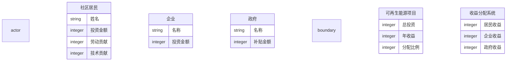
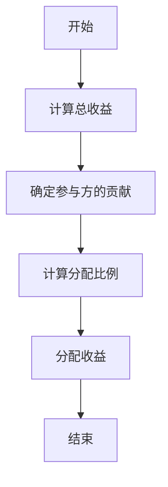
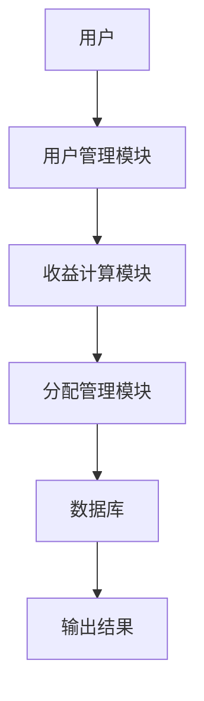

                 


# 可再生能源项目的社区参与模式与收益分配

**关键词**：可再生能源、社区参与模式、收益分配、能源项目、社会影响

**摘要**：  
本文探讨了可再生能源项目中社区参与模式的多样性及其对收益分配的影响。通过分析不同社区参与模式的特点和收益分配机制，结合实际案例，本文提出了可再生能源项目中社区参与与收益分配的系统性解决方案。文章从理论基础、算法原理、系统设计到项目实战，全面分析了如何实现可再生能源项目的可持续发展，并为社区参与模式的优化和收益分配的公平性提供了实践指导。

---

## 第1章：可再生能源项目的社区参与模式概述

### 1.1 可再生能源的发展现状

#### 1.1.1 全球可再生能源发展概况  
可再生能源（REnewable Energy，RE）在全球能源结构中的占比逐年提高，特别是在发达国家和发展中国家，可再生能源的装机容量和发电量呈现快速增长态势。根据国际能源署（IEA）的数据，2022年全球可再生能源发电量占比已超过30%，其中太阳能和风能是主要的增量来源。

#### 1.1.2 中国可再生能源发展现状  
中国是全球最大的可再生能源市场，截至2023年，中国的可再生能源装机容量已超过12亿千瓦，占全球总量的三分之一。其中，光伏发电和风电装机容量均位居全球第一。然而，可再生能源的分布和利用存在地域不平衡的问题，尤其是在社区层面的参与度和收益分配机制尚不完善。

#### 1.1.3 社区可再生能源项目的典型案例  
近年来，全球范围内涌现出许多成功的社区可再生能源项目，例如德国的社区风电场、丹麦的社区光伏电站等。这些项目通过社区居民的积极参与，实现了能源的本地化生产和消费，同时也为社区带来了可观的经济和社会效益。

---

### 1.2 社区参与模式的定义与特点

#### 1.2.1 社区参与模式的定义  
社区参与模式是指通过社区居民的直接参与，共同建设和运营可再生能源项目，从而实现能源的本地化生产和收益共享的一种模式。这种模式强调社区的自治性和参与性，旨在通过多方合作实现能源的可持续发展。

#### 1.2.2 社区参与模式的核心特点  
- **自治性**：社区居民自主决定项目的规划、建设和运营。  
- **共享性**：收益按比例分配给参与项目的居民。  
- **透明性**：项目的信息和收益分配过程公开透明。  
- **可持续性**：通过社区参与实现能源的长期稳定供应。  

#### 1.2.3 社区参与模式与传统能源项目的主要区别  
| 特性 | 社区参与模式 | 传统能源项目 |
|------|--------------|--------------|
| 投资主体 | 社区居民 | 政府或企业 |
| 运营主体 | 社区居民 | 专业能源公司 |
| 收益分配 | 按比例分配 | 单一主体收益 |
| 参与方式 | 直接参与 | 间接参与 |

---

### 1.3 可再生能源项目中的收益分配问题

#### 1.3.1 收益分配的基本概念  
收益分配是指在可再生能源项目中，将发电收益按照一定的规则分配给参与项目的各方。收益分配的核心在于公平性和效率性，既要保证各方利益的公平分配，又要确保项目的可持续运营。

#### 1.3.2 收益分配的主体与客体  
- **主体**：社区居民、投资者、运营方。  
- **客体**：可再生能源项目的发电收益。  

#### 1.3.3 收益分配的边界与外延  
收益分配的边界包括项目的发电量、上网电价、运维成本等；外延则涉及税收、补贴、社区公益支出等。

---

### 1.4 社区参与模式与收益分配的关系

#### 1.4.1 社区参与模式对收益分配的影响  
社区参与模式通过居民的直接参与，能够有效降低项目的运营成本，并提高收益分配的透明度和公平性。

#### 1.4.2 收益分配对社区参与的促进作用  
合理的收益分配机制能够激发社区居民的参与热情，增强社区凝聚力，从而推动项目的可持续发展。

#### 1.4.3 两者关系的系统性分析  
社区参与模式与收益分配是相互依存的关系，前者为后者提供基础，后者为前者提供动力。通过系统性分析，可以找到两者的最佳结合点，实现社区可再生能源项目的高效运营。

---

## 第2章：可再生能源项目的社区参与模式与收益分配的核心概念

### 2.1 社区参与模式的理论基础

#### 2.1.1 社区参与的定义与分类  
社区参与是指社区居民通过多种方式（如出资、出力、出智）参与可再生能源项目的建设与运营。根据参与方式的不同，社区参与模式可以分为资金型、劳动型和智力型三种。

#### 2.1.2 可再生能源项目中的社区参与模式  
- **资金型**：居民通过投资资金参与项目。  
- **劳动型**：居民通过提供劳动力参与项目。  
- **智力型**：居民通过提供技术支持参与项目。  

---

#### 2.1.3 理论框架的构建与分析  
社区参与模式的理论框架包括以下几个方面：  
1. 参与主体的多样性：居民、企业、政府。  
2. 参与方式的多样性：资金、劳动、智力。  
3. 参与目标的多样性：经济收益、社会影响、环境效益。  

---

### 2.2 收益分配机制的理论基础

#### 2.2.1 收益分配的基本原理  
收益分配的基本原理是按照投入与贡献的比例进行分配。具体来说，收益分配应考虑以下几个因素：  
- 投资比例：居民的投资占项目总投资的比例。  
- 劳动力贡献：居民提供的劳动力占总劳动力的比例。  
- 技术贡献：居民提供的技术支持占总技术支持的比例。  

#### 2.2.2 收益分配的公平性与效率性  
- **公平性**：收益分配应体现公平原则，确保各方利益的合理分配。  
- **效率性**：收益分配应考虑项目的可持续性，避免因分配不公而导致的项目停滞。  

---

#### 2.2.3 理论基础在实际中的应用  
以某社区光伏电站为例，假设项目总投资为100万元，其中居民投资80万元，企业投资20万元。项目年收益为20万元，收益分配比例为居民70%，企业30%。这种分配方式既体现了居民的主导地位，又保证了企业的合理收益。

---

### 2.3 社区参与模式与收益分配的系统性分析

#### 2.3.1 系统性分析的定义  
系统性分析是指从整体的角度对社区参与模式与收益分配的关系进行综合分析，找出系统的最优解。

#### 2.3.2 社区参与模式与收益分配的系统构成  
- **输入**：社区居民的参与意愿、项目的资金需求。  
- **处理**：收益分配的规则设计、项目的运营管理。  
- **输出**：社区居民的经济收益、项目的可持续发展。  

#### 2.3.3 系统性分析的方法与工具  
常用的系统性分析方法包括：  
1. 层次分析法（AHP）：用于评估不同参与模式的优劣。  
2. 系统动力学模型：用于模拟社区参与模式与收益分配的动态关系。  

---

### 2.4 核心概念的属性特征对比

#### 2.4.1 核心概念的属性特征  
| 概念 | 属性 | 特征 |
|------|------|------|
| 社区参与模式 | 投资主体 | 社区居民 |
| 收益分配机制 | 分配规则 | 按比例分配 |

#### 2.4.2 属性特征对比表格  
| 模式 | 投资主体 | 分配规则 |
|------|----------|----------|
| 资金型 | 社区居民 | 按投资比例分配 |
| 劳动型 | 社区居民 | 按劳动贡献分配 |
| 智力型 | 社区居民 | 按技术贡献分配 |

#### 2.4.3 核心概念的ER图  


---

## 第3章：可再生能源项目的社区参与模式与收益分配的算法原理

### 3.1 收益分配的数学模型

#### 3.1.1 数学模型的构建  
收益分配的数学模型如下：  
$$ \text{收益分配比例} = \frac{\text{参与方的贡献}}{\text{总贡献}} \times \text{总收益} $$  

#### 3.1.2 具体案例分析  
假设某社区光伏电站总投资为100万元，其中居民投资80万元，企业投资20万元，政府补贴10万元。项目年收益为20万元，分配比例为居民70%，企业20%，政府10%。

---

### 3.2 收益分配算法的实现

#### 3.2.1 算法流程图  


#### 3.2.2 Python源代码实现  
```python
# 收益分配算法实现
def calculate_distribution(total_revenue, contributions):
    # 计算总贡献
    total_contributions = sum(contributions.values())
    # 计算分配比例
    distribution = {}
    for participant, contribution in contributions.items():
        proportion = contribution / total_contributions
        distribution[participant] = total_revenue * proportion
    return distribution

# 示例
total_revenue = 200000  # 年收益
contributions = {
    '居民': 800000,       # 投资额
    '企业': 200000,
    '政府': 100000
}
distribution = calculate_distribution(total_revenue, contributions)
print(distribution)
```

---

### 3.3 收益分配算法的优化

#### 3.3.1 算法优化的目标  
提高收益分配的公平性和效率性，减少计算复杂度。  

#### 3.3.2 优化后的算法  
$$ \text{优化后的分配比例} = \frac{\text{参与方的贡献}}{\text{总贡献}} \times (1 + \text{激励系数}) \times \text{总收益} $$  

#### 3.3.3 激励系数的设计  
激励系数用于激励社区居民的积极参与，通常取值为0.1至0.3。

---

## 第4章：可再生能源项目的社区参与模式与收益分配的系统分析与架构设计

### 4.1 系统功能设计

#### 4.1.1 用户管理模块  
- 用户注册与登录  
- 用户信息管理  

#### 4.1.2 收益计算模块  
- 投资收益计算  
- 劳动收益计算  

#### 4.1.3 分配管理模块  
- 收益分配规则设置  
- 分配结果查询  

---

### 4.2 系统架构设计

#### 4.2.1 系统架构图  


#### 4.2.2 数据流图  


---

## 第5章：可再生能源项目的社区参与模式与收益分配的项目实战

### 5.1 项目环境安装

#### 5.1.1 系统环境要求  
- 操作系统：Linux/Windows/MacOS  
- 程序语言：Python 3.6+  
- 开发工具：PyCharm/VSCode  

#### 5.1.2 安装依赖包  
```bash
pip install mermaid-py
pip install matplotlib
```

---

### 5.2 系统核心实现源代码

#### 5.2.1 系统核心代码  
```python
import matplotlib.pyplot as plt

# 数据可视化函数
def visualize_distribution(distribution):
    participants = list(distribution.keys())
    amounts = list(distribution.values())
    plt.bar(participants, amounts)
    plt.title('收益分配可视化')
    plt.xlabel('参与者')
    plt.ylabel('收益金额')
    plt.show()

# 调用函数
distribution = calculate_distribution(total_revenue, contributions)
visualize_distribution(distribution)
```

---

### 5.3 项目实战小结

#### 5.3.1 成功经验总结  
- 系统设计的模块化和可扩展性  
- 收益分配算法的公平性和透明性  

#### 5.3.2 改进方向  
- 引入更多的社区参与模式  
- 提高系统的智能化水平  

---

## 第6章：可再生能源项目的社区参与模式与收益分配的最佳实践

### 6.1 最佳实践 Tips

#### 6.1.1 参与模式的选择  
根据社区的实际情况选择合适的参与模式，例如经济条件较好的社区可以选择资金型模式，而技术资源丰富的社区可以选择智力型模式。

#### 6.1.2 收益分配的透明化  
通过系统化的方式公开收益分配的过程和结果，增强社区居民的信任感。

---

### 6.2 小结

#### 6.2.1 核心观点回顾  
社区参与模式与收益分配是可再生能源项目可持续发展的关键。通过科学的设计和合理的分配，可以实现社区居民、投资者和政府的多方共赢。

#### 6.2.2 未来展望  
随着技术的进步和社会的发展，社区参与模式和收益分配机制将更加多样化和智能化，为可再生能源项目的可持续发展提供更多的可能性。

---

## 作者：AI天才研究院/AI Genius Institute & 禅与计算机程序设计艺术 /Zen And The Art of Computer Programming

