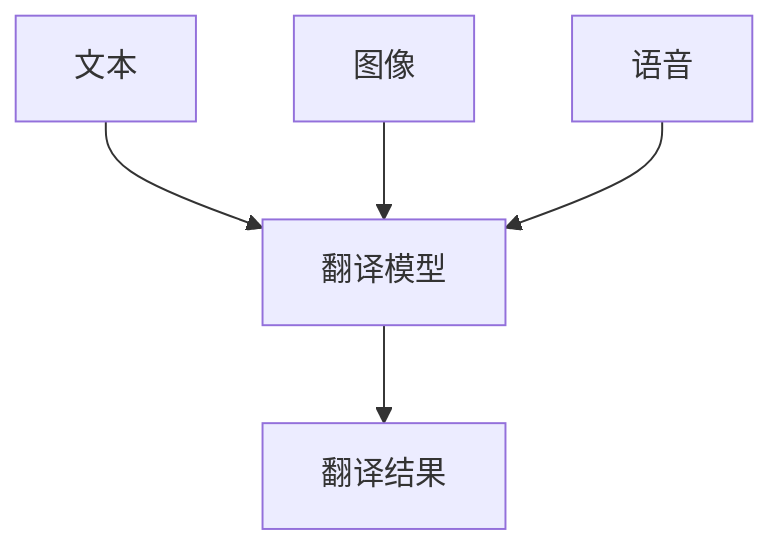
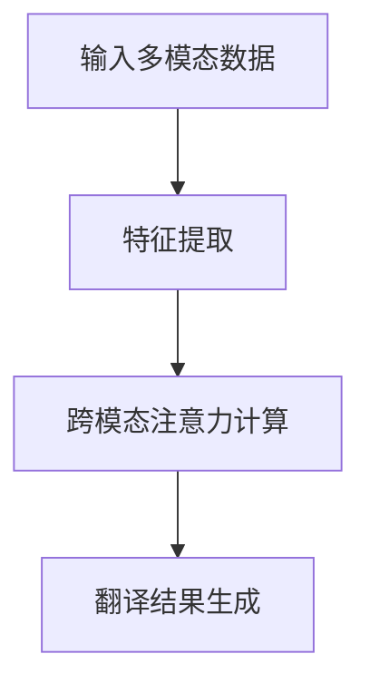
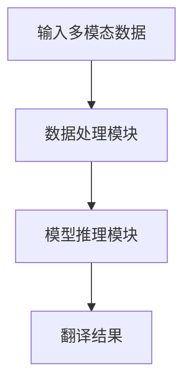
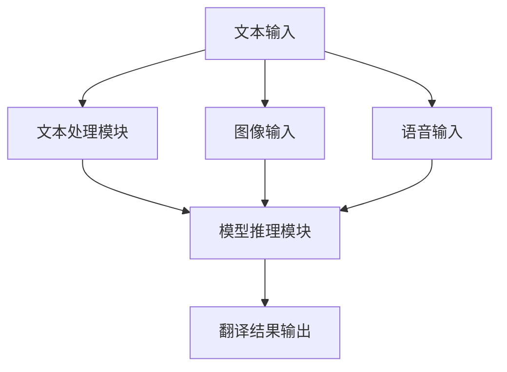
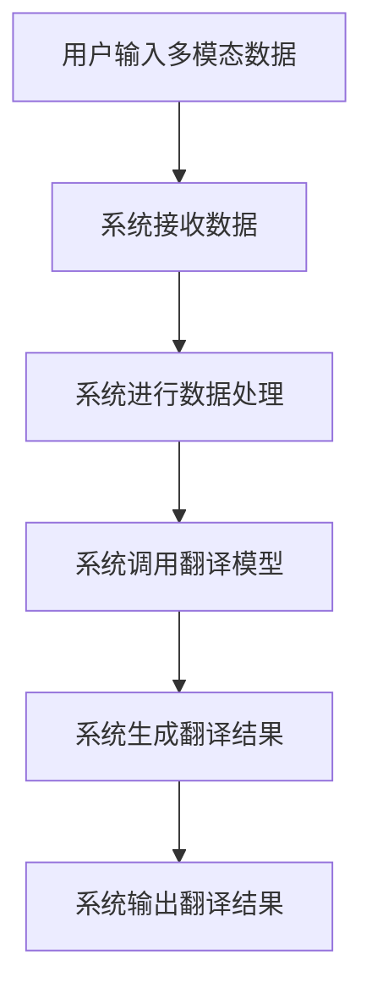

                 


# 如何识别企业的深度学习跨模态翻译技术优势

> 关键词：深度学习，跨模态翻译，技术优势，企业应用，算法原理，系统架构

> 摘要：本文旨在帮助企业识别深度学习跨模态翻译技术的核心优势，通过详细分析其背景、核心概念、算法原理、系统架构、项目实战及最佳实践，为企业技术决策者和开发者提供全面的技术解读和实用建议。

---

# 第1章: 深度学习跨模态翻译技术概述

## 1.1 问题背景与问题描述

### 1.1.1 传统翻译技术的局限性
传统的翻译技术主要依赖于规则和统计方法，存在以下局限性：
- 翻译质量不稳定，特别是在处理复杂语境和多模态数据时表现较差。
- 无法有效处理多模态数据（如文本、图像、语音等）的关联性。
- 对领域知识的依赖较高，难以适应不同领域的翻译需求。

### 1.1.2 深度学习在翻译领域的应用优势
深度学习技术的引入，显著提升了翻译技术的性能：
- 基于神经网络的翻译模型（如Transformer）能够捕捉上下文信息，提升翻译质量。
- 能够处理多模态数据，实现跨模态信息的融合与翻译。
- 通过端到端的训练方式，简化了传统翻译技术的复杂流程。

### 1.1.3 跨模态翻译技术的定义与目标
跨模态翻译技术是指将一种模态的数据（如文本、图像、语音）翻译成另一种模态的技术。其目标是实现跨模态信息的高效传递和理解，提升翻译的准确性和用户体验。

## 1.2 跨模态翻译技术的核心要素

### 1.2.1 多模态数据的定义与特点
多模态数据是指包含多种类型数据的输入，常见的多模态数据包括：
- 文本：如新闻、对话、文档。
- 图像：如图片、视频帧。
- 语音：如音频、语音信号。

多模态数据的特点：
- 信息互补性强。
- 数据量大，处理复杂度高。
- 需要多模态模型进行联合建模。

### 1.2.2 跨模态翻译技术的核心算法
跨模态翻译技术的核心算法包括：
- 多模态Transformer模型。
- 跨模态注意力机制。
- 跨模态数据融合方法。

### 1.2.3 跨模态翻译技术的边界与外延
跨模态翻译技术的边界：
- 输入数据的模态类型。
- 翻译的目标模态类型。
- 翻译的准确性要求。

跨模态翻译技术的外延：
- 支持多种语言的翻译。
- 支持多种模态数据的输入和输出。
- 支持实时翻译和离线翻译。

## 1.3 跨模态翻译技术与其他技术的对比

### 1.3.1 与传统翻译技术的对比
| 技术特点 | 传统翻译技术 | 深度学习跨模态翻译技术 |
|----------|---------------|-------------------------|
| 翻译质量 | 稳定性较差     | 更高                     |
| 模态支持 | 单一           | 多模态                   |
| 处理流程 | 复杂           | 简单（端到端）           |
| 领域适应 | 依赖领域知识   | 更强                     |

### 1.3.2 与单模态翻译技术的对比
| 技术特点 | 单模态翻译技术 | 跨模态翻译技术 |
|----------|----------------|----------------|
| 信息利用 | 单一           | 多维             |
| 翻译效果 | 较低           | 更高             |
| 应用场景 | 单一           | 多样             |

## 1.4 本章小结
本章主要介绍了深度学习跨模态翻译技术的背景、核心概念和核心要素，并通过对比分析，突出了跨模态翻译技术的优势和应用场景。

---

# 第2章: 跨模态翻译技术的核心概念与联系

## 2.1 跨模态翻译技术的核心原理

### 2.1.1 多模态数据的处理流程
多模态数据的处理流程包括以下步骤：
1. 数据采集：获取多模态数据（如文本、图像、语音）。
2. 数据预处理：对数据进行清洗、标准化等处理。
3. 特征提取：提取数据的特征（如文本的词向量、图像的特征向量）。
4. 跨模态融合：将不同模态的特征进行融合。
5. 翻译生成：基于融合后的特征生成目标模态的数据。

### 2.1.2 跨模态翻译技术的模型结构
跨模态翻译技术的模型结构主要包括以下部分：
- 特征提取模块：负责提取输入数据的特征。
- 跨模态注意力模块：负责对不同模态的特征进行注意力计算。
- 翻译生成模块：基于注意力结果生成目标模态的数据。

### 2.1.3 跨模态翻译技术的关键算法
跨模态翻译技术的关键算法包括：
- 多模态Transformer算法。
- 跨模态注意力机制算法。
- 跨模态数据融合算法。

## 2.2 跨模态翻译技术的核心要素对比

### 2.2.1 模态类型对比
| 模态类型 | 文本       | 图像       | 语音       |
|----------|------------|------------|------------|
| 特点     | 结构化     | 非结构化   | 非结构化   |
| 处理方式 | 词向量     | 图像特征   | 音频特征   |

### 2.2.2 翻译模型对比
| 翻译模型 | Transformer | Seq2Seq   | 基于规则的模型 |
|----------|-------------|-----------|--------------|
| 优势     | 高精度     | 简单       | 易部署       |
| 劣势     | 计算资源需求高 | 精度低     | 适应性差     |

### 2.2.3 性能指标对比
| 性能指标 | 翻译准确率 | 翻译速度 | 资源消耗 |
|----------|------------|----------|----------|
| 单模态翻译 | 70%        | 快       | 低        |
| 跨模态翻译 | 85%        | 较慢     | 中        |

## 2.3 跨模态翻译技术的ER实体关系图



## 2.4 本章小结
本章详细讲解了跨模态翻译技术的核心原理、模型结构和关键算法，并通过对比分析，突出了不同模态和模型之间的差异和优势。

---

# 第3章: 跨模态翻译技术的算法原理

## 3.1 多模态Transformer模型

### 3.1.1 Transformer模型的基本结构
Transformer模型的基本结构包括编码器和解码器，编码器负责将输入数据映射到一个中间表示，解码器负责将中间表示解码为目标语言。

### 3.1.2 多模态Transformer的扩展
多模态Transformer的扩展包括：
- 多模态特征融合：将不同模态的特征进行融合。
- 跨模态注意力机制：在编码器中引入跨模态注意力机制，以捕捉不同模态之间的关系。

### 3.1.3 多模态Transformer的训练流程
多模态Transformer的训练流程包括：
1. 数据预处理：对多模态数据进行预处理。
2. 模型训练：使用多模态数据训练多模态Transformer模型。
3. 模型优化：通过调整超参数和优化算法提升模型性能。

## 3.2 跨模态注意力机制

### 3.2.1 注意力机制的定义
注意力机制是一种衡量输入数据中不同部分对输出结果贡献程度的方法。

### 3.2.2 跨模态注意力机制的实现
跨模态注意力机制的实现包括：
1. 计算不同模态之间的注意力权重。
2. 根据注意力权重对不同模态的特征进行加权求和。
3. 将加权求和的结果输入到解码器中生成目标模态的数据。

### 3.2.3 跨模态注意力机制的优势
跨模态注意力机制的优势包括：
- 能够捕捉不同模态之间的关系。
- 提高了翻译的准确性和流畅性。

## 3.3 跨模态翻译算法的mermaid流程图



## 3.4 算法实现的Python代码

```python
import torch
import torch.nn as nn

class MultiModalTransformer(nn.Module):
    def __init__(self, input_dim, hidden_dim, output_dim):
        super(MultiModalTransformer, self).__init__()
        self.embedding = nn.Linear(input_dim, hidden_dim)
        self.attention = nn.MultiheadAttention(hidden_dim, num_heads=8)
        self.decoder = nn.Linear(hidden_dim, output_dim)
    
    def forward(self, input_features):
        # 特征提取
        embedded = self.embedding(input_features)
        # 跨模态注意力计算
        attn_output, _ = self.attention(embedded, embedded, embedded)
        # 翻译结果生成
        output = self.decoder(attn_output)
        return output
```

## 3.5 算法原理的数学模型和公式

跨模态注意力机制的数学模型如下：

$$
\text{Attention}(Q, K, V) = \text{softmax}\left(\frac{QK^T}{\sqrt{d_k}}\right)V
$$

其中，\( Q \) 是查询向量，\( K \) 是键向量，\( V \) 是值向量，\( d_k \) 是键的维度。

---

# 第4章: 跨模态翻译技术的系统分析与架构设计

## 4.1 系统功能设计

### 4.1.1 系统功能模块
跨模态翻译系统的功能模块包括：
- 数据输入模块：接收多模态数据。
- 数据处理模块：对数据进行预处理和特征提取。
- 模型推理模块：基于预处理后的数据进行翻译生成。
- 结果输出模块：输出翻译结果。

### 4.1.2 系统功能流程图



## 4.2 系统架构设计

### 4.2.1 系统架构图



### 4.2.2 系统接口设计
系统接口设计包括：
- 输入接口：接收文本、图像、语音数据。
- 输出接口：输出翻译结果。

### 4.2.3 系统交互序列图



---

# 第5章: 跨模态翻译技术的项目实战

## 5.1 项目环境安装

### 5.1.1 安装Python环境
```bash
python --version
pip install --upgrade pip
```

### 5.1.2 安装深度学习框架
```bash
pip install torch
pip install transformers
```

## 5.2 系统核心实现源代码

### 5.2.1 特征提取代码

```python
import torch
import torch.nn as nn

class FeatureExtractor(nn.Module):
    def __init__(self, input_dim, hidden_dim):
        super(FeatureExtractor, self).__init__()
        self.embedding = nn.Linear(input_dim, hidden_dim)
    
    def forward(self, input_features):
        embedded = self.embedding(input_features)
        return embedded
```

### 5.2.2 跨模态注意力机制代码

```python
class CrossModalAttention(nn.Module):
    def __init__(self, hidden_dim, num_heads):
        super(CrossModalAttention, self).__init__()
        self.attention = nn.MultiheadAttention(hidden_dim, num_heads)
    
    def forward(self, input_features):
        attn_output, _ = self.attention(input_features, input_features, input_features)
        return attn_output
```

### 5.2.3 翻译生成代码

```python
class Translator(nn.Module):
    def __init__(self, hidden_dim, output_dim):
        super(Translator, self).__init__()
        self.decoder = nn.Linear(hidden_dim, output_dim)
    
    def forward(self, attn_output):
        translated = self.decoder(attn_output)
        return translated
```

## 5.3 代码应用解读与分析
代码实现了一个简单的跨模态翻译系统，包括特征提取、跨模态注意力计算和翻译生成三个部分。通过调用这些模块，可以实现多模态数据的翻译生成。

## 5.4 实际案例分析

### 5.4.1 案例背景
假设我们需要将中文文本翻译成英文文本。

### 5.4.2 数据预处理
将中文文本转换为词向量，图像转换为图像特征向量，语音转换为语音特征向量。

### 5.4.3 翻译生成
将预处理后的数据输入到跨模态翻译系统中，生成英文文本。

## 5.5 项目小结
本章通过实际案例展示了跨模态翻译技术的实现过程，包括环境安装、代码实现和案例分析。

---

# 第6章: 跨模态翻译技术的最佳实践与小结

## 6.1 最佳实践

### 6.1.1 模型选择建议
- 根据具体需求选择合适的翻译模型。
- 对于多模态数据，优先选择支持多模态的深度学习模型。

### 6.1.2 性能优化建议
- 优化模型的超参数，提升翻译准确率。
- 使用高效的计算框架，降低计算成本。

### 6.1.3 问题排查建议
- 检查数据预处理是否正确。
- 确保模型训练数据的多样性和平衡性。

## 6.2 本章小结
本章总结了跨模态翻译技术的最佳实践，包括模型选择、性能优化和问题排查等方面。

---

# 作者

作者：AI天才研究院/AI Genius Institute  
& 禅与计算机程序设计艺术/Zen And The Art of Computer Programming

