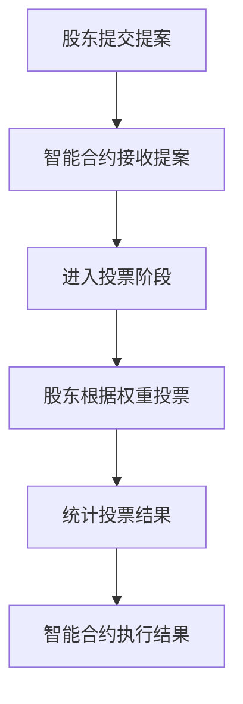
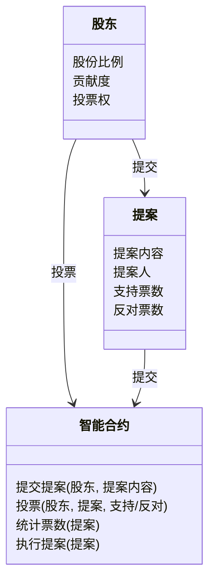
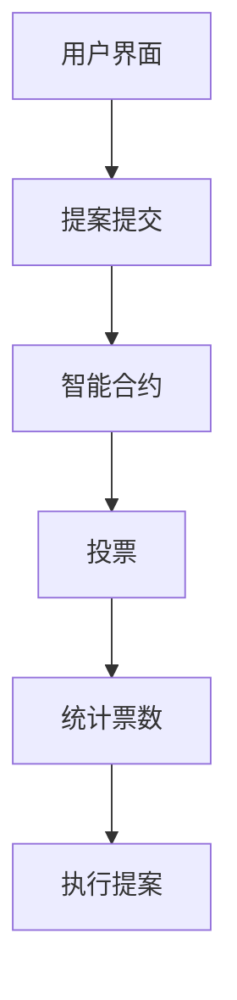
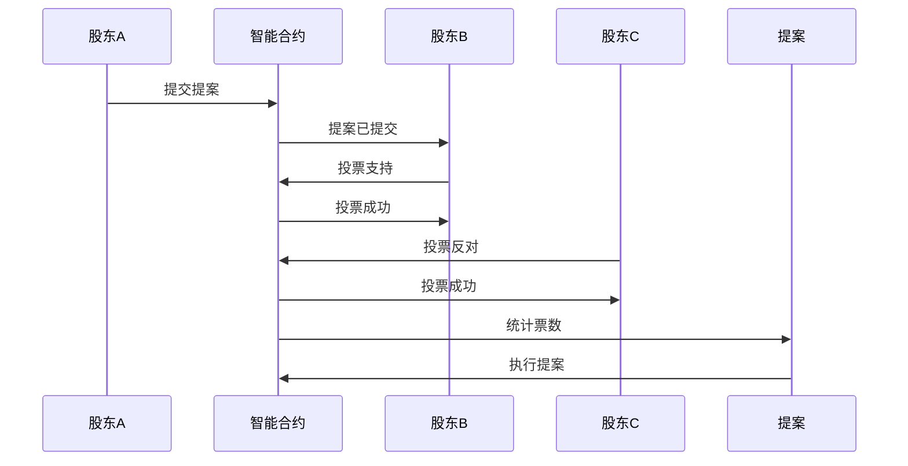

                 


# 巴菲特的股东沟通艺术：去中心化自治组织的治理模式

## 关键词：
- 巴菲特，股东沟通，治理模式，去中心化自治组织，DAO，区块链治理，分布式治理

## 摘要：
本文探讨了巴菲特的股东沟通艺术与去中心化自治组织（DAO）治理模式的结合。通过分析 DAO 的起源、核心概念以及与巴菲特投资哲学的联系，文章提出了将巴菲特的股东价值理念融入 DAO 治理的创新方法。文章详细阐述了 DAO 的治理机制、投票系统、激励措施等核心概念，并通过对比分析和案例研究，展示了如何利用这些概念优化 DAO 的治理结构。此外，文章还提供了 DAO 治理的系统架构设计和项目实战指导，帮助读者理解如何在实际中应用这些理论。

---

## 第一部分：引言

### 第1章：引言

#### 1.1 本书的背景与意义

##### 1.1.1 为什么研究巴菲特的股东沟通艺术
巴菲特的股东沟通艺术是其投资成功的重要因素之一。他通过透明和真诚的沟通，建立了投资者的信任，从而实现了长期的价值增长。这种沟通艺术不仅适用于传统企业治理，也对现代 DAO 的治理模式具有启示意义。

##### 1.1.2 去中心化自治组织（DAO）的兴起
DAO 是一种基于区块链技术的新型组织形式，其特点是去中心化、透明和集体决策。DAO 的兴起标志着治理模式从传统的中心化向去中心化的转变。

##### 1.1.3 两者的结合与创新
将巴菲特的股东沟通艺术与 DAO 的治理模式结合，可以弥补 DAO 在透明性和信任建设方面的不足，同时为 DAO 的治理提供新的思路。

#### 1.2 本书的结构与目标

##### 1.2.1 目标读者
本文适合对区块链技术、DAO 治理以及巴菲特投资哲学感兴趣的读者阅读。

##### 1.2.2 本书的章节安排
本文分为五个主要部分：背景介绍、核心概念与联系、算法原理、系统分析与架构设计、项目实战。

##### 1.2.3 学习本书的收获
读者将从本文中了解到如何将巴菲特的股东沟通艺术与 DAO 的治理模式结合，掌握 DAO 治理的核心概念和实现方法。

---

## 第二部分：背景介绍

### 第2章：去中心化自治组织（DAO）概述

#### 2.1 DAO 的起源与发展

##### 2.1.1 分布式自治组织的定义
DAO 是一种基于区块链技术的组织形式，其特点是去中心化、透明和集体决策。

##### 2.1.2 DAO 的历史发展
DAO 的概念起源于比特币的白皮书，后来通过以太坊等智能合约技术得到了进一步发展。

##### 2.1.3 DAO 的核心特征
- 去中心化：决策权分散在所有参与者手中。
- 透明性：所有决策和资金流向公开透明。
- 集体决策：通过投票机制进行决策。

#### 2.2 巴菲特的股东沟通艺术

##### 2.2.1 巴菲特的股东价值理念
巴菲特强调长期价值创造，通过透明的沟通与股东建立信任关系。

##### 2.2.2 巴菲特的沟通风格与技巧
巴菲特以简洁、清晰、真诚的沟通风格著称，他通过年会、股东信等方式与股东保持密切联系。

##### 2.2.3 巴菲特与现代治理模式的联系
巴菲特的股东价值理念为现代企业的治理提供了重要的参考，尤其是在 DAO 的治理中，其透明性和信任建设具有重要意义。

#### 2.3 DAO 与巴菲特治理理念的结合

##### 2.3.1 DAO 的去中心化治理与巴菲特的集中化治理
DAO 的去中心化治理与巴菲特的集中化治理在决策权的分配上有显著差异。

##### 2.3.2 两者的互补性与冲突点
虽然两者在决策权分配上有差异，但可以通过结合两者的优点，优化治理结构。

##### 2.3.3 结合的创新意义
将巴菲特的股东沟通艺术融入 DAO 的治理模式，可以提升 DAO 的透明性和信任度，从而增强其长期价值。

---

## 第三部分：核心概念与联系

### 第3章：核心概念与联系

#### 3.1 核心概念的定义与属性

##### 3.1.1 DAO 的治理机制
DAO 的治理机制包括投票系统、激励措施、决策流程等。

##### 3.1.2 巴菲特的股东价值模型
巴菲特的股东价值模型强调长期价值创造和股东信任。

##### 3.1.3 两者的对比分析
通过对比分析，可以发现两者的治理理念在透明性、信任建设和决策权分配上的异同。

#### 3.2 核心概念的联系与对比

##### 3.2.1 核心概念的对比分析
| 概念 | DAO 治理模式 | 巴菲特股东价值模型 |
|------|---------------|-------------------|
| 决策权 | 去中心化      | 集中化           |
| 透明性 | 高            | 高               |
| 决策方式 | 智能合约投票 | 股东大会投票     |

##### 3.2.2 ER 实体关系图
```mermaid
er
  actor 股东;
  actor 董事会;
  actor 智能合约;
  股东 --> 智能合约: 投票;
  董事会 --> 智能合约: 提案;
  智能合约 --> 股东: 执行结果;
```

---

## 第四部分：算法原理

### 第4章：算法原理

#### 4.1 算法原理的定义与属性

##### 4.1.1 投票机制
DAO 的投票机制通常采用加权投票制，权重与股东的贡献或持有股份相关。

##### 4.1.2 投票流程
投票流程包括提案提交、投票阶段和结果执行。

##### 4.1.3 算法的数学模型
加权投票模型：
$$ \text{权重} = \text{股份比例} \times \text{贡献度} $$

##### 4.1.4 算法的实现步骤
1. 提案提交：董事会或提案人提交治理提案。
2. 投票阶段：股东根据权重进行投票。
3. 结果执行：智能合约根据投票结果执行提案。

#### 4.2 算法原理的实现

##### 4.2.1 投票机制的 mermaid 流程图


##### 4.2.2 投票机制的 Python 代码实现
```python
class DAO:
    def __init__(self):
        self.shares = {}  # 股东股份分布
        self.votes = {}   # 投票结果

    def submit_proposal(self, proposer, proposal):
        # 提案提交
        self.proposals.append(proposal)
        return f"Proposal {proposal} submitted by {proposer}"

    def vote(self, shareholder, proposal, support):
        # 投票
        if self.shares.get(shareholder, 0) == 0:
            return "You have no voting权."
        self.votes[(shareholder, proposal)] = support
        return f"{shareholder} voted {support} for {proposal}."

    def tally_votes(self):
        # 统计投票
        for proposal in self.proposals:
            total_support = sum(v for shareholder, v in self.votes.items() if proposal in shareholder.votes)
            if total_support > len(self.shares) / 2:
                self.execute(proposal)
            else:
                return "Proposal not approved."

    def execute(self, proposal):
        # 执行提案
        print(f"Proposal {proposal} executed successfully.")

# 示例用法
dao = DAO()
dao.submit_proposal("股东A", "提案1")
dao.vote("股东A", "提案1", True)
dao.tally_votes()
```

##### 4.2.3 算法的数学模型与解释
加权投票模型：
$$ \text{权重} = \text{股份比例} \times \text{贡献度} $$
其中，股份比例为股东持有的股份占总股份的比例，贡献度为股东对 DAO 的贡献程度（如参与度、活跃度等）。

---

## 第五部分：系统分析与架构设计

### 第5章：系统分析与架构设计

#### 5.1 问题场景介绍
DAO 的治理系统需要支持提案提交、投票、结果执行等功能，同时需要保证系统的透明性和安全性。

#### 5.2 项目介绍

##### 5.2.1 项目目标
设计一个基于区块链的 DAO 治理系统，实现提案提交、投票、结果执行的自动化流程。

#### 5.3 系统功能设计

##### 5.3.1 领域模型 mermaid 类图


#### 5.4 系统架构设计

##### 5.4.1 系统架构 mermaid 图


#### 5.5 系统接口设计

##### 5.5.1 API 接口
- 提交提案 API：`submit_proposal(proposer, proposal)`
- 投票 API：`vote(shareholder, proposal, support)`
- 统计票数 API：`tally_votes()`
- 执行提案 API：`execute(proposal)`

#### 5.6 系统交互 mermaid 序列图


---

## 第六部分：项目实战

### 第6章：项目实战

#### 6.1 环境安装

##### 6.1.1 安装 Python 和区块链开发环境
安装 Python 3.8 或更高版本，安装区块链开发框架（如以太坊的 Web3.py）。

#### 6.2 核心代码实现

##### 6.2.1 提案提交与投票的实现
```python
from web3 import Web3, EthereumTester

# 初始化区块链环境
w3 = Web3(EthereumTester())
accounts = w3.eth.accounts

# 提案提交
def submit_proposal(proposer, proposal):
    # 提案提交逻辑
    pass

# 投票实现
def vote(shareholder, proposal, support):
    # 投票逻辑
    pass

# 统计票数与执行提案
def tally_votes(proposal):
    # 统计票数逻辑
    pass

# 示例用法
submit_proposal(accounts[0], "提案1")
vote(accounts[0], "提案1", True)
tally_votes("提案1")
```

#### 6.3 代码应用解读与分析

##### 6.3.1 提案提交与投票的代码解读
通过智能合约实现提案的提交和投票过程，确保过程的透明性和不可篡改性。

##### 6.3.2 统计票数与执行提案的代码解读
通过区块链的智能合约实现票数统计和提案执行，确保结果的公正性。

#### 6.4 实际案例分析

##### 6.4.1 案例分析
通过具体案例分析 DAO 治理系统的实现过程，验证系统的可行性和有效性。

##### 6.4.2 案例总结
总结案例中的经验教训，提出改进建议。

#### 6.5 项目小结

##### 6.5.1 项目实现的关键点
- 智能合约的实现
- 投票机制的实现
- 票数统计与提案执行的自动化

##### 6.5.2 项目实现的难点
- 确保系统的透明性和安全性
- 处理复杂的投票逻辑和异常情况

##### 6.5.3 项目的未来改进方向
- 引入更复杂的投票机制
- 提高系统的可扩展性和性能

---

## 第七部分：最佳实践

### 第7章：最佳实践

#### 7.1 最佳实践 tips

##### 7.1.1 治理模式的设计建议
- 确保治理模式的透明性和公正性
- 合理分配决策权和执行权
- 定期审查和优化治理机制

##### 7.1.2 提案提交与投票的优化建议
- 简化提案提交流程
- 提高投票的透明度和参与度
- 引入激励机制提高股东的参与积极性

#### 7.2 小结

##### 7.2.1 本文总结
本文通过分析 DAO 的治理模式和巴菲特的股东沟通艺术，提出了将两者结合的创新方法，并通过系统设计和项目实战验证了其可行性。

##### 7.2.2 未来展望
未来可以进一步研究 DAO 治理的其他方面，如激励机制、决策效率等，为 DAO 的发展提供更多的理论支持和实践指导。

#### 7.3 注意事项

##### 7.3.1 实践中的注意事项
- 确保系统的安全性和稳定性
- 合规性：遵守相关法律法规
- 可扩展性：确保系统能够适应未来的发展需求

##### 7.3.2 实践中的常见问题
- 如何处理复杂的投票逻辑
- 如何确保系统的透明性和公正性
- 如何提高股东的参与度

#### 7.4 拓展阅读

##### 7.4.1 推荐的书籍和资源
- 《区块链：从比特币到以太坊》
- 《 DAO 治理模式研究》
- 巴菲特股东大会的视频和演讲

---

## 第八部分：结论

### 第8章：结论

#### 8.1 本文的核心观点总结
通过将巴菲特的股东沟通艺术与 DAO 的治理模式结合，可以优化 DAO 的治理结构，提升其透明性和信任度。

#### 8.2 本文的创新点
- 提出了将巴菲特的股东沟通艺术融入 DAO 治理的创新方法
- 设计了 DAO 治理的系统架构和实现方案

#### 8.3 未来研究方向
- 研究 DAO 治理的其他方面，如激励机制、决策效率等
- 探讨 DAO 治理模式在不同领域的应用

---

## 作者：AI天才研究院/AI Genius Institute & 禅与计算机程序设计艺术/Zen And The Art of Computer Programming

