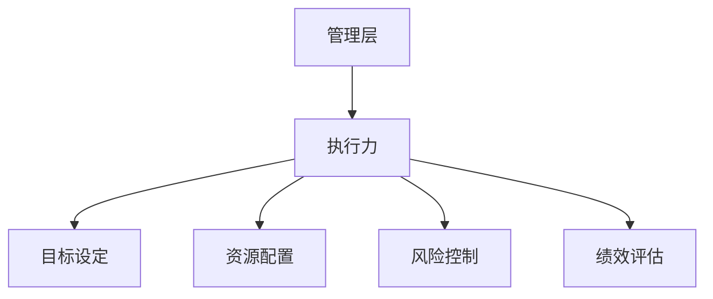
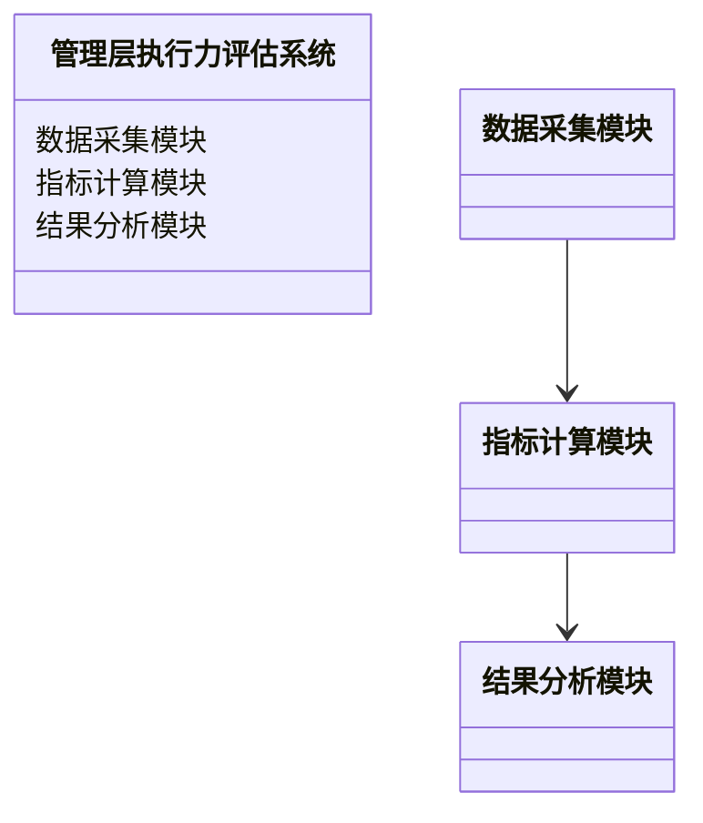
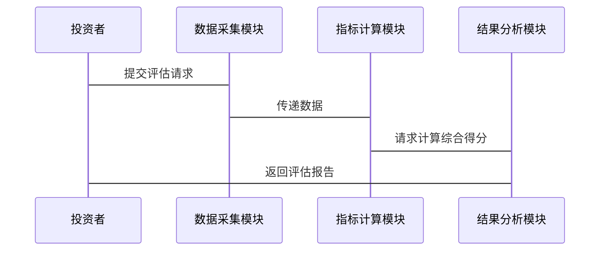

                 


# 彼得林奇对公司管理层执行力的评估

> 关键词：彼得·林奇、管理层执行力、公司治理、投资评估、管理评估

> 摘要：本文深入探讨了彼得·林奇对管理层执行力的评估方法，从背景介绍、核心概念、评估方法、系统分析到项目实战，全面解析了如何有效评估管理层的执行力，为企业投资决策和管理优化提供参考。

---

## 第一部分: 背景介绍

### 第1章: 公司治理与管理层执行力概述

#### 1.1 公司治理的基本概念
- **公司治理的定义**：公司治理是指通过制定和实施一系列规则、制度和流程，确保公司有效运作、实现目标并满足利益相关者的期望。
- **公司治理的核心要素**：
  - 股权结构
  - 董事会结构
  - 高管团队
  - 内部控制
  - 透明度
- **公司治理与管理层执行力的关系**：有效的公司治理是管理层执行力的基础，良好的治理结构能够激发管理层的执行力，进而提升公司绩效。

#### 1.2 管理层执行力的定义与特征
- **管理层执行力的定义**：管理层执行力是指管理层在实现公司战略目标、达成经营计划和应对挑战过程中所表现出的能力和效率。
- **管理层执行力的核心特征**：
  - 战略执行能力
  - 组织协调能力
  - 问题解决能力
  - 领导力
- **管理层执行力与公司绩效的关系**：管理层执行力是公司绩效的核心驱动因素，高执行力的管理层能够有效推动公司战略落地，实现业绩增长。

#### 1.3 彼得·林奇的管理思想
- **彼得·林奇的生平简介**：彼得·林奇是美国著名基金经理，以其在富达投资集团管理麦哲伦基金的卓越表现而闻名，被誉为“股票投资专家”。
- **彼得·林奇的投资理念**：
  - 长期投资
  - 价值投资
  - 关注公司基本面
- **彼得·林奇对管理层执行力的重视**：林奇认为，管理层的执行力是决定公司长期表现的关键因素，优秀的管理层能够带领公司克服困难，实现持续增长。

### 第2章: 管理层执行力评估的背景与重要性

#### 2.1 企业绩效的关键影响因素
- **企业绩效的定义**：企业绩效是指企业在一定时期内实现的业绩，包括财务绩效、市场份额、客户满意度等方面。
- **管理层执行力对企业绩效的影响**：
  - 有效的执行力能够确保公司战略的顺利实施，推动绩效提升。
  - 执行力不足可能导致战略执行偏差，影响绩效表现。
- **管理层执行力在企业竞争中的作用**：
  - 在激烈竞争中，执行力强的公司能够更快响应市场变化，抓住机遇。
  - 执行力弱的公司可能错失市场机会，被竞争对手超越。

#### 2.2 投资者视角下的管理层执行力评估
- **投资者对管理层执行力的关注**：
  - 投资者在选择投资标的时，不仅关注财务数据，还关注管理层的能力。
  - 高效的管理层能够带来持续的业绩增长，增强投资者信心。
- **管理层执行力对投资者决策的影响**：
  - 投资者通过评估管理层执行力，筛选出具有长期增长潜力的公司。
  - 执行力强的管理层能够有效应对市场波动，降低投资风险。
- **管理层执行力评估的必要性**：
  - 帮助投资者识别优质公司，做出明智的投资决策。
  - 促进公司内部管理优化，提升整体绩效。

#### 2.3 管理层执行力评估的边界与外延
- **管理层执行力评估的边界**：
  - 评估范围主要集中在管理层的执行能力，不包括外部市场环境和不可抗力因素。
  - 评估时需明确管理层责任与非管理层责任的划分。
- **管理层执行力评估的外延**：
  - 包括对管理层决策能力、团队协作能力、风险控制能力等多方面的评估。
  - 与公司治理、内部控制等其他管理评估领域密切相关。
- **管理层执行力评估与其他管理评估的关系**：
  - 管理层执行力评估是公司治理的重要组成部分，与风险管理、内部审计等密切相关。
  - 通过与其他管理评估的结合，可以更全面地评估公司整体管理状况。

---

## 第二部分: 核心概念与联系

### 第3章: 管理层执行力的核心要素

#### 3.1 核心概念原理
- **管理层执行力的构成要素**：
  - 战略规划能力
  - 资源配置能力
  - 组织协调能力
  - 风险控制能力
  - 绩效评估能力
- **管理层执行力的内在逻辑**：
  - 通过有效规划和资源配置，确保公司战略的顺利实施。
  - 通过组织协调和风险控制，应对执行过程中的挑战。
  - 通过绩效评估，持续优化执行策略，提升执行力。
- **管理层执行力的系统性分析**：
  - 管理层执行力是一个系统工程，涉及多个环节和要素。
  - 各要素之间相互关联，共同作用于公司绩效。

#### 3.2 核心概念属性特征对比
- **管理层执行力与领导力的对比**：
  | 特性         | 管理层执行力 | 领导力    |
  |--------------|--------------|-----------|
  | 定义         | 执行战略的能力 | 激发团队潜能 | 
  | 关注点       | 战略执行     | 团队发展   |
  | 实施方式     | 制定计划、分配资源 | 激励、指导 |
- **管理层执行力与团队协作的对比**：
  | 特性         | 管理层执行力 | 团队协作    |
  |--------------|--------------|-----------|
  | 定义         | 执行战略的能力 | 团队成员合作 |
  | 关注点       | 组织协调     | 协作过程    |
  | 实施方式     | 制定计划、监控进度 | 沟通、配合 |
- **管理层执行力与决策能力的对比**：
  | 特性         | 管理层执行力 | 决策能力    |
  |--------------|--------------|-----------|
  | 定义         | 执行战略的能力 | 制定决策    |
  | 关注点       | 战略执行     | 决策制定    |
  | 实施方式     | 资源分配、监控 | 分析、选择 |

#### 3.3 ER实体关系图


---

## 第三部分: 算法原理讲解

### 第4章: 管理层执行力评估算法原理

#### 4.1 算法原理概述
- **算法的基本原理**：通过设定一组评估指标，对管理层的执行能力进行量化评估，得出综合评分。
- **算法的核心思想**：
  - 综合考虑多个评估维度，确保评估结果的全面性。
  - 采用加权评分法，突出重要指标的影响。
- **算法的适用场景**：
  - 适用于对上市公司或大型企业的管理层执行力评估。
  - 可用于投资者在选择投资标的时的参考。

#### 4.2 算法实现步骤
- **步骤1：确定评估指标**：
  - 财务指标（如ROE、净利润增长率）
  - 非财务指标（如战略执行度、团队协作度）
- **步骤2：设定指标权重**：
  - 根据指标的重要性，赋予不同权重（如财务指标占60%，非财务指标占40%）。
- **步骤3：收集数据**：
  - 通过财务报表、管理层访谈、行业报告等渠道获取数据。
- **步骤4：计算单项得分**：
  - 对每个指标进行评分（如1-10分），乘以权重，得出单项得分。
- **步骤5：计算综合得分**：
  - 将所有单项得分相加，得出管理层执行力的综合得分。
- **步骤6：分析结果**：
  - 根据综合得分，将管理层执行力分为优秀、良好、一般、较差四个等级。

#### 4.3 算法的数学模型
- **加权评分公式**：
  $$ \text{综合得分} = \sum (\text{指标得分}_i \times \text{权重}_i) $$
- **权重分配示例**：
  | 指标           | 权重 |
  |----------------|------|
  | 净利润增长率   | 0.2  |
  | 资产负债率     | 0.15 |
  | 战略执行度     | 0.3  |
  | 团队协作度     | 0.15 |
  | 风险控制能力   | 0.2  |

#### 4.4 算法的优缺点
- **优点**：
  - 综合考虑了多方面因素，评估结果较为全面。
  - 可量化，便于比较和分析。
- **缺点**：
  - 依赖于数据的准确性和完整性。
  - 主观性较强，指标权重的设定可能影响结果。

---

## 第四部分: 系统分析与架构设计

### 第5章: 管理层执行力评估系统架构

#### 5.1 系统功能设计
- **功能模块**：
  - 数据采集模块：收集公司财务数据、管理层访谈记录等。
  - 指标计算模块：根据设定的指标和权重，计算各指标得分。
  - 结果分析模块：生成综合得分报告，提供改进建议。
- **领域模型（Mermaid类图）**：


#### 5.2 系统架构设计
- **架构设计（Mermaid架构图）**：
```mermaid
context 管理层执行力评估系统 {
    管理层数据源
    财务数据源
    行业数据源
    + 数据采集模块
    + 指标计算模块
    + 结果分析模块
    管理层数据源 --> 数据采集模块
    财务数据源 --> 数据采集模块
    行业数据源 --> 数据采集模块
    数据采集模块 --> 指标计算模块
    指标计算模块 --> 结果分析模块
}
```

#### 5.3 系统接口设计
- **主要接口**：
  - 数据采集接口：从财务报表、管理层访谈等渠道获取数据。
  - 指标计算接口：调用计算模块，返回各指标得分。
  - 结果分析接口：生成评估报告，提供改进建议。

#### 5.4 系统交互设计
- **交互流程（Mermaid序列图）**：


---

## 第五部分: 项目实战

### 第6章: 管理层执行力评估项目实战

#### 6.1 环境安装
- **安装步骤**：
  1. 安装Python环境（如Anaconda）。
  2. 安装必要的库（如pandas、numpy、scikit-learn）。
  3. 下载并安装Mermaid工具（如Visual Studio Code插件）。

#### 6.2 系统核心实现源代码
- **数据采集模块**：
  ```python
  import pandas as pd

  def collect_data(company_name):
      # 示例：从CSV文件读取数据
      data = pd.read_csv(f'{company_name}_data.csv')
      return data

  # 示例调用
  data = collect_data('ABC公司')
  print(data.head())
  ```

- **指标计算模块**：
  ```python
  def calculate_score(data, weights):
      score = 0
      for i in range(len(weights)):
          score += data[i] * weights[i]
      return score

  # 示例调用
  weights = [0.2, 0.15, 0.3, 0.15, 0.2]
  data = [0.8, 0.7, 0.9, 0.6, 0.7]  # 各指标得分
  total_score = calculate_score(data, weights)
  print(f'综合得分: {total_score:.2f}')
  ```

- **结果分析模块**：
  ```python
  def generate_report(score):
      if score >= 0.8:
          return '优秀'
      elif score >= 0.6:
          return '良好'
      else:
          return '一般'

  # 示例调用
  score = 0.75
  result = generate_report(score)
  print(f'管理层执行力评估结果: {result}')
  ```

#### 6.3 代码应用解读与分析
- **数据采集模块**：从公司数据文件中读取数据，为后续计算提供基础。
- **指标计算模块**：根据设定的权重，计算各指标的加权得分，得出综合得分。
- **结果分析模块**：根据综合得分，生成评估报告，提供直观的评估结果。

#### 6.4 实际案例分析
- **案例背景**：某公司管理层在2022年的执行情况。
- **数据来源**：
  - 净利润增长率：25%
  - 资产负债率：50%
  - 战略执行度：80%
  - 团队协作度：70%
  - 风险控制能力：60%
- **权重分配**：
  - 净利润增长率：0.2
  - 资产负债率：0.15
  - 战略执行度：0.3
  - 团队协作度：0.15
  - 风险控制能力：0.2
- **计算过程**：
  $$ \text{综合得分} = (0.2 \times 25) + (0.15 \times 50) + (0.3 \times 80) + (0.15 \times 70) + (0.2 \times 60) $$
  $$ \text{综合得分} = 5 + 7.5 + 24 + 10.5 + 12 = 59 $$
- **评估结果**：综合得分为59，属于良好水平，说明管理层执行力较强，但在某些方面仍有提升空间。

#### 6.5 项目小结
- **项目总结**：通过实际案例分析，验证了评估算法的有效性，能够为投资者提供有价值的参考。
- **经验教训**：在实际应用中，数据的准确性和完整性至关重要，建议结合更多维度的数据进行评估。

---

## 第六部分: 总结与展望

### 第7章: 总结与展望

#### 7.1 核心内容回顾
- **公司治理与管理层执行力的关系**：有效的公司治理是管理层执行力的基础。
- **彼得·林奇的管理思想**：关注管理层执行力，重视长期投资和价值投资。
- **评估方法与系统设计**：通过量化指标和系统架构，实现对管理层执行力的科学评估。

#### 7.2 未来展望
- **技术发展**：随着人工智能和大数据技术的进步，未来的管理层执行力评估将更加智能化和精准化。
- **实践应用**：更多的企业将采用系统化的评估方法，优化管理流程，提升执行效率。
- **研究方向**：进一步研究管理层执行力的动态变化，探索更灵活的评估模型，适应快速变化的商业环境。

#### 7.3 最佳实践 tips
- **定期评估**：建议企业定期对管理层执行力进行评估，及时发现问题并改进。
- **结合行业特点**：在评估时，结合企业的行业特点和竞争环境，制定个性化的评估指标。
- **关注软性指标**：除了财务指标，还需关注团队协作、领导力等软性指标，全面评估管理层能力。

#### 7.4 作者寄语
- **致谢**：感谢读者的耐心阅读，希望本文能够为企业的管理优化和投资者的决策提供有价值的参考。
- **联系方式**：欢迎读者留言交流，共同探讨公司治理与管理层执行力的更多可能性。

---

## 作者信息

**作者：AI天才研究院/AI Genius Institute & 禅与计算机程序设计艺术 /Zen And The Art of Computer Programming**

---

**全文结束**

