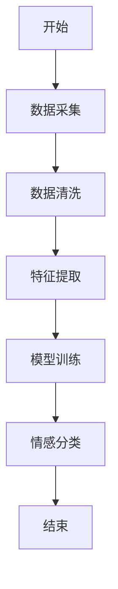
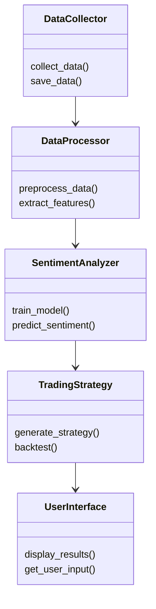
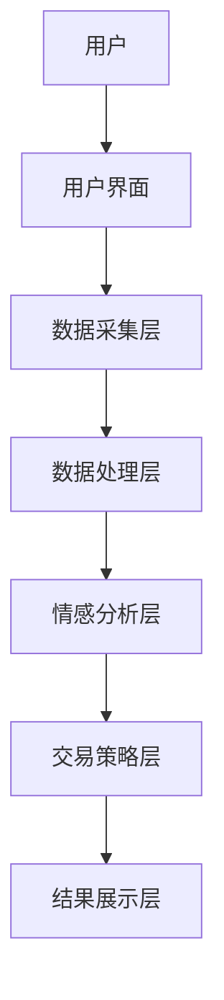
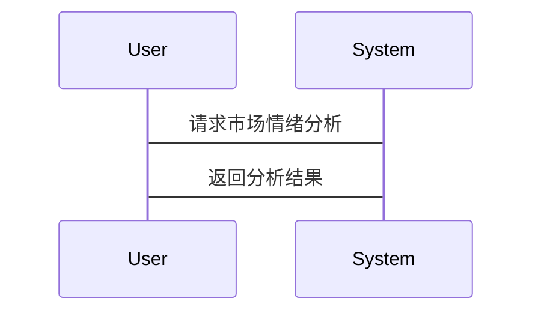

                 


# 智能加密货币市场情绪分析系统

> 关键词：智能加密货币，市场情绪分析，自然语言处理，机器学习，区块链技术，交易策略

> 摘要：本文介绍了一种基于自然语言处理和机器学习的智能加密货币市场情绪分析系统，该系统能够实时采集和分析市场情绪数据，预测市场走势，并为交易者提供策略建议。文章详细探讨了系统的背景、核心概念、算法原理、系统架构以及项目实现，最后给出了实际案例和最佳实践建议。

---

## 第一部分: 智能加密货币市场情绪分析系统背景介绍

### 第1章: 加密货币市场的现状与挑战

#### 1.1 加密货币市场的概述

##### 1.1.1 加密货币的基本概念
加密货币是一种基于区块链技术的数字资产，具有去中心化、匿名性和不可篡改的特性。比特币是第一个成功的加密货币，随后出现了以太坊、 Ripple 等多种类型的加密货币。加密货币市场的波动性极高，价格受多种因素影响，包括市场情绪、政策法规、技术发展等。

##### 1.1.2 加密货币市场的特点与发展趋势
- **去中心化**：加密货币不依赖任何中央机构，交易通过区块链网络进行。
- **匿名性**：交易者身份通常隐藏在地址后面，增加了市场的复杂性。
- **高波动性**：加密货币价格波动剧烈，短期内可能上涨或下跌数倍。
- **全球性**：市场24小时全天候运行，参与者遍布全球。

随着区块链技术的不断进步，加密货币的应用场景也在不断扩大，从支付、投资到去中心化金融（DeFi），加密货币正在逐步改变传统金融体系。

##### 1.1.3 市场情绪分析的重要性
市场情绪是影响加密货币价格的重要因素之一。投资者的情绪波动会直接影响市场供需关系，从而导致价格波动。例如，当市场情绪乐观时，投资者倾向于买入，价格可能上涨；反之，当市场情绪悲观时，投资者倾向于卖出，价格可能下跌。因此，准确分析市场情绪对于投资者制定交易策略至关重要。

---

#### 1.2 情绪分析在加密货币市场中的作用

##### 1.2.1 情绪分析的定义与核心目标
情绪分析是一种自然语言处理技术，旨在通过分析文本数据来识别和分类情感倾向。在加密货币市场中，情绪分析的目标是通过分析社交媒体、论坛、新闻等来源的文本数据，判断市场参与者的情绪状态（如乐观、悲观、中立等），并预测价格走势。

##### 1.2.2 情绪分析在交易决策中的应用
- **实时监控市场情绪**：通过持续分析社交媒体和新闻，交易者可以实时掌握市场情绪的变化。
- **辅助投资决策**：情绪分析可以帮助交易者识别市场趋势，避免情绪化交易。
- **风险控制**：通过分析市场情绪，交易者可以更好地管理投资风险。

##### 1.2.3 情绪分析对市场预测的价值
情绪分析能够帮助交易者捕捉市场情绪的变化，从而提前做出反应。例如，当市场情绪突然转向悲观时，交易者可以提前卖出，避免更大的损失。

---

#### 1.3 传统市场情绪分析的局限性

##### 1.3.1 传统情绪分析方法的不足
传统的市场情绪分析方法主要依赖于经验判断和简单的统计分析，存在以下问题：
- 数据来源单一：通常只关注价格走势，忽略了社交媒体、新闻等非结构化数据。
- 分析效率低：人工分析耗时耗力，难以实时监控市场情绪。
- 精度不足：传统方法难以准确捕捉复杂的情绪变化。

##### 1.3.2 加密货币市场的特殊性与复杂性
- **市场参与者多样性**：加密货币市场参与者包括个人投资者、机构投资者、矿工等，情绪来源复杂。
- **信息传播速度快**：社交媒体和新闻网站的信息传播速度快，市场情绪可能迅速变化。
- **数据量大**：加密货币市场的数据量庞大，包括交易数据、社交媒体数据、新闻数据等。

##### 1.3.3 智能情绪分析系统的必要性
随着加密货币市场的快速发展，传统的市场情绪分析方法已经无法满足需求。智能情绪分析系统能够实时采集和分析大量数据，提供更精准的情绪分析结果，帮助交易者做出更明智的决策。

---

### 第2章: 智能加密货币市场情绪分析系统的背景与目标

#### 2.1 系统开发背景

##### 2.1.1 加密货币市场的波动性与不确定性
加密货币市场的价格波动剧烈，投资者需要一种能够实时监控市场情绪的工具，以应对市场的不确定性。

##### 2.1.2 技术进步对情绪分析的推动
随着自然语言处理和机器学习技术的进步，智能情绪分析系统能够更准确地分析文本数据，捕捉市场情绪的变化。

##### 2.1.3 智能情绪分析系统的提出
智能情绪分析系统结合了自然语言处理和机器学习技术，能够实时分析社交媒体、新闻等非结构化数据，识别市场情绪，并预测价格走势。

---

#### 2.2 系统开发目标

##### 2.2.1 实时数据采集与处理
系统需要实时采集社交媒体、新闻网站等来源的文本数据，并进行清洗和预处理。

##### 2.2.2 情感特征提取与分析
通过自然语言处理技术，提取文本中的情感特征，并进行分类。

##### 2.2.3 情绪预测与交易策略生成
基于情绪分析结果，预测市场走势，并生成相应的交易策略。

---

#### 2.3 系统边界与外延

##### 2.3.1 系统的功能边界
- 数据采集：包括社交媒体、新闻网站等。
- 数据处理：清洗、预处理、特征提取。
- 情绪分析：识别情绪倾向。
- 预测与策略生成：预测价格走势，生成交易策略。

##### 2.3.2 系统的适用范围与限制
- 适用于加密货币市场，但需要针对不同市场进行调整。
- 依赖于数据质量和数量，数据不足可能影响分析结果。

##### 2.3.3 系统与其他系统的交互关系
- 数据源：社交媒体平台、新闻网站。
- 用户界面：提供给交易者使用。
- 第三方服务：可能需要调用API进行数据处理。

---

### 第3章: 情绪分析系统的核心概念与联系

#### 3.1 核心概念原理

##### 3.1.1 加密货币市场的数据来源
- 社交媒体：如Twitter、Reddit。
- 新闻网站：如CoinDesk、Cointelegraph。
- 交易数据：如 Coinbase、Binance 的交易数据。

##### 3.1.2 情绪分析的关键技术
- 自然语言处理（NLP）：用于文本理解和情感分类。
- 机器学习：用于模型训练和预测。

##### 3.1.3 系统的整体架构
- 数据采集层：负责采集数据。
- 数据处理层：清洗和预处理数据。
- 分析层：进行情感分析和预测。
- 展示层：向用户展示结果。

---

#### 3.2 核心概念对比表格

##### 情绪分析方法对比表

| 方法 | 优点 | 缺点 | 适用场景 |
|------|------|------|----------|
| 基于规则的分类 | 简单易实现 | 精度低 | 小数据集 |
| 机器学习分类 | 精度高 | 需要大量数据 | 大数据集 |

##### 数据处理流程对比表

| 阶段 | 传统方法 | 智能系统 |
|------|----------|----------|
| 数据采集 | 手动收集 | 自动采集 |
| 数据清洗 | 手动处理 | 自动清洗 |
| 特征提取 | 人工提取 | 自动提取 |

---

#### 3.3 ER实体关系图架构（使用 Mermaid）

```mermaid
erDiagram
    actor User {
        <属性>
        id : integer
        username : string
        }
    actor TradingPlatform {
        <属性>
        id : integer
        name : string
        }
    actor NewsSource {
        <属性>
        id : integer
        name : string
        }
    actor SocialMedia {
        <属性>
        id : integer
        name : string
        }
    database MarketData {
        <属性>
        id : integer
        timestamp : datetime
        price : float
        }
    database SentimentData {
        <属性>
        id : integer
        timestamp : datetime
        sentiment_score : float
        }
    database TransactionData {
        <属性>
        id : integer
        user_id : integer
        amount : float
        }
    }
```

---

## 第二部分: 智能加密货币市场情绪分析系统的核心算法与技术实现

### 第4章: 算法原理

#### 4.1 算法原理概述

##### 4.1.1 情感分析算法的选择与优化
- 选择合适的算法：如支持向量机（SVM）、随机森林（Random Forest）。
- 优化算法性能：如参数调优、数据增强。

##### 4.1.2 算法实现步骤
1. 数据清洗与预处理。
2. 特征提取。
3. 模型训练。
4. 情感分类。
5. 结果分析。

##### 4.1.3 算法复杂度分析
- 时间复杂度：O(n)，其中n是数据量。
- 空间复杂度：O(m)，其中m是特征数量。

---

#### 4.2 算法实现细节

##### 4.2.1 基于规则的分类方法



##### 4.2.2 基于机器学习的分类方法

```python
# 示例代码：基于SVM的情感分类
from sklearn.svm import SVC
from sklearn.feature_extraction.text import TfidfVectorizer

# 数据预处理
corpus = [...]  # 文本数据
labels = [...]   # 情感标签（0：负面，1：正面）

# 特征提取
vectorizer = TfidfVectorizer()
X = vectorizer.fit_transform(corpus)

# 模型训练
model = SVC()
model.fit(X, labels)

# 预测
test_corpus = [...]  # 测试文本
test_X = vectorizer.transform(test_corpus)
predictions = model.predict(test_X)
```

##### 4.2.3 算法数学模型与公式

情感得分计算公式：

$$
\text{情感得分} = \sum_{i=1}^{n} w_i \times f_i
$$

其中，\( w_i \) 是第i个特征的权重，\( f_i \) 是第i个特征的值。

---

### 第5章: 系统分析与架构设计方案

#### 5.1 系统分析

##### 5.1.1 问题场景介绍
系统需要实时分析市场情绪，预测价格走势，并为交易者提供策略建议。

##### 5.1.2 项目介绍
本项目旨在开发一个智能加密货币市场情绪分析系统，帮助交易者做出更明智的投资决策。

---

#### 5.2 系统功能设计

##### 5.2.1 领域模型（使用 Mermaid 类图）



---

#### 5.3 系统架构设计

##### 5.3.1 系统架构图（使用 Mermaid）



---

#### 5.4 系统接口设计

##### 5.4.1 数据接口
- 数据采集接口：从社交媒体和新闻网站获取数据。
- 数据处理接口：清洗和预处理数据。

##### 5.4.2 用户接口
- 输入接口：用户输入查询条件。
- 输出接口：显示分析结果和交易策略。

---

#### 5.5 系统交互设计

##### 5.5.1 交互流程（使用 Mermaid 序列图）



---

### 第6章: 项目实战

#### 6.1 环境搭建

##### 6.1.1 系统环境要求
- 操作系统：Windows/Mac/Linux
- Python版本：3.6+
- 需要安装的库：nltk, scikit-learn, pandas, numpy

##### 6.1.2 开发工具推荐
- IDE：PyCharm, VS Code
- 版本控制工具：Git

---

#### 6.2 系统核心实现

##### 6.2.1 数据采集与预处理

```python
# 示例代码：数据采集
import requests
from bs4 import BeautifulSoup

def scrape_data(url):
    response = requests.get(url)
    soup = BeautifulSoup(response.text, 'html.parser')
    return [p.text for p in soup.find_all('p')]
```

##### 6.2.2 特征工程

```python
# 示例代码：特征提取
from sklearn.feature_extraction.text import CountVectorizer

vectorizer = CountVectorizer()
X = vectorizer.fit_transform(corpus)
```

##### 6.2.3 模型训练与预测

```python
# 示例代码：模型训练
from sklearn.model

